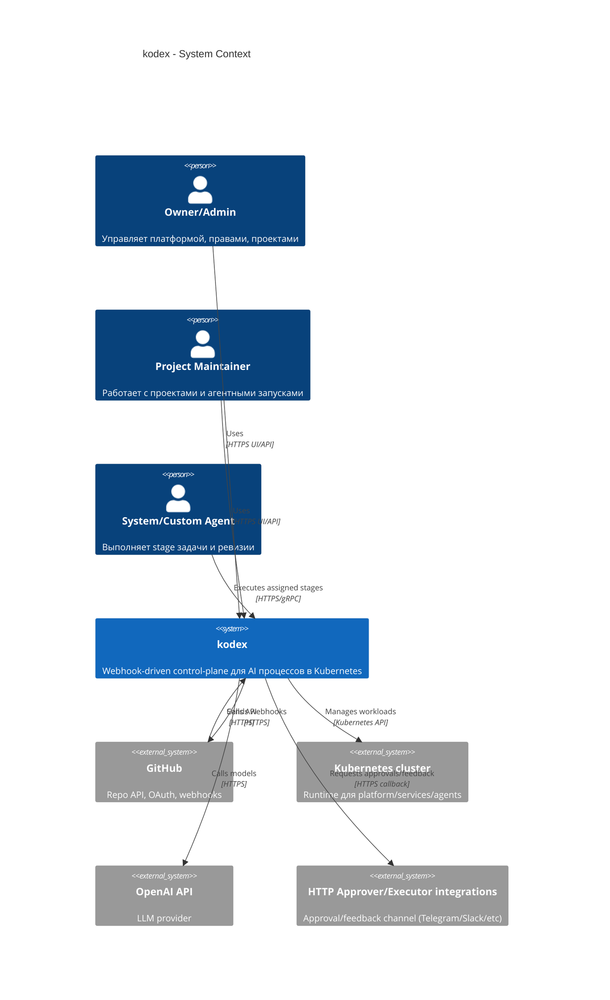

# C4 Context: kodex

## TL;DR
- Система в контуре: `kodex` control-plane.
- Пользователи: Owner/Admin, Project Maintainer, системные и custom-агенты.
- Внешние зависимости: GitHub API/Webhooks, Kubernetes API, OpenAI API, HTTP approver/executor интеграции (Telegram как первый адаптер).

## Диаграмма (Mermaid C4Context)

## Пояснения

- Основные взаимодействия: webhook ingest -> domain orchestration -> k8s/repo actions -> audit/state in Postgres.
- Границы ответственности: `kodex` управляет процессами и состоянием, но не заменяет GitHub и Kubernetes как системы-источники соответствующих фактов.
- Stage orchestration в продуктовой модели определяется label taxonomy (`run:*`, `state:*`, `need:*`) и policy апрувов.

## Внешние зависимости

- GitHub: OAuth, repo/webhook operations, fine-grained tokens/service tokens.
- Kubernetes: runtime для сервисов платформы и агентных pod/namespace lifecycle.
- OpenAI: модельные вызовы и токены использования.
- HTTP approver/executor интеграции: канал апрува и уточнений для stage переходов (Telegram/Slack/Mattermost/Jira adapters).

## Решения Owner

- Отдельный provider для enterprise GitHub/GHE на этапе MVP не требуется.
- Production OpenAI account подключается сразу.

## Апрув

- request_id: owner-2026-02-06-mvp
- Решение: approved
- Комментарий: Внешние зависимости на MVP утверждены.
