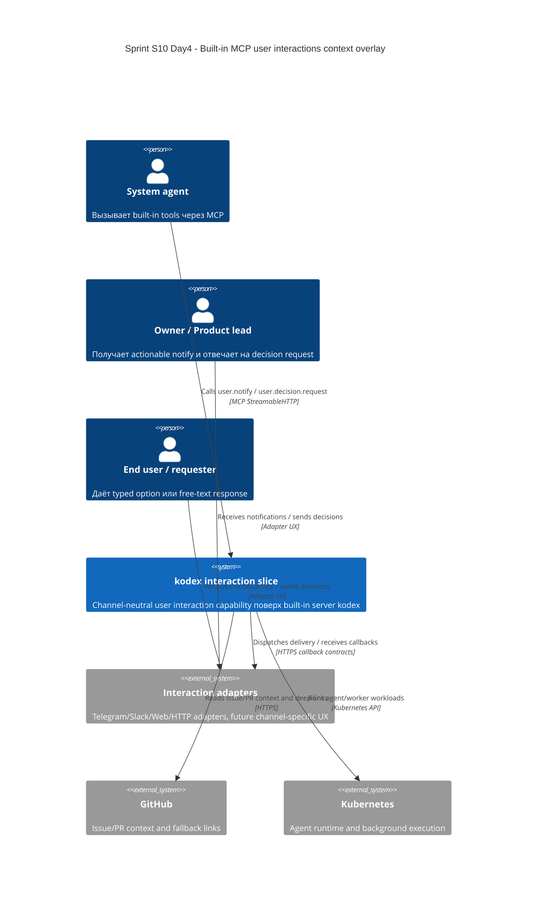

# C4 Context: Sprint S10 Day 4 built-in MCP user interactions

## TL;DR
- Built-in MCP user interactions остаются capability slice внутри `kodex`, а не отдельной внешней системы.
- Human-facing delivery и responses идут через channel-neutral adapter layer; GitHub comments остаются fallback/context channel, а не primary interaction path.

## Диаграмма (Mermaid C4Context)

## Пояснения
- Interaction slice не заменяет approval flow и не делает GitHub primary response channel для core MVP.
- Human response path всегда проходит через adapter layer и возвращается в platform domain как typed callback.
- Kubernetes остаётся runtime substrate для agent/worker execution, но не владельцем interaction semantics.

## Внешние зависимости
- Interaction adapters: replaceable channel integrations без vendor lock-in в core contract.
- GitHub: issue/PR context, deep-links и fallback evidence, но не primary state machine user interactions.
- Kubernetes: runtime для agent-runner и worker background loops.
