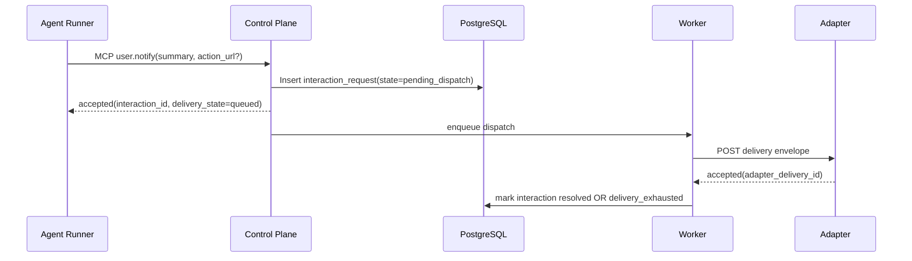
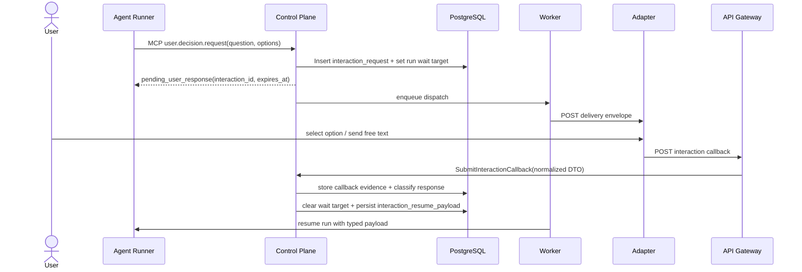

# Detailed Design: Sprint S10 built-in MCP user interactions

## TL;DR
- Что меняем: фиксируем implementation-ready design для `user.notify` и `user.decision.request`, callback ingress, interaction aggregate, wait-state/resume semantics и rollout order.
- Почему: Day4 архитектура закрепила ownership split, но без typed contract/data решений следующий этап повторно откроет boundary trade-offs.
- Основные компоненты: `control-plane`, `worker`, `api-gateway`, `agent-runner`, `PostgreSQL`, внешний adapter layer.
- Риски: drift между approval и interaction semantics, повторный logical completion на duplicate callbacks, Telegram-specific leakage в core contract.
- План выката: `migrations -> control-plane -> worker -> api-gateway -> adapters`; на `run:design` runtime изменений нет.

## Цели / Не-цели
### Goals
- Зафиксировать typed contract для built-in tools, outbound adapter envelope, inbound callback DTO и resume payload.
- Определить interaction lifecycle для `notify` и `decision_request`, включая retries, expiry, accepted/rejected callbacks и resume contract.
- Закрепить data-model и schema ownership без reuse approval tables как source-of-truth.
- Зафиксировать wait-state taxonomy так, чтобы runtime reuse не смешивал business meaning approval и user interaction.
- Подготовить handover в `run:plan` с явными execution streams и rollout constraints.

### Non-goals
- Реализация кода, миграций, OpenAPI/proto/codegen и adapter runtime.
- Telegram-first UX, reminders, richer multi-turn conversations, voice/STT и delivery preferences.
- Разрешение агенту выбирать произвольного получателя interaction payload.
- Выделение отдельного interaction-service до появления измеримых scale/throughput причин.

## Контекст и текущая архитектура
- Source architecture:
  - `docs/architecture/initiatives/s10_mcp_user_interactions/architecture.md`
  - `docs/architecture/adr/ADR-0012-built-in-mcp-user-interactions-control-plane-owned-lifecycle.md`
  - `docs/architecture/alternatives/ALT-0004-built-in-mcp-user-interactions-lifecycle-boundaries.md`
- Source product contract:
  - `docs/delivery/epics/s10/prd-s10-day3-mcp-user-interactions.md`
- Baseline runtime reuse:
  - run/session pause-resume уже использует `agent_runs`, `agent_sessions.codex_cli_session_json` и `codex exec resume`;
  - coarse runtime status `waiting_mcp` уже существует и не требует нового wait engine;
  - approval callbacks и approval tables уже есть, но не подходят как domain source-of-truth для обычных user interactions.
- Болевые точки, которые закрывает Day5:
  - отсутствие typed tool/output contract для interaction tools;
  - отсутствие persisted interaction aggregate и callback evidence модели;
  - отсутствие явной схемы, как resume path получает typed interaction result без reuse approval semantics.

## Предлагаемый дизайн (high-level)
### Component boundaries
| Компонент | Ответственность | Что запрещено |
|---|---|---|
| `control-plane` | Валидация built-in tool input, recipient resolution, interaction aggregate, callback classification, wait-state entry/exit, resume payload, audit/correlation | Делегировать business-state transition в `api-gateway`, `worker` или adapter |
| `worker` | Outbound dispatch, delivery attempts, backoff/retry, expiry scan, enqueue resume request после terminal interaction outcome | Принимать решение, какой callback logical winner и как интерпретировать `response_kind` |
| `api-gateway` | Auth и schema validation callback request, DTO/casters, thin-edge bridge в internal gRPC | Хранить state, решать duplicate/stale/expired outcome |
| `agent-runner` | Сохранять session snapshot, возобновлять run через `codex exec resume`, прикладывать typed resume payload в deterministic prompt block | Хранить interaction source-of-truth или выполнять adapter callbacks напрямую |
| External adapters | Human-facing UX и channel-specific delivery transport поверх channel-neutral envelope | Вводить обязательные Telegram-specific поля в core contract |

### Recipient resolution
- Агент не передаёт `recipient_id`, `chat_id` или другие channel-specific идентификаторы.
- `control-plane` резолвит получателя из run context:
  - baseline MVP: issue requester / owner mapping по policy проекта;
  - adapter-specific routing остаётся платформенным concern и не попадает в model-visible tool input.
- Persisted aggregate хранит только opaque `recipient_ref` и `recipient_provider`, достаточные для dispatch и audit.

### Lifecycle model
| Фаза | `user.notify` | `user.decision.request` | Primary owner |
|---|---|---|---|
| Tool accepted | `control-plane` создаёт interaction aggregate и ставит `state=pending_dispatch` | То же + подготавливает wait target и deadline | `control-plane` |
| Dispatch | `worker` отправляет envelope adapter-у и пишет delivery attempt | То же | `worker` |
| Waiting | Не используется | `agent_runs.status=waiting_mcp`, `wait_reason=interaction_response`, timeout paused | `control-plane` |
| Callback | Delivery receipt опционален, влияет только на delivery evidence | Typed response callback обязателен для happy-path; delivery receipt остаётся вспомогательным evidence | `api-gateway` -> `control-plane` |
| Terminal outcome | `resolved` или `delivery_exhausted` без resume | `resolved` / `expired` / `delivery_exhausted` / `cancelled`, затем run resume | `control-plane` + `worker` |

### Wait-state taxonomy decision
- Coarse runtime state сохраняется как `agent_runs.status=waiting_mcp`, чтобы не ломать общий pause/resume engine.
- Business meaning выносится в отдельные значения `agent_runs.wait_reason`:
  - `approval_pending`
  - `interaction_response`
  - `owner_review`
- Старое значение `mcp` считается deprecated и на миграции backfill-ится в `approval_pending`.
- Для детерминированного resume `agent_runs` получает typed linkage:
  - `wait_target_kind=interaction_request|approval_request`
  - `wait_target_ref=<opaque id>`
  - `wait_deadline_at=<RFC3339 timestamp>`
- Инвариант: у одного run одновременно не может быть более одного open wait target.

### Resume contract
- `user.notify` не создаёт resume payload.
- `user.decision.request` после initial ack переводит run в wait-state и сохраняет open interaction aggregate.
- После terminal outcome `control-plane` формирует `interaction_resume_payload`:

```json
{
  "interaction_id": "9d9e52d5-5cbb-4b8d-9d36-8dbf2c2a6d4a",
  "tool_name": "user.decision.request",
  "request_status": "answered",
  "response_kind": "option",
  "selected_option_id": "approve",
  "free_text": "",
  "resolved_at": "2026-03-12T16:05:00Z",
  "resolution_reason": "accepted"
}
```

- `worker` возобновляет run только после фиксации terminal interaction outcome; payload остаётся persisted в `control-plane` и не пробрасывается в Pod env/spec как carrier.
- `agent-runner` перед resume делает run-bound gRPC lookup этого payload у `control-plane`, после чего добавляет typed JSON block в начало prompt перед `codex exec resume`, чтобы модель получила детерминированный machine-readable outcome без повторного запроса к adapter.
- Размер handoff контракта ограничен:
  - `response.free_text` принимается только до `8192` UTF-8 байт;
  - сериализованный `interaction_resume_payload` должен помещаться в `12288` байт.
- Если free-text или итоговый resume payload превышает этот лимит, callback классифицируется как `invalid`, resume не ставится, а run остаётся ждать валидный ответ либо expiry.

## API/Контракты
- Детальный contract delta: `docs/architecture/initiatives/s10_mcp_user_interactions/api_contract.md`.
- Source of truth для `run:dev`:
  - OpenAPI callback path: `services/external/api-gateway/api/server/api.yaml`
  - gRPC bridge: `proto/kodex/controlplane/v1/controlplane.proto`
  - Built-in tool surface: `control-plane` MCP catalog
- Совместимость:
  - новые tool names и callback path additive;
  - wait taxonomy меняет внутренние enum/value semantics coordinated rollout-ом;
  - approval contracts не ломаются и остаются отдельным callback family.

## Модель данных и миграции
- Data-model detail: `docs/architecture/initiatives/s10_mcp_user_interactions/data_model.md`.
- Migrations policy: `docs/architecture/initiatives/s10_mcp_user_interactions/migrations_policy.md`.
- Главные persisted changes:
  - новые interaction tables под owner `control-plane`;
  - расширение `agent_runs` для typed wait linkage;
  - reuse существующего `agent_sessions` snapshot storage без отдельной interaction session table.

## Сценарии (Sequence diagrams)




## Нефункциональные аспекты
- Надёжность:
  - idempotency для tool invocation по `(run_id, mcp_request_id)`;
  - idempotency для callbacks по `(interaction_id, adapter_event_id)`;
  - ровно один effective response на decision interaction.
- Производительность:
  - callback classification path индексируется по `interaction_id` и `adapter_event_id`;
  - expiry/retry scans остаются lease-aware background jobs в `worker`.
- Безопасность:
  - callback bearer token scope-bound на конкретный interaction, живёт как минимум до response deadline и сохраняет post-deadline grace для deterministic duplicate/expired classification;
  - agent input не может выбрать произвольного получателя;
  - free-text response не дублируется в `flow_events` и не попадает в model-visible logs;
  - terminal `interaction_resume_payload` не раскрывается через Pod/Job spec, потому что runner забирает его из `control-plane` по run-bound bearer auth уже после старта pod.
- Наблюдаемость:
  - interaction lifecycle публикует отдельные flow events и metrics;
  - duplicate/stale callbacks видны как audit evidence, а не silent no-op.

## Наблюдаемость (Observability)
- Логи:
  - `interaction callback handled` в `api-gateway` с полями `interaction_id`, `delivery_id`, `adapter_event_id`, `callback_kind`, `classification`, `interaction_state`, `resume_required`;
  - `interaction dispatch completed` в `worker` с полями `interaction_id`, `run_id`, `attempt_no`, `delivery_id`, `adapter_kind`, `status`, `retryable`, `error_code`, `next_retry_at`, `interaction_state`, `resume_required`;
  - `interaction expiry processed` в `worker` с полями `interaction_id`, `interaction_state`, `run_id`, `resume_required`, `resume_scheduled`;
  - existing control-plane audit/flow events `interaction.request.created`, `interaction.callback.received`, `interaction.response.accepted|rejected`, `interaction.wait.entered`, `interaction.wait.resumed` остаются каноническим source-of-truth для lifecycle evidence.
- Метрики:
  - runtime counters/histograms в `control-plane`:
    - `kodex_interaction_requests_created_total{tool_name,interaction_kind}`;
    - `kodex_interaction_resume_total{interaction_kind,request_status}`;
    - `kodex_interaction_decision_turnaround_seconds{request_status}`;
  - runtime metrics в `worker`:
    - `kodex_interaction_dispatch_attempt_total{adapter,status}`;
    - `kodex_interaction_dispatch_retry_scheduled_total{adapter,error_code}`;
  - persisted collector metrics в `control-plane`:
    - `kodex_interaction_requests_state{interaction_kind,state}`;
    - `kodex_interaction_pending_dispatch_backlog{interaction_kind,queue_kind}`;
    - `kodex_interaction_wait_deadline_overdue{interaction_kind}`;
    - `kodex_interaction_callback_events_total{callback_kind,classification}`;
    - `kodex_interaction_dispatch_attempts_total{interaction_kind,adapter_kind,status}`;
  - edge ingress metrics в `api-gateway`:
    - `kodex_interaction_callback_requests_total{callback_kind,classification}`;
    - `kodex_interaction_callback_duration_seconds{callback_kind,classification}`.
- Трейсы:
  - `agent-runner -> control-plane -> postgres`
  - `worker -> adapter`
  - `api-gateway -> control-plane -> postgres`
- Дашборды:
  - open interactions by state;
  - callback classification rate;
  - decision turnaround latency;
  - delivery retry backlog.
- Алерты:
  - рост `kodex_interaction_callback_events_total{classification="duplicate|stale"}` выше baseline;
  - `kodex_interaction_wait_deadline_overdue > 0` дольше agreed grace window;
  - repeated `kodex_interaction_dispatch_attempts_total{status="failed"}` или рост retry backlog на одном adapter provider.

## Тестирование
- Юнит:
  - validation rules для tool input и callback DTO;
  - wait-state guard (`one open wait target per run`);
  - callback classification `accepted|duplicate|stale|expired|invalid`.
- Интеграция:
  - interaction tables + indexes;
  - backfill wait taxonomy;
  - `agent_runs` wait linkage и terminal resume payload persistence.
- Contract:
  - OpenAPI request/response validation для callback path;
  - gRPC caster coverage `api-gateway -> control-plane`;
  - adapter envelope snapshot serialization.
- E2E:
  - `notify` happy-path без wait-state;
  - `decision_request` option response;
  - `decision_request` free-text response;
  - late/duplicate callback safety;
  - expiry -> deterministic resume.
- Security checks:
  - callback token misuse;
  - agent cannot override recipient;
  - free-text redaction from logs/audit summaries.

## План выката (Rollout)
- `run:design`: runtime changes отсутствуют.
- Целевой rollout в `run:dev`:
  1. Migrations for new interaction tables and `agent_runs` wait linkage.
  2. `control-plane` dual-read/dual-write for old `wait_reason=mcp` and new typed values.
  3. `worker` dispatch/retry/expiry rollout.
  4. `api-gateway` callback endpoint + OpenAPI/codegen sync.
  5. Controlled exposure новых built-in tools и adapter traffic.
- Sequencing guard:
  - `api-gateway` callback path не открывается до готовности `control-plane` callback classification;
  - `worker` expiry/resume path не включается до появления typed wait linkage в БД.

## План отката (Rollback)
- Триггеры:
  - duplicate logical completion;
  - неконсистентный wait resume;
  - массовый `delivery_exhausted` после rollout.
- Шаги:
  1. Убрать `user.notify`/`user.decision.request` из effective MCP tool catalog.
  2. Остановить adapter routing и принимать callbacks как disabled path.
  3. Сохранить additive schema и investigation evidence.
  4. Вернуться к старому wait path для approval-only traffic.
- Проверка успеха:
  - новых interaction writes нет;
  - approval flow работает без деградации;
  - additive tables сохранены для postmortem.

## Альтернативы и почему отвергли
- Reuse approval flow and `owner.feedback.request`.
  - Отвергнуто: approval semantics и user interaction semantics разные; появляется semantic drift.
- Новый interaction-service на MVP.
  - Отвергнуто: premature split до фиксации implementation scope и rollout evidence.
- Callback-only model без persisted response records.
  - Отвергнуто: не даёт доказуемого logical winner и затрудняет audit stale/duplicate paths.

## Context7 и dependency baseline
- Выполнена попытка использовать Context7 для актуализации `kin-openapi` и `goose`.
- Результат: `Monthly quota exceeded`.
- Новые внешние зависимости на Day5 не требуются; design package опирается на уже принятые contract-first и migration инструменты репозитория.

## Acceptance criteria для handover в `run:plan`
- [x] Зафиксированы typed contracts для built-in tools, outbound envelope, callback ingress и resume payload.
- [x] Определены interaction aggregate, delivery attempts, callback evidence и wait linkage к `agent_runs`/`agent_sessions`.
- [x] Зафиксированы rollout order, migration/backfill и rollback constraints.
- [x] Approval flow остался отдельным bounded context и не используется как source-of-truth для interaction responses.
- [x] Подготовлена follow-up issue `#389` для `run:plan`.

## Апрув
- request_id: owner-2026-03-12-issue-387-design
- Решение: pending
- Комментарий: Ожидается review design package и подтверждение перехода в `run:plan`.
