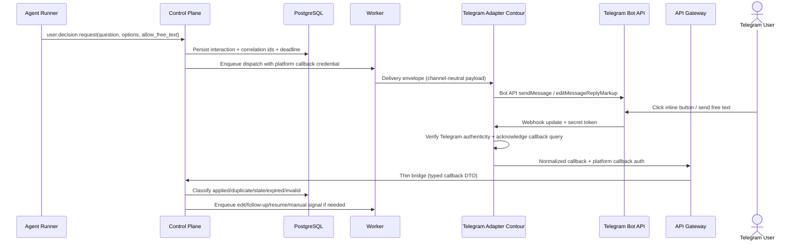

# Sprint S11 Day 4 — Telegram user interaction adapter architecture (Issue #452)

## TL;DR
- `control-plane` остаётся единственным владельцем interaction semantics, correlation, duplicate/replay/expired classification, wait-state transitions и operator-visible outcomes для Telegram-адаптера.
- `worker` закрепляется за outbound dispatch, retry/expiry loops и post-callback UX continuation; message edit vs follow-up notify остаётся асинхронным platform-owned side effect, а не решением callback ingress path.
- `api-gateway` принимает только normalized adapter callbacks с platform-issued auth; raw Telegram webhooks, Bot API secret-token expectations и callback query acknowledgement остаются во внешнем Telegram adapter contour.

## Контекст и входные артефакты
- Delivery-цепочка: `#361 (intake) -> #447 (vision) -> #448 (prd) -> #452 (arch)`.
- Source of truth:
  - `docs/delivery/epics/s11/prd-s11-day3-telegram-user-interaction-adapter.md`
  - `docs/product/requirements_machine_driven.md`
  - `docs/product/agents_operating_model.md`
  - `docs/product/labels_and_trigger_policy.md`
  - `docs/product/stage_process_model.md`
  - `docs/architecture/api_contract.md`
  - `docs/architecture/data_model.md`
  - `docs/architecture/mcp_approval_and_audit_flow.md`
  - `docs/architecture/initiatives/s10_mcp_user_interactions/design_doc.md`
  - `docs/architecture/initiatives/s10_mcp_user_interactions/api_contract.md`
  - `docs/architecture/initiatives/s10_mcp_user_interactions/data_model.md`
  - `services/external/api-gateway/README.md`
  - `services/internal/control-plane/README.md`
  - `services/jobs/worker/README.md`
  - `services/jobs/agent-runner/README.md`

## Цели архитектурного этапа
- Превратить Day3 product contract в проверяемые service boundaries и ownership split для Telegram delivery path, callback/webhook security, correlation lifecycle и operator visibility.
- Сохранить typed interaction contract Sprint S10 как platform-owned baseline, не позволяя Telegram-specific transport constraints переопределять core semantics.
- Зафиксировать architecture-level decisions по callback payload strategy, webhook authenticity boundary и post-callback UX continuation до design-stage выбора DTO/schema/runtime деталей.
- Подготовить handover в `run:design` с явным списком transport/data/migration вопросов, которые ещё предстоит детализировать.

## Non-goals
- Не выбираем точные HTTP/gRPC DTO, поля БД, миграции и rollout manifest changes.
- Не фиксируем конкретную реализацию Telegram adapter contour внутри или вне этого репозитория.
- Не проектируем richer conversation flows, reminders, voice/STT, multi-chat routing и дополнительные каналы.
- Не смешиваем user interaction flow с approval/control flow и не переиспользуем approval aggregates как source-of-truth.

## Неподвижные guardrails из PRD
- Typed interaction contract Sprint S10 остаётся каноническим baseline для `user.notify` и `user.decision.request`.
- `user.notify` остаётся non-blocking path; `user.decision.request` остаётся единственным core wait-state path.
- Telegram-specific identifiers, webhook payloads и callback data не попадают в agent-facing tool input как source-of-truth.
- Optional free-text reply остаётся явным opt-in платформы; adapter contour не может самостоятельно расширять semantics запроса.
- GitHub comments и другие fallback paths остаются secondary/manual path, а не primary completion channel.
- Approval flow и interaction flow остаются разными bounded contexts, даже если оба eventually materialize через Telegram affordances.

## Внешний provider baseline (проверено 2026-03-14)
- Официальные Telegram Bot API docs подтверждают, что `getUpdates` и webhooks являются взаимоисключающими способами получения updates, а входящие updates хранятся на стороне Telegram до 24 часов.
- Bot API `setWebhook` поддерживает secret token и заголовок `X-Telegram-Bot-Api-Secret-Token`; это фиксирует transport-level authenticity expectation между Telegram и Telegram adapter contour.
- Callback query в Telegram требует `answerCallbackQuery`, поэтому immediate callback acknowledgement относится к adapter UX duty и не считается semantic acceptance ответа.
- Context7 по `/mymmrac/telego` подтверждает текущий Go SDK baseline для webhook mode, secret token, inline keyboards и callback query helpers; Day4 не закрепляет SDK как source-of-truth доменной модели.

## Source-of-truth split

| Concern | Канонический владелец | Почему |
|---|---|---|
| Interaction request semantics и typed outcome meaning | `control-plane` + Sprint S10 interaction contract | Channel-neutral meaning должен жить в платформе, а не в Telegram transport |
| Outbound delivery attempts, retries, expiry и UX continuation jobs | `worker` + PostgreSQL | Это фоновые идемпотентные side effects, требующие lease-aware reconciliation |
| Raw Telegram webhook authenticity и Bot API coupling | Telegram adapter contour | Telegram-specific transport должен оставаться вне core platform bounded context |
| Adapter callback auth/schema validation на границе платформы | `api-gateway` | Thin-edge boundary остаётся на transport/auth/rate-limit уровне |
| Duplicate/replay/stale/expired classification и wait-state transitions | `control-plane` + PostgreSQL | Semantic winner и lifecycle decision должны быть едиными для всех pod |
| Operator visibility, audit/correlation и manual fallback status | `control-plane` + `flow_events` | User-visible platform truth не может зависеть от adapter-local logs |

## Service Boundaries And Ownership Matrix

| Concern | Primary owner | Supporting owners | Boundary decision | Design-stage deliverables |
|---|---|---|---|---|
| Built-in tool invocation, recipient resolution и initial validation | `control-plane` | `agent-runner` | Agent pod не передаёт `chat_id`, callback payloads или Telegram-specific refs; получатель и routing policy остаются platform-owned | Tool input/output contract, recipient resolution rules |
| Outbound delivery command generation и attempt lifecycle | `worker` | `control-plane`, Telegram adapter contour | `worker` отправляет channel-neutral envelope с platform correlation ids; retries и expiry не живут в adapter contour | Delivery envelope, retry policy, delivery/error taxonomy |
| Telegram rendering, Bot API calls и raw callback query acknowledgement | Telegram adapter contour | Telegram Bot API | Adapter contour владеет inline keyboard layout, message refs и `answerCallbackQuery`, но не определяет business outcome | Adapter capability contract, immediate ack expectations |
| Raw webhook intake и secret-token verification | Telegram adapter contour | Telegram Bot API | Telegram-specific webhook authenticity завершается до входа в `kodex`; `api-gateway` не обязан разбирать raw Telegram updates | Webhook/auth contract, normalized callback family |
| Normalized callback ingress в платформу | `api-gateway` | Telegram adapter contour, `control-plane` | `api-gateway` валидирует platform-issued callback auth, rate limits и typed schema, затем делает thin bridge в `control-plane` | OpenAPI/gRPC bridge contract, error mapping |
| Semantic callback classification и wait-state/resume decisions | `control-plane` | PostgreSQL, `worker` | Только `control-plane` решает `applied|duplicate|stale|expired|invalid`, а также перевод run в resume/manual path | Callback state machine, wait-state linkage, resume contract |
| Post-callback UX continuation: edit vs follow-up notify | `worker` | `control-plane`, Telegram adapter contour | Message edit/secondary notify выполняются асинхронно после semantic classification; callback ingress path не делает business-visible write-through в Telegram | Follow-up action model, retry policy for edit/follow-up |
| Operator visibility, manual fallback и audit/correlation | `control-plane` | `worker`, `api-gateway` | Любой failed/invalid/expired path должен стать typed platform signal, а не остаться adapter-local detail | Visibility projection, flow event set, operator fallback contract |

## Callback/webhook security and correlation lifecycle

- `control-plane` выделяет `interaction_id`, delivery correlation и callback reference до любого adapter side effect.
- `worker` передаёт в adapter contour только channel-neutral payload, callback URL и platform-issued callback credential; exact token format остаётся design-stage вопросом.
- Telegram-specific authenticity, provider webhook retries и callback query acknowledgement завершаются внутри adapter contour.
- `api-gateway` доверяет только normalized callback family с platform auth и не делает semantic interpretation raw Telegram fields.
- `control-plane` выполняет единственную semantic classification against persisted state/deadline; результат фиксируется в audit и становится input для resume/manual fallback.

## Telegram-specific affordances without semantic drift
- Callback payload strategy: платформа выдаёт opaque callback handle/reference, а не кодирует business meaning целиком в Telegram `callback_data`; exact size/encoding определяет `run:design`.
- Optional free-text остаётся отдельным typed path платформы и не должен неявно подменять option-based decision flow.
- `answerCallbackQuery` является обязательным UX side effect adapter contour, но не означает, что платформа приняла response как valid terminal outcome.
- Telegram-specific layout, inline keyboard labels, edit-in-place behaviour и formatting остаются adapter-layer affordances и не меняют core поля `response_kind`, `selected_option`, `free_text`, `request_status`, `callback_status`.

## Fallback decisions for payload limits, edit/follow-up and operator visibility
- Payload limits: chosen architectural direction — opaque callback handle plus server-side lookup in platform domain; semantic payload duplication inside Telegram button data не допускается.
- Message update policy: preferred user-facing continuation после accepted callback — edit in place исходного Telegram message, если у adapter contour есть валидная provider reference и edit остаётся safe.
- Follow-up fallback: если edit недоступен, протух, отклонён Bot API или нарушает UX clarity, `worker` выполняет отдельный follow-up notify как тот же logical interaction continuation.
- Manual operator visibility: repeated delivery failures, invalid callback payloads, exhausted edit retries и expired waits обязаны становиться typed platform signals в `control-plane`, а не оставаться только в adapter logs.

## Approval flow boundary
- Interaction callbacks используют отдельный callback family, token scope и event taxonomy относительно approval/executor flows.
- Даже если Telegram eventually используется и для approval-like surface, interaction aggregate, correlation ids и wait-state semantics не могут переиспользовать approval records как primary model.
- Shared infrastructure допускается только на уровне transport/auth building blocks, audit plumbing и background job primitives; business vocabulary остаётся раздельной.

## Почему текущий split лучше прямого Telegram-first path
- Прямая терминация raw Telegram webhook в `api-gateway` сделала бы thin-edge канал-специфичным и ускорила бы drift между product semantics и transport detail.
- Новый внутренний Telegram-specific service на Day4 добавил бы premature DB owner и межсервисный consistency contour до фиксации design contracts.
- Текущий split сохраняет будущую multi-channel trajectory:
  - `control-plane` владеет semantics;
  - `worker` владеет async side effects;
  - `api-gateway` остаётся channel-neutral transport bridge;
  - Telegram adapter contour остаётся replaceable external adapter layer.

## Architecture quality gates for `run:design`

| Gate | Что проверяем | Почему это обязательно |
|---|---|---|
| `QG-S11-A1` Callback ingress integrity | Raw Telegram webhooks и secret-token verification не протекают в `api-gateway` или `control-plane` как source-of-truth payload | Иначе thin-edge и adapter isolation будут нарушены |
| `QG-S11-A2` Channel-neutral semantics | Core contracts не требуют Telegram-specific ids, callback data semantics или message refs в agent-facing inputs | Иначе Sprint S10 baseline потеряет канальную нейтральность |
| `QG-S11-A3` Replay and expiry safety | Duplicate/replay/stale/expired classification остаётся целиком в `control-plane`, а side effects idempotent в `worker`/adapter contour | Иначе нельзя доказать audit-safe lifecycle |
| `QG-S11-A4` UX continuation discipline | Immediate callback ack отделён от semantic acceptance, а edit/follow-up path остаётся async и operator-visible | Иначе callback path смешает transport UX и domain state |
| `QG-S11-A5` Approval separation | Interaction flow не переиспользует approval aggregates, statuses и callback records как primary source-of-truth | Иначе product guardrail из PRD будет нарушен |
| `QG-S11-A6` Sequencing continuity | Design package сохраняет dependency gate Sprint S10 и issue-цепочку `design -> plan -> dev` | Иначе Sprint S11 потеряет stage continuity |

## Открытые design-вопросы
- Какой exact format/TTL/size limit нужен platform-issued callback handle, чтобы удержать Telegram payload constraints и не раскрывать semantics?
- Где хранить Telegram provider message references, edit eligibility и follow-up attempts без утечки adapter-local state в agent-facing contracts?
- Как выразить operator visibility read model для `delivery_failed`, `invalid_callback`, `expired_wait` и `edit_fallback_triggered` без дублирования бизнес-логики в UI?
- Какой typed callback DTO family нужен для option response, free-text response, delivery receipts и adapter-side transport failures?
- Как провести rollout/rollback sequence, если Telegram adapter contour обновляется отдельно от core platform services?

## Migration и runtime impact
- На этапе `run:arch` код, БД-схема, deploy manifests и runtime behaviour не менялись.
- Обязательный rollout order для будущего implementation path:
  - `migrations -> control-plane -> worker -> api-gateway -> Telegram adapter contour`.
- Design-stage обязан отдельно зафиксировать:
  - persistence model для interaction requests, delivery attempts, callback evidence и provider message refs;
  - token/credential lifetime rules и operator-safe observability;
  - rollback constraints для edit/follow-up policy и callback handle format.

## Context7 и внешняя верификация
- Context7 использован для актуальной проверки Telegram Go SDK baseline:
  - `/mymmrac/telego`.
- Context7 использован для проверки текущих Telegram Bot API constraints:
  - `/websites/core_telegram_bots_api`.
- Дополнительно 2026-03-14 просмотрены official Telegram Bot API docs по `Getting updates`, `setWebhook` и callback behaviour; новых внешних зависимостей на `run:arch` не добавляется.

## Handover в `run:design`
- Следующий этап: `run:design`.
- Follow-up issue: `#454`.
- На design-stage обязательно выпустить:
  - `design_doc.md`
  - `api_contract.md`
  - `data_model.md`
  - `migrations_policy.md`
- На design-stage обязательно конкретизировать:
  - typed outbound/inbound DTO и internal bridge contract;
  - exact callback handle/token rules и payload limits;
  - persistence model для message refs, follow-up actions и operator visibility;
  - rollout/rollback notes и продолжение issue-цепочки `design -> plan -> dev`.
