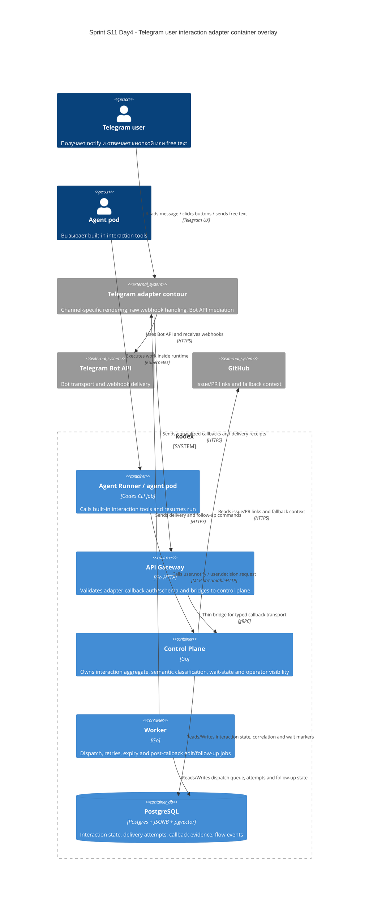

# C4 Container: Sprint S11 Day 4 Telegram user interaction adapter

## TL;DR
- Container baseline платформы не меняется: Telegram channel path раскладывается на существующие `agent-runner`, `api-gateway`, `control-plane`, `worker`, `postgres` и внешний Telegram adapter contour.
- Day4 фиксирует только ownership split для outbound delivery, raw webhook/auth boundary, normalized callback ingress, semantic classification и post-callback UX continuation.

## Диаграмма (Mermaid C4Container)

## Container responsibilities in Telegram user interactions

| Container | Role |
|---|---|
| `agent-runner` | Использует только built-in interaction tools и deterministic resume path; не владеет chat ids, webhook payloads и callback lifecycle |
| `api-gateway` | Platform callback auth, schema validation, typed transport normalization и gRPC bridge в `control-plane` |
| `control-plane` | Interaction aggregate owner, semantic classification, wait-state transitions, audit/correlation, operator visibility |
| `worker` | Outbound dispatch, retries, expiry scans и post-callback edit/follow-up continuation |
| `postgres` | Единственная persisted coordination layer для interaction lifecycle и delivery evidence |
| Telegram adapter contour | Channel-specific rendering, raw Telegram webhook verification, callback query acknowledgement и provider message refs |

## Runtime и data boundaries
- Raw Telegram webhooks не терминируются внутри `api-gateway`; этот boundary остаётся во внешнем Telegram adapter contour.
- `control-plane` не вызывает Telegram Bot API напрямую и не хранит Bot API payloads как primary model.
- `worker` выполняет edit/follow-up after semantic decision, но не решает сам, какой callback logical winner.
- `agent-runner` не хранит source-of-truth interaction state в pod и не может напрямую обращаться к Telegram transport.

## Handover note for `run:design`
- Зафиксировать exact outbound/inbound DTO, callback handle model и persistence model для provider message refs и follow-up actions.
- Уточнить rollout/rollback order, если Telegram adapter contour выкатывается независимо от core platform services.
