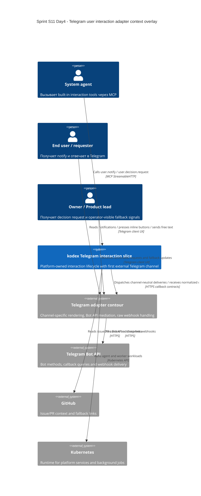

# C4 Context: Sprint S11 Day 4 Telegram user interaction adapter

## TL;DR
- Telegram-адаптер остаётся первым внешним channel-specific path поверх platform-owned interaction slice, а не новым source-of-truth для interaction semantics.
- Raw Telegram traffic завершается во внешнем Telegram adapter contour; `kodex` получает только normalized callbacks и сохраняет channel-neutral meaning outcome.

## Диаграмма (Mermaid C4Context)

## Пояснения
- `kodex` владеет interaction aggregate, audit/correlation и semantic classification; Telegram-specific transport detail остаётся во внешнем adapter contour.
- Telegram adapter contour может материализоваться отдельным runtime/service, но для core architecture он рассматривается как replaceable external adapter layer.
- GitHub остаётся fallback/context channel для ссылок и operator workflow, но не primary response path для core S11 flows.

## Внешние зависимости
- Telegram Bot API: first external channel delivery/update surface с webhook/polling constraints и callback query UX expectations.
- Telegram adapter contour: внешний channel-specific слой, который связывает Bot API с platform callback contract.
- GitHub: issue/PR context, deep-links и secondary/manual fallback evidence.
- Kubernetes: runtime substrate для `control-plane`, `worker`, `api-gateway` и agent pods.
