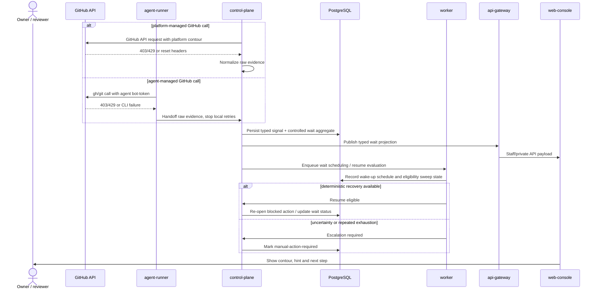

# Sprint S12 Day 4 — GitHub API rate-limit resilience architecture (Issue #418)

## TL;DR
- `control-plane` становится единственным владельцем domain classification, controlled wait aggregate, contour attribution, recovery hints и visibility contract для GitHub rate-limit resilience.
- `worker` закрепляется за time-based orchestration: wait scheduling, eligibility sweeps, auto-resume attempts и escalation в manual-action-required path; `agent-runner` больше не может решать recoverable wait локальными retry-loop и обязан передавать raw evidence в platform domain.
- `api-gateway` и `web-console` остаются thin visibility surfaces: они показывают typed wait projections, но не вычисляют countdown, classification или contour semantics самостоятельно.
- Plan-stage в Issue `#423` подтвердил эти service boundaries и разложил реализацию на execution waves `#425..#431` без переноса ownership между слоями.

## Контекст и входные артефакты
- Delivery-цепочка: `#366 (intake) -> #413 (vision) -> #416 (prd) -> #418 (arch)`.
- Source of truth:
  - `docs/delivery/epics/s12/prd-s12-day3-github-api-rate-limit-resilience.md`
  - `docs/product/requirements_machine_driven.md`
  - `docs/product/agents_operating_model.md`
  - `docs/product/labels_and_trigger_policy.md`
  - `docs/product/stage_process_model.md`
  - `docs/architecture/api_contract.md`
  - `docs/architecture/data_model.md`
  - `docs/architecture/agent_runtime_rbac.md`
  - `docs/architecture/mcp_approval_and_audit_flow.md`
  - `services/internal/control-plane/README.md`
  - `services/jobs/worker/README.md`
  - `services/jobs/agent-runner/README.md`
  - `services/external/api-gateway/README.md`
  - `services/staff/web-console/README.md`

## Цели архитектурного этапа
- Превратить Day3 product contract в проверяемые service boundaries и ownership split для rate-limit signals, wait-state orchestration, visibility и resume path.
- Сохранить split `platform PAT` vs `agent bot-token` без дублирования доменной логики и без возвращения к абстрактному статусу "GitHub недоступен".
- Зафиксировать архитектурные trade-offs по classification owner, resume orchestration и visibility surfaces до design-stage выбора API/schema деталей.
- Подготовить handover в `run:design` с явным списком transport/data/migration вопросов, которые ещё предстоит детализировать.

## Non-goals
- Не выбираем точные HTTP/gRPC DTO, поля БД и миграции.
- Не вводим отдельный quota-orchestrator сервис и не выносим новый bounded context в отдельный runtime.
- Не проектируем multi-provider quota governance, predictive budgeting и adapter-specific notification policies.
- Не меняем существующие токены, RBAC или runtime deployment manifests на Day4.

## Неподвижные guardrails из PRD
- GitHub остаётся единственным provider baseline инициативы.
- Recoverable rate-limit переводится в controlled wait-state, а не в ложный `failed`.
- `platform PAT` и `agent bot-token` сохраняются как разные user-facing operational contour.
- Hard-failure cases (`bad credentials`, invalid scope, policy/permission failure, non-rate-limit `403/429`) не могут маскироваться под recoverable wait.
- Agent path после typed signal detection не делает infinite local retries и не обещает локальный countdown.
- Secondary-limit неопределённость должна выражаться typed recovery hints и manual-intervention path, а не выдуманным точным ETA.

## Внешний provider baseline (GitHub Docs, проверено 2026-03-13)
- Официальные GitHub REST docs подтверждают, что primary rate limit предоставляет детерминированные reset signals через `x-ratelimit-*` headers.
- Те же docs подтверждают, что secondary rate limit может приходить как `403` или `429`, а recovery guidance строится вокруг backoff / `Retry-After`, но не гарантирует единый универсальный countdown.
- Best practices GitHub API советуют избегать лишнего concurrency burst и не долбить mutating path без пауз; для Sprint S12 это остаётся design input, а не запуском общего retry framework.

## Source-of-truth split

| Concern | Канонический владелец | Почему |
|---|---|---|
| Raw signal capture на `platform PAT` path | `control-plane` и `worker` GitHub client adapters | Эти сервисы уже владеют platform-managed GitHub calls и должны фиксировать provider evidence без UI/transport логики |
| Raw signal capture на `agent bot-token` path | `agent-runner` как source emitter, `control-plane` как source-of-truth | Агент видит raw stderr/exit code/headers, но не имеет права сам решать wait-state semantics |
| Recoverable vs hard-failure classification | `control-plane` + PostgreSQL | Нужен единый доменный owner для invariants, contour attribution и typed recovery hints |
| Controlled wait aggregate и visibility projection | `control-plane` + PostgreSQL | Один persisted coordination contour нужен для multi-pod consistency, audit и UI/service-comment sync |
| Time-based wait scheduling и auto-resume eligibility | `worker` + PostgreSQL под policy `control-plane` | Это background lifecycle с idempotent sweeps и re-attempt discipline |
| Staff/API presentation | `api-gateway` + `web-console` как thin adapters | UI должен читать typed projection, а не вычислять классификацию или ETA самостоятельно |
| GitHub service-comment / run status feedback | `control-plane` MCP path + GitHub issue/PR updates | Owner/reviewer visibility должна идти из того же source-of-truth, что и staff surfaces |

## Модель контуров и инварианты
- User-facing contour model остаётся двухзначной:
  - `platform_pat`
  - `agent_bot_token`
- Чтобы не дублировать доменную логику, Day4 разделяет:
  - `contour_kind` — user-facing operational contour из PRD;
  - `signal_origin` — сервис, который принёс raw evidence (`control-plane`, `worker`, `agent-runner`);
  - `affected_operation_class` — что именно было заблокировано (label transition, service-comment update, repo management call, agent GitHub action и т.д.).
- Если platform-managed GitHub path в будущем использует platform-held bot-token для отдельных операций, это остаётся внутренней диагностической детализацией `signal_origin` или `credential_source`, но не ломает Day4 contract о двух user-facing contour.

## Service Boundaries And Ownership Matrix

| Concern | Primary owner | Supporting owners | Boundary decision | Design-stage deliverables |
|---|---|---|---|---|
| Provider signal normalization | `control-plane` | `worker`, `agent-runner` | Только `control-plane` переводит raw GitHub evidence в typed product signal; `worker` и `agent-runner` отправляют input, но не выбирают wait taxonomy | Typed signal envelope, hard-failure map, evidence fields |
| Agent-path handoff | `control-plane` | `agent-runner` | `agent-runner` обязан остановить local retry loop после typed suspicion и передать raw evidence upstream; локальный backoff не является source-of-truth | Callback/handoff contract, allowed raw evidence set, no-retry policy |
| Controlled wait aggregate | `control-plane` | PostgreSQL | Один aggregate владеет contour attribution, recovery hint, affected operation class, visibility status и resume gate | Wait aggregate model, status enum, invariants |
| Wait scheduling и resume sweeps | `worker` | `control-plane` | Все time-based проверки идут фоновым reconciliation path; `worker` не классифицирует rate-limit сам, а исполняет policy и re-check loops | Resume task contract, sweep cadence, escalation thresholds |
| Visibility surfaces | `control-plane` | `api-gateway`, `web-console` | UI/service-comment получают уже typed wait projection и никогда не строят countdown или classification из сырых логов | Projection DTO, UI fields, service-comment wording rules |
| Manual-intervention path | `control-plane` | `worker`, `web-console` | Выход в manual path решается доменом при исчерпании safe auto-resume strategy или при отсутствии trustworthy recovery hint | Manual-action trigger rules, operator-facing next-step contract |
| GitHub request policy | `control-plane` | `worker`, `agent-runner` | Platform path и agent path делят guardrails, но не shared retry loop; всё, что касается provider budgeting, централизуется в domain policy | Retry ownership note, concurrency/backoff rules, safe re-attempt gate |

## Architecture flow: detect -> classify -> wait -> resume/manual action

## Controlled wait lifecycle

| Phase | Owner | What must be true |
|---|---|---|
| `detect` | `control-plane` or `agent-runner` as source emitter | Raw evidence captured once, correlation preserved, no local infinite retry after handoff |
| `classify` | `control-plane` | Case is mapped to recoverable primary, recoverable secondary, hard failure or uncertainty requiring manual path |
| `wait` | `control-plane` + `worker` | Persisted wait record exists, contour is explicit, visibility is updated, timeout semantics stay audit-safe |
| `resume` | `worker` under `control-plane` policy | Resume happens only when provider evidence or elapsed policy window makes it safe |
| `manual action` | `control-plane` + visibility surfaces | User/operator sees why auto-resume stopped and what next step is required |

## Visibility surfaces
- `control-plane` формирует единый typed visibility contract для:
  - run service-comment / progress feedback;
  - staff/private API read models;
  - `web-console` wait-state surfaces.
- Обязательные поля visibility contract на Day4:
  - contour;
  - affected operation class;
  - recovery hint category;
  - confidence level (`deterministic` vs `provider-uncertain`);
  - next-step kind (`wait`, `auto-resume`, `manual-action-required`);
  - audit correlation link.
- `web-console` не должен пытаться вычислять собственный countdown из логов или произвольных GitHub headers.

## Resume semantics
- Primary limit с надёжным reset signal допускает deterministic wait window и auto-resume attempt после достижения recovery point.
- Secondary limit трактуется как provider-uncertain signal:
  - auto-resume допустим только по conservative sweep policy;
  - если повторный safe attempt снова упирается в secondary limit, `worker` эскалирует кейс в manual-action-required вместо бесконечной очереди local retries.
- Agent path после handoff не replays GitHub request внутри pod без явного platform resume signal.

## Почему не создаём отдельный quota-orchestrator сервис сейчас
- `control-plane` уже владеет run/session lifecycle, MCP policy, audit и visibility projections.
- Новый сервис на Day4 добавил бы лишний DB ownership contour до фиксации design-stage contracts.
- Текущий split уже покрывает PRD:
  - `control-plane` владеет semantics;
  - `worker` владеет time-based orchestration;
  - `agent-runner` остаётся source emitter, но не domain owner;
  - `api-gateway` и `web-console` остаются thin adapters.

## Architecture quality gates for `run:design`

| Gate | Что проверяем | Почему это обязательно |
|---|---|---|
| `QG-S12-A1` Boundary integrity | `api-gateway`/`web-console` не получают доменных решений по classification/resume | Иначе thin-edge будет нарушен |
| `QG-S12-A2` Contour fidelity | Два contour остаются различимыми на всех visibility surfaces | Иначе исчезнет ключевой product outcome |
| `QG-S12-A3` Agent backpressure discipline | После handoff `agent-runner` не может продолжать local retry loop | Иначе FR-416-02 останется недоказуемым |
| `QG-S12-A4` Provider uncertainty discipline | Secondary-limit path не обещает фиктивный точный countdown | Иначе UX будет врать пользователю |
| `QG-S12-A5` Resume safety | `worker` делает finite auto-resume path и умеет эскалировать в manual action | Иначе controlled wait превратится в бесконечную очередь |

## Открытые design-вопросы
- Как выразить typed raw-evidence handoff от `agent-runner` в `control-plane`, не привязываясь к одному CLI/parsing формату?
- Какой persisted aggregate нужен для wait-state, чтобы сохранить contour attribution, recovery hint и audit linkage без схемного overfit?
- Где провести границу между generic run wait-state и rate-limit-specific subreason в data model?
- Нужен ли отдельный internal `credential_source`, чтобы не потерять platform-held bot-token diagnostics и при этом не ломать user-facing two-contour contract?
- Какой набор visibility DTO нужен для service-comment и `web-console`, чтобы не дублировать доменную логику на UI?

## Migration и runtime impact
- На этапе `run:arch` код, БД-схема, deploy manifests и runtime behavior не менялись.
- Обязательный rollout order для будущего implementation path:
  - `migrations -> control-plane -> worker -> agent-runner -> api-gateway -> web-console`.
- Design-stage обязан отдельно зафиксировать:
  - additive schema и rollback constraints;
  - observability event set для detect/classify/wait/resume/escalation;
  - backward-safe coexistence до полного rollout всех visibility surfaces.

## Context7 и внешняя верификация
- Context7 использован для актуальной проверки Mermaid C4 syntax:
  - `/mermaid-js/mermaid`.
- Context7 использован для non-interactive GitHub CLI flow:
  - `/websites/cli_github_manual`.
- Официальные GitHub Docs по rate limits и best practices просмотрены 2026-03-13 и использованы как внешний baseline для primary/secondary semantics.

## Continuity after `run:plan`
- Day4 handover в `run:design` был завершён через Issue `#420`; Day5 design package и Day6 plan package не изменили зафиксированную ownership-модель.
- Execution waves `#425..#431` обязаны сохранять:
  - `#425` только schema/repository foundation;
  - `#426` только domain classification/projection under `control-plane`;
  - `#427` только worker orchestration поверх domain policy;
  - `#428` только runner handoff/resume payload без local ownership drift;
  - `#429` и `#430` только typed visibility surfaces;
  - `#431` только observability/readiness evidence перед `run:qa`.
