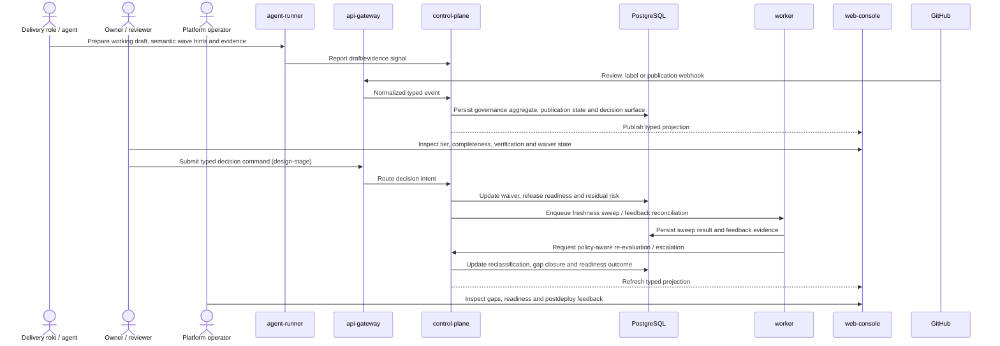

# Sprint S13 Day 4 — Quality Governance System architecture

## TL;DR
- `control-plane` становится единственным владельцем canonical change-governance aggregate: risk classification, evidence completeness, verification minimum, publication eligibility, waiver/residual-risk decisions и release-ready projection живут в одном доменном контуре.
- `worker` закрепляется за asynchronous governance reconciliation: freshness sweeps, overdue-gate escalation и postdeploy feedback ingestion идут только под policy `control-plane`; сам `worker` пишет лишь reconciliation/evidence state и запрашивает policy-aware re-evaluation, а late reclassification и gap closure фиксирует `control-plane`.
- `api-gateway` и `web-console` остаются thin visibility/interaction surfaces, а Sprint S14 (`#470`) получает право строить runtime/UI automation только поверх typed projections и commands следующего stage, не переоткрывая policy baseline.

## Контекст и входные артефакты
- Delivery-цепочка: `#469 (intake) -> #471 (vision) -> #476 (prd) -> #484 (arch)`.
- Source of truth:
  - `docs/delivery/epics/s13/prd-s13-day3-quality-governance-system.md`
  - `docs/product/requirements_machine_driven.md`
  - `docs/product/agents_operating_model.md`
  - `docs/product/labels_and_trigger_policy.md`
  - `docs/product/stage_process_model.md`
  - `docs/architecture/api_contract.md`
  - `docs/architecture/data_model.md`
  - `docs/architecture/agent_runtime_rbac.md`
  - `docs/architecture/mcp_approval_and_audit_flow.md`
  - `services/internal/control-plane/README.md`
  - `services/jobs/worker/README.md`
  - `services/jobs/agent-runner/README.md`
  - `services/external/api-gateway/README.md`
  - `services/staff/web-console/README.md`

## Цели архитектурного этапа
- Превратить Day3 product contract в проверяемые service boundaries и ownership split для change-governance lifecycle, publication discipline и operator visibility.
- Зафиксировать, где живут risk tier semantics, evidence/verification/waiver decisions, semantic-wave publication gate, release readiness и governance-gap feedback loop.
- Сохранить proportional low-risk path и high/critical no-silent-waiver discipline без premature transport/schema lock-in.
- Подготовить handover в `run:design` с явным списком typed contract/data/migration вопросов, которые ещё предстоит детализировать.

## Non-goals
- Не выбираем точные HTTP/gRPC DTO, поля БД и миграции.
- Не создаём отдельный quality-governance runtime-сервис на Day4.
- Не проектируем конкретный quality cockpit UX, rollout automation или observability stack Sprint S14.
- Не меняем код, deploy manifests, RBAC или runtime behavior на этапе `run:arch`.

## Неподвижные guardrails из PRD
- Каждый change package обязан иметь explicit risk tier `low / medium / high / critical`.
- `Evidence completeness`, `verification minimum` и `review/waiver discipline` остаются отдельными constructs; один сильный сигнал не заменяет другие.
- `Internal working draft` остаётся hidden non-mergeable artifact и не может стать review/merge baseline.
- Перед первой внешней публикацией change обязан пройти путь `internal working draft -> semantic wave map -> published waves`.
- Large PR допустим только как behaviour-neutral mechanical bounded-scope bundle; маленький semantically mixed diff не считается автоматически качественным.
- `High/critical` changes не допускают silent waivers и implicit gate closure.
- Sprint S13 остаётся source-of-truth для policy semantics; Sprint S14 (`#470`) наследует baseline, а не переоткрывает его implementation-first.

## Source-of-truth split

| Concern | Канонический владелец | Почему |
|---|---|---|
| Risk tier semantics, publication eligibility и stage-gate mapping | `control-plane` + PostgreSQL | Один доменный owner нужен для воспроизводимого решения owner/reviewer/operator |
| Evidence completeness и verification minimum evaluation | `control-plane` | Separate constructs нельзя разносить по UI, runner и background jobs без split-brain |
| Hidden working draft, semantic wave map и published-wave status | `control-plane` | Только домен может гарантировать, что raw draft не утекает в review-ready surface |
| Waiver, residual risk и release-ready decision surface | `control-plane` | Нужен единый audit trail и запрет silent waivers для `high/critical` |
| Asynchronous freshness sweeps, overdue-gate escalation и governance-gap reconciliation | `worker` под policy `control-plane` | `worker` исполняет background lifecycle и пишет только reconciliation/evidence state; canonical re-evaluation, late reclassification и gap closure остаются у домена `control-plane` |
| GitHub webhook/review ingress и staff/private transport | `api-gateway` | Edge остаётся thin normalization/auth/routing boundary без policy calculation |
| Draft/evidence emission из run execution | `agent-runner` как source emitter, `control-plane` как source-of-truth | Агент видит локальный контекст, но не владеет canonical semantics |
| Visibility surfaces и operator/owner interactions | `api-gateway` + `web-console` на typed projections `control-plane` | UI не должен вычислять classification, completeness или waiver rules самостоятельно |

## Architecture flow: draft -> classify -> evaluate -> decide -> feedback

## Canonical governance lifecycle

| Phase | Owner | What must be true |
|---|---|---|
| `internal_working_draft` | Delivery role + `agent-runner` emitter | Draft остаётся hidden и не имеет review-ready/publication status |
| `semantic_wave_mapped` | `control-plane` | Есть explicit wave map; каждая wave имеет один dominant semantic intent и свой verification surface |
| `risk_classified` | `control-plane` | Tier и rationale по blast radius / contract / security / runtime impact записаны явно |
| `evidence_evaluated` | `control-plane` | Completeness и verification status разделены; gaps видимы и не скрыты за summary |
| `review_decided` | `control-plane` + human actors | Waiver explicit, residual risk stated, для `high/critical` отсутствуют silent decisions |
| `release_ready_recorded` | `control-plane` | Stage-gate outcome и следующий шаг выражены typed projection, а не narrative-only comment |
| `feedback_reconciled` | `worker` + `control-plane` | `worker` фиксирует feedback/evidence и инициирует re-evaluation, а `control-plane` записывает late reclassification или governance-gap outcome без переписывания истории |

## Service Boundaries And Ownership Matrix

| Concern | Primary owner | Supporting owners | Boundary decision | Design-stage deliverables |
|---|---|---|---|---|
| Canonical change-governance aggregate | `control-plane` | PostgreSQL | Один aggregate владеет tier, evidence/verification/waiver status, publication state, release readiness и feedback linkage | Typed aggregate model, status vocabulary, audit linkage rules |
| Publication path `working draft -> semantic waves -> published waves` | `control-plane` | `agent-runner`, GitHub provider adapters | `agent-runner` может отправлять draft/evidence signals, но raw draft не получает publication status вне домена | Publication state machine, wave lineage contract, admissibility rules |
| Review/waiver/residual-risk decisions | `control-plane` | `api-gateway`, `web-console` | Human decision surfaces строятся на typed commands/projections; UI и GitHub comments не становятся source-of-truth | Decision command DTO, waiver/residual-risk projection, error map |
| Asynchronous governance reconciliation | `worker` | `control-plane` | Worker делает sweeps, stale detection, feedback rollups и escalation, пишет только reconciliation/evidence state и запрашивает policy-aware re-evaluation у `control-plane`; canonical reclassification/gap closure не живут в worker-path | Reconciliation jobs, cadence, escalation thresholds, replay rules |
| GitHub/staff ingress | `api-gateway` | `control-plane` | Edge только валидирует, нормализует и маршрутизирует review/label/action events в домен | Webhook/interaction envelope, authz rules, thin-edge mapping |
| Owner/reviewer/operator visibility | `control-plane` | `api-gateway`, `web-console` | Все surfaces читают один typed projection и не вычисляют completeness, proportional path или publication admissibility самостоятельно | Projection DTO, list/detail/realtime fields, service-comment wording rules |
| Agent-sourced evidence handoff | `control-plane` | `agent-runner` | Runner передаёт draft/evidence/verification hints и прекращает локальное policy reasoning; canonical interpretation остаётся у домена | Handoff contract, allowed raw evidence set, no-local-policy rule |
| Sprint S13 -> Sprint S14 boundary | `control-plane` baseline, Sprint S14 consumers | `web-console`, future runtime/UI streams | Downstream runtime/UI stream наследует typed surfaces и action semantics, но не меняет policy baseline без отдельного product цикла | Boundary notes, deferred scope list, reuse contract |

## Publication discipline and semantic wave rules
- `Internal working draft` существует только как скрытый exploration artifact: он не попадает в owner review, PR-quality decision или published change package.
- Первая externally reviewable единица должна быть описана как semantic wave: один dominant intent, отдельная verification surface и traceable relation к governance aggregate.
- Large bundle допускается только когда wave явно классифицирована как `behaviour-neutral mechanical bounded-scope` и не смешивает business behavior, schema, security/policy или runtime-intent changes.
- Small diff не получает поблажку по размеру: semantically mixed package должен быть разложен на waves либо получить explicit exception с residual risk.

## Почему не создаём отдельный governance service сейчас
- `control-plane` уже владеет stage transitions, label policy, GitHub service-message path, audit и доменной консистентностью run lifecycle.
- Новый сервис на Day4 добавил бы второй owner для governance semantics до того, как зафиксированы typed contracts и migration policy.
- Текущий split уже покрывает PRD:
  - `control-plane` владеет policy semantics и decision surface;
  - `worker` владеет asynchronous orchestration и reconciliation inputs, но не canonical aggregate decisions;
  - `api-gateway` и `web-console` остаются thin adapters;
  - `agent-runner` остаётся evidence emitter, но не policy owner.
- Если после plan/dev появятся scale-сигналы, aggregate можно вынести позже в отдельный service boundary без изменения зафиксированного product contract.

## Architecture quality gates for `run:design`

| Gate | Что проверяем | Почему это обязательно |
|---|---|---|
| `QG-S13-A1` Boundary integrity | Risk/evidence/waiver/publication semantics не утекают в `api-gateway`, `web-console` или `agent-runner` | Иначе thin-edge и single-owner policy теряются |
| `QG-S13-A2` Construct fidelity | `risk tier`, `evidence completeness`, `verification minimum`, `waiver state`, `residual risk` и `publication state` остаются раздельными typed constructs | Иначе PRD contract становится недоказуемым |
| `QG-S13-A3` Publication discipline | Raw working draft не может получить review-ready/publication статус | Иначе ломается `working draft -> semantic waves` policy |
| `QG-S13-A4` Proportionality integrity | Low-risk path, large mechanical bundle rules и small mixed diff decomposition выражены явно | Иначе governance станет либо бюрократией, либо скрытым bypass |
| `QG-S13-A5` Downstream continuity | Sprint S14 использует typed surfaces из Day5+, но не переопределяет policy semantics Sprint S13 | Иначе boundary `S13 -> S14` размывается |

## Открытые design-вопросы
- Как лучше разложить canonical aggregate на typed change package, wave lineage, evidence blocks и decision projections без схемного overfit?
- Какие transport surfaces нужны для owner/reviewer decisions: только staff/private API, GitHub-linked service-comments или гибридный path?
- Как представить governance-gap feedback и late reclassification так, чтобы не смешать release/postdeploy specifics с базовой governance vocabulary?
- Нужен ли отдельный projection shape для operator backlog и stale-gate sweeps, или достаточно общего list/detail contract с typed filters?
- Как формально выражать допустимость mechanical bundle без привязки к конкретному git diff heuristic?

## Migration и runtime impact
- На этапе `run:arch` код, БД-схема, deploy manifests и runtime behavior не менялись.
- Обязательный rollout order для будущего `run:dev` остаётся:
  - `migrations -> control-plane -> worker -> api-gateway -> web-console`.
- Design-stage обязан отдельно зафиксировать:
  - backfill strategy для исторических change packages и review evidence;
  - rollback notes для новых governance states и projections;
  - audit event set для publication, waiver, reclassification и feedback reconciliation.

## Context7 baseline
- Подтверждён актуальный non-interactive GitHub CLI flow для follow-up issue и PR automation:
  - `/websites/cli_github_manual`.
- Новые внешние зависимости на этапе `run:arch` не требуются.

## Handover в `run:design`
- Следующий этап: `run:design`.
- Follow-up issue: `#494`.
- На design-этапе обязательно выпустить:
  - `design_doc.md` с interaction model для owner/reviewer/operator surfaces, semantic-wave lifecycle и negative paths;
  - `api_contract.md` с typed ingress/projection/decision surfaces;
  - `data_model.md` с canonical aggregate, wave lineage, evidence/waiver/reclassification records и audit linkage;
  - `migrations_policy.md` с rollout/backfill/rollback notes и sequencing для `control-plane -> worker -> api-gateway -> web-console`.
