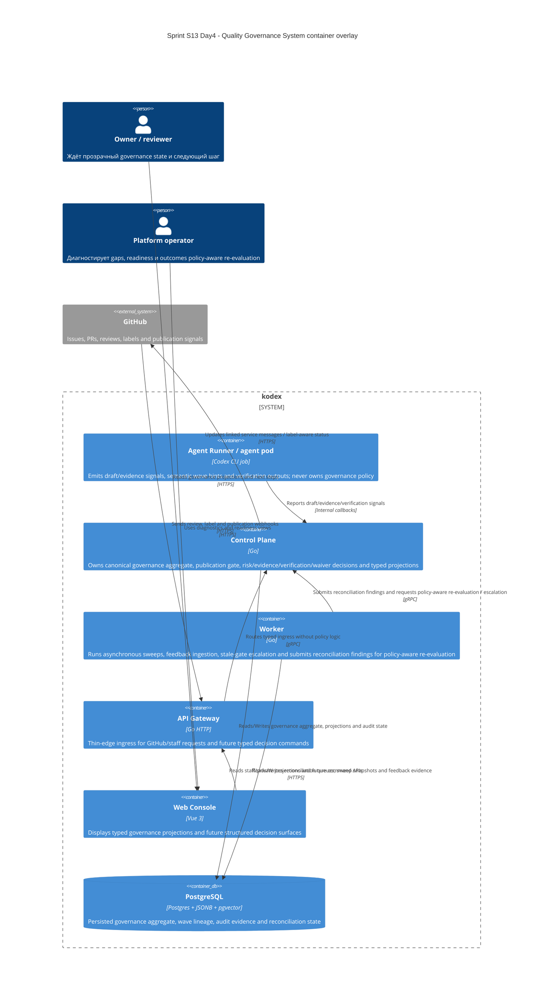

# C4 Container: Sprint S13 Day 4 Quality Governance System

## TL;DR
- Container baseline платформы не меняется: capability реализуется внутри существующих `agent-runner`, `control-plane`, `worker`, `api-gateway`, `web-console`, `postgres`.
- Day4 фиксирует ownership split для draft/evidence handoff, canonical governance aggregate, asynchronous reconciliation и typed visibility/decision projections.

## Диаграмма (Mermaid C4Container)

## Container responsibilities in Quality Governance System

| Container | Role |
|---|---|
| `agent-runner` | Видит локальный run context и передаёт draft/evidence/verification signals без ownership policy semantics |
| `control-plane` | Единственный owner canonical governance aggregate, publication gate, waiver/residual-risk decisions и typed visibility contract |
| `worker` | Выполняет sweeps, stale detection и postdeploy feedback rollups, пишет только reconciliation/evidence state и передаёт findings в `control-plane` для late reclassification / gap closure |
| `api-gateway` | Отдаёт thin-edge ingress/transport surface для GitHub webhook и staff/private команд |
| `web-console` | Показывает typed projections и operator-facing next-step guidance без локальной бизнес-логики |
| `postgres` | Единая persisted coordination layer между pod для governance state, wave lineage и audit evidence |

## Runtime и data boundaries
- `agent-runner` не хранит source-of-truth governance state внутри pod.
- `api-gateway` и `web-console` не вычисляют risk tier, evidence completeness, waiver rules или publication admissibility самостоятельно.
- `worker` не закрывает gates и не создаёт policy semantics без решения `control-plane`.
- GitHub labels/comments остаются внешними publication/review surfaces и не заменяют canonical aggregate в PostgreSQL.

## Continuity after `run:arch`
- Design package в Issue `#494` должен описать typed handoff/projection/decision contracts и migration policy, не меняя этот container ownership split.
- Любой downstream runtime/UI stream Sprint S14 (`#470`) обязан потреблять готовые typed surfaces из `control-plane`, а не переносить ownership в `web-console` или отдельный temporary service.
