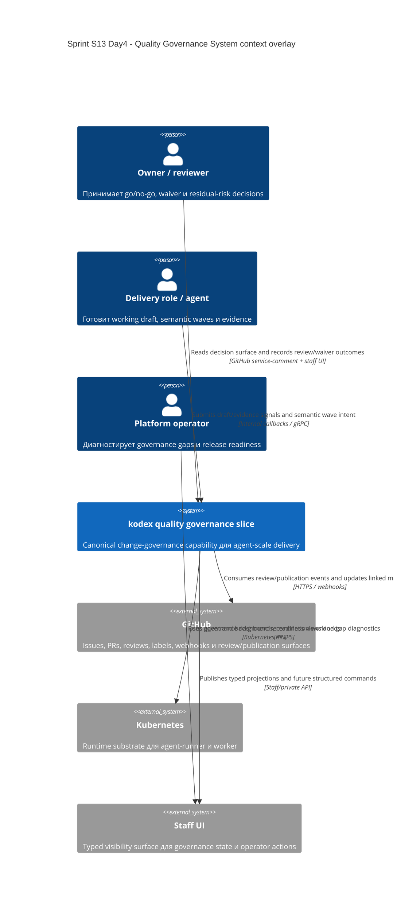

# C4 Context: Sprint S13 Day 4 Quality Governance System

## TL;DR
- `Quality Governance System` остаётся capability slice внутри `kodex`, а не отдельной внешней governance-платформой.
- Owner/reviewer, delivery roles и platform operator получают разные visibility surfaces, но единый source-of-truth для policy semantics живёт внутри platform domain.

## Диаграмма (Mermaid C4Context)

## Пояснения
- GitHub остаётся внешним source of review/publication events, но не source-of-truth для canonical governance semantics.
- Staff UI и GitHub service-comments остаются surfaces одного и того же typed projection.
- Kubernetes обеспечивает runtime только для agent/worker execution и не владеет risk/evidence/waiver semantics.

## Внешние зависимости
- GitHub: review, labels, PR surfaces и webhook evidence.
- Kubernetes: runtime для `agent-runner` и `worker`.
- Staff UI/API: operator/owner visibility surface, но не место для доменных решений.

## Continuity after `run:arch`
- Issue `#494` (`run:design`) должен сохранить этот context overlay как baseline для typed transport/data contracts.
- Sprint S14 (`#470`) не может превращать GitHub, Staff UI или Kubernetes в source-of-truth для policy semantics: этот инвариант остаётся внутри platform domain.
