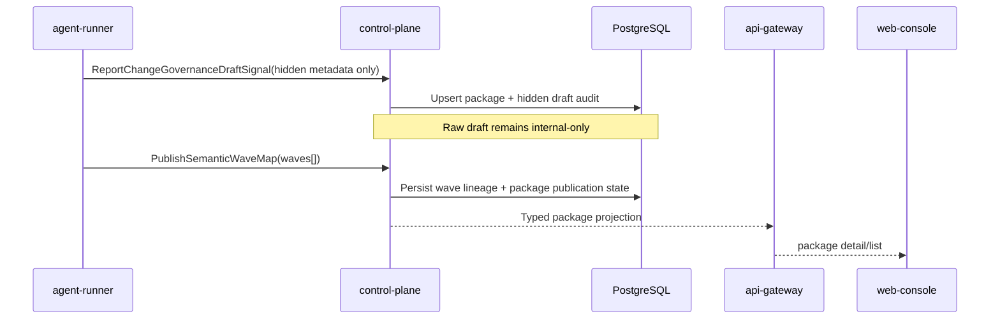
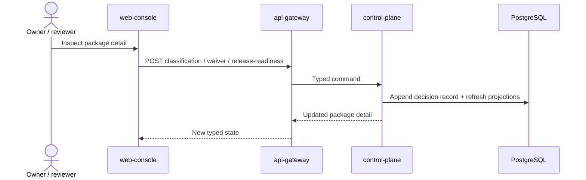
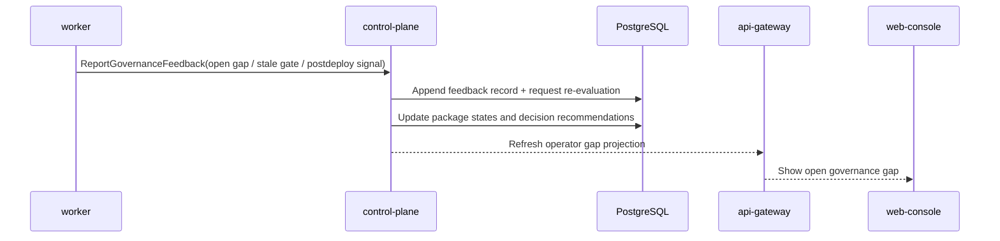

# Detailed Design: Quality Governance System

## TL;DR
- Что меняем: фиксируем implementation-ready design для canonical change-governance aggregate, hidden draft discipline, semantic-wave publication path, typed decision surfaces и governance-gap feedback loop.
- Почему: Day4 architecture закрепил ownership split, но без typed transport/data contracts `run:plan` и `run:dev` снова вернутся к спору о форме aggregate, projections и rollout semantics.
- Основные компоненты: `control-plane` владеет package aggregate, decision ledger и projections; `worker` исполняет sweeps/backfill/feedback reconciliation; `api-gateway` и `web-console` читают и отправляют typed commands; `agent-runner` репортит hidden draft/evidence hints без публикации raw draft.
- Риски: смешение completeness и verification, утечка raw working draft в review surface, over-governance для `low`, implicit waivers для `high/critical`, а также excessive backfill inventing history.
- План выката: `migrations -> control-plane -> worker -> api-gateway -> web-console`.

## Цели / Не-цели
### Goals
- Зафиксировать canonical aggregate и projection model для `Quality Governance System` без service-boundary drift.
- Определить typed ingress, decision и visibility surfaces для change package, semantic wave map, waiver/residual-risk, release readiness и governance-gap feedback.
- Развести hidden `internal working draft` и publishable `semantic waves` на уровне модели и контрактов.
- Сохранить proportional path для `low` и запрет silent waivers для `high/critical`.
- Подготовить rollout, backfill и rollback notes для handover в `run:plan`.

### Non-goals
- Реализация Go/TS кода, OpenAPI/proto/codegen, миграций и feature flags на этапе `run:design`.
- Построение полноценного Sprint S14 cockpit UX, realtime canvas или automation policy beyond typed baseline.
- Новая runtime-служба quality governance на Day5.
- Перенос canonical risk/evidence semantics в `api-gateway`, `web-console`, `worker` или GitHub comments.

## Контекст и текущая архитектура
- Входной baseline:
  - `docs/architecture/initiatives/s13_quality_governance_system/architecture.md`
  - `docs/architecture/adr/ADR-0015-quality-governance-control-plane-owned-change-governance-aggregate.md`
  - `docs/architecture/alternatives/ALT-0007-quality-governance-boundaries.md`
  - `docs/delivery/epics/s13/prd-s13-day3-quality-governance-system.md`
- Неподвижные guardrails:
  - explicit `risk tier` обязателен для каждого change package;
  - `evidence completeness`, `verification minimum`, `waiver discipline` и `release readiness` остаются раздельными constructs;
  - `internal working draft` остаётся hidden non-mergeable artifact;
  - первая publishable единица формируется только через `semantic wave map`;
  - large PR допустим только для `behaviour-neutral mechanical bounded-scope` bundle;
  - `high/critical` changes не допускают silent waivers;
  - Sprint S14 (`#470`) наследует typed surfaces и не переоткрывает policy baseline Sprint S13.

## Предлагаемый дизайн (high-level)
### Design choice: один aggregate, несколько typed sub-ledgers
- `control-plane` хранит один canonical `change governance package`, но не сворачивает все состояния в один boolean.
- Aggregate разбит на отдельные typed части:
  - hidden draft state;
  - semantic wave lineage;
  - evidence blocks;
  - decision ledger (`risk classification`, `waiver`, `release readiness`, `reclassification`);
  - governance feedback records;
  - projection snapshots для owner/reviewer/operator/GitHub mirror.

### Hidden draft stays internal-only
- `internal working draft` фиксируется только как internal metadata и audit trail.
- Raw draft content, full prompt output, exploratory notes и промежуточные diff bundles не попадают ни в staff/private projections, ни в GitHub status comment.
- Единственный publishable bridge наружу: typed `semantic wave map`, где каждая wave имеет dominant intent, bounded scope и отдельную verification surface.

### Publication discipline through semantic waves
- Package сначала может существовать в состоянии hidden draft.
- После этого delivery path обязан опубликовать `semantic wave map`.
- Только после появления минимум одной wave package может получить owner/reviewer visibility и `review_ready` semantics.
- If small diff is semantically mixed:
  - package получает `bundle_admissibility=requires_decomposition`, даже если LOC малы.
- If large bundle is purely mechanical:
  - package может получить `bundle_admissibility=mechanical_bounded_scope`, но только при явном verification plan и отсутствии business/policy/schema mix.

### Separate evaluation constructs
| Construct | Source of truth | Why it stays separate |
|---|---|---|
| `risk tier` | decision ledger in `control-plane` | blast radius и policy impact не равны completeness |
| `evidence completeness` | evidence block evaluation | наличие обязательных evidence blocks не гарантирует их качество или verification |
| `verification minimum` | verification state on package/wave evidence | passed checks не заменяют release/readiness или waiver discipline |
| `waiver state` + `residual risk` | explicit decision record | gap должен быть видимым и auditable |
| `release readiness` | отдельное decision surface | release gate не сводится к tier/completeness alone |
| `governance feedback` | feedback ledger + worker reconciliation | late gaps должны уметь переоткрывать risk/evidence decisions |

### Projection families
| Projection | Primary consumers | Notes |
|---|---|---|
| `package_list` | owner, reviewer, operator | queue with tier, publication, completeness, verification, waiver, release states |
| `package_detail` | owner, reviewer | waves, evidence blocks, decision history, residual risk, linked artifacts |
| `operator_gap_queue` | operator, QA, SRE | unresolved governance gaps, stale waivers, overdue verification |
| `release_gate` | owner, QA, SRE | release-readiness blockers and approved residual risk |
| `github_status_comment` | GitHub service-comment mirror | best-effort render only; never source-of-truth |

### Ownership split
| Concern | Owner | Why |
|---|---|---|
| Package aggregate, wave lineage, decision ledger, projections | `control-plane` | canonical semantics and audit must stay single-owner |
| Sweeps, bounded historical backfill, feedback ingestion, stale-gap escalation | `worker` under `control-plane` policy | asynchronous lifecycle belongs to background jobs, not edge/UI |
| Public webhook ingress and staff/private HTTP adapters | `api-gateway` | thin-edge validation/auth/routing only |
| Review/operator interaction surface | `web-console` on typed projections | UI reads canonical projections and submits explicit typed commands |
| Hidden draft/evidence hints | `agent-runner` as emitter only | runner sees local draft context but does not own semantics |

## Interaction model
### Flow 1: hidden draft -> wave map -> published waves

### Flow 2: owner/reviewer decision path

### Flow 3: governance-gap feedback and late reclassification

### Negative paths (normative)
- `NP-01` Raw draft leakage:
  - hidden draft metadata may exist in aggregate, but public/staff projections must never include raw draft payload, prompt text or exploratory summary.
- `NP-02` Silent waiver:
  - package with `risk_tier in (high, critical)` and missing mandatory evidence/verification cannot transition to `release_ready` without explicit approved waiver and residual-risk record.
- `NP-03` Small semantically mixed diff:
  - package gets `bundle_admissibility=requires_decomposition`; review-ready projection stays blocked until waves are republished.
- `NP-04` Over-governance on `low`:
  - package may record extra evidence, but baseline `low` path cannot be blocked only because higher-tier artifacts are absent unless risk reclassification happened explicitly.
- `NP-05` Backfill inventing history:
  - historical import may infer artifact links and evidence gaps, but never fabricates hidden drafts, wave maps, waivers or release decisions that did not exist in evidence.

## API/Контракты
- Детализация transport surfaces: `docs/architecture/initiatives/s13_quality_governance_system/api_contract.md`.
- Day5 design choice:
  - no new public webhook endpoint family;
  - existing GitHub webhook normalization path extends domain inputs, but canonical write path for governance decisions stays in staff/private API;
  - GitHub service-comment is read-only mirror with deep-link to staff/private decision surface.
- Decision surfaces intentionally stay explicit:
  - risk classification / reclassification;
  - waiver + residual risk;
  - release readiness;
  - governance feedback acknowledgement / closure.

## Модель данных и миграции
- Детализация entities/indexes/invariants: `docs/architecture/initiatives/s13_quality_governance_system/data_model.md`.
- Rollout/backfill/rollback policy: `docs/architecture/initiatives/s13_quality_governance_system/migrations_policy.md`.
- Key Day5 choice:
  - additive `control-plane` tables own new aggregate;
  - bounded historical backfill creates only evidence-backed packages and gaps;
  - no separate governance schema owner or shared-db split is introduced.

## Нефункциональные аспекты
- Надёжность:
  - draft/evidence ingestion idempotent by `signal_id`;
  - decision commands deduped by `decision_id` / `expected_projection_version`;
  - worker sweeps idempotent by `package_id + sweep_kind + projection_version`.
- Производительность:
  - list and gap queues read from persisted projections, not from fan-out joins over every artifact;
  - detail view may hydrate sub-ledgers lazily per package.
- Безопасность:
  - hidden draft content never enters user-facing DTOs;
  - GitHub comment mirror renders only typed projection fields;
  - all platform env/flags use `KODEX_` prefix.
- Наблюдаемость:
  - every draft ingestion, wave publication, decision, feedback and reclassification mirrors into `flow_events`.

## Наблюдаемость (Observability)
- Logs:
  - `quality_governance.package.upserted`
  - `quality_governance.wave_map.published`
  - `quality_governance.decision.recorded`
  - `quality_governance.feedback.recorded`
  - `quality_governance.projection.refreshed`
- Metrics:
  - `quality_governance_packages_total{risk_tier,publication_state}`
  - `quality_governance_gaps_total{gap_kind,state}`
  - `quality_governance_waivers_total{risk_tier,state}`
  - `quality_governance_projection_refresh_total{projection_kind,result}`
- Traces:
  - `agent-runner.signal -> control-plane.package-upsert`
  - `staff-http -> control-plane.decision-command`
  - `worker.feedback -> control-plane.re-evaluation`
- Dashboards:
  - package queue by risk tier/state;
  - operator gap backlog and stale-gate trend;
  - waiver volume by tier and residual risk.
- Alerts:
  - unresolved `high/critical` gaps older than policy threshold;
  - projection refresh failures;
  - repeated late reclassification for the same package lineage.

## Тестирование
- Unit:
  - state transitions for publication, completeness, waiver and release readiness.
- Integration:
  - package aggregate persistence;
  - wave publication;
  - decision record append + projection refresh;
  - worker feedback re-evaluation.
- Contract:
  - staff/private DTO validation and error mapping;
  - internal signal RPC schemas.
- E2E:
  - `hidden draft -> wave map -> review-ready -> waiver -> release-ready`;
  - `postdeploy gap -> reclassification -> operator queue`.
- Security checks:
  - raw draft redaction from projections and comment mirror;
  - forbidden silent waiver path for `high/critical`.

## План выката (Rollout)
- Production path for future `run:dev`:
  1. migrations
  2. `control-plane`
  3. `worker`
  4. `api-gateway`
  5. `web-console`
- Runtime settings:
  - foundation path включается через typed platform setting `quality_governance_enabled` в staff UI `/configuration/system-settings`;
  - downstream feedback/UI/comment-mirror toggles должны добавляться в тот же typed platform settings catalog, а не как env-only switches.
- Rollout notes:
  - domain flag goes live before worker/UI flags;
  - UI may lag safely while projections accumulate in DB;
  - comment mirror stays optional and must not block canonical state persistence.

## План отката (Rollback)
- Safe rollback before worker/UI enable:
  - disable `quality_governance_enabled` через staff UI `/configuration/system-settings`;
  - keep additive schema in place;
  - stop creating new packages while leaving stored evidence/audit readable.
- Limited rollback after live decisions:
  - disable UI/comment-mirror flags first;
  - keep decision ledger and feedback history immutable;
  - manual recovery remains on typed package detail surface.
- Non-revertible effects:
  - recorded waivers, release decisions, reclassifications and feedback evidence;
  - backfilled package artifacts and projection versions referenced by audit.

## Альтернативы и почему отвергли
- GitHub comment as primary write path:
  - rejected because free-form comments would re-open policy semantics and break typed audit.
- Worker-owned aggregate:
  - rejected because asynchronous sweeps cannot become canonical owner of risk/evidence semantics.
- Flat boolean `quality_gate_passed`:
  - rejected because it collapses separate constructs and hides waiver/residual-risk discipline.

## Открытые вопросы
1. На `run:plan` нужно разложить execution waves так, чтобы foundation package aggregate вышел раньше operator gap queue и GitHub mirror.
2. Sprint S14 должен решить, нужен ли отдельный realtime stream для governance projections, но этот выбор не меняет typed baseline Day5.
3. Нужен отдельный execution sub-wave для bounded historical backfill и gap seeding, чтобы не смешать его с live package creation.

## Апрув
- request_id: `owner-2026-03-16-issue-494-design`
- Решение: pending
- Комментарий: design package ждёт review Owner и handover в `run:plan`.
