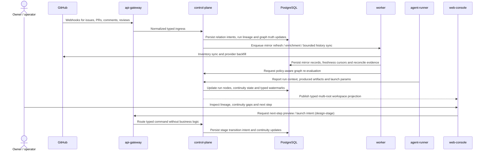

# Sprint S16 Day 4 — Mission Control graph workspace architecture

## TL;DR
- 2026-03-25 issue `#561` перевела этот architecture baseline в historical superseded state.
- Зафиксированная здесь ownership-модель S16 больше не является текущим Mission Control source of truth и не должна автоматически переноситься в новые спринты.
- Текущий agreed path: сначала новый UX baseline `#562`, затем новый backend architecture package `#563`.

## Контекст и входные артефакты
- Delivery-цепочка: `#492 (intake) -> #496 (vision) -> #510 (prd) -> #516 (arch)`.
- Source of truth:
  - `docs/delivery/epics/s16/prd-s16-day3-mission-control-graph-workspace.md`
  - `docs/delivery/epics/s16/epic-s16-day3-mission-control-graph-workspace-prd.md`
  - `docs/delivery/sprints/s16/sprint_s16_mission_control_graph_workspace.md`
  - `docs/delivery/traceability/s16_mission_control_graph_workspace_history.md`
  - `docs/product/requirements_machine_driven.md`
  - `docs/product/agents_operating_model.md`
  - `docs/product/labels_and_trigger_policy.md`
  - `docs/product/stage_process_model.md`
  - `docs/architecture/c4_context.md`
  - `docs/architecture/c4_container.md`
  - `docs/architecture/data_model.md`
  - `docs/architecture/initiatives/s9_mission_control_dashboard/architecture.md`
  - `services/internal/control-plane/README.md`
  - `services/jobs/worker/README.md`
  - `services/jobs/agent-runner/README.md`
  - `services/external/api-gateway/README.md`
  - `services/staff/web-console/README.md`

## Цели архитектурного этапа
- Превратить Day3 product contract в проверяемые service boundaries и ownership split для graph truth, provider inventory foundation, typed watermarks/launch params и next-step surfaces.
- Зафиксировать, как hybrid truth merge объединяет platform state и GitHub inventory без дублирования canonical ownership и без возврата к live-fetch-only UI.
- Сохранить locked baseline Sprint S16: issue `#480`, exact Wave 1 filters `open_only`, `assigned_to_me_or_unassigned`, `active-state presets`, secondary/dimmed semantics только для graph integrity, nodes `discussion/work_item/run/pull_request`, platform-canonical launch params и continuity rule `PR + linked follow-up issue`.
- Подготовить handover в `run:design` с явным списком typed contract/data/migration вопросов, которые ещё предстоит детализировать.

## Non-goals
- Не выбираем точные HTTP/gRPC DTO, поля БД и миграции.
- Не создаём отдельный runtime/service boundary для Mission Control graph workspace на Day4.
- Не проектируем конкретную graph library, exact canvas interaction model или realtime transport namespace.
- Не возвращаем voice/STT, dashboard orchestrator agent, отдельную `agent` node taxonomy, full-history/archive или richer provider enrichment в core Wave 1.
- Не меняем код, БД-схему, deploy manifests, RBAC или runtime behavior на этапе `run:arch`.

## Неподвижные guardrails из PRD
- Mission Control остаётся primary fullscreen multi-root graph workspace/control plane, а не board/list refresh Sprint S9.
- Coverage contract provider foundation остаётся `all open Issues/PR + bounded recent closed history`; GitHub Projects / Issue Type / Relationships не становятся primary graph source.
- Wave 1 nodes ограничены `discussion`, `work_item`, `run`, `pull_request`; `agent` не становится canvas node.
- Secondary/dimmed semantics допускаются только для graph integrity и не подменяют primary filters.
- Human review, merge и provider-native collaboration остаются в GitHub UI.
- Stage continuity через `run:dev` считается complete только при наличии `PR + linked follow-up issue`.

## Source-of-truth split

| Concern | Канонический владелец | Почему |
|---|---|---|
| Graph node kind, relations, continuity lineage, continuity gaps | `control-plane` + PostgreSQL | Только домен платформы знает stage semantics, allowed relations и правило `PR + linked follow-up issue` |
| Run nodes, produced artifacts, launch params, platform metadata/watermarks | `control-plane` | Эти данные не имеют внешнего provider owner и должны быть typed platform state |
| Issue/PR/comment/review state и provider-native collaboration | GitHub provider mirror (`worker` maintains, `control-plane` consumes) | GitHub остаётся canonical для provider entities, review и merge semantics |
| Bounded provider inventory freshness, recent closed history, enrichment/backfill execution | `worker` под policy `control-plane` | Нужен background idempotent execution path без переноса graph semantics в job layer |
| Hybrid truth merge rules и next-step projection | `control-plane` | Иначе `web-console`, `worker` или `api-gateway` начнут вычислять graph truth локально |
| Webhook normalization и staff/private transport | `api-gateway` | Edge остаётся thin boundary без graph/business logic |
| Canvas rendering, toolbar state, drawer inspection UX | `web-console` | UI остаётся presentation layer над typed projections, но не source-of-truth |
| Run-produced local evidence | `agent-runner` как emitter, `control-plane` как owner | Runner видит локальный context, но не владеет canonical lineage semantics |

## Hybrid truth model

### Layer 1: Provider inventory foundation
- `worker` поддерживает persisted mirror для scope `all open Issues/PR + bounded recent closed history`.
- Mirror хранит GitHub-canonical facts:
  - issue / pull request state;
  - comments, reviews и provider-native development links;
  - provider freshness cursors и bounded coverage watermarks.
- Mirror не превращается в graph truth сам по себе: он поставляет provider evidence для следующего слоя.

### Layer 2: Platform graph truth
- `control-plane` хранит canonical graph aggregate:
  - node classification `discussion/work_item/run/pull_request`;
  - relations между nodes и produced artifacts;
  - continuity gaps и expected downstream artifacts;
  - typed metadata/watermarks;
  - platform-canonical launch params и next-step eligibility.
- Если provider entity отсутствует в mirror из-за bounded policy, graph truth не подделывает факт отсутствия: она показывает scope/freshness watermark и сохраняет relation only when explicitly known.

### Layer 3: Workspace projection
- `control-plane` строит workspace projection как merge платформенного graph truth и provider mirror.
- Projection obeys:
  - primary filters `open_only`, `assigned_to_me_or_unassigned`, `active-state presets`;
  - secondary/dimmed nodes only when required for graph integrity;
  - one typed node shell per canonical entity reference;
  - explicit freshness/scope watermarks на каждом участке, зависящем от bounded inventory.
- `web-console` получает уже собранную projection surface и не выполняет client-side merge provider/platform state.

## Architecture flow: provider inventory -> graph truth -> next step

## Service boundaries and ownership matrix

| Concern | Primary owner | Supporting owners | Boundary decision | Design-stage deliverables |
|---|---|---|---|---|
| Node classification and relation graph | `control-plane` | `worker`, `web-console` | Node kinds `discussion/work_item/run/pull_request` и relations живут только в platform graph truth; GitHub raw entities и UI heuristics не могут менять canonical type | Typed node/relation DTO, relation invariants, graph watermark model |
| Multi-root workspace projection | `control-plane` | `web-console` | Projection строится в backend поверх graph truth + mirror evidence; frontend не собирает graph из разрозненных APIs | Snapshot contract, filter preset contract, dimmed-node rules |
| Continuity rule `PR + linked follow-up issue` | `control-plane` | `agent-runner`, `worker` | Canonical continuity gap detection и expected-artifact semantics живут в домене платформы, а не в PR comments или UI hints | Continuity gap model, next-step preview/error map |
| Platform-canonical launch params и next-step surfaces | `control-plane` | `api-gateway`, `web-console` | Allowed next step определяется stage policy и runtime lineage внутри домена; UI только показывает typed preview/allowed action set | Launch preview DTO, allowed action enum, audit events |
| Provider mirror freshness и bounded recent closed history | `worker` under `control-plane` policy | GitHub adapters | Background jobs синхронизируют inventory и backfill, но не решают graph membership сами | Reconcile cadence, mirror watermark model, stale behavior |
| Typed metadata and watermarks | `control-plane` | `worker`, `web-console` | Watermarks собираются как typed platform surface: source kind, freshness, coverage scope, continuity status | Watermark taxonomy, placement rules, visibility matrix |
| Webhook/staff ingress | `api-gateway` | `control-plane` | Edge только валидирует, authz/authn и нормализует input; доменная merge logic туда не переносится | Ingress envelopes, command routing contract |
| Canvas rendering and local UI state | `web-console` | none | UI управляет layout, selection, drawer state и responsiveness, но не вычисляет graph truth и next-step policy | View model slices, stale-state UX, deep-link rules |
| Run artifact emission | `agent-runner` | `control-plane` | Runner передаёт produced artifacts, run metadata и launch params; canonical linkage и continuity state остаются в `control-plane` | Callback payload contract, idempotency keys |

## Continuity graph semantics
- `discussion` и `work_item` represent platform-owned node kinds over issue-backed entities; raw GitHub issue type не считается достаточным graph owner.
- `run` является platform-native node и получает canonical linkage к родительскому `discussion` или `work_item`.
- `pull_request` остаётся provider-backed node, но relation `run -> pull_request` и continuity completeness являются platform truth.
- Follow-up issue для следующего stage остаётся issue-backed node типа `work_item`; отсутствие linked follow-up issue после завершения stage считается persisted continuity gap.
- `agent` intentionally excluded from Wave 1 node taxonomy:
  - agent identity может быть metadata/drawer surface;
  - core graph truth не раздувается дополнительным node type до появления owner-approved need.

## Почему не создаём отдельный graph workspace service сейчас
- `control-plane` уже владеет run lifecycle, stage policy, next-step semantics, audit trail и transport ownership для platform-native state.
- Новый service boundary на Day4 создал бы второго owner для graph truth до фиксации typed contracts и migration policy.
- Current split already covers Sprint S16:
  - `control-plane` owns graph truth and continuity policy;
  - `worker` owns background inventory execution and freshness;
  - `api-gateway` and `web-console` stay thin adapters;
  - `agent-runner` stays source emitter for run outputs.
- Если после `run:plan` / `run:dev` появятся scale-сигналы, projection-serving path можно вынести позже без переоткрытия hybrid truth ownership.

## Architecture quality gates for `run:design`

| Gate | Что проверяем | Почему это обязательно |
|---|---|---|
| `QG-S16-A1` Hybrid truth integrity | Provider mirror, platform graph truth и workspace projection остаются раздельными typed слоями | Иначе вернётся split-brain между GitHub, background jobs и UI |
| `QG-S16-A2` Boundary integrity | `control-plane` / `worker` / `api-gateway` / `web-console` / `agent-runner` имеют явные owner roles без local graph logic outside `control-plane` | Иначе Day4 потеряет смысл и `run:design` переоткроет ownership |
| `QG-S16-A3` Continuity completeness | Rule `PR + linked follow-up issue` выражено как persisted domain construct, а не как narrative best practice | Иначе следующий шаг нельзя будет проверить автоматически |
| `QG-S16-A4` Wave 1 discipline | Exact filters/nodes, dimmed semantics и deferred contours закреплены без scope drift | Иначе design-stage превратится в product rethink |
| `QG-S16-A5` Foundation boundedness | `#480` inventory foundation остаётся bounded mirror, а не full-history data warehouse | Иначе Sprint S16 потеряет focus и runtime feasibility |

## Открытые design-вопросы
- Как лучше разложить canonical graph aggregate на typed entities/projections без overfit под конкретную UI library?
- Нужен ли единый projection shape для graph canvas и list fallback, или design-stage лучше разделить их на list/detail/read models при общей truth model?
- Как представить watermarks по freshness, coverage scope и continuity так, чтобы пользователь не путал provider staleness с actual continuity gap?
- Какие provider-safe inline actions кроме open/inspect/launch preview можно допустить в Wave 1 без нарушения GitHub-native review/merge semantics?
- Как формально выразить bounded recent closed history policy и backfill behaviour без drift между `worker` и `control-plane`?

## Migration и runtime impact
- На этапе `run:arch` код, БД-схема, deploy manifests и runtime behavior не менялись.
- Обязательный rollout order для будущего `run:dev` остаётся:
  - `migrations -> control-plane -> worker -> api-gateway -> web-console`.
- Design-stage обязан отдельно зафиксировать:
  - canonical data model для graph truth, provider mirror references, continuity gaps и watermarks;
  - backfill strategy для open issues/PR и bounded recent closed history;
  - rollback notes для новых graph projections и next-step surfaces;
  - audit event set для continuity gap detection, next-step preview/launch, mirror freshness и graph watermark updates.

## Context7 и внешний baseline
- Context7/external dependency lookup на этапе `run:arch` не требовались: новые библиотеки и vendor integrations в scope не добавлялись.
- Локально подтверждён non-interactive GitHub CLI flow для follow-up issue и PR automation:
  - `gh issue create --help`
  - `gh pr create --help`
  - `gh pr edit --help`

## Handover в `run:design`
- Следующий этап: `run:design`.
- Follow-up issue: `#519`.
- Trigger-лейбл на новую issue ставит Owner после review architecture package.
- На design-stage обязательно выпустить:
  - `design_doc.md` с graph interaction model, list fallback rules, continuity-gap UX и next-step preview behavior;
  - `api_contract.md` с typed contracts для graph snapshot, node details, launch preview/launch intents и freshness/continuity surfaces;
  - `data_model.md` с graph truth aggregate, provider mirror references, watermarks, continuity gaps и bounded history ownership;
  - `migrations_policy.md` с rollout/backfill/rollback notes и sequencing `control-plane -> worker -> api-gateway -> web-console`.
