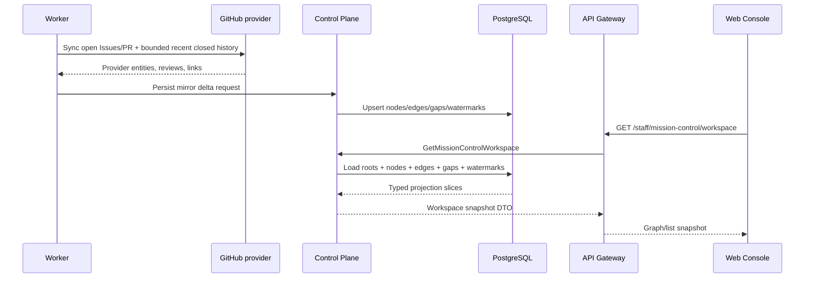
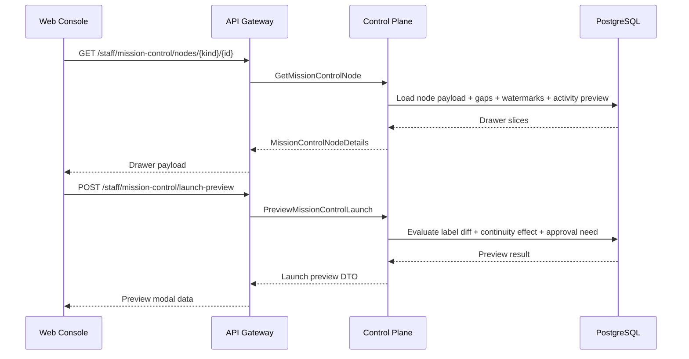
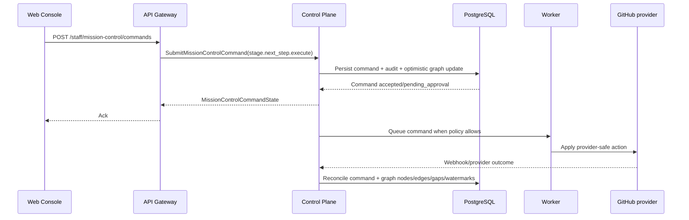

# Detailed Design: Mission Control graph workspace

## TL;DR
- 2026-03-25 issue `#561` перевела этот detailed design в historical superseded state.
- Graph/list shell, taxonomy `discussion/work_item/run/pull_request` и rollout path Sprint S16 больше не являются текущим Mission Control baseline.
- Новый design path будет переопределён после frontend-first approval в issue `#562` и backend rebuild sprint `#563`.
- План выката: additive schema/backfill в `control-plane`, shadow validation в candidate, rollout order `migrations -> control-plane -> worker -> api-gateway -> web-console`, после чего старый S9 dashboard path переводится в superseded state.

## Цели / Не-цели
### Goals
- Зафиксировать graph-first interaction model для Wave 1: multi-root workspace, right drawer, continuity gaps, watermarks и next-step preview.
- Выбрать эволюционный путь поверх существующего Mission Control foundation Sprint S9, не создавая отдельный сервис и не перенося graph truth во frontend.
- Сохранить fixed Wave 1 baseline: `open_only`, `assigned_to_me_or_unassigned`, active-state presets, nodes `discussion/work_item/run/pull_request`, secondary/dimmed semantics только для graph integrity.
- Сохранить existing command ledger для platform-safe actions и встроить graph-specific preview поверх `stage.next_step.execute`, а не вводить второй write-path.
- Определить rollout, backfill и rollback notes так, чтобы graph read model мог быть включён без drift между `control-plane`, `worker`, `api-gateway` и `web-console`.

### Non-goals
- Реализация кода, миграций, OpenAPI/proto и deploy manifests в этом stage.
- Выделение отдельного graph-workspace service, отдельной БД или отдельного runtime boundary.
- Возврат `agent` node taxonomy, voice/STT, dashboard orchestrator agent, full-history/archive и richer provider enrichment в core Wave 1.
- Перенос human review, merge decision или provider-native collaboration из GitHub UI в Mission Control.
- Введение env-only feature flag для продуктового поведения graph workspace.

## Контекст и текущая архитектура
- Source architecture:
  - `docs/architecture/initiatives/s16_mission_control_graph_workspace/architecture.md`
  - `docs/architecture/adr/ADR-0016-mission-control-graph-workspace-hybrid-truth-and-continuity-ownership.md`
  - `docs/architecture/alternatives/ALT-0008-mission-control-graph-workspace-hybrid-truth-boundaries.md`
- Product baseline:
  - `docs/delivery/epics/s16/prd-s16-day3-mission-control-graph-workspace.md`
  - `docs/delivery/sprints/s16/sprint_s16_mission_control_graph_workspace.md`
- Existing implementation baseline to evolve:
  - Sprint S9 Mission Control dashboard already owns projection/timeline/command runtime and rollout order `migrations -> control-plane -> worker -> api-gateway -> web-console`.
  - `mission_control_commands` and `stage.next_step.execute` already express platform-safe mutation path and must not be duplicated.
  - `agent` nodes, `board|list` framing and dashboard-first DTO were acceptable for Sprint S9, but no longer cover graph lineage and continuity completeness for Sprint S16.

## Предлагаемый дизайн (high-level)
### Design choice: graph workspace as evolutionary read-model replacement
- Выбран эволюционный design path:
  - `control-plane` остаётся единственным owner graph truth, continuity gaps и launch surfaces.
  - `worker` продолжает строить provider mirror и recent-closed-history backfill по policy `control-plane`.
  - существующий Mission Control command ledger сохраняется; меняется graph-first read model и preview semantics.
- Почему не второй read/write contour:
  - отдельный graph command path удвоит admission/audit/approval logic;
  - design stage должен сохранить один owner policy-safe action surface.

### Graph read model
- Workspace snapshot строится как merge трёх typed layers:
  - provider mirror scope из `#480`: open Issues/PR + bounded recent closed history;
  - platform graph truth: node classification, relations, continuity gaps, launch params;
  - workspace projection: roots, columns, visibility tier, watermarks и drawer-ready slices.
- Projection rules:
  - primary selection всегда использует fixed filters `open_only` + `assigned_to_me_or_unassigned` + chosen active-state preset;
  - `secondary_dimmed` допускается только для node/edge, который нужен для связности path между primary nodes или для recent closed context внутри bounded window;
  - node `run` становится platform-native first-class node; `agent` уходит в drawer metadata run node и не рендерится на canvas;
  - graph/list используют один snapshot contract и один набор node/edge/watermark DTO.

### Interaction model
- Initial load:
  - UI вызывает workspace snapshot и получает graph roots, nodes, edges, gaps, workspace watermarks и `resume_token`.
  - `graph` — primary presentation, `list` — fallback/collapsed projection той же выборки.
- Drawer:
  - details route возвращает node payload, continuity gaps, node watermarks, activity preview и launch surfaces.
  - comments/chat остаются drawer/timeline entities и не становятся отдельными canvas nodes.
- Next step:
  - отдельный preview route рассчитывает continuity effect перед mutation path;
  - actual execution остаётся в `POST /commands` через `stage.next_step.execute`, чтобы не дублировать audit/approval semantics.
- Realtime:
  - сохраняется snapshot-first / delta-second baseline Sprint S9;
  - delta никогда не заменяет полный snapshot, а только обновляет nodes/edges/gaps/watermarks.

## Core flows
### Flow 1: Provider foundation -> graph truth -> workspace snapshot

### Flow 2: Drawer inspection + launch preview

### Flow 3: Preview accepted -> command ledger -> reconcile

## UI and state rules
### Workspace shell
- Layout remains fullscreen with detached top toolbar, graph canvas and right drawer/chat.
- Toolbar controls in Wave 1:
  - state preset switcher (`working`, `waiting`, `blocked`, `review`, `recent_critical_updates`, `all_active`);
  - search;
  - graph/list toggle;
  - explicit refresh.
- `open_only` and `assigned_to_me_or_unassigned` остаются fixed baseline, показываются как effective filter chips, но не настраиваются пользователем в core Wave 1.

### Visibility and continuity rules
- `primary` node:
  - satisfies fixed filters + chosen active-state preset.
- `secondary_dimmed` node:
  - вне primary filter, но обязателен для graph integrity или recent closed context внутри bounded window.
- Continuity gap rendering:
  - `blocking` gap: яркий badge на node/root + первичный drawer banner.
  - `warning` gap: dimmed notice + preview hint.
  - `info` gap: activity/event-level context without blocking CTA.
- Missing `pull_request` or missing linked follow-up issue are always persisted gaps, not ephemeral UI hints.

### Provider boundary
- Inline action set Wave 1 ограничен:
  - inspect node/drawer;
  - inspect run context;
  - preview next allowed stage;
  - open linked PR;
  - open linked follow-up issue;
  - open provider context.
- Human review/merge/rebase/comment editing remain provider deep-link-only and never get inline mutation contract in graph workspace.

## API/Контракты
- Полная transport-спецификация вынесена в:
  - `docs/architecture/initiatives/s16_mission_control_graph_workspace/api_contract.md`
- Key design decisions:
  - existing route family `/api/v1/staff/mission-control/*` remains under the same product area, but `dashboard/entities/timeline` DTO are superseded by `workspace/nodes/activity` DTO;
  - no backward compatibility guarantee for Sprint S9 dashboard contract is required because repo is early-stage and `web-console` ships in the same rollout wave;
  - preview of `stage.next_step.execute` becomes explicit typed read-side call before command submit;
  - realtime keeps snapshot-first / delta-second semantics and only transports typed graph deltas.

## Модель данных и миграции
- Подробная схема и invariants:
  - `docs/architecture/initiatives/s16_mission_control_graph_workspace/data_model.md`
- Rollout/backfill/rollback notes:
  - `docs/architecture/initiatives/s16_mission_control_graph_workspace/migrations_policy.md`
- Core storage choice:
  - reuse existing Mission Control foundation tables for nodes/edges/activity/commands;
  - add persisted continuity gaps and workspace watermarks under the same schema owner `control-plane`;
  - avoid second schema owner or parallel graph service.

## Нефункциональные аспекты
- Надёжность:
  - workspace snapshot is fully derivable from persisted graph truth + mirror evidence;
  - preview result is deterministic for one `(snapshot_id, node_ref, target_label)` tuple;
  - missing provider coverage is shown as watermark, not guessed away.
- Производительность:
  - snapshot target: p95 `<= 2s` for 2-3 active initiatives and bounded recent closed context;
  - drawer details target: p95 `<= 1s`;
  - preview target: p95 `<= 500ms`.
- Безопасность:
  - staff JWT + project RBAC stay mandatory;
  - preview never performs side effects;
  - `stage.next_step.execute` continues to respect approval/label policy and cannot silently bypass existing next-step governance.
- Наблюдаемость:
  - coverage freshness, graph rebuild duration, gap count and preview admission outcomes get dedicated metrics/log events.

## Наблюдаемость (Observability)
- Логи:
  - `mission_control.workspace.snapshot_loaded`
  - `mission_control.workspace.preview_generated`
  - `mission_control.workspace.preview_blocked`
  - `mission_control.workspace.gap_detected`
  - `mission_control.workspace.gap_resolved`
  - `mission_control.workspace.watermark_updated`
- Метрики:
  - `mission_control_workspace_snapshot_duration_seconds`
  - `mission_control_workspace_preview_duration_seconds`
  - `mission_control_workspace_roots_total`
  - `mission_control_workspace_secondary_nodes_total`
  - `mission_control_workspace_blocking_gaps_total`
  - `mission_control_workspace_provider_watermark_age_seconds`
- Трейсы:
  - snapshot build;
  - drawer details build;
  - preview generation;
  - command reconcile to graph update.
- Дашборды:
  - graph workspace freshness/coverage;
  - continuity gap backlog;
  - preview/command outcomes by action kind.
- Алерты:
  - provider watermark status `degraded` above threshold;
  - graph rebuild lag above agreed SLO;
  - blocking gaps growing while preview success drops.

## Тестирование
- Unit:
  - graph classification and continuity-gap rules in `control-plane`;
  - preview eligibility and continuity-effect calculator;
  - worker backfill mapping `provider mirror -> run lineage -> gaps/watermarks`.
- Integration:
  - OpenAPI/gRPC DTO mapping for workspace snapshot, node details and preview;
  - repository tests for continuity gaps, watermarks and graph relation rebuild;
  - worker reconcile tests with bounded recent closed history.
- E2E:
  - multi-root workspace with 2-3 initiatives;
  - missing PR / missing follow-up gap detection;
  - provider deep-link-only boundary for human review/merge.
- Нагрузочное:
  - snapshot and preview performance for pilot-size active set.
- Security checks:
  - preview route is read-only;
  - command submit remains policy-governed;
  - no graph logic in `api-gateway` or `web-console`.

## План выката (Rollout)
- Candidate:
  - additive schema changes and shadow backfill land first;
  - graph snapshot/details/preview are validated in candidate before merge;
  - `web-console` graph shell deploys last.
- Production:
  - rollout order remains `migrations -> control-plane -> worker -> api-gateway -> web-console`;
  - no separate feature flag or alternate service path is introduced.
- Gradual enablement:
  - read path switches before write path preview is exposed to UI;
  - preview route is enabled before graph-driven `stage.next_step.execute` CTA becomes default.
- Коммуникации:
  - owner review of design package precedes `run:plan`;
  - plan stage must decompose rollout into foundation/backend/transport/UI quality gates.

## План отката (Rollback)
- Trigger conditions:
  - graph snapshot not matching bounded coverage contract;
  - blocking gaps rendered incorrectly;
  - preview path producing policy drift versus existing next-step service.
- Rollback steps:
  - redeploy previous app images in reverse order `web-console -> api-gateway -> worker -> control-plane`;
  - keep additive schema/tables for audit and replay;
  - pause graph backfill jobs if they overload provider mirror cadence.
- Success check:
  - previous Mission Control behavior restored;
  - no orphan commands or untracked provider side effects introduced by preview path.

## Альтернативы и почему отвергли
- Full replacement with a new graph service: rejected on Day4/Day5 because it reopens ownership and rollout contour too early.
- Client-side graph assembly from multiple endpoints: rejected because it leaks truth merge into `web-console`.
- Second mutation path for graph launches: rejected because `mission_control_commands` already provides audit/approval-safe admission semantics.

## Открытые вопросы
1. Нужен ли отдельный post-rollout cleanup issue для SQL cleanup `agent` node materialization, или это безопасно включить в последнюю dev wave после candidate verification?
2. Достаточно ли current S9 realtime envelope with graph deltas, или `run:plan` должен выделить отдельную sub-wave на graph-specific realtime soak in candidate?

## Апрув
- request_id: `owner-2026-03-16-issue-519-design`
- Решение: pending
- Комментарий: требуется owner review design package и handover в `run:plan`.
