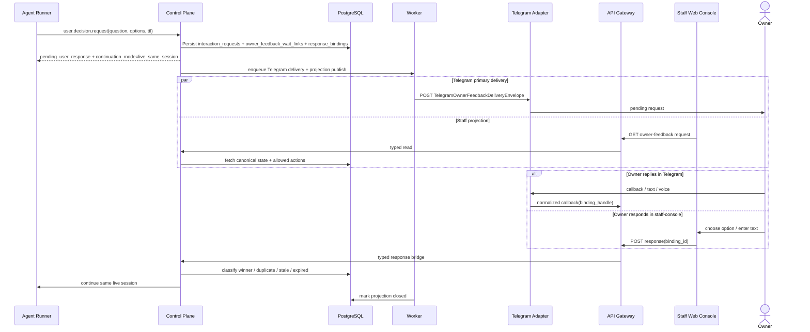
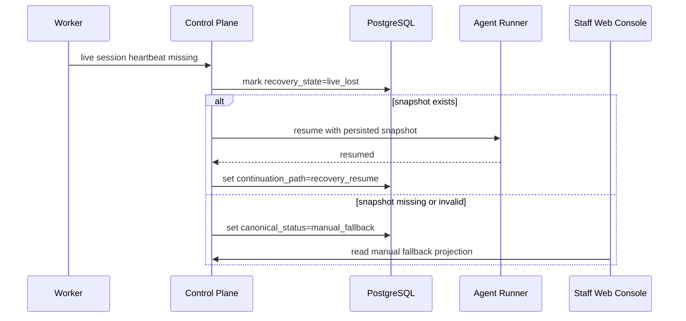

# Detailed Design: Sprint S17 unified owner feedback loop

## TL;DR
- Что меняем: фиксируем implementation-ready design для unified owner feedback loop поверх Sprint S10/S11 foundation, где response-required path продолжает ту же live session и использует Telegram + staff-console как две surface-проекции одного persisted backend truth.
- Почему: Day4 зафиксировал boundaries и guardrails, но без typed API/data/runtime contracts следующий этап переоткроет ownership решений и drift между live wait, fallback UI и recovery-resume.
- Основные компоненты: `control-plane`, `worker`, `api-gateway`, `agent-runner`, `telegram-interaction-adapter`, `staff web-console`, PostgreSQL.
- Риски: split-brain между Telegram и staff-console, повторный logical completion на duplicate/stale replies, деградация happy-path в detached resume, смешение owner feedback с control-tool `owner.feedback.request`.
- План выката: prerequisite Sprint S10/S11 foundation, затем `migrations -> control-plane -> worker -> api-gateway -> telegram-interaction-adapter -> web-console`.

## Цели / Не-цели
### Goals
- Зафиксировать typed contract для built-in owner feedback wait path без reuse approval/control semantics.
- Определить единый persisted request truth, channel projections и response binding registry для Telegram callback/free-text/voice и staff-console fallback responses.
- Зафиксировать wait-state linkage между `interaction_requests`, `agent_runs`, `agent_sessions`, timeout-guard и recovery-only snapshot resume.
- Закрепить visibility model и допустимые operator actions для `overdue`, `expired`, `manual_fallback` и `recovery_resume`.
- Подготовить handover в `run:plan` с явным sequencing и rollout constraints относительно Sprint S10/S11.

### Non-goals
- Реализация кода, миграций, OpenAPI/proto/codegen и runtime rollout в этом stage.
- Новый dedicated service или новый DB owner вне `control-plane`.
- Дополнительные каналы, reminders/escalations, attachments, multi-party routing и generalized conversation platform.
- Reuse `owner.feedback.request`, approval tables или approval state vocabulary как source-of-truth для owner responses.
- Возврат detached resume-run как normal happy-path.

## Контекст и текущая архитектура
- Source architecture:
  - `docs/architecture/initiatives/s17_unified_owner_feedback_loop/architecture.md`
  - `docs/architecture/adr/ADR-0017-unified-owner-feedback-loop-live-wait-primary-platform-owned-continuation.md`
  - `docs/architecture/alternatives/ALT-0009-unified-owner-feedback-loop-live-wait-and-channel-ownership.md`
- Source interaction foundation:
  - `docs/architecture/initiatives/s10_mcp_user_interactions/design_doc.md`
  - `docs/architecture/initiatives/s10_mcp_user_interactions/api_contract.md`
  - `docs/architecture/initiatives/s10_mcp_user_interactions/data_model.md`
  - `docs/architecture/initiatives/s10_mcp_user_interactions/migrations_policy.md`
- Source Telegram foundation:
  - `docs/architecture/initiatives/s11_telegram_user_interaction_adapter/design_doc.md`
  - `docs/architecture/initiatives/s11_telegram_user_interaction_adapter/api_contract.md`
  - `docs/architecture/initiatives/s11_telegram_user_interaction_adapter/data_model.md`
  - `docs/architecture/initiatives/s11_telegram_user_interaction_adapter/migrations_policy.md`
- Baseline guardrails, которые не меняются:
  - `user.decision.request` остаётся единственным agent-facing wait entrypoint для обычного human response path;
  - `owner.feedback.request` остаётся control/approval tool и не переиспользуется;
  - same live pod / same `codex` session остаётся primary happy-path;
  - effective built-in wait timeout/TTL не короче owner wait window;
  - snapshot-resume разрешён только как recovery fallback;
  - Telegram и staff-console остаются thin surfaces поверх одного persisted truth.

### Болевые точки, которые закрывает Day5
- В Sprint S10/S11 уже есть generic interaction aggregate и Telegram callback path, но нет явного owner-feedback specialization с dual-channel parity и live-session-first continuation semantics.
- Staff-console пока не определён как typed response surface и поэтому рискует превратиться во второй source of truth.
- Нет зафиксированного response binding registry, который одинаково классифицирует Telegram callback, Telegram text/voice и staff-console fallback response.
- Нет implementation-ready linkage между wait aggregate, `agent_runs`, `agent_sessions` heartbeat/snapshot и recovery-only resume.

## Предлагаемый дизайн (high-level)
### Key design decisions
| Decision | Суть | Почему |
|---|---|---|
| Keep the built-in wait path | Agent-facing entrypoint остаётся `user.decision.request`; S17 добавляет owner-feedback specialization поверх interaction foundation, а не новый tool name | Не переоткрываем S10 contract и не смешиваем control tool `owner.feedback.request` с обычным user response flow |
| Specialize on top of S10/S11 tables | Canonical root остаётся `interaction_requests`, а S17 добавляет owner-feedback fields + overlay tables для wait linkage, channel projections и response bindings | Сохраняется schema owner `control-plane` и additive path относительно Sprint S10/S11 |
| Staff-console is a projection, not an adapter owner | Staff-console читает и отправляет typed actions в `control-plane`, но не владеет delivery/retry/provider refs | UI не становится вторым semantic owner и не дублирует Telegram adapter contour |
| One response binding registry | Все owner replies проходят через `owner_feedback_response_bindings`: Telegram option handle, Telegram free-text session handle и staff-console binding id резолвятся в один domain path | Deterministic winner selection не зависит от канала и не допускает duplicate logical completion |
| Recovery stays explicitly degraded | Recovery resume разрешён только после потери live session evidence и фиксируется отдельным `continuation_path=recovery_resume` | Happy-path и degraded path остаются операционно различимыми |

### Component boundaries
| Компонент | Ответственность | Что запрещено |
|---|---|---|
| `control-plane` | Validate tool input, persist owner-feedback aggregate, allocate response bindings, classify replies, decide winner/duplicate/stale/expired/manual fallback, issue deterministic resume payload | Делегировать lifecycle semantics в `api-gateway`, `staff web-console` или Telegram adapter |
| `worker` | Dispatch/retry, overdue/expired/manual-fallback reconcile, continuation side effects, namespace lease keepalive while live wait is active | Самостоятельно выбирать semantic winner ответа или менять continuation path без `control-plane` decision |
| `api-gateway` | Validate staff JWT and callback auth, expose typed staff read/write endpoints, bridge normalized DTO to internal gRPC/domain | Хранить owner-feedback state или вычислять allowed actions ad hoc |
| `agent-runner` | Hold live `codex` session, update heartbeat/snapshot evidence, resume from live tool wait or persisted recovery payload | Владеть request truth, выбирать fallback channel или normalise detached resume как happy-path |
| `telegram-interaction-adapter` | Render Telegram delivery, normalize callback/free-text/voice, verify raw Telegram authenticity, forward normalized payload | Выбирать final response winner, mark request resolved or invent UI-only states |
| `staff web-console` | Render pending projection and submit typed fallback response through `api-gateway` | Строить собственную lifecycle truth или напрямую писать в DB |

## Lifecycle and wait-state model
### Canonical lifecycle
| Canonical status | Meaning | Primary owner |
|---|---|---|
| `created` | request persisted, bindings not allocated yet | `control-plane` |
| `delivery_pending` | outbound delivery/reprojection queued | `control-plane` + `worker` |
| `delivery_accepted` | Telegram primary delivery or staff projection publish acknowledged | `worker` |
| `waiting` | open owner response window, live wait still expected | `control-plane` |
| `response_received` | one normalized response accepted as semantic winner | `control-plane` |
| `continuation_live` | same live session continued successfully | `control-plane` + `agent-runner` |
| `recovery_resume` | live session lost; snapshot-based resume executed as degraded path | `control-plane` + `agent-runner` |
| `overdue` | soft threshold passed, request still open and can accept response | `worker` publishes signal; `control-plane` owns status |
| `expired` | hard deadline passed; further replies can only classify as `expired|invalid` | `control-plane` |
| `manual_fallback` | Telegram path degraded or live continuation unavailable; staff-console remains visible response surface | `control-plane` + `worker` |
| `resolved` | terminal visible state after live continuation or explicit degraded classification | `control-plane` |

### Wait linkage rules
- `agent_runs.status` remains `waiting_mcp` for owner feedback live waits.
- `agent_runs.wait_reason` remains `interaction_response`; no new generic wait engine is introduced.
- `owner_feedback_wait_links` becomes the typed join between:
  - `interaction_requests.id`
  - `agent_runs.id`
  - `agent_sessions.run_id`
  - owner wait deadline
  - tool timeout/TTL deadline
  - last session heartbeat
  - current `continuation_path`
- `agent_sessions.wait_state=mcp` and `timeout_guard_disabled=true` remain the source of timeout pause semantics while the wait is live.
- `agent_sessions.last_heartbeat_at` is treated as live-session evidence, not as business truth; business state remains in owner-feedback aggregate.

### Recovery-only snapshot resume
- Snapshot resume is allowed only if:
  - `owner_feedback_wait_links.recovery_state=live_lost`;
  - there is persisted `agent_sessions.codex_cli_session_json` with valid `snapshot_version` / `snapshot_checksum`;
  - `control-plane` transitions `continuation_path` from `live_same_session` to `recovery_resume`.
- Successful resume does not rewrite history into `continuation_live`; it remains a degraded outcome.
- If recovery fails and request is still open, the request transitions to `manual_fallback` and staff-console remains the only response surface.

## Channel model
### Primary Telegram + staff-console fallback
- Telegram remains the primary delivery surface for owner-facing path.
- Staff-console does not own a separate delivery lifecycle; it consumes `owner_feedback_channel_projections` generated from the same request aggregate.
- Both surfaces read the same canonical fields:
  - `canonical_status`
  - `owner_wait_deadline_at`
  - `overdue_at`
  - `continuation_path`
  - `response_source_kind`
  - `allowed_actions`
- `allowed_actions` are domain-derived:
  - `respond_option`
  - `respond_free_text`
  - `view_only`
- Overdue, expired and recovery states are intentionally platform-owned. Staff UI may display them, but cannot mutate them directly.

### Response binding strategy
- Each option button, Telegram free-text session and staff-console response path gets a logical response binding.
- Telegram receives opaque `binding_handle` values derived from those bindings.
- Staff-console receives opaque `binding_id` values in typed DTOs and returns them in response commands.
- One binding can produce at most one effective response.
- Duplicate, stale and expired replies are classified against the same binding registry regardless of channel.

## Sequence diagrams
### Same-session happy path

### Recovery-only degraded path

## API/Контракты
- Детальный transport delta вынесен в:
  - `docs/architecture/initiatives/s17_unified_owner_feedback_loop/api_contract.md`
- Главные contract decisions:
  - agent-facing wait path stays on `user.decision.request`;
  - Telegram callback family extends Sprint S11 with voice normalization and binding-handle classification;
  - staff-console gets dedicated typed read/write contract for pending requests and fallback responses;
  - `owner.feedback.request` remains approval/control tool and is not part of owner-feedback happy-path.

## Модель данных и миграции
- Data-model detail:
  - `docs/architecture/initiatives/s17_unified_owner_feedback_loop/data_model.md`
- Migrations policy:
  - `docs/architecture/initiatives/s17_unified_owner_feedback_loop/migrations_policy.md`
- Главные persisted changes:
  - S10/S11 foundation remains prerequisite;
  - S17 adds owner-feedback overlay fields/tables for wait linkage, channel projections and response bindings;
  - `control-plane` remains the only schema owner.

## Нефункциональные аспекты
- Надёжность:
  - one logical winner per request across all channels;
  - overdue/expired/manual-fallback transitions are idempotent worker reconciliations;
  - recovery resume is explicit and auditable.
- Производительность:
  - wait queue and projection queries index only open owner-feedback requests;
  - duplicate classification resolves through binding registry instead of scanning raw payload logs.
- Безопасность:
  - Telegram handles remain opaque and hashed at rest;
  - staff-console response submission requires staff JWT and opaque binding ids;
  - free-text and voice transcripts stay out of `flow_events` summaries and model-visible logs.
- Наблюдаемость:
  - delivery accepted, wait entered, response bound, continuation live, recovery resume, overdue, expired and manual fallback all emit typed events and metrics.

## Наблюдаемость (Observability)
- Логи:
  - `owner_feedback.request.created`
  - `owner_feedback.delivery.accepted`
  - `owner_feedback.response.classified`
  - `owner_feedback.continuation.live`
  - `owner_feedback.continuation.recovery`
  - `owner_feedback.visibility.transitioned`
- Метрики:
  - `kodex_owner_feedback_requests_total{canonical_status}`
  - `kodex_owner_feedback_response_classification_total{response_source,classification}`
  - `kodex_owner_feedback_wait_window_seconds{continuation_path}`
  - `kodex_owner_feedback_overdue_total{surface_kind}`
  - `kodex_owner_feedback_manual_fallback_total{reason}`
- Трейсы:
  - `agent-runner -> control-plane -> postgres`
  - `worker -> telegram-interaction-adapter`
  - `staff web-console -> api-gateway -> control-plane`
- Дашборды:
  - open owner-feedback requests by canonical status;
  - same-session vs recovery continuation rate;
  - overdue / expired / manual-fallback backlog;
  - response-source mix by Telegram / staff-console.
- Алерты:
  - any `expired` while live wait TTL is still expected;
  - sustained growth of `manual_fallback` or `recovery_resume`;
  - duplicate/stale response classifications above agreed baseline.

## Тестирование
- Юнит:
  - winner selection across Telegram/staff responses;
  - wait linkage guardrails and recovery gating;
  - allowed-actions matrix by canonical status.
- Интеграция:
  - owner-feedback overlay tables and indexes;
  - additive S10/S11 coexistence;
  - resume payload generation with `continuation_path`.
- Contract:
  - staff read/write DTOs;
  - Telegram callback voice/text/callback normalization;
  - gRPC bridge for `GetRunInteractionResumePayload`.
- E2E:
  - same-session Telegram happy path;
  - same-session staff-console fallback response;
  - overdue -> response accepted before hard expiry;
  - expiry classification;
  - recovery-only resume after live session loss.
- Security checks:
  - opaque handle misuse;
  - duplicate/stale idempotency;
  - transcript/free-text redaction from audit summaries.

## План выката (Rollout)
- Production:
  1. confirm Sprint S10/S11 schema/runtime prerequisite;
  2. apply additive S17 migrations;
  3. rollout `control-plane`;
  4. rollout `worker`;
  5. rollout `api-gateway`;
  6. rollout `telegram-interaction-adapter`;
  7. rollout `web-console`.
- Canary / gradual rollout:
  - first enable read-only staff projections;
  - then enable staff response submission;
  - finally enable Telegram voice normalization.
- Feature flags:
  - product-visible runtime switches are not introduced as env-only flags;
  - exposure gating stays in typed platform/domain policy during `run:dev`.
- План коммуникаций:
  - owner/operator documentation and acceptance walkthrough belong to `run:plan` / `run:qa`.

## План отката (Rollback)
- Триггеры:
  - incorrect winner classification across channels;
  - live wait TTL drift below owner wait window;
  - unstable Telegram callback voice path;
  - staff-console response path producing split-brain states.
- Шаги:
  1. disable new owner-feedback write exposure in `control-plane`;
  2. keep additive schema and persisted evidence;
  3. keep staff projection read-only if response submission is unstable;
  4. downgrade Telegram path to callback/text only if voice normalization is unstable.
- Проверка успеха:
  - no new owner-feedback writes;
  - no additional split-brain states;
  - existing evidence remains queryable for audit.

## Альтернативы и почему отвергли
- Reuse `owner.feedback.request`:
  - rejected because it collapses approval/control semantics into ordinary owner response flow.
- Model staff-console as second delivery adapter with its own lifecycle:
  - rejected because UI would become an independent semantic owner and duplicate delivery state.
- Introduce a dedicated owner-feedback service on Day5:
  - rejected because current bounded contexts already fit the scope; a new service would add premature cross-service coordination before `run:dev`.

## Открытые вопросы (для `run:plan`)
1. Нужен ли отдельный execution wave для read-only staff projection before response submission, или это можно держать в одной feature wave с `api-gateway`?
2. Какой acceptance evidence minimum нужен для degraded paths `manual_fallback` и `recovery_resume`, чтобы не блокировать первую implementation wave избыточным scope?

## Апрув
- request_id: owner-2026-03-27-issue-568-design
- Решение: pending
- Комментарий: Ожидается review implementation-ready contracts и handover в `run:plan`.
