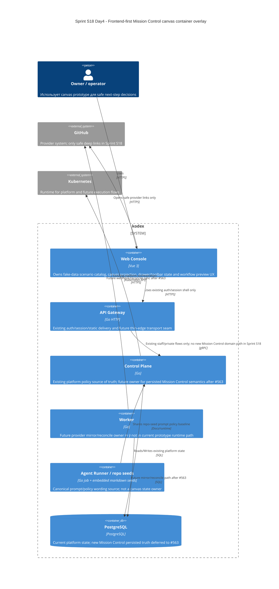

# C4 Container: Sprint S18 Day 4 frontend-first Mission Control canvas

## TL;DR
- В Wave 1 активным owner prototype behavior является только `web-console`.
- `api-gateway`, `control-plane`, `worker` и `PostgreSQL` остаются существующими platform containers, но не становятся новой Mission Control truth-path для Sprint S18.
- `agent-runner` важен как источник repo-seed prompt policy, однако не участвует в runtime state prototype и не превращается в data source canvas.

## Диаграмма (Mermaid C4Container)

## Container responsibilities in Sprint S18

| Container | Роль |
|---|---|
| `web-console` | Единственный owner fake-data scenario model, canvas projection, local UI state и workflow preview UX |
| `api-gateway` | Thin-edge adapter без новой Mission Control бизнес-логики |
| `control-plane` | Existing platform policy source и deferred owner для будущего backend rebuild |
| `worker` | Deferred provider mirror/reconcile executor только после старта `#563` |
| `agent-runner` / repo seeds | Source of truth для prompt wording и workflow-policy text, но не для UI state |
| `postgres` | Existing platform storage; Sprint S18 не вводит в него новые Mission Control prototype structures |

## Runtime и data boundaries
- `web-console` не вычисляет live provider truth и не трактует fake data как canonical persisted model.
- `api-gateway` не принимает решений о relation semantics, workflow policy или safe action matrix для prototype.
- `control-plane` не должен становиться скрытой обязательной зависимостью для Sprint S18 `run:dev`.
- `worker` не участвует в fake-data prototype и не вычисляет stale/freshness раньше backend rebuild.
- `agent-runner` не владеет canvas state, даже если workflow preview использует wording из repo seeds.

## Continuity after `run:arch`
- Design package в issue `#573` должен описать explicit UI/state contracts и documented replacement seam к backend rebuild `#563`, не меняя этот ownership split.
- Любой downstream execution stream Sprint S18 обязан потреблять approved boundaries из этого container overlay, а не возвращать S16-style hidden backend dependency.
