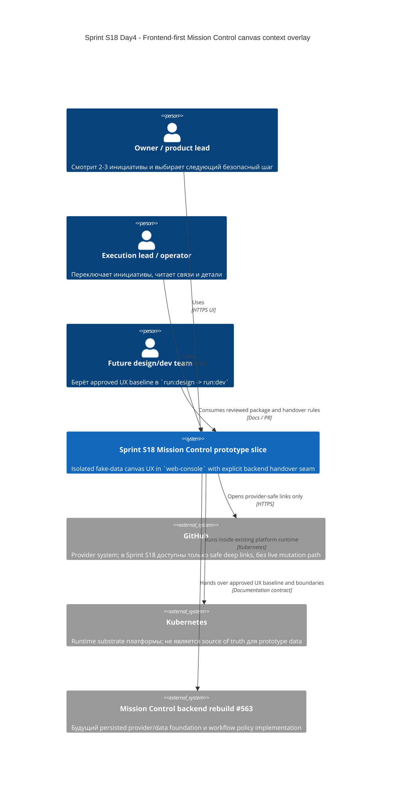

# C4 Context: Sprint S18 Day 4 frontend-first Mission Control canvas

## TL;DR
- Sprint S18 моделирует Mission Control как isolated fake-data UX slice внутри `kodex`, а не как live GitHub/control-plane read model.
- Пользователи взаимодействуют с owner-approved canvas UX, тогда как GitHub и backend rebuild `#563` остаются внешними или downstream dependencies, но не текущим runtime prerequisite.
- Диаграмма подчёркивает separation: текущий prototype доказывает UX и safe action semantics, а persisted provider/data truth остаётся отдельной будущей задачей.

## Диаграмма (Mermaid C4Context)

## Пояснения
- GitHub не выступает live data source для prototype runtime path: Sprint S18 доказывает UX, а не backend truth.
- Kubernetes обеспечивает окружение платформы, но не хранит fake-data scenario state как доменную истину.
- Backend rebuild `#563` показан как downstream system, потому что именно он позже должен принять persisted provider/data ownership без reopening UX baseline.

## Внешние зависимости
- GitHub: только provider-safe deep links и исторический продуктовый контекст.
- Kubernetes: runtime substrate для текущей платформы и будущих execution flows.
- Backend rebuild `#563`: будущий consumer approved UX baseline и отдельный owner data/model work.

## Continuity after `run:arch`
- Issue `#573` (`run:design`) должен сохранить этот context overlay как baseline для UI/state/contract design package.
- Live provider sync, DB prompt editor и release-safety cockpit остаются вне core context Sprint S18.
