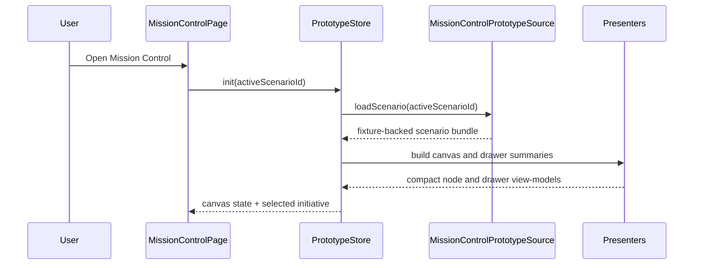
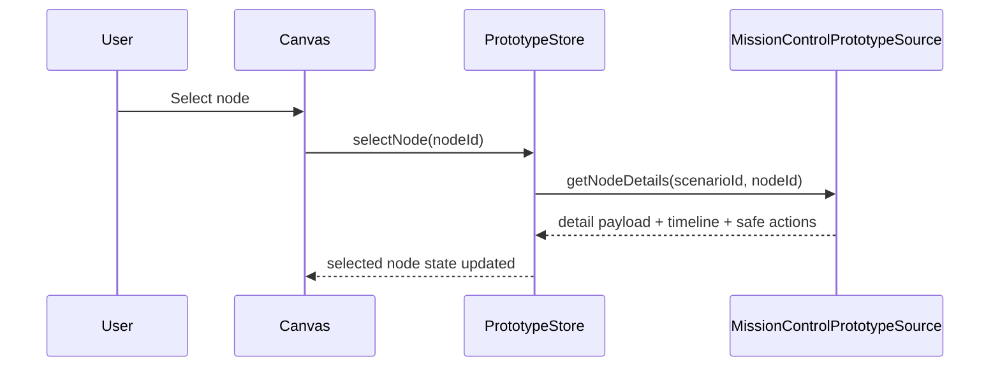
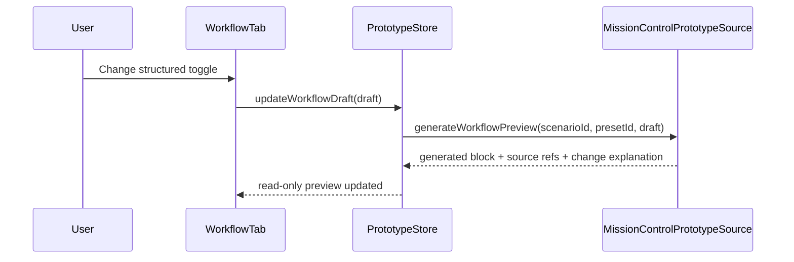

# Detailed Design: Mission Control frontend-first canvas prototype

## TL;DR
- Sprint S18 `run:dev` должен выпустить только isolated fake-data prototype в `services/staff/web-console`, без новых backend/API/runtime prerequisites.
- Route `MissionControlPage.vue` остаётся entry point, но вся логика переносится в feature-local prototype source/store под `src/features/mission-control/prototype/*`, а не поверх current API/realtime path.
- Workflow editor остаётся local policy-preview UX: пользователь меняет только structured toggles, а UI показывает deterministic generated `workflow-policy block` с явными repo-seed refs.
- OpenAPI/gRPC/DB schema не меняются; documented replacement seam к backend rebuild остаётся в issue `#563`.

## Цели / Не-цели
### Goals
- Зафиксировать implementation-ready frontend layout и state model для fullscreen свободного canvas c taxonomy `Issue` / `PR` / `Run`.
- Определить feature-local source contract, который позволяет реализовать fake-data prototype без подключения `api-gateway`, `control-plane`, `worker` и live provider sync.
- Удержать drawer, toolbar и workflow preview в рамках platform-safe actions only и repo-seed prompt policy.
- Описать replacement seam, через который future backend rebuild `#563` заменит fake-data source без reopening Sprint S18 UX baseline.

### Non-goals
- Новые HTTP/gRPC endpoints, OpenAPI/proto changes, codegen или transport migrations.
- Новый schema owner, временная БД для fake data, shadow tables или runtime feature flag.
- Live GitHub/provider mutation path, live freshness semantics, DB prompt editor, release-safety cockpit и waves `#524/#525`.
- Возврат к list/lane/column shell, старой S16 taxonomy или reuse текущих realtime/freshness surfaces как части нового baseline.

## Контекст и текущая архитектура
- Source architecture:
  - `docs/architecture/initiatives/s18_mission_control_frontend_first_canvas/architecture.md`
  - `docs/architecture/adr/ADR-0018-mission-control-frontend-first-prototype-and-backend-handover-boundary.md`
  - `docs/architecture/alternatives/ALT-0010-mission-control-frontend-first-prototype-boundaries.md`
- Product baseline:
  - `docs/delivery/epics/s18/prd-s18-day3-mission-control-frontend-first-canvas.md`
  - `docs/delivery/sprints/s18/sprint_s18_mission_control_frontend_first_canvas_fake_data.md`
- Current implementation surface to avoid extending in Sprint S18:
  - `services/staff/web-console/src/pages/operations/MissionControlPage.vue`
  - `services/staff/web-console/src/features/mission-control/api.ts`
  - `services/staff/web-console/src/features/mission-control/store.ts`
  - `services/staff/web-console/src/features/mission-control/types.ts`
- Current `features/mission-control` path encodes superseded live-data assumptions: generated API DTO, realtime/freshness chips, graph/list toggle and transport-driven state. Sprint S18 must not stretch this path with temporary fake-data branches. Instead `run:dev` should introduce an explicit prototype submodule and let the route consume only that source during the frontend-first walkthrough.

## Предлагаемый дизайн (high-level)
### Design choice: route stays, data source becomes local prototype contract
- Route stays in `pages/operations/MissionControlPage.vue`, but the page becomes a thin container:
  - reads route/query state;
  - connects to `useMissionControlPrototypeStore`;
  - renders presentational canvas, drawer and workflow preview components.
- New implementation slice for `run:dev`:

| Slice | Proposed location | Responsibility | Rule |
|---|---|---|---|
| Prototype source contract | `src/features/mission-control/prototype/source.ts` | Async-friendly interface for catalog/scenario/details/workflow preview loading | Source stays frontend-local in Sprint S18, but the contract shape becomes the future replacement seam for `#563` |
| Fixture catalog | `src/features/mission-control/prototype/fixtures.ts` | Hardcoded fake-data scenarios, node layout, relations, timeline evidence, workflow presets | No browser-side parsing of repo files; prompt references are copied as metadata refs only |
| Feature types | `src/features/mission-control/prototype/types.ts` | UI view-models and workflow preview draft/result types | UI models stay separate from generated API DTO per frontend guidelines |
| Presenters | `src/features/mission-control/prototype/presenters.ts` | Mapping fixture data into compact card, drawer and workflow view-models | No presentational branching inside store or page |
| Pinia store | `src/features/mission-control/prototype/store.ts` | Route state, selection state, canvas viewport, workflow draft and derived views | Store owns UI state only; it does not invent backend truth |
| Presentational components | `src/features/mission-control/*.vue` or `src/features/mission-control/prototype/*.vue` | Canvas shell, node cards, relation layer, toolbar, drawer tabs, workflow panel | Dumb components only; no direct fixture or route access |

### Why async-friendly local contract
- `MissionControlPrototypeSource` should expose promise-based methods even though Sprint S18 data comes from static fixtures.
- This keeps the route/store contract stable when `#563` later replaces the fixture implementation with backend-backed reads.
- The browser still gets zero runtime dependency today, because the concrete source implementation stays bundle-local.

### UI shell and interaction rules
- One fullscreen canvas is the primary and only workspace surface for Sprint S18.
- Initiative grouping is presentational, not a node taxonomy:
  - the canvas can show `1..3` initiative clusters at once;
  - clusters are rendered as loose labelled constellations with free positioning;
  - no columns, lanes or mandatory nested shells.
- Route-level controls are limited to:
  - scenario selector;
  - initiative focus chips;
  - search;
  - zoom / fit / reset;
  - workflow entry CTA for the currently selected node.
- Explicitly excluded from Sprint S18 toolbar:
  - graph/list toggle;
  - freshness/realtime status chips;
  - live filter controls tied to provider truth (`open_only`, `assigned_to_me_or_unassigned`).

### Node card rules
- Closed node taxonomy: `Issue`, `PR`, `Run`.
- Compact node card must fit dense walkthrough mode and show only:
  - kind badge;
  - short title;
  - stage/status line;
  - `1..2` supporting metadata chips;
  - at most one blocking or attention badge.
- Full detail moves to drawer; the card must not expand into a pseudo-table or lane column.

### Relation rules
- Relations are first-class canvas elements and always visible as explicit edges.
- Closed relation set for Sprint S18:
  - `drives` (`Issue -> Run`);
  - `produces` (`Run -> PR`);
  - `tracks` (`Issue -> PR`);
  - `blocks` (cross-node dependency inside the same scenario).
- Search and focus may dim unrelated nodes, but relations required to explain the selected node remain visible.

### Drawer and mobile behavior
- Desktop:
  - sticky right drawer;
  - tabs `Details`, `Timeline`, `Workflow`.
- Mobile:
  - fullscreen dialog/drawer reusing the same three tabs;
  - no secondary condensed panel.
- Drawer content rules:
  - `Details` holds narrative summary, related refs and safe action list;
  - `Timeline` shows fixture-backed event history only;
  - `Workflow` shows structured draft controls plus generated policy block.

### Workflow preview rules
- Workflow preview is always scoped to a selected node or initiative.
- Editable inputs stay structured:
  - stage sequence preset;
  - auto-review policy on/off;
  - follow-up propagation mode;
  - safe-action profile.
- Output is always read-only:
  - generated `workflow-policy block`;
  - source refs to repo-seed prompt files/policy docs;
  - explanation chips describing what changed relative to the baseline preset.
- Explicitly forbidden in Sprint S18:
  - free-form prompt text editing;
  - saving workflow drafts outside browser memory;
  - applying labels, creating PR/issues or mutating provider state from the workflow panel.

## Сценарии (Sequence diagrams)
### Scenario 1: route load and scenario hydration

### Scenario 2: node selection and drawer focus

### Scenario 3: workflow draft to deterministic preview

## API/Контракты
- Sprint S18 does not introduce new backend transport.
- Contract baseline for the prototype is defined in:
  - `docs/architecture/initiatives/s18_mission_control_frontend_first_canvas/api_contract.md`
- Rule for `run:dev`:
  - current generated API client and realtime transport stay untouched or are left unused;
  - new prototype code talks only to `MissionControlPrototypeSource`;
  - future backend issue `#563` may replace the source implementation, but not the route-level UX semantics locked in Sprint S18.

## Модель данных и миграции
- Feature-local fake-data model is defined in:
  - `docs/architecture/initiatives/s18_mission_control_frontend_first_canvas/data_model.md`
- Migration and rollout policy is defined in:
  - `docs/architecture/initiatives/s18_mission_control_frontend_first_canvas/migrations_policy.md`
- Core rule:
  - all fake-data identifiers are local scenario refs only;
  - they are not declared as a temporary canonical backend identifier space.

## Нефункциональные аспекты
- Надёжность:
  - the route renders from bundle-local fixtures and must not fail on missing backend availability;
  - a missing or malformed scenario becomes a typed frontend error state, not a silent blank page.
- Производительность:
  - target dataset stays bounded to owner walkthrough scale (`1..3` initiatives, `<= 60` nodes total);
  - selection, search and workflow preview regeneration stay local and should feel immediate.
- Безопасность:
  - no secrets, provider tokens or runtime credentials are surfaced to the browser;
  - safe actions remain link-out or preview-only.
- Наблюдаемость:
  - no new backend metrics/logs are required for Sprint S18;
  - candidate validation relies on component tests and owner walkthrough evidence.

## Наблюдаемость (Observability)
- Логи:
  - existing frontend error boundary and normalized API error surfaces are sufficient;
  - prototype source may emit console warnings in development only.
- Метрики:
  - not required for Sprint S18 prototype.
- Трейсы:
  - not required; there is no backend request path in the chosen design.
- Дашборды:
  - not required.
- Алерты:
  - not required.

## Тестирование
- Unit:
  - presenter mapping for compact nodes, drawer sections and workflow preview diffs;
  - store actions for selection, focus, viewport reset and structured workflow draft updates.
- Component:
  - canvas node selection and relation highlighting;
  - drawer tab switching on desktop and mobile;
  - workflow preview regeneration from structured toggles.
- Manual candidate walkthrough:
  - `2..3` initiative canvas walkthrough with explicit relations;
  - node density and drawer readability check;
  - workflow preview shows generated block plus prompt-source refs;
  - safe actions stay read-only or deep-link only.
- Security checks:
  - verify no provider mutation CTA and no prompt free-text editor.

## План выката (Rollout)
- Production:
  - none at `run:design`; `run:dev` remains frontend-only scope.
- Candidate rollout at `run:dev`:
  - update `web-console` route and prototype feature modules only;
  - keep backend services and OpenAPI/proto untouched.
- Canary/gradual rollout:
  - not required; prototype is owner-reviewed in candidate before any broader follow-up.
- Feature flags:
  - none. Product behavior must not rely on env-only switches.
- План коммуникаций:
  - owner review uses candidate environment walkthrough and PR evidence.

## План отката (Rollback)
- Триггеры:
  - owner rejects the prototype walkthrough;
  - candidate bundle becomes unusable or drifts from Sprint S18 locked baseline.
- Шаги:
  - revert `web-console` route and prototype modules to the previous revision;
  - keep docs and issue `#563` handover intact.
- Проверка успеха:
  - Mission Control route opens again without the rejected prototype changes;
  - no data cleanup is required because Sprint S18 stores no persisted prototype state.

## Альтернативы и почему отвергли
- Extend current `features/mission-control/api.ts` and `store.ts` with a temporary fake-data mode.
  - Rejected: mixes superseded live transport semantics with the new fake-data baseline and keeps graph/list/freshness drift alive.
- Add a temporary backend endpoint or temp JSON file under `api-gateway`.
  - Rejected: breaks the frontend-first isolation requirement and creates hidden backend scope before `#563`.
- Parse repo prompt seed files directly in the browser.
  - Rejected: prompt seeds stay repo source-of-truth, but browser runtime should consume curated refs and generated preview copy only.

## Открытые вопросы (для Telegram Executor)
1. В `run:dev` legacy API-backed `features/mission-control` files лучше оставить как deferred adapter seam или удалить сразу вместе с route rewrite, если это упростит review?
2. Достаточно ли одного workflow preset на инициативу для owner walkthrough, или plan-stage должен требовать минимум `baseline + stricter-review + faster-follow-up` preset trio?

## Апрув
- request_id: `owner-2026-04-01-issue-573-design-doc`
- Решение: pending
- Комментарий: требуется owner review frontend-only shell, workflow preview semantics и handover boundary к `#563`.
