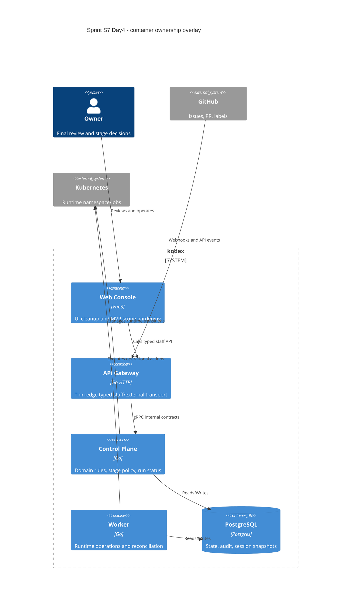

# C4 Container: Sprint S7 Day 4 MVP readiness streams

## TL;DR
- Основные контейнеры неизменны: `web-console`, `api-gateway`, `control-plane`, `worker`, `postgres`.
- S7 Day4 добавляет только архитектурный ownership-map потоков `S7-E01..S7-E18`.
- Все контрактные и runtime изменения отложены на `run:design`/`run:dev`.

## Диаграмма (Mermaid C4Container)

## Ownership Overlay By Stream Class

| Stream class | Преобладающий контейнер | Примечание по границе |
|---|---|---|
| UI cleanup (`S7-E02..E05`, `S7-E08`) | `web-console` | Без доменной логики; только presentation и typed client usage |
| Agents/prompt policy de-scope (`S7-E06`, `S7-E07`, `S7-E15`) | `control-plane` + `api-gateway` + `web-console` | Доменная policy в `control-plane`; edge/UI не принимают доменных решений |
| Runtime ops reliability (`S7-E09`, `S7-E10`, `S7-E16`, `S7-E17`) | `control-plane` + `worker` | Идемпотентные state transitions, audit-first |
| Stage/policy reliability (`S7-E11`, `S7-E13`) | `control-plane` | Deterministic resolver и ambiguity-gate |
| Governance/evidence (`S7-E01`, `S7-E12`, `S7-E14`, `S7-E18`) | docs/process layer | Delivery contracts и traceability без runtime mutation |

## Runtime And Data Boundaries
- `web-console` и `api-gateway` остаются thin adapters.
- Любые state-machine изменения допускаются только в `control-plane`/`worker`.
- `postgres` остаётся единственным источником синхронизации состояния между pod.

## Handover note for run:design
- Проверить для потоков `S7-E06/S7-E07/S7-E09/S7-E10/S7-E13/S7-E16/S7-E17`, нужны ли:
  - contract-first изменения OpenAPI/proto;
  - миграции таблиц состояния;
  - расширение observability events.
