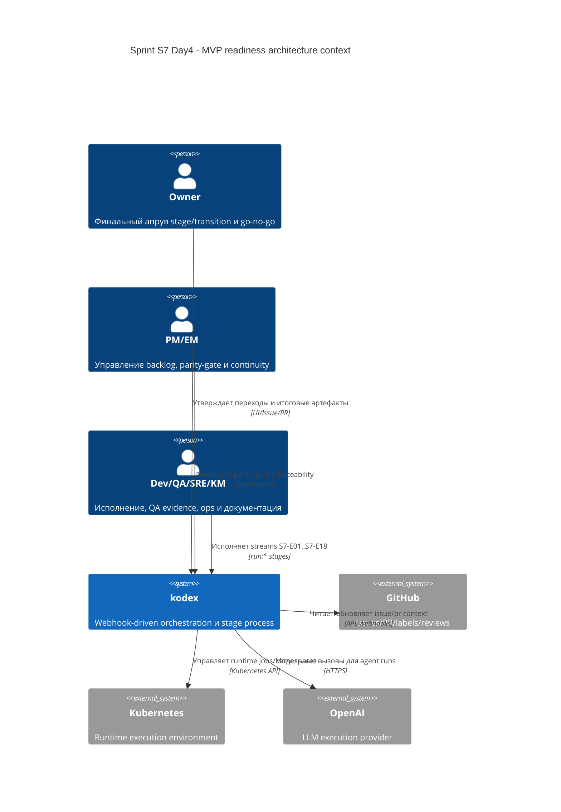

# C4 Context: Sprint S7 Day 4 MVP readiness streams

## TL;DR
- Система в контуре: `kodex` stage/governance runtime.
- Фокус overlay: потоки `S7-E01..S7-E18`, которые закрывают MVP readiness gaps.
- Ключевые внешние системы: GitHub, Kubernetes, OpenAI.

## Диаграмма (Mermaid C4Context)

## Пояснения
- S7 Day4 не вводит новых внешних интеграций; фокус только на декомпозиции границ и ownership.
- Потоки, требующие runtime-изменений, остаются в `internal/jobs`; edge и UI должны оставаться thin adapters.
- Governance-потоки (`S7-E01`, `S7-E12`, `S7-E18`) закрепляют обязательные quality-gates перед `run:dev`.

## Открытые вопросы для run:design
- Нужен ли отдельный transport endpoint для `runtime deploy cancel/stop` (`S7-E10`) или достаточно расширить существующий typed action contract?
- Какие persisted состояния будут изменяться для потоков reliability (`S7-E16`, `S7-E17`) и требуют ли отдельной миграции?
- Как формально валидировать parity-gate в automation без нарушения текущего stage process model?
