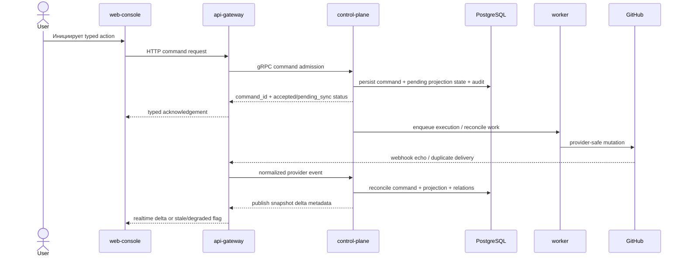

# Sprint S9 Day 4 — Mission Control Dashboard architecture (Issue #340)

## TL;DR
- `control-plane` остаётся владельцем persisted active-set projection, relation graph, timeline mirror и command ledger для Mission Control Dashboard.
- `worker` отвечает за outbound provider sync, retries и reconciliation loops; `api-gateway` и `web-console` остаются thin transport/presentation слоями.
- Realtime остаётся ускоряющим snapshot/delta path поверх существующего staff realtime baseline, а degraded mode обязан работать через HTTP snapshot, explicit refresh и list fallback.
- Voice intake не входит в core MVP path: это отдельный candidate stream, который может породить только draft discussion/task после явного подтверждения.

## Контекст и входные артефакты
- Delivery-цепочка: `#333 (intake) -> #335 (vision) -> #337 (prd) -> #340 (arch)`.
- Source of truth:
  - `docs/delivery/epics/s9/prd-s9-day3-mission-control-dashboard.md`
  - `docs/product/requirements_machine_driven.md`
  - `docs/product/agents_operating_model.md`
  - `docs/product/labels_and_trigger_policy.md`
  - `docs/product/stage_process_model.md`
  - `docs/architecture/api_contract.md`
  - `docs/architecture/data_model.md`
  - `docs/delivery/epics/s3/epic-s3-day19.5-realtime-event-bus-and-websocket-backplane.md`
  - `docs/delivery/epics/s3/epic-s3-day19.6-staff-realtime-subscriptions-and-ui.md`

## Цели архитектурного этапа
- Превратить product contract Day3 в проверяемые сервисные границы и ownership split без premature implementation lock-in.
- Зафиксировать, где живут active-set projection, relation model, command lifecycle, provider sync/reconciliation и timeline/comments mirror.
- Определить runtime-safe baseline для realtime и degraded fallback без нарушения GitHub-first MVP.
- Подготовить handover в `run:design` с явным списком contract/data/runtime решений, которые нужно детализировать на следующем этапе.

## Non-goals
- Не создаём отдельный runtime-сервис Mission Control Dashboard на Day4.
- Не проектируем полный historical graph как default representation.
- Не выбираем конкретные graph/realtime/STT библиотеки.
- Не переносим human review, merge decision и provider-specific collaboration из GitHub UI в staff console.

## Неподвижные guardrails из PRD
- Active-set default и list fallback обязательны; полный архив не становится default view.
- GitHub остаётся каноническим provider в MVP, а external human review сохраняется во внешнем UI.
- Любое действие из dashboard идёт только через typed command path с audit, sync state и reconciliation.
- Realtime не может быть единственным способом получить корректное состояние.
- Voice intake не может блокировать релиз core dashboard MVP.

## Source-of-truth split

| Контур | Канонический источник истины | Почему |
|---|---|---|
| Provider review/merge/comments | GitHub / provider | Human review и provider-specific collaboration остаются внешними |
| Active-set projection, relations, command lifecycle | `control-plane` + PostgreSQL | Dashboard требует единую operational read model, не зависящую от клиента |
| Outbound sync/retries/reconciliation execution | `worker` + lease-aware Postgres state | Этот контур должен быть идемпотентным и переживать retries/pod failover |
| Realtime fanout/session state | `api-gateway` (ephemeral) + persisted realtime event log | WS ускоряет доставку, но не становится source-of-truth |
| Voice candidate drafts | isolated intake boundary в `control-plane` | Optional stream не должен загрязнять core MVP contracts до explicit confirmation |

## Service Boundaries And Ownership Matrix

| Concern | Primary owner | Supporting owners | Boundary decision | Design-stage deliverables |
|---|---|---|---|---|
| Active-set dashboard snapshot и relation graph | `control-plane` | `worker`, `web-console` | Persisted projection живёт в Postgres под owner-логикой `control-plane`; frontend не собирает канонический active set из разрозненных provider/runtime ответов | Typed snapshot/query DTO, freshness markers, filter/list fallback contract |
| Side panel details и timeline/comments mirror | `control-plane` | `worker`, GitHub provider adapters | Timeline projection объединяет provider comments/reviews и platform flow events, но не вводит отдельный primary chat backend | Timeline source tags, relation types, source-aware ordering |
| Typed command admission и acknowledgement path | `control-plane` | `api-gateway`, `web-console` | UI отправляет только typed command intent; immediate response содержит `command_id`, lifecycle state и blocking reason, а не raw provider outcome | Command DTO, ack/status enum, transport-level error map |
| Provider sync, webhook echo dedupe и reconciliation | `control-plane` (policy/lifecycle), `worker` (execution) | `api-gateway` | Webhook boundary нормализует событие и отдаёт его в домен; dedupe опирается на `provider_delivery_id`, `business_intent_key`, `correlation_id`, а retries принадлежат `worker` | Reconciliation state machine, correlation schema, audit events |
| Realtime delta transport и degraded fallback | `api-gateway` (transport), `control-plane` (payload semantics) | `web-console`, `worker` | Initial load всегда идёт через HTTP snapshot; WS/SSE-like delta path ускоряет обновления, а degraded state переключает UX на explicit refresh/list fallback | Async contract, stale marker model, reconnection/resume rules |
| Discussion -> formal task formalization | `control-plane` | `worker`, GitHub provider adapters | Formalization остаётся domain command с идемпотентным guard, а не клиентским хаком поверх issue/comment UI | Formalization command contract, one-discussion-to-one-task invariants |
| Voice intake candidate stream | isolated intake boundary в `control-plane` | optional adapters, `worker` | Voice path может создать только draft candidate и требует явного promotion в discussion/task; core dashboard page-load и command SLA не зависят от voice | Candidate draft contract, promotion flow, disable-by-policy path |

## Architecture flow: command -> provider sync -> webhook echo reconciliation

## Почему не выделяем отдельный dashboard-сервис сейчас
- Mission Control Dashboard является новым UX-срезом над уже существующими bounded contexts платформы, а не отдельным автономным продуктом.
- Выделение нового сервиса на Day4 добавило бы ещё один DB owner и новый cross-service consistency contour до того, как детализированы contracts/data model.
- Текущая архитектура уже имеет естественное разделение:
  - `control-plane` владеет доменной консистентностью и projection rules;
  - `worker` обеспечивает idempotent execution/reconciliation;
  - `api-gateway` и `web-console` дают transport + UX without domain ownership.
- Если после MVP появятся scale/throughput признаки, projection-serving слой можно вынести позже как отдельный read-model service без изменения product guardrails.

## Realtime и degraded mode baseline
- Snapshot-first:
  - dashboard и side panel обязаны уметь загружать полное актуальное состояние через typed HTTP snapshot endpoints;
  - snapshot возвращает freshness metadata и явный degraded marker.
- Delta-second:
  - realtime доставляет только дельты/invalidations поверх уже загруженного snapshot;
  - клиент не должен требовать WS для первичной корректности.
- Degraded mode:
  - при stale realtime пользователь видит явный статус, может сделать explicit refresh и переключиться в list fallback;
  - command submission не должен зависеть от активного realtime-соединения;
  - usability на `20..400+` entities достигается за счёт active-set rules, search/filters и list fallback, а не попыткой расширять board без ограничений.

## Timeline/comments boundary
- Timeline не является отдельным chat-продуктом. Это projection-слой, который собирает:
  - provider comments/reviews/discussion updates;
  - platform flow events;
  - command lifecycle markers (`accepted`, `pending_sync`, `reconciled`, `failed`).
- Для каждой timeline-entry design-этап обязан определить:
  - `source_kind` (`provider`, `platform`, `command`);
  - внешний/внутренний entity reference;
  - ordering strategy и freshness semantics.
- Console write path для comment/discussion не обходит provider policy:
  - либо typed command с provider sync,
  - либо explicit provider deep-link там, где MVP ещё не даёт safe inline write UX.

## Architecture quality gates for `run:design`

| Gate | Что проверяем | Почему это обязательно |
|---|---|---|
| `QG-S9-A1 Boundary integrity` | Ни один dashboard endpoint/topic не переносит domain decisions в `api-gateway` или `web-console` | Иначе теряется thin-edge и появится split-brain по policy |
| `QG-S9-A2 Projection integrity` | Active-set, relations, timeline mirror и command states описаны как typed persisted models, а не client-only aggregation | Иначе нельзя доказать reconciliation correctness и degraded fallback |
| `QG-S9-A3 Command safety` | Для каждого command path определены ack-state, dedupe keys, reconciliation completion и failure mapping | Иначе AC-337-04/05 останутся недоказуемыми |
| `QG-S9-A4 Realtime fallback` | Snapshot contract, delta contract, stale marker и explicit refresh/list fallback описаны вместе | Иначе realtime станет hidden hard dependency |
| `QG-S9-A5 Voice isolation` | Voice stream не добавляет blocking зависимости в core MVP DTO, page-load path и rollout order | Иначе conditional stream превратится в scope leak |

## Открытые design-вопросы
- Какая форма persisted projection лучше для active set:
  - нормализованные таблицы,
  - materialized JSONB documents,
  - hybrid-модель `entities + relations + view cache`.
- Расширяем ли текущий staff realtime topic contract, или вводим отдельный Mission Control topic namespace поверх того же backplane.
- Какие comment/discussion write actions входят в Wave 1/Wave 2 как inline console actions, а какие остаются provider deep-link-only до подтверждения UX safety.

## Migration и runtime impact
- На этапе `run:arch` код, БД-схема, deploy manifests и runtime поведение не менялись.
- Обязательный rollout order для будущего `run:dev`:
  - `migrations -> control-plane -> worker -> api-gateway -> web-console`.
- Design-этап обязан отдельно зафиксировать:
  - schema ownership и migration policy для projection/command/timeline tables;
  - rollback strategy для reconciliation state transitions;
  - observability events для freshness, command dedupe и degraded mode.

## Context7 baseline
- Подтверждён актуальный CLI-синтаксис GitHub CLI для follow-up issue и PR flow:
  - `/websites/cli_github_manual`.
- Подтверждён актуальный Mermaid C4 syntax для architecture package diagrams:
  - `/mermaid-js/mermaid`.
- Новые внешние зависимости на этапе `run:arch` не требуются.

## Handover в `run:design`
- Следующий этап: `run:design`.
- Follow-up issue: `#351`.
- На design-этапе обязательно выпустить:
  - `design_doc.md` с interaction model, degraded UX rules и command/timeline behaviors;
  - `api_contract.md` с typed HTTP/gRPC/async deltas для snapshot, entity details, command admission/status и realtime topics;
  - `data_model.md` с projection/relation/command/timeline ownership;
  - `migrations_policy.md` c rollout/rollback notes.
