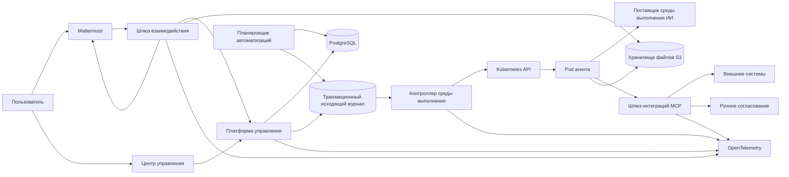

# Высокоуровневая архитектура

## Платформа управления

Хранит желаемое состояние и бизнес-модель: организации, рабочие области, агенты, поставщики моделей, интеграции, инструкции, управляемые процессы, расписания, сессии, метаданные файлов, согласования и аудит.

Платформа управления не создает pod Kubernetes напрямую из HTTP-обработчика. Она фиксирует транзакционное изменение и публикует долговечную команду через исходящий журнал.

## Шлюз взаимодействия

Обрабатывает события Mattermost, резервные slash-команды, интерактивные карточки, диалоги, учетные записи ботов, реакции, доставку файлов и обновления обсуждений.

Шлюз не владеет бизнес-состоянием агента и сессии. Повторная доставка события Mattermost безопасна благодаря идентификаторам `event_id` и `post_id`.

## Контроллер среды выполнения

Сопоставляет желаемое состояние среды выполнения с ресурсами Kubernetes. Сверка идемпотентна и использует детерминированные имена, метки, ссылки на владельца и условия состояния.

Контроллер решает:

- какой pod сессии должен существовать;
- какую `RuntimeRevision` применить;
- достаточно ли ресурсов;
- какой простаивающий pod можно освободить;
- когда завершить pod сессии по TTL;
- когда восстановить ход из очереди после временной ошибки.

## Запуск агента

Компонент запуска агента управляет процессами внутри pod сессии:

- получает и подтверждает ход;
- материализует конфигурацию, авторизацию, инструкции и вложения;
- запускает адаптер среды выполнения ИИ;
- передает прогресс и потребление лимитов;
- вызывает разрешенные инструменты MCP;
- публикует итоговый результат;
- сохраняет архив сессии;
- корректно завершает дочерние процессы и обрабатывает остановку.

Компонент запуска не содержит бизнес-логику Mattermost, создания проектов и согласований.

## Шлюз интеграций

Предоставляет MCP endpoint в области одной сессии. Он аутентифицирует сессию агента, вычисляет права, маскирует данные, создает запросы согласования и выполняет внешние действия от имени `IntegrationConnection`.

Опасные учетные данные остаются в шлюзе или хранилище секретов и не передаются в pod агента.

## Планировщик автоматизаций

Выбирает наступившие `AutomationSchedule`, создает уникальные экземпляры и ставит `ScheduledRun` в общую очередь. Планировщик не запускает pod напрямую и не использует Kubernetes CronJob как бизнес-модель.

## Модель согласованности

- Внутри доменного контекста используется транзакция PostgreSQL.
- Между контекстами используются транзакционный исходящий журнал и идемпотентные обработчики.
- Kubernetes, Mattermost и внешние API согласуются асинхронно с явным состоянием и повторами.
- Ручное согласование является долговечным состоянием ожидания, а не удержанием HTTP-запроса.
