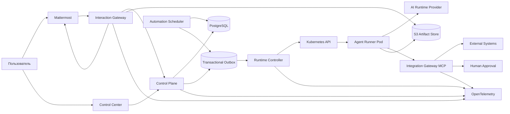

# Высокоуровневая архитектура

## Control plane

Хранит desired state и бизнес-модель: organizations, workspaces, agents, providers, integrations, instructions, playbooks, schedules, sessions, artifacts metadata, approvals и audit.

Control plane не создает Kubernetes pod напрямую из HTTP handler. Он фиксирует транзакционное изменение и публикует durable command через outbox.

## Interaction gateway

Обрабатывает Mattermost events, slash fallback, interactive cards, dialogs, bot identities, reactions, file delivery и thread updates.

Gateway не владеет agent/session бизнес-состоянием. Повторно доставленный Mattermost event должен быть безопасен по `event_id/post_id`.

## Runtime controller

Сопоставляет desired runtime state с Kubernetes resources. Reconcile идемпотентен и использует детерминированные имена, labels, owner references и status conditions.

Controller решает:

- какой session pod должен существовать;
- какой RuntimeRevision должен быть применен;
- достаточно ли capacity;
- какой idle pod можно освободить;
- когда session pod завершить по TTL;
- когда восстановить queued turn после transient failure.

## Agent runner

Runner является process supervisor внутри session pod:

- получает и подтверждает turn;
- материализует config, auth, instructions и attachments;
- запускает AI runtime adapter;
- стримит progress и usage;
- вызывает разрешенные MCP tools;
- публикует final result;
- сохраняет session archive;
- корректно reap-ит дочерние процессы и обрабатывает termination.

Runner не содержит Mattermost, project onboarding и approval business logic.

## Integration gateway

Предоставляет session-scoped MCP endpoint. Он аутентифицирует agent session, вычисляет grants, маскирует данные, создает approvals и выполняет внешние действия от имени IntegrationConnection.

Опасный credential остается в gateway/secret backend и не передается agent pod.

## Automation scheduler

Выбирает due AutomationSchedules, создает уникальные occurrences и ставит ScheduledRuns в общую очередь. Scheduler не запускает pod напрямую и не использует Kubernetes CronJob как бизнес-модель.

## Consistency model

- Внутри bounded context — PostgreSQL transaction.
- Между contexts — transactional outbox и идемпотентные consumers.
- Kubernetes/Mattermost/external APIs — eventual consistency с status и retry.
- Human approval — durable wait state, а не удержание HTTP request.
