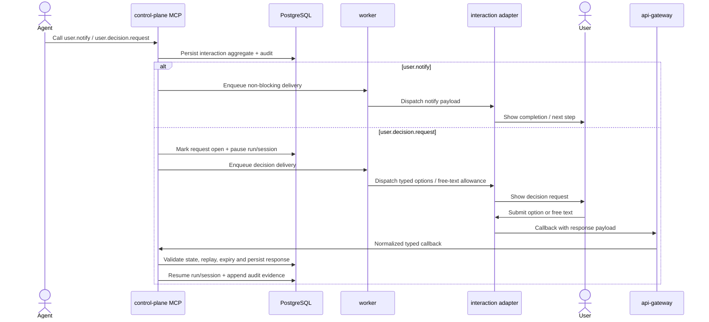

# Sprint S10 Day 4 — Built-in MCP user interactions architecture (Issue #385)

## TL;DR
- `control-plane` остаётся владельцем interaction aggregate, typed response validation, audit/correlation и wait-state transitions; `worker` закреплён за outbound dispatch, retries и timeout/expiry reconciliation; `api-gateway` остаётся thin-edge ingress для adapter callbacks.
- Interaction flow остаётся отдельным bounded context относительно approval/control flow: `owner.feedback.request` и approval-specific state vocabulary не становятся source-of-truth для обычных user interactions.
- Built-in сервер `codex_k8s` расширяется новыми interaction tools без отдельного runtime server block, а channel-specific UX остаётся во внешнем adapter слое.

## Контекст и входные артефакты
- Delivery-цепочка: `#360 (intake) -> #378 (vision) -> #383 (prd) -> #385 (arch)`.
- Source of truth:
  - `docs/delivery/epics/s10/prd-s10-day3-mcp-user-interactions.md`
  - `docs/product/requirements_machine_driven.md`
  - `docs/product/agents_operating_model.md`
  - `docs/product/labels_and_trigger_policy.md`
  - `docs/product/stage_process_model.md`
  - `docs/architecture/api_contract.md`
  - `docs/architecture/data_model.md`
  - `docs/architecture/mcp_approval_and_audit_flow.md`
  - `services/external/api-gateway/README.md`
  - `services/internal/control-plane/README.md`
  - `services/jobs/worker/README.md`
  - `services/jobs/agent-runner/README.md`

## Цели архитектурного этапа
- Превратить product contract Day3 в проверяемые service boundaries и ownership split без premature transport/storage lock-in.
- Зафиксировать, где живут interaction request/response state machine, wait-state transitions, callback ingestion, retries/expiry и audit/correlation semantics.
- Отделить interaction-domain от approval/control-domain на уровне сервисных границ, state vocabulary и будущих persisted contracts.
- Подготовить handover в `run:design` с явным списком API/data/migration решений, которые ещё предстоит детализировать.

## Non-goals
- Не выбираем финальный HTTP/OpenAPI path и точные DTO поля для callback/adapter envelopes.
- Не фиксируем окончательную схему БД и миграции на Day4.
- Не запускаем отдельный interaction-runtime сервис и не меняем built-in MCP server topology.
- Не включаем Telegram-first UX, reminders, richer conversation threads и voice/STT в core MVP path.

## Неподвижные guardrails из PRD
- Built-in сервер `codex_k8s` остаётся единственной core точкой расширения для interaction tools.
- `user.notify` остаётся non-blocking path и не переводит run в wait-state.
- `user.decision.request` остаётся единственным core wait-state path для user interaction.
- Approval flow и user interaction flow не смешиваются ни по semantics, ни по source-of-truth моделям.
- Dispatch, retries, correlation, timeout/expiry и audit принадлежат platform domain, а не agent pod.
- Channel adapters не переопределяют core meaning полей `response_kind`, `selected_option`, `free_text`, `request_status`.

## Source-of-truth split

| Контур | Канонический источник истины | Почему |
|---|---|---|
| Agent-facing built-in tools (`user.notify`, `user.decision.request`) | `control-plane` MCP surface | Единая built-in точка входа без нового runtime server block |
| Interaction aggregate и response state machine | `control-plane` + PostgreSQL | Нужно сохранить typed semantics и separation from approval flow |
| Run/session pause-resume для interaction wait-state | `control-plane` + существующий run/session storage | Execution lifecycle принадлежит платформе, а не adapters |
| Outbound dispatch attempts, retries и expiry reconciliation | `worker` + PostgreSQL | Это фоновый идемпотентный контур с lease-aware retry behavior |
| Inbound callback ingress, adapter auth и payload normalization | `api-gateway` | Thin-edge boundary должен остаться на транспорте |
| Channel-specific rendering, delivery identifiers и UX affordances | adapter layer вне core architecture | Vendor-specific логика не должна просачиваться в core semantics |
| Audit/correlation evidence | `control-plane` + `flow_events` + interaction records | Multi-pod lifecycle должен оставаться воспроизводимым |

## Service Boundaries And Ownership Matrix

| Concern | Primary owner | Supporting owners | Boundary decision | Design-stage deliverables |
|---|---|---|---|---|
| Built-in tool invocation и initial validation | `control-plane` | `agent-runner` | Агент вызывает только built-in MCP tools; agent pod не создаёт свои interaction state machine и не хранит callback correlation | Tool input/output contract, validation rules, tool-level error map |
| Interaction aggregate (`notify` / `decision`) и state transitions | `control-plane` | PostgreSQL | Отдельный interaction-domain живёт вне approval aggregates и не использует approval-specific states как primary model | Interaction status enum, response_kind rules, invariants for open/answered/expired/rejected |
| Wait-state entry/exit и run/session resume | `control-plane` | `worker` | Wait-state остаётся platform concern; shared pause/resume infrastructure допускается, но business meaning interaction wait нельзя прятать в approval-only vocabulary | Wait-state mapping, resume contract, stale-response handling |
| Outbound dispatch scheduling, retries и expiry timers | `worker` | `control-plane` | Все time-based side effects и delivery attempts уходят в background контур; `control-plane` задаёт policy и desired state | Dispatch job contract, retry policy, expiry scan semantics |
| Callback ingress и adapter authentication | `api-gateway` | `control-plane` | `api-gateway` валидирует transport/auth и нормализует payload, но не принимает решений о state transition и idempotency outcome | Callback DTO envelope, auth scheme, transport error taxonomy |
| Response validation, replay/idempotency и acceptance | `control-plane` | `api-gateway`, `worker` | Duplicate/stale/invalid callbacks оцениваются только доменом; transport edge не решает business outcome | Idempotency key strategy, accepted/rejected outcome model, replay-safe semantics |
| Adapter-specific UX/rendering | external adapters | `worker`, `api-gateway` | Telegram/Slack/web adapters остаются replaceable слоями поверх channel-neutral core contract | Adapter envelope contract, channel extension rules, mapping boundaries |
| Separation from approval flow | `control-plane` | `api-gateway`, `worker` | Approval tools и user interactions могут делить инфраструктурные building blocks, но не tables/state vocabulary/domain meaning | Explicit domain split, shared-vs-isolated component list, migration guardrails |

## Architecture flow: tool call -> dispatch -> callback -> resume

## Notify vs decision lifecycle

| Aspect | `user.notify` | `user.decision.request` |
|---|---|---|
| Blocking behavior | Не блокирует run | Переводит run в interaction wait-state до valid terminal outcome |
| Logical result | Delivery attempt + audit evidence | Interaction request + user response + resume outcome |
| Callback requirement | Необязателен, только delivery/ack evidence | Обязателен для accepted response path |
| Worker role | Dispatch и retry delivery | Dispatch, retry, timeout/expiry reconciliation |
| Control-plane role | Persist notify classification и audit | Own state machine, validation, replay safety, resume |

## Approval flow boundary
- Interaction-domain не переиспользует `owner.feedback.request`, approval-specific states (`approved`, `denied`, `applied`) и approval tables как source-of-truth для обычных user responses.
- Approval flow и interaction flow могут делить только инфраструктурные building blocks:
  - callback token/auth patterns;
  - generic audit/event plumbing;
  - pause/resume engine для run/session;
  - worker retry/reconciliation primitives.
- Если на design stage сохранится текущая техническая wait-state taxonomy `waiting_mcp`, это допустимо только как shared runtime implementation detail.
- Business semantics interaction wait-state всё равно должны быть выражены отдельным interaction-domain contract и не смешиваться с approval meaning.

## Почему не выделяем отдельный interaction-сервис сейчас
- Уже существующий `control-plane` владеет built-in MCP surface, run/session lifecycle, policy и audit.
- Выделение нового сервиса на Day4 добавило бы ещё один DB owner и новый cross-service consistency contour до фиксации design contracts.
- Текущий split уже естественно покрывает задачу:
  - `control-plane` владеет доменной консистентностью и interaction semantics;
  - `worker` выполняет async delivery/retry/expiry loops;
  - `api-gateway` остаётся thin-edge ingress;
  - adapters остаются replaceable внешними интеграциями.
- Если после MVP появятся scale/throughput сигналы, interaction serving/dispatch layer можно вынести позже без пересмотра product guardrails.

## Architecture quality gates for `run:design`

| Gate | Что проверяем | Почему это обязательно |
|---|---|---|
| `QG-S10-A1 Boundary integrity` | Ни один callback/adapter contract не переносит business-state transitions в `api-gateway` или adapters | Иначе thin-edge и adapter neutrality будут нарушены |
| `QG-S10-A2 Approval separation` | Interaction records, status vocabulary и response semantics не переиспользуют approval domain как source-of-truth | Иначе PRD guardrail “interaction != approval” станет недоказуемым |
| `QG-S10-A3 Wait-state discipline` | Notify path остаётся non-blocking, decision path явно описывает pause/resume and timeout behavior | Иначе run lifecycle сломается или станет неоднозначным |
| `QG-S10-A4 Replay safety` | Duplicate/stale/expired callbacks приводят к детерминированному no-op или rejection outcome с audit evidence | Иначе невозможно доказать idempotency/correlation correctness |
| `QG-S10-A5 Adapter neutrality` | Core DTO не требуют Telegram-specific полей и не зависят от одного канала | Иначе Sprint S10 потеряет channel-neutral baseline |
| `QG-S10-A6 Runtime continuity` | Rollout order и backward-safe migration notes покрывают interaction-domain без регресса approval waits | Иначе следующий этап не сможет безопасно перейти в `run:dev` |

## Открытые design-вопросы
- Каким должен быть typed callback envelope:
  - отдельный interaction callback family;
  - расширение текущего MCP callback surface;
  - унифицированный external callback contract с typed `callback_kind`.
- Как лучше моделировать persisted delivery attempts:
  - отдельная таблица attempt records;
  - JSONB event ledger внутри interaction aggregate;
  - hybrid-модель aggregate + attempt log.
- Как design-stage выразит interaction wait-state:
  - отдельный `wait_reason`;
  - generalized external-input wait-state с typed subreason;
  - interaction reference внутри existing wait-state model.

## Migration и runtime impact
- На этапе `run:arch` код, БД-схема, deploy manifests и runtime поведение не менялись.
- Обязательный rollout order для будущего `run:dev`:
  - `migrations -> control-plane -> worker -> api-gateway -> channel adapters`.
- Design-stage обязан отдельно зафиксировать:
  - schema ownership для interaction records, delivery attempts и callback evidence;
  - rollback strategy для wait-state/status vocabulary;
  - observability events для dispatch, retry, expiry, accepted/rejected response и run resume.

## Context7 baseline
- Попытка использовать Context7 для Mermaid/C4 documentation завершилась ошибкой `Monthly quota exceeded`.
- Для текущего пакета использованы существующие Mermaid/C4 conventions репозитория; новые внешние зависимости на этапе `run:arch` не требуются.

## Handover в `run:design`
- Следующий этап: `run:design`.
- Follow-up issue: `#387`.
- На design-этапе обязательно выпустить:
  - `design_doc.md` с interaction lifecycle, timeout/retry/resume semantics и adapter isolation rules;
  - `api_contract.md` с typed tool contracts, outbound envelope, inbound callback DTO и error taxonomy;
  - `data_model.md` с interaction aggregate, response/delivery records и wait-state linkage;
  - `migrations_policy.md` c rollout/rollback notes.
