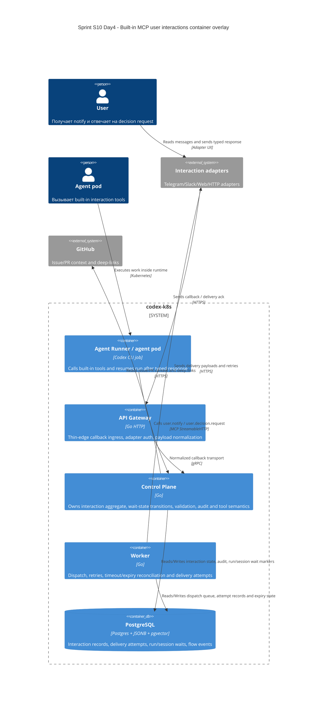

# C4 Container: Sprint S10 Day 4 built-in MCP user interactions

## TL;DR
- Container baseline не меняется: built-in MCP user interactions реализуются внутри существующих `agent-runner`, `api-gateway`, `control-plane`, `worker`, `postgres`.
- Новая Day4-фиксация касается только ownership split для interaction state, callback ingress, retries/expiry и wait-state resume.

## Диаграмма (Mermaid C4Container)

## Container responsibilities in built-in MCP user interactions

| Container | Role |
|---|---|
| `agent-runner` | Использует только built-in MCP tools; не владеет callback lifecycle и persisted interaction state |
| `api-gateway` | Callback ingress, adapter auth, typed transport normalization |
| `control-plane` | Interaction aggregate owner, state transitions, validation, wait-state pause/resume, audit/correlation |
| `worker` | Outbound delivery, retries, expiry scan, attempt-level reconciliation |
| `postgres` | Единственная persisted coordination layer между pod для interaction lifecycle |

## Runtime и data boundaries
- `agent-runner` не хранит source-of-truth interaction state внутри pod.
- `api-gateway` не принимает решений о accepted/rejected response outcome и idempotency.
- `worker` не решает business semantics `response_kind` и не завершает run напрямую без `control-plane`.
- `postgres` остаётся единственной точкой синхронизации; отдельный broker/service для interaction lifecycle на Day4 не вводится.

## Handover note for `run:design`
- Уточнить, какой callback contract reuse текущий MCP surface, а какой вводит новый typed family внутри `api-gateway`.
- Зафиксировать точную persisted model без нарушения schema ownership `control-plane`.
