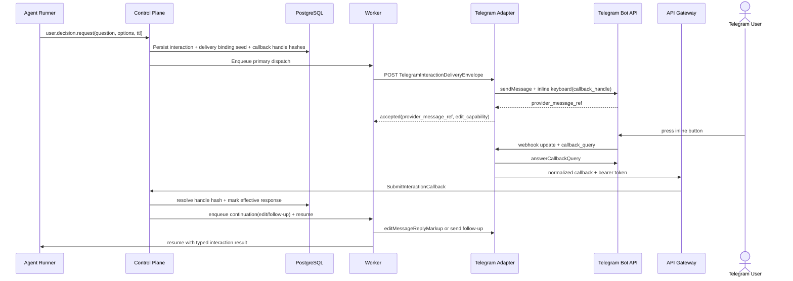
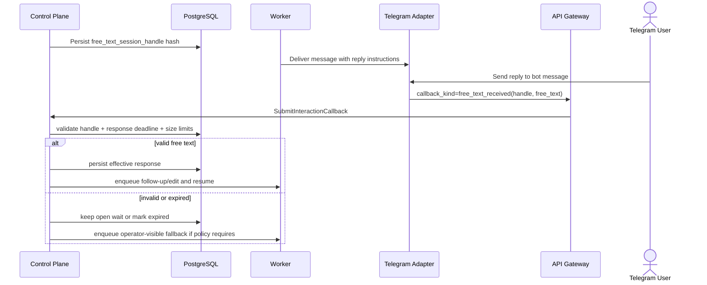

# Detailed Design: Sprint S11 Telegram user interaction adapter

## TL;DR
- Что меняем: фиксируем implementation-ready design для Telegram delivery path поверх Sprint S10 interaction foundation: outbound envelope, inbound callback contract, opaque callback handle strategy, provider message refs, edit-vs-follow-up policy и rollout constraints.
- Почему: Day4 architecture закрепила ownership split, но без exact transport/data/runtime contracts `run:plan` и `run:dev` повторно откроют boundary-компромиссы.
- Основные компоненты: `control-plane`, `worker`, `api-gateway`, `agent-runner`, `PostgreSQL`, внешний Telegram adapter contour.
- Риски: drift между callback handle и delivery binding, повторный logical completion на duplicate updates, слишком агрессивный edit-in-place rollback и смешение interaction flow с approval flow.
- План выката: prerequisite Sprint S10 generic interaction foundation, затем `migrations -> control-plane -> worker -> api-gateway -> Telegram adapter contour`.

## Цели / Не-цели
### Goals
- Зафиксировать typed contract для `user.notify` и `user.decision.request` при materialization в Telegram.
- Выбрать exact callback handle и callback auth strategy, которая укладывается в Telegram payload limits и не раскрывает business semantics.
- Определить persistence model для provider message refs, callback evidence, operator visibility и resume linkage.
- Сохранить separation between immediate Telegram UX acknowledgement и platform semantic acceptance результата.
- Зафиксировать rollout/rollback constraints и dependency gate относительно Sprint S10.

### Non-goals
- Реализация кода, миграций, OpenAPI/proto/codegen и adapter runtime в этом stage.
- Новая core interaction semantics вместо S10 baseline.
- Voice/STT, reminders, rich multi-turn threads, multi-chat routing и дополнительные каналы.
- Telegram-first recipient routing или agent-visible channel identifiers.
- Вынос Telegram path в отдельный internal service до появления execution evidence.

## Контекст и текущая архитектура
- Source architecture:
  - `docs/architecture/initiatives/s11_telegram_user_interaction_adapter/architecture.md`
  - `docs/architecture/adr/ADR-0014-telegram-user-interaction-adapter-platform-owned-lifecycle.md`
  - `docs/architecture/alternatives/ALT-0006-telegram-user-interaction-adapter-boundaries.md`
- Source interaction foundation:
  - `docs/architecture/initiatives/s10_mcp_user_interactions/design_doc.md`
  - `docs/architecture/initiatives/s10_mcp_user_interactions/api_contract.md`
  - `docs/architecture/initiatives/s10_mcp_user_interactions/data_model.md`
  - `docs/architecture/initiatives/s10_mcp_user_interactions/migrations_policy.md`
- Runtime and transport guardrails, которые не меняются:
  - `control-plane` остаётся единственным owner interaction semantics, replay/expiry classification и wait-state lifecycle.
  - `worker` остаётся owner delivery attempts, retries, expiry scans и post-callback continuation.
  - `api-gateway` остаётся thin-edge и принимает только normalized adapter callbacks с platform-issued auth.
  - Telegram adapter contour завершает raw Telegram webhooks, secret-token verification и `answerCallbackQuery`.

## Provider baseline, проверенный 2026-03-14
- Official Telegram Bot API подтверждает:
  - webhook и `getUpdates` взаимоисключающи, а incoming updates хранятся не дольше 24 часов;
  - `setWebhook` поддерживает `secret_token`, который Telegram передаёт в `X-Telegram-Bot-Api-Secret-Token`;
  - `InlineKeyboardButton.callback_data` ограничен `1-64 bytes`;
  - после нажатия inline button Telegram client ждёт `answerCallbackQuery`, поэтому callback acknowledgement обязателен даже без отдельного текста пользователю.
- Context7 по `/mymmrac/telego` подтвердил актуальный SDK baseline для webhook mode, secret token, inline keyboard и callback query helpers.
- `go list -m -json github.com/mymmrac/telego@latest` на `2026-03-14` подтвердил latest stable `v1.7.0`; библиотека остаётся implementation baseline, а не источником продуктовой семантики.

## Предлагаемый дизайн (high-level)
### Design choice: opaque handle + platform callback token
- Для каждого decision interaction `control-plane` создаёт:
  - `callback_handle` на каждый inline option;
  - optional `free_text_session_handle`, если `allow_free_text=true`;
  - interaction-scoped callback bearer token для adapter -> platform callbacks.
- `callback_handle`:
  - versioned opaque ASCII token длиной не более `48` символов;
  - содержит не менее `160` bits randomness;
  - хранится в БД только как `sha256` hash;
  - никогда не несёт `option_id`, `interaction_id`, `run_id` или другой business meaning в plaintext.
- `callback_data` Telegram содержит только `callback_handle`, чтобы уложиться в Bot API limit `1-64 bytes` и не зашивать semantics в transport payload.
- Callback bearer token:
  - platform-issued signed bearer with claims `scope=interaction_callback`, `interaction_id`, `delivery_id`, `adapter_kind=telegram`;
  - TTL = `response_deadline_at + 24h grace`, чтобы late delivery/provider retries можно было классифицировать как `expired|duplicate`, а не как `unauthorized`;
  - raw token не хранится в БД, в persisted state остаются только `token_key_id`, `expires_at` и link на delivery binding.

### TTL and deadline rules
- `response_ttl_seconds` для Telegram decision path ограничивается диапазоном `60..86400`.
- Причина:
  - верхняя граница 24 часа выровнена с Telegram update retention baseline;
  - меньшие TTL не дают operator-safe window для ручного fallback и redelivery.
- `callback_handle` business-valid до `response_deadline_at`, но остаётся resolvable до `grace_expires_at = response_deadline_at + 24h`.
- После `grace_expires_at` callback handle и callback token считаются окончательно invalid; adapter retries после этого не должны менять domain state и возвращают `classification=invalid`.

### Domain slices
| Slice | Primary owner | Responsibilities |
|---|---|---|
| Request admission | `control-plane` | Validate tool input, resolve recipient, allocate callback handles, persist interaction aggregate |
| Primary delivery | `worker` | Create delivery binding, call adapter, persist provider message refs and retry schedule |
| Callback ingress | Telegram adapter contour + `api-gateway` | Verify Telegram authenticity, send `answerCallbackQuery`, forward normalized callback with platform auth |
| Semantic resolution | `control-plane` | Resolve handle hash, classify `applied|duplicate|stale|expired|invalid`, write effective response and operator state |
| UX continuation | `worker` | Disable keyboard/edit message or send follow-up notify after semantic resolution |
| Resume | `control-plane` + `agent-runner` | Persist typed interaction result and resume run via deterministic payload lookup |

## Core lifecycle decisions
### Notify flow
- `user.notify` materializes as one-way Telegram message with optional action link.
- Notify path:
  - does not allocate callback handles;
  - may receive delivery receipts and transport failures;
  - never puts run into wait-state;
  - may create operator signal `manual_fallback_required`, если delivery exhausted и message criticality требует visible fallback.

### Decision flow
- `user.decision.request` materializes as:
  - one Telegram message with inline buttons;
  - optional free-text instructions;
  - wait-state `agent_runs.status=waiting_mcp`, `wait_reason=interaction_response`.
- Each inline button is bound to exactly one opaque `callback_handle`.
- Free-text is allowed only when:
  - delivery binding exists;
  - adapter can correlate reply to the active interaction via provider message ref;
  - request has dedicated `free_text_session_handle`.
- Semantic winner is chosen only in `control-plane` after handle hash lookup and state verification.

### Edit-vs-follow-up continuation policy
- Immediate callback acknowledgement always happens inside adapter contour before platform semantic response.
- After `classification=applied`, `worker` executes async continuation:
  1. preferred path: remove inline keyboard and update original message in place;
  2. fallback path: send follow-up notify if edit is impossible, rejected by Bot API or would degrade UX clarity;
  3. operator-visible fallback: if both edit and follow-up fail, mark interaction as `manual_fallback_required`.
- `duplicate|stale|expired|invalid`:
  - adapter still acknowledges callback query with short UX feedback;
  - `worker` does not edit message on every duplicate;
  - first terminal non-happy classification may emit one follow-up or operator signal, but ingress path stays side-effect light.

### Resume linkage
- `control-plane` writes terminal `interaction_resume_payload` only after effective response or terminal expiry/exhaustion.
- `agent-runner` fetches that payload through run-bound gRPC lookup before `codex exec resume`.
- Payload stays machine-readable and channel-neutral:
  - `interaction_id`
  - `request_status`
  - `response_kind`
  - `selected_option_id`
  - `free_text`
  - `resolution_reason`
  - `resolved_at`
- Telegram provider refs, callback handles and raw update ids are never copied into resume payload.

## Sequence diagrams
### Decision request happy path

### Free-text fallback path

## API/Контракты
- Детальный transport delta вынесен в:
  - `docs/architecture/initiatives/s11_telegram_user_interaction_adapter/api_contract.md`
- Source of truth для будущего `run:dev`:
  - OpenAPI callback path: `services/external/api-gateway/api/server/api.yaml`
  - Internal gRPC bridge: `proto/codexk8s/controlplane/v1/controlplane.proto`
  - Built-in tool surface and callback lifecycle: `control-plane` interaction domain
- Contract invariants:
  - agent-facing tools remain channel-neutral;
  - adapter-facing delivery envelope is typed and closed-variant;
  - inbound callback DTO carries opaque handles and provider evidence, not semantic option ids as source-of-truth;
  - `api-gateway` returns typed classifications instead of ad-hoc error text.

## Модель данных и миграции
- Data-model detail:
  - `docs/architecture/initiatives/s11_telegram_user_interaction_adapter/data_model.md`
- Migrations policy:
  - `docs/architecture/initiatives/s11_telegram_user_interaction_adapter/migrations_policy.md`
- Главные persisted changes:
  - S10 interaction tables remain prerequisite foundation;
  - S11 adds Telegram channel bindings, callback handle hashes, operator visibility fields and delivery continuation state;
  - rollout is additive and retains `control-plane` as the only schema owner.

## Нефункциональные аспекты
- Надёжность:
  - exactly one effective response per decision interaction;
  - duplicate Telegram updates are safe because classification is bound to `adapter_event_id` and handle hash;
  - edit/follow-up continuation is idempotent via delivery role + attempt ledger.
- Производительность:
  - callback resolution path indexed by handle hash and interaction id;
  - operator visibility queries avoid scanning raw callback payloads;
  - continuation jobs are asynchronous and do not block callback acknowledgement.
- Безопасность:
  - raw Telegram webhook trust ends in adapter contour;
  - callback bearer token is scope-bound and expires automatically;
  - raw callback handles are never stored in plaintext;
  - free-text is redacted from audit summaries and model-visible logs.
- Наблюдаемость:
  - operator-visible signals are first-class persisted state, not only adapter logs;
  - callback classification, continuation result and resume scheduling emit typed flow events.

## Наблюдаемость (Observability)
- Логи:
  - `telegram.interaction.dispatch.accepted`
  - `telegram.interaction.callback.received`
  - `telegram.interaction.callback.classified`
  - `telegram.interaction.continuation.edit_attempted`
  - `telegram.interaction.continuation.follow_up_sent`
  - `telegram.interaction.operator_signal.raised`
- Метрики:
  - `codexk8s_telegram_interaction_dispatch_attempt_total{delivery_role,status}`
  - `codexk8s_telegram_interaction_callback_total{callback_kind,classification}`
  - `codexk8s_telegram_interaction_continuation_total{action_kind,status}`
  - `codexk8s_telegram_interaction_operator_signal_total{signal_code}`
  - `codexk8s_telegram_interaction_decision_turnaround_seconds`
- Трейсы:
  - `worker -> adapter -> api-gateway -> control-plane -> postgres`
  - `control-plane -> worker -> agent-runner resume`
- Дашборды:
  - pending Telegram waits by deadline
  - callback classification distribution
  - edit success vs follow-up fallback rate
  - manual fallback queue
- Алерты:
  - рост `classification=invalid|duplicate` выше baseline;
  - `manual_fallback_required` backlog > agreed threshold;
  - repeated continuation failures on one adapter instance;
  - overdue interaction waits with no terminal outcome.

## Тестирование
- Юнит:
  - handle generation and hash lookup;
  - TTL/size validation for callback handle and free-text payload;
  - classification `applied|duplicate|stale|expired|invalid`;
  - continuation policy `edit_first -> follow_up -> manual_fallback_required`.
- Интеграция:
  - persisted channel bindings and operator state;
  - callback token verification in `api-gateway -> control-plane`;
  - resume payload lookup after terminal interaction outcome.
- Contract:
  - OpenAPI request/response validation for adapter callback path;
  - gRPC mapping for `SubmitInteractionCallback`;
  - delivery envelope snapshots against Telegram adapter contour.
- E2E:
  - notify happy path;
  - decision request accepted via inline button;
  - free-text reply with active session handle;
  - duplicate update replay;
  - expired handle with graceful classification;
  - edit failure leading to follow-up and operator signal.
- Security checks:
  - invalid/expired callback bearer token;
  - callback handle reuse after terminal resolution;
  - no raw handle/token leakage in logs or audit payloads.

## План выката (Rollout)
- Production / candidate order:
  1. prerequisite Sprint S10 generic interaction foundation enabled;
  2. additive Telegram schema migrations;
  3. rollout `control-plane`;
  4. rollout `worker`;
  5. rollout `api-gateway`;
  6. enable / rollout Telegram adapter contour.
- Feature exposure:
  - first enable notify-only path;
  - then decision path with inline callbacks;
  - then free-text fallback;
  - finally edit-in-place continuation, if adapter metrics stay healthy.
- Communication:
  - operator handbook and acceptance checklist must mention manual fallback queue and callback token grace semantics.

## План отката (Rollback)
- Safe rollback before callback exposure:
  - disable Telegram adapter traffic and keep additive schema.
- Limited rollback after production traffic:
  - stop new Telegram decision interactions;
  - keep persisted bindings, callback evidence and operator signals for audit;
  - disable edit continuation separately from notify/follow-up if Bot API behavior is unstable.
- What is not safely reversible:
  - already delivered Telegram messages;
  - already accepted user decisions;
  - recorded callback evidence and manual fallback history.

## Альтернативы и почему отвергли
- Semantic option id directly in Telegram `callback_data`:
  - rejected because it leaks business meaning into transport and makes replay classification Telegram-shaped.
- Shared approval callback token family:
  - rejected because interaction flow must remain isolated from approval aggregates and status vocabulary.
- Synchronous edit or follow-up inside callback ingress:
  - rejected because it couples semantic resolution to provider UX side effects and increases duplicate-write risk.

## Вопросы, закрытые в `run:plan`
1. Notify-only rollout сохранён как допустимый feature-gated substep внутри owner-managed waves `#458`, но не вынесен в отдельный execution anchor.
2. Обязательные acceptance evidence и operator visibility для free-text fallback зафиксированы в `S11-E06` как observability/fallback gate перед `run:qa`.
3. Telegram adapter contour сохранён как integration boundary внутри wave `S11-E05`; отдельный deployable не стал обязательным prerequisite первой implementation wave.

## Handover status after `run:plan`
- [x] Design package согласован как source-of-truth для `run:dev`.
- [x] Plan package Issue `#456` разложил execution waves `S11-E01..S11-E06` и закрепил issue `#458` как единственный execution anchor.
- [x] Day4-Day5 boundaries не переоткрываются без отдельного ADR/owner decision.
- [x] Rollout guardrails сохранены: `migrations -> control-plane -> worker -> api-gateway -> Telegram adapter contour -> observability/evidence gate`.
