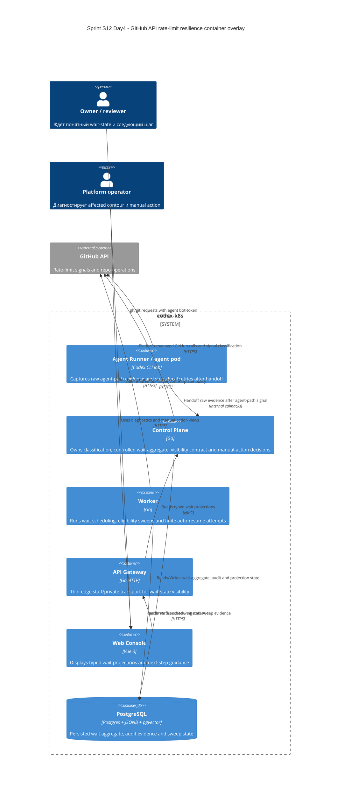

# C4 Container: Sprint S12 Day 4 GitHub API rate-limit resilience

## TL;DR
- Container baseline платформы не меняется: capability реализуется внутри существующих `agent-runner`, `control-plane`, `worker`, `api-gateway`, `web-console`, `postgres`.
- Новая Day4-фиксация касается ownership split для signal handoff, controlled wait aggregate, resume sweeps и typed visibility projections.

## Диаграмма (Mermaid C4Container)

## Container responsibilities in GitHub API rate-limit resilience

| Container | Role |
|---|---|
| `agent-runner` | Видит raw agent-path evidence и прекращает local retry после handoff |
| `control-plane` | Единственный owner classification, wait aggregate, contour attribution и visibility contract |
| `worker` | Планирует wake-up, делает finite auto-resume attempts и эскалирует uncertainty |
| `api-gateway` | Отдаёт typed staff/private visibility contract без доменной логики |
| `web-console` | Показывает typed wait projections и manual-action hints |
| `postgres` | Единая persisted coordination layer между pod |

## Runtime и data boundaries
- `agent-runner` не хранит source-of-truth wait-state внутри pod.
- `worker` не выбирает contour и не переводит hard failure в recoverable wait без решения `control-plane`.
- `api-gateway` и `web-console` не вычисляют countdown или provider classification самостоятельно.
- `postgres` остаётся единственной точкой синхронизации для wait aggregate и resume evidence.

## Continuity after `run:plan`
- Typed raw-evidence handoff, persisted wait aggregate и finite auto-resume orchestration были детализированы на Day5 и разложены на execution waves `#425..#431` в Issue `#423`.
- Container ownership из этой схемы остаётся обязательным guardrail для implementation streams и не может меняться локальными решениями внутри `worker`, `agent-runner`, `api-gateway` или `web-console`.
