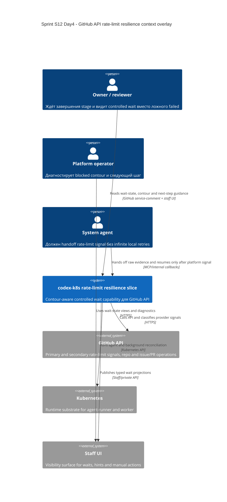

# C4 Context: Sprint S12 Day 4 GitHub API rate-limit resilience

## TL;DR
- GitHub API rate-limit resilience остаётся capability slice внутри `codex-k8s`, а не отдельной внешней quota-management системы.
- Owner/reviewer, platform operator и агент получают разные visibility semantics, но единый source-of-truth остаётся внутри platform domain.

## Диаграмма (Mermaid C4Context)

## Пояснения
- GitHub остаётся внешним source of provider signals, но не source-of-truth для user-facing wait semantics.
- Staff UI и GitHub comments остаются surfaces одного и того же typed projection.
- Kubernetes обеспечивает runtime только для agent/worker execution и не владеет rate-limit semantics.

## Внешние зависимости
- GitHub API: rate-limit headers/signals и affected operations.
- Kubernetes: runtime для `agent-runner` и `worker`.
- Staff UI/API: операторская и owner visibility surface, но не место для бизнес-решений.

## Continuity after `run:plan`
- Plan package Issue `#423` зафиксировал, что этот context overlay остаётся неизменным baseline для execution waves `#425..#431`.
- Ни одна implementation wave не получает права превращать GitHub API, Kubernetes или Staff UI в source-of-truth для wait semantics: этот инвариант остаётся внутри platform domain.
