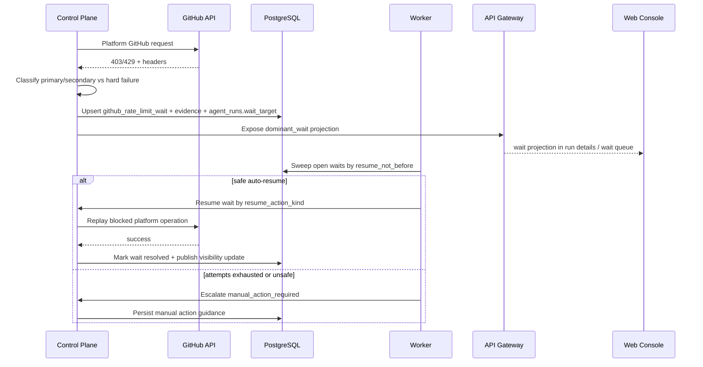
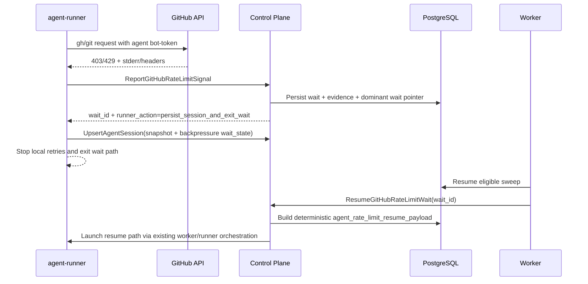

# Detailed Design: GitHub API rate-limit resilience

## TL;DR
- Что меняем: фиксируем implementation-ready design для controlled wait-state при GitHub rate-limit, typed signal handoff от `agent-runner`, persisted wait aggregate/evidence и visibility contract для staff surfaces и GitHub service-comment.
- Почему: Day4 architecture (`#418`) закрепил ownership, но без точных API/data/runtime contracts нельзя безопасно перейти в `run:plan` и `run:dev`.
- Основные компоненты: `control-plane` владеет classification, wait aggregate и visibility; `worker` исполняет finite auto-resume sweeps; `agent-runner` передаёт raw evidence и получает deterministic resume payload; `api-gateway`/`web-console` читают typed projection.
- Риски: drift между dominant wait и related waits, service-comment lag при platform contour saturation, runaway auto-resume loops и ложные promises по secondary limit.
- План выката: `migrations -> control-plane -> worker -> agent-runner -> api-gateway -> web-console`.
- Plan-stage Issue `#423` подтвердил этот design как source-of-truth и декомпозировал execution waves `#425..#431` без изменения контрактов.

## Цели / Не-цели
### Goals
- Зафиксировать wait-state taxonomy для GitHub rate-limit без reuse `waiting_mcp` semantics.
- Определить typed signal contract для platform-managed path и `agent-runner` handoff path.
- Выбрать persisted aggregate/evidence model, которая сохраняет contour attribution, audit linkage и finite auto-resume policy.
- Зафиксировать visibility contract для `GET /staff/runs/{run_id}`, `GET /staff/runs/waits`, realtime stream и GitHub service-comment mirror.
- Подготовить rollout/rollback notes и follow-up в `run:plan`.

### Non-goals
- Реализация Go/TS кода, миграций, OpenAPI/proto и deploy manifests в этом stage.
- Добавление dedicated operator write endpoint для ручного resolution в первой волне MVP.
- Обобщение capability на multi-provider quota governance, predictive budgeting или adapter-specific notifications.
- Polling `GET /rate_limit` как активной recovery-стратегии платформы.

## Контекст и текущая архитектура
- Source architecture:
  - `docs/architecture/initiatives/s12_github_api_rate_limit_resilience/architecture.md`
  - `docs/architecture/adr/ADR-0013-github-rate-limit-controlled-wait-ownership.md`
  - `docs/architecture/alternatives/ALT-0005-github-rate-limit-wait-state-boundaries.md`
- Product baseline:
  - `docs/delivery/epics/s12/prd-s12-day3-github-api-rate-limit-resilience.md`
  - `docs/delivery/sprints/s12/sprint_s12_github_api_rate_limit_resilience.md`
- GitHub Docs baseline (проверено 2026-03-13 через Context7 `/github/docs`):
  - primary limit даёт deterministic `x-ratelimit-reset` / `x-ratelimit-remaining`;
  - secondary limit может приходить как `403` или `429`, с `Retry-After` либо без него;
  - при отсутствии `Retry-After` GitHub рекомендует ждать минимум минуту, затем использовать exponential backoff и stop-after-N-retries;
  - для снижения secondary-limit риска GitHub рекомендует избегать concurrency bursts и полагаться на webhook-driven path вместо polling.

## Предлагаемый дизайн (high-level)
### Design choice: отдельный coarse wait-state `waiting_backpressure`
- Coarse runtime wait-state больше не reuse'ит `waiting_mcp` для GitHub rate-limit.
- Нормативный выбор:
  - `agent_runs.status=waiting_backpressure`
  - `agent_runs.wait_reason=github_rate_limit`
  - `agent_runs.wait_target_kind=github_rate_limit_wait`
  - `agent_runs.wait_target_ref=<wait_id>`
  - `agent_sessions.wait_state=backpressure`
- Почему:
  - GitHub rate-limit не является MCP/human-response wait;
  - новый coarse state не ломает split approval/interaction semantics, уже введённый в Sprint S10;
  - wait queue и realtime surfaces получают отдельный operational meaning without UI inference from raw logs.

### Ownership and contracts
| Concern | Decision | Why |
|---|---|---|
| Signal normalization | `control-plane` creates canonical `GitHubRateLimitSignal` | Один owner classification и contour attribution |
| Agent path handoff | `agent-runner` reports typed signal and stops local retries immediately | No infinite local retry-loop |
| Wait persistence | `github_rate_limit_waits` + `github_rate_limit_wait_evidence` under `control-plane` schema ownership | Persisted source of truth for multi-pod consistency |
| Auto-resume | `worker` executes sweep/resume using persisted policy, never inventing classification | Idempotent time-based orchestration |
| Visibility | Existing run details, wait queue, realtime and service-comment render from one projection | Thin-edge and comment consistency |
| Manual path | No dedicated write endpoint in Wave 1; visibility returns typed `manual_action_kind` and operator guidance | Keeps Day5 within contract scope and avoids premature command surface |

### Dominant wait vs related waits
- Persisted unit is one wait aggregate per `(run_id, contour_kind)` with partial unique index on open states.
- If both contour kinds are open at once (`platform_pat` and `agent_bot_token`), `control-plane` elects exactly one `dominant` wait for `agent_runs.wait_target_ref`.
- Dominant election order:
  1. `manual_action_required`
  2. later `resume_not_before`
  3. latest `updated_at`
- Staff surfaces return both:
  - `dominant_wait` for runtime semantics;
  - `related_waits[]` for full contour transparency.
- GitHub service-comment mirrors only dominant wait headline plus compact contour badges for related waits, because comment space is scarce and may itself be blocked by the platform contour.

### Classification and recovery policy
| Incoming signal | Classification | Recovery hint | Auto-resume policy |
|---|---|---|---|
| `x-ratelimit-remaining=0` + `x-ratelimit-reset` | `primary` | `rate_limit_reset` | one scheduled attempt at `reset_at + 5s guard`; second failure downgrades to conservative retry after 60s, then manual action |
| `Retry-After` present on `403/429` | `secondary` | `retry_after` | attempt at `now + retry_after + 15s guard`; max 2 automatic attempts |
| `403/429` without deterministic reset and without `Retry-After`, but signal classified as secondary/abuse | `secondary` | `exponential_backoff` | attempts at `+1m`, `+2m`, `+4m`, capped at 15m; max 3 automatic attempts total |
| `bad credentials`, invalid scope, permission/policy failure, non-rate-limit `403/429` | hard failure | no wait | wait aggregate is not created |

### Resume action kinds
- `run_status_comment_retry`
  - best-effort replay of comment mirror that was blocked by platform contour.
- `platform_github_call_replay`
  - idempotent replay of one blocked platform-managed GitHub operation.
- `agent_session_resume`
  - deterministic resume of one persisted `codex exec resume` path after agent contour wait resolves.

### Manual action contract
- `next_step_kind=manual_action_required` does not create a new operator endpoint in Wave 1.
- Instead, visibility surfaces return:
  - `manual_action_kind`
  - `manual_action_summary`
  - `manual_action_details_markdown`
  - `suggested_not_before`
- Closed enum for `manual_action_kind`:
  - `requeue_platform_operation`
  - `resume_agent_session`
  - `retry_after_operator_review`
- Rationale:
  - design keeps user/operator guidance typed and auditable;
  - actual triggering remains existing run/stage/operator flows and will be decomposed on `run:plan`.

## Lifecycle flows
### Platform contour detect -> wait -> resume


### Agent contour handoff -> persisted session -> resume


## Wait-state taxonomy decision
- `agent_runs.status` closed set expands with `waiting_backpressure`.
- `agent_runs.wait_reason` closed set expands with `github_rate_limit`.
- `agent_runs.wait_target_kind` closed set expands with `github_rate_limit_wait`.
- `agent_sessions.wait_state` closed set expands with `backpressure`.
- Invariant:
  - one dominant wait target per run;
  - open waits may exist per contour, but only one aggregate is dominant for runtime pause semantics at any moment.

## Resume payload contract
- Agent resume payload is persisted in `github_rate_limit_waits.resume_payload_json` when `resume_action_kind=agent_session_resume`.
- Shape:

```json
{
  "wait_id": "d8b66c6c-6aa4-4520-9c6f-e1cbbe4c05e9",
  "wait_reason": "github_rate_limit",
  "contour_kind": "agent_bot_token",
  "limit_kind": "secondary",
  "resolution_kind": "auto_resumed",
  "recovered_at": "2026-03-13T14:21:00Z",
  "attempt_no": 2,
  "affected_operation_class": "agent_github_call",
  "guidance": "Continue from persisted session and do not replay the local retry loop."
}
```

- `agent-runner` prepends this JSON block to the resume prompt before invoking `codex exec resume`.
- Payload is the only machine-readable source for resume context; runner must not re-derive semantics from stale stderr or GitHub headers.

## Visibility surfaces
### Staff/private read model
- Existing `GET /api/v1/staff/runs/{run_id}` receives `wait_projection`.
- Existing `GET /api/v1/staff/runs/waits` lists dominant waits and exposes `related_waits_count`.
- Existing realtime stream `/api/v1/staff/runs/{run_id}/realtime` adds `wait_entered`, `wait_updated`, `wait_resolved`, `wait_manual_action_required`.

### GitHub service-comment mirror
- Service-comment is a best-effort mirror of the canonical projection, not the source of truth.
- If comment upsert itself hits the platform contour:
  - wait aggregate and staff surfaces still commit successfully;
  - evidence row `comment_mirror_failed` is appended;
  - worker retries `run_status_comment_retry` after wait resolution.
- Comment wording must stay derived from typed projection and never parse raw headers.

## API/Контракты
- Детализация transport contracts: `docs/architecture/initiatives/s12_github_api_rate_limit_resilience/api_contract.md`.
- Source of truth for future `run:dev`:
  - OpenAPI: `services/external/api-gateway/api/server/api.yaml`
  - gRPC: `proto/codexk8s/controlplane/v1/controlplane.proto`
- Day5 decision:
  - no new public endpoint;
  - existing run/wait visibility routes are extended with typed wait projection;
  - new internal callback RPC `ReportGitHubRateLimitSignal` is added for `agent-runner`.

## Модель данных и миграции
- Детализация entities/indexes: `docs/architecture/initiatives/s12_github_api_rate_limit_resilience/data_model.md`
- Rollout/rollback constraints: `docs/architecture/initiatives/s12_github_api_rate_limit_resilience/migrations_policy.md`
- Ключевой выбор:
  - `control-plane` owns new wait/evidence tables;
  - `agent_runs` and `agent_sessions` are extended but remain the coarse runtime pause engine;
  - no polling table for `GET /rate_limit` snapshots is introduced.

## Нефункциональные аспекты
- Надёжность:
  - signal/report path idempotent by `signal_id`;
  - worker sweep idempotent by `wait_id + resume_attempt_no`;
  - dominant wait election is transactional with `agent_runs.wait_target_ref`.
- Производительность:
  - wait projection read must piggyback on existing run detail / wait queue queries;
  - evidence writes are append-only and low-cardinality per wait.
- Безопасность:
  - evidence stores sanitized headers/excerpts only;
  - `Authorization`, token values and raw bearer strings are never persisted;
  - `agent-runner` continues to use run-bound bearer for callback auth.
- Наблюдаемость:
  - every detect/classify/schedule/resume/escalate step mirrors to `flow_events`.

## Наблюдаемость (Observability)
- Logs:
  - `github_rate_limit.signal_reported`
  - `github_rate_limit.wait_entered`
  - `github_rate_limit.resume_scheduled`
  - `github_rate_limit.resume_attempted`
  - `github_rate_limit.resume_succeeded`
  - `github_rate_limit.manual_action_required`
  - `github_rate_limit.comment_retry_scheduled`
- Metrics:
  - `github_rate_limit_wait_open_total{contour,limit_kind,state}`
  - `github_rate_limit_resume_attempt_total{contour,limit_kind,outcome}`
  - `github_rate_limit_manual_action_total{contour,manual_action_kind}`
  - `github_rate_limit_comment_mirror_retry_total`
- Traces:
  - `agent-runner -> control-plane` signal callback
  - `worker -> control-plane -> github` resume replay path

## Тестирование
- Unit:
  - classification matrix for primary/secondary/hard-failure;
  - dominant wait election;
  - finite auto-resume budget transitions.
- Integration:
  - repository tests for partial unique open wait per `(run_id, contour_kind)`;
  - worker sweep idempotency and retry budget enforcement;
  - run status comment retry scheduling when platform contour blocks mirror.
- Contract:
  - gRPC callback DTO validation for `ReportGitHubRateLimitSignal`;
  - staff DTO snapshots for run details / wait queue / realtime envelopes.
- Negative cases:
  - dual contour incident;
  - hard-failure misclassification prevention;
  - duplicate signal replay;
  - comment mirror failure without losing staff visibility.

## План выката (Rollout)
- Day5 runtime impact: отсутствует, change-set markdown-only.
- Planned rollout for `run:dev`:
  1. DB migrations and enum/check expansion.
  2. `control-plane` write/read path for wait aggregate and visibility projection.
  3. `worker` auto-resume sweeps and manual escalation.
  4. `agent-runner` signal handoff + deterministic resume payload.
  5. `api-gateway` DTO/casters + staff wait queue projection.
  6. `web-console` UI surfaces for dominant/related waits.
- Feature-gate recommendation:
  - `CODEXK8S_GITHUB_RATE_LIMIT_WAIT_ENABLED`
  - `CODEXK8S_GITHUB_RATE_LIMIT_WAIT_UI_ENABLED`

## План отката (Rollback)
- Before agent-runner cutover:
  - disable `CODEXK8S_GITHUB_RATE_LIMIT_WAIT_ENABLED`;
  - keep new tables read-only;
  - existing hard-failure behavior remains available.
- After agent-runner cutover:
  - stop new wait creation and worker sweeps first;
  - keep persisted waits/evidence for audit;
  - do not delete wait rows or session snapshots needed for safe recovery diagnosis.
- Service-comment mirror may be disabled independently of staff visibility if GitHub platform contour remains unstable.

## Альтернативы и почему отвергли
- Reuse `waiting_mcp`:
  - rejected because it collapses provider backpressure into unrelated human/MCP semantics.
- Dedicated operator write endpoint on Day5:
  - rejected because plan-stage must first decompose execution waves and approval policy for manual actions.
- Polling `GET /rate_limit`:
  - rejected because GitHub docs state the endpoint can still count against secondary limits and headers from the original response are preferred.

## Runtime impact / Migration impact
- Runtime impact (`run:design`): none.
- Migration impact (`run:dev`):
  - new wait/evidence tables;
  - enum/check expansion for `agent_runs` and `agent_sessions`;
  - additive rollout of visibility DTO and worker sweep logic.

## Handover status after `run:plan`
- [x] Подготовлен design package (`design_doc`, `api_contract`, `data_model`, `migrations_policy`).
- [x] Зафиксированы typed contracts для signal handoff, wait projection, manual action guidance и resume payload.
- [x] Определены persisted wait aggregate, evidence ledger, dominant wait election и finite auto-resume policy.
- [x] Зафиксированы rollout/rollback constraints и follow-up issue `#423` для `run:plan`.
- [x] Plan package завершил документный контур и зафиксировал execution waves `#425..#431` как единственный handover в `run:dev`.
