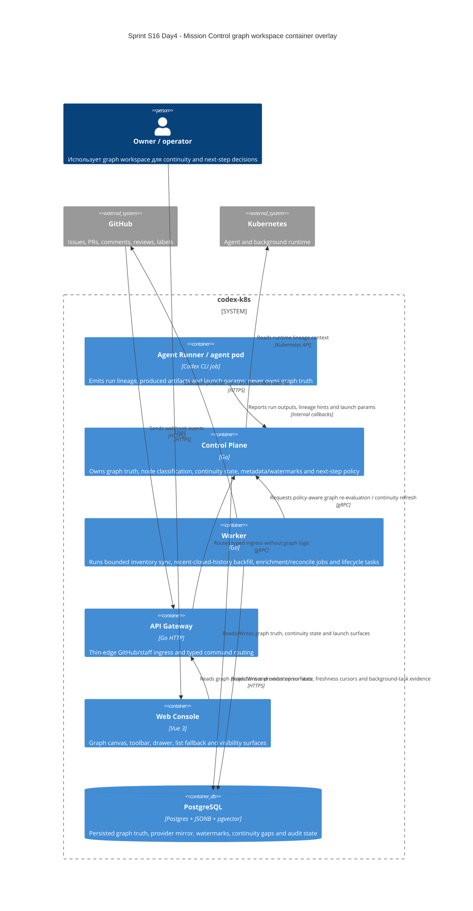

# C4 Container: Sprint S16 Day 4 Mission Control graph workspace

## TL;DR
- 2026-03-25 issue `#561` перевела этот C4 container overlay в historical superseded state.
- Контейнерные границы и ownership из этого файла больше не являются текущим Mission Control source of truth; они сохранены только как evidence отклонённого S16 baseline.

## Диаграмма (Mermaid C4Container)

## Container responsibilities in Mission Control graph workspace

| Container | Role |
|---|---|
| `agent-runner` | Передаёт run context, produced artifacts и launch params без ownership graph semantics |
| `control-plane` | Единственный owner graph truth, continuity gaps, typed metadata/watermarks и next-step eligibility |
| `worker` | Выполняет bounded inventory sync, recent-closed-history backfill, enrichment/reconcile jobs и lifecycle tasks без ownership graph truth |
| `api-gateway` | Thin-edge ingress для GitHub webhook и staff/private actions |
| `web-console` | Показывает canvas, drawer и list fallback на основе typed projections |
| `postgres` | Единая persisted coordination layer для graph truth, provider mirror, watermarks и audit state |

## Runtime и data boundaries
- `web-console` не строит canonical graph и не рассчитывает allowed next steps локально.
- `api-gateway` не принимает решений о node classification, continuity completeness или hybrid truth merge.
- `worker` не изменяет canonical node kinds и не закрывает continuity gaps без решения `control-plane`.
- `agent-runner` не становится owner relations только потому, что первым видел run outcome.

## Continuity after `run:arch`
- Design package в Issue `#519` должен описать typed snapshot/detail/launch contracts и migration policy, не меняя этот container ownership split.
- Любой downstream execution stream Sprint S16 обязан потреблять готовые typed surfaces из `control-plane`, а не переносить graph truth в UI или отдельный temporary service.
