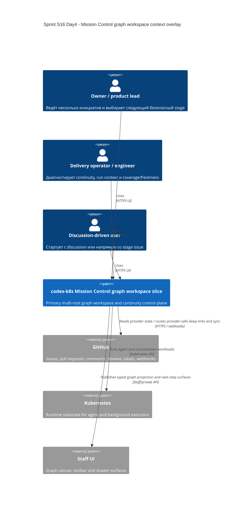

# C4 Context: Sprint S16 Day 4 Mission Control graph workspace

## TL;DR
- Mission Control graph workspace остаётся capability slice внутри `codex-k8s`, а не отдельной внешней graph-платформой.
- GitHub остаётся canonical provider for issue/PR/comment/review state, а platform domain остаётся owner graph truth, continuity lineage и next-step policy.

## Диаграмма (Mermaid C4Context)

## Пояснения
- GitHub остаётся источником provider facts и human review/merge semantics, но не становится canonical owner graph relations и continuity completeness.
- Kubernetes обеспечивает runtime для `agent-runner` и `worker`, но не хранит graph truth.
- Staff UI остаётся visibility surface над typed projections `control-plane`, а не отдельным graph backend.

## Внешние зависимости
- GitHub: issue/pr/comment/review state, labels, provider-native collaboration и webhook echoes.
- Kubernetes: runtime для `agent-runner` и `worker`.
- Staff UI/API: отображает multi-root graph workspace и next-step surfaces, но не вычисляет domain semantics.

## Continuity after `run:arch`
- Issue `#519` (`run:design`) должен сохранить этот context overlay как baseline для typed transport/data contracts.
- Voice/STT, dashboard orchestrator agent, отдельная `agent` node taxonomy и full-history/archive остаются за пределами core context Wave 1.
