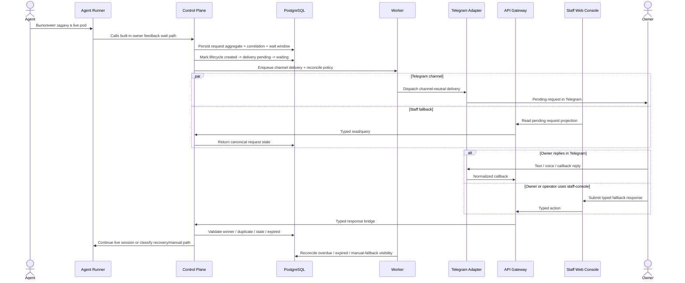

# Sprint S17 Day 4 — Unified owner feedback loop architecture (Issue #559)

## TL;DR
- `control-plane` остаётся единственным владельцем feedback-request aggregate, wait/continuation policy, persisted channel truth и классификации degraded paths; `worker` владеет dispatch/retry/reconcile и удержанием long-lived wait runtime, а `agent-runner` удерживает только live same-session execution и recovery snapshot capture.
- Primary happy-path не меняется: owner reply должен продолжать ту же live pod / ту же `codex` session; shorter max timeout/TTL или detached resume-run не считаются допустимой нормализацией архитектуры.
- `api-gateway`, `staff web-console` и `telegram-interaction-adapter` остаются thin surfaces вокруг одного persisted backend contract: они не владеют semantic winner ответа, lifecycle truth или continuation classification.

## Контекст и входные артефакты
- Delivery-цепочка: `#541 (intake) -> #554 (vision) -> #557 (prd) -> #559 (arch)`.
- Source of truth:
  - `docs/delivery/epics/s17/prd-s17-day3-unified-user-interaction-waits-and-owner-feedback-inbox.md`
  - `docs/product/requirements_machine_driven.md`
  - `docs/product/agents_operating_model.md`
  - `docs/product/labels_and_trigger_policy.md`
  - `docs/product/stage_process_model.md`
  - `docs/architecture/api_contract.md`
  - `docs/architecture/data_model.md`
  - `docs/architecture/agent_runtime_rbac.md`
  - `docs/architecture/mcp_approval_and_audit_flow.md`
  - `docs/architecture/initiatives/s10_mcp_user_interactions/architecture.md`
  - `docs/architecture/initiatives/s11_telegram_user_interaction_adapter/architecture.md`
  - `services/internal/control-plane/README.md`
  - `services/jobs/agent-runner/README.md`
  - `services/jobs/worker/README.md`
  - `services/external/api-gateway/README.md`
  - `services/external/telegram-interaction-adapter/README.md`
  - `services/staff/web-console/README.md`

## Цели архитектурного этапа
- Превратить PRD contract Sprint S17 в проверяемые service boundaries и ownership split без premature API/schema/UI lock-in.
- Зафиксировать, как one logical owner-wait window materializes через live wait, namespace/session lifetime, degraded-state visibility и recovery-only snapshot-resume.
- Сохранить same-session continuation как primary happy-path и не допустить drift в detached resume-run, Telegram-first UX или split-brain между Telegram и staff-console.
- Подготовить handover в `run:design` с явным списком transport/data/migration решений, которые ещё предстоит детализировать.

## Non-goals
- Не выбираем точные DTO, OpenAPI/grpc fields, schema columns и UI layouts для owner inbox.
- Не фиксируем новый отдельный internal service или новый DB owner на Day4.
- Не расширяем scope на дополнительные каналы, reminders/escalations, attachments, multi-party routing и generalized conversation UX.
- Не возвращаем detached resume-run как допустимый equal happy-path и не смешиваем owner feedback loop с approval flow.

## Неподвижные guardrails из Day1-Day3
- Same live pod / same `codex` session остаётся primary happy-path.
- Effective max timeout/TTL built-in `codex_k8s` MCP wait path не может быть ниже owner wait window.
- Persisted session snapshot разрешён только как recovery fallback при потере live runtime.
- Lifecycle truth обязана сохранять минимум стадии `created -> delivery pending -> delivery accepted -> waiting -> response -> continuation`.
- Telegram inbox и staff-console fallback обязаны жить поверх одного persisted backend contract.
- Deterministic text/voice/callback binding обязателен для accepted response path.
- `run:self-improve` остаётся вне owner-facing human-wait contract.

## Source-of-truth split

| Concern | Канонический владелец | Почему |
|---|---|---|
| Agent-facing built-in wait path | `control-plane` MCP surface + `agent-runner` live execution | Built-in tool policy и live session continuation должны оставаться platform-owned |
| Feedback request aggregate и lifecycle truth | `control-plane` + PostgreSQL | Нужен один semantic owner для lifecycle, deadlines и channel parity |
| Long-lived wait budget и degraded classification | `control-plane` policy + `worker` reconcile + `agent-runner` heartbeat | Wait window должен одинаково управлять runtime, lease и fallback semantics |
| Telegram delivery / raw webhook normalization | `telegram-interaction-adapter` | Channel-specific transport остаётся внешним replaceable contour |
| Staff-console fallback и operator surface | `staff web-console` через `api-gateway`, backed by `control-plane` truth | UI не должен становиться вторым source of truth |
| Accepted-response winner, duplicate/stale/expired handling | `control-plane` | Только домен может выбрать semantic winner across channels |
| Recovery snapshot storage and restore gating | `control-plane` + `agent-runner` + `agent_sessions` | Resume должен оставаться recovery-only path, а не основным execution model |

## Service Boundaries And Ownership Matrix

| Concern | Primary owner | Supporting owners | Boundary decision | Design-stage deliverables |
|---|---|---|---|---|
| Live wait execution inside the same pod/session | `agent-runner` | `control-plane`, `worker` | `agent-runner` удерживает live `codex` session, пишет heartbeat/snapshot и продолжает работу только после platform decision; он не владеет persisted request truth и не может сам нормализовать detached resume | Resume handshake, heartbeat contract, snapshot-promotion rules |
| Feedback request aggregate, lifecycle states и continuation policy | `control-plane` | PostgreSQL | Один доменный owner хранит request truth, delivery-vs-wait distinction, continuation mode и degraded classification | Aggregate/state model, continuation policy, error taxonomy |
| Effective wait window и TTL/lease policy | `control-plane` | `worker`, `agent-runner` | Логический owner wait window задаётся один раз и должен одновременно отражаться в MCP wait timeout, session wait semantics и runtime retention | Deadline propagation rules, policy validation, lease/heartbeat contract |
| Dispatch, retries, overdue/expired/manual-fallback reconciliation | `worker` | `control-plane`, `telegram-interaction-adapter` | Все time-based side effects, retries и sweep-переходы выполняются асинхронно; `worker` не выбирает semantic winner ответа | Retry/reconcile policy, timer semantics, fallback escalation contract |
| Callback ingress и staff fallback actions | `api-gateway` | `control-plane`, `staff web-console`, `telegram-interaction-adapter` | `api-gateway` валидирует auth/schema/RBAC и делает typed bridge, но не владеет lifecycle transitions | Typed ingress families, auth model, transport error mapping |
| Staff fallback inbox и operator visibility | `staff web-console` | `api-gateway`, `control-plane` | UI только отображает canonical state и отправляет typed actions; локальные optimistic truths или parallel inbox models запрещены | Read-model boundaries, action semantics, degraded-state UX rules |
| Telegram delivery, webhook handling и voice/text normalization | `telegram-interaction-adapter` | `worker`, `api-gateway` | Adapter contour владеет raw Telegram transport, `answerCallbackQuery`, voice normalization и provider refs, но не platform semantics | Adapter envelope boundaries, normalized callback contract, provider-ref rules |
| Deterministic text/voice/callback binding and channel parity | `control-plane` | `telegram-interaction-adapter`, `staff web-console`, `api-gateway` | Все reply types связываются через один opaque request handle и platform-owned correlation; duplicate/stale paths не могут завершать run повторно | Handle strategy, accepted-response rules, stale/duplicate contract |

## Architecture flow: request -> delivery -> wait -> response -> continuation

## Wait lifetime policy

| Aspect | Architecture decision |
|---|---|
| Owner wait window | Один logical owner wait window принадлежит `control-plane`; design stage должен спроецировать его в built-in MCP timeout/TTL, request deadline и operator visibility without drift |
| Live same-session budget | Happy-path допустим только если effective built-in wait timeout/TTL не короче owner wait window; shorter timeout считается blocking policy violation, а не разрешённой оптимизацией |
| Runtime retention | `worker` keepalive/lease logic удерживает candidate namespace и wait-state while run is active; `agent-runner` heartbeat/snapshot служат evidence для живой session continuity и stale-recovery detection |
| Delivery-before-wait discipline | Wait-state не подменяет delivery acceptance: canonical lifecycle хранит отдельные факты `delivery pending`, `delivery accepted`, `waiting` и только потом `response` |
| Recovery-only snapshot resume | Snapshot restore запускается только после потери live runtime или явного recovery decision; successful resume обязан оставаться отдельно классифицированным degraded path |
| Manual/degraded outcomes | `overdue`, `expired`, `manual-fallback` и `recovery-resume` считаются platform-visible canonical outcomes и не прячутся в adapter logs или UI-local heuristics |

## Deterministic binding and channel parity
- `control-plane` выдаёт opaque request handle и canonical correlation ids до любого channel side effect.
- Telegram text, voice и callback replies, а также staff-console fallback action должны приходить обратно в один platform-owned binding contour; exact handle/token format остаётся design-stage scope.
- Accepted response winner выбирается только once against persisted request state; duplicate, stale и expired replies materialize как typed no-op/rejection outcome с audit evidence.
- Ни Telegram, ни staff-console не могут independently mark request completed; оба канала обязаны читать и обновлять один persisted truth.
- GitHub comments и service messages остаются degraded/manual context path и не входят в primary accepted-response contract.

## Visibility model for overdue / expired / manual fallback
- `control-plane` владеет canonical status families и reason taxonomy для `waiting`, `response_received`, `continuation_live`, `recovery_resume`, `overdue`, `expired`, `manual_fallback`.
- `worker` отвечает за time-based detection и за публикацию typed reconciliation signals, но не решает бизнес-смысл continuation.
- `staff web-console` является обязательной operator-visible fallback surface: там должны быть видны те же canonical states, что и в Telegram/user-facing path.
- `telegram-interaction-adapter` может публиковать уведомления о fallback/degradation, но не определяет, когда request становится overdue, expired или manual-fallback.

## Почему не выделяем новый dedicated service сейчас
- `control-plane` уже владеет built-in MCP surface, run/session lifecycle, policy и audit semantics.
- Новый dedicated service добавил бы premature DB owner и лишний cross-service consistency contour до фиксации design contracts.
- Текущий split лучше соответствует существующей архитектуре:
  - `control-plane` владеет доменной truth и continuation policy;
  - `worker` владеет background dispatch/reconcile;
  - `api-gateway` остаётся thin-edge;
  - `staff web-console` остаётся presentation/fallback surface;
  - `telegram-interaction-adapter` остаётся replaceable external channel contour.

## Architecture quality gates for `run:design`

| Gate | Что проверяем | Почему это обязательно |
|---|---|---|
| `QG-S17-A1 Live wait integrity` | Design package доказывает, что live same-session path удерживается max timeout/TTL не ниже owner wait window | Иначе primary happy-path silently деградирует в detached resume |
| `QG-S17-A2 Single persisted truth` | Telegram и staff-console работают поверх одного aggregate/read-model без split-brain semantics | Иначе dual-channel inbox теряет доверие |
| `QG-S17-A3 Recovery-only discipline` | Snapshot resume остаётся отдельным degraded mode и не маскирует runtime loss как normal path | Иначе ломается baseline Day1-Day3 |
| `QG-S17-A4 Thin surfaces` | `api-gateway`, `staff web-console` и `telegram-interaction-adapter` не принимают доменные lifecycle decisions | Иначе нарушаются bounded contexts |
| `QG-S17-A5 Deterministic binding` | Все reply types materialize в один accepted-response contract с duplicate/stale/expired safety | Иначе continuation semantics станет недоказуемой |
| `QG-S17-A6 Visibility parity` | Overdue / expired / manual-fallback states одинаково видны owner/operator surfaces и audit trail | Иначе degraded paths останутся hidden operator-only detail |
| `QG-S17-A7 Scope discipline` | `run:self-improve`, additional channels и generalized conversation UX не просачиваются в core contract | Иначе Sprint S17 потеряет bounded scope |

## Открытые design-вопросы
- Какой exact request-handle/token format нужен, чтобы удержать deterministic binding, channel parity и deadline-aware stale classification?
- Как materialize wait-state linkage между feedback aggregate, `agent_runs` и `agent_sessions`, не смешивая runtime wait semantics с business states?
- Какой read-model нужен для staff-console fallback и operator visibility, чтобы показывать identical canonical statuses без UI-local heuristics?
- Как design stage выразит policy для overdue -> expired -> manual-fallback переходов и допустимых operator actions без premature workflow expansion?
- Какой rollout/rollback path нужен для последовательности `migrations -> control-plane -> worker -> api-gateway -> telegram-interaction-adapter -> web-console`?

## Migration и runtime impact
- На этапе `run:arch` код, БД-схема, deploy manifests и runtime behaviour не менялись.
- Future rollout order для implementation path:
  - `migrations -> control-plane -> worker -> api-gateway -> telegram-interaction-adapter -> web-console`.
- Design stage обязан отдельно зафиксировать:
  - schema ownership и migration boundaries для request truth, reply binding, projections и degraded-state evidence;
  - rollout/rollback notes для long wait continuity и mixed-version safety;
  - observability events для delivery accepted, wait entered, response bound, live continuation, recovery resume, overdue, expired и manual fallback.

## External dependencies / Context7
- Новые внешние зависимости на `run:arch` не выбирались и не добавлялись.
- Context7 на этом этапе не требовался, потому что пакет фиксирует только service boundaries и trade-offs поверх уже утверждённого Sprint S10/S11 baseline.

## Handover в `run:design`
- Следующий этап: `run:design`.
- Follow-up issue: `#568`.
- На design stage обязательно выпустить:
  - `design_doc.md`
  - `api_contract.md`
  - `data_model.md`
  - `migrations_policy.md`
- На design stage обязательно конкретизировать:
  - typed built-in wait contracts, channel callbacks и staff-console fallback actions;
  - persisted request truth, projections, binding rules и visibility model;
  - wait-state linkage, timeout/TTL propagation и recovery-only snapshot resume mechanics;
  - continuity issue для `run:plan` с явным требованием сохранить цепочку `plan -> dev`.
