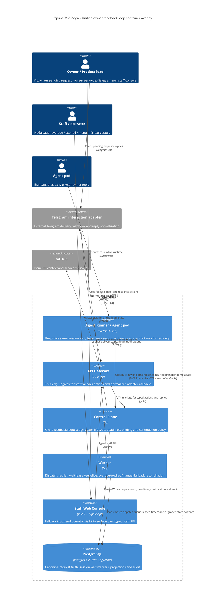

# C4 Container: Sprint S17 Day 4 unified owner feedback loop

## TL;DR
- Container baseline платформы не меняется: owner feedback continuity раскладывается на существующие `agent-runner`, `api-gateway`, `control-plane`, `worker`, `web-console`, `postgres` и внешний `telegram-interaction-adapter`.
- Day4 фиксирует только ownership split для live wait execution, persisted truth, callback ingress, dual-channel projections и degraded-state reconciliation.

## Диаграмма (Mermaid C4Container)

## Container responsibilities in unified owner feedback loop

| Container | Role |
|---|---|
| `agent-runner` | Удерживает live same-session execution, heartbeat и snapshot capture; не владеет request truth и не может сам назначить detached resume как happy-path |
| `api-gateway` | Auth/RBAC/schema validation и typed bridge для staff fallback actions и normalized adapter callbacks |
| `control-plane` | Feedback request aggregate owner, wait/deadline policy, deterministic binding, accepted-response winner и continuation classification |
| `worker` | Delivery, retries, lease keepalive, overdue/expired/manual-fallback reconciliation и background notifications |
| `staff web-console` | Platform-owned fallback inbox и operator visibility surface без собственного lifecycle source of truth |
| `postgres` | Единственная persisted coordination layer для request truth, session waits, projections и audit evidence |
| `telegram-interaction-adapter` | Channel-specific delivery, raw webhook handling, voice/text normalization и provider refs без platform semantics |

## Runtime и data boundaries
- `agent-runner` не хранит source-of-truth request lifecycle внутри pod и не может завершить request без `control-plane`.
- `api-gateway` не выбирает semantic winner ответа и не materializes local wait-state policy.
- `staff web-console` не поддерживает separate inbox state и не обходит typed API/control-plane decisions.
- `telegram-interaction-adapter` не владеет overdue/expired/manual-fallback semantics и не определяет accepted-response outcome.
- `worker` не определяет business meaning reply types; он исполняет only background dispatch/reconcile side effects.

## Handover note for `run:design`
- Зафиксировать exact typed contracts для staff fallback actions, Telegram callbacks и built-in wait path.
- Определить persistence/read-model boundaries для projections, degraded-state visibility и recovery linkage без изменения этого ownership split.
