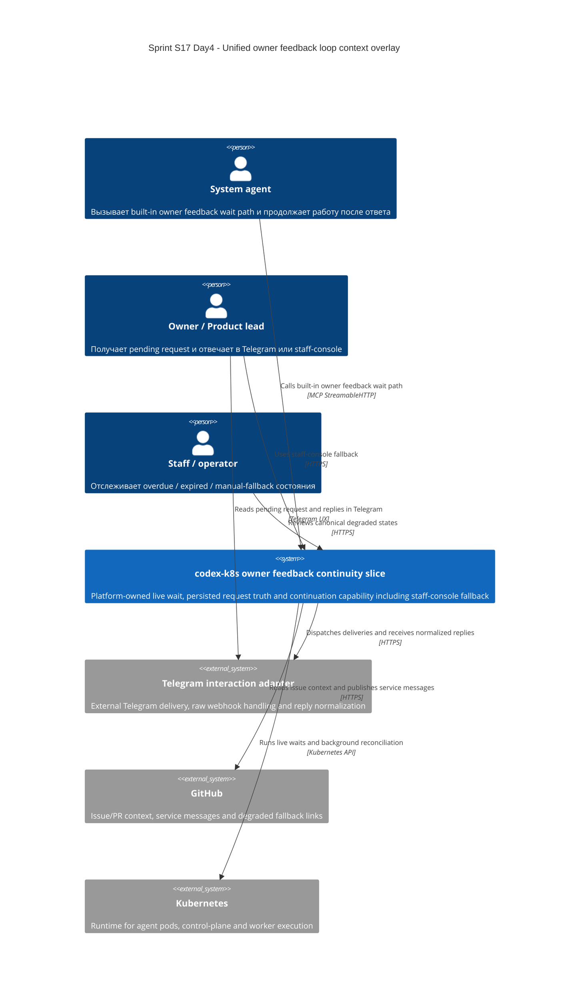

# C4 Context: Sprint S17 Day 4 unified owner feedback loop

## TL;DR
- Unified owner feedback loop остаётся platform capability внутри `codex-k8s`, а не Telegram-first contour и не отдельная внешняя система.
- Staff-console fallback входит в platform-owned slice, а Telegram остаётся первым внешним channel path поверх того же persisted truth.

## Диаграмма (Mermaid C4Context)

## Пояснения
- Staff-console fallback materializes как часть platform-owned system, а не как второй внешний канал с собственной семантикой.
- Telegram adapter остаётся external transport contour: raw transport/webhook detail не переопределяет domain meaning request states.
- GitHub остаётся context and fallback channel для ссылок, service messages и degraded-path коммуникации, но не primary accepted-response path.

## Внешние зависимости
- Telegram interaction adapter: первый внешний owner-facing channel для pending inbox и reply normalization.
- GitHub: context, traceability и service messages.
- Kubernetes: runtime substrate для same-session wait, background jobs и lease retention.
