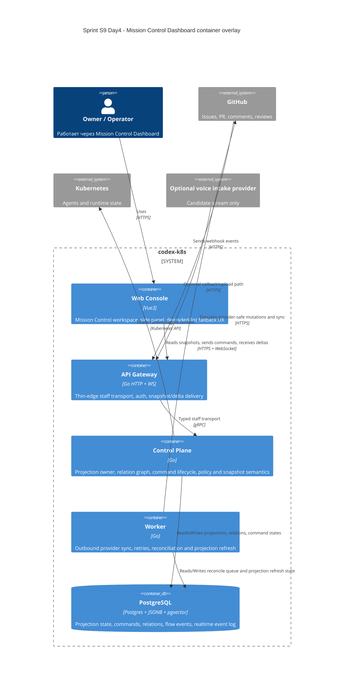

# C4 Container: Sprint S9 Day 4 Mission Control Dashboard

## TL;DR
- Container baseline не меняется: Mission Control Dashboard реализуется внутри существующих `web-console`, `api-gateway`, `control-plane`, `worker`, `postgres`.
- Новая Day4-фиксация касается только ownership-map для projections, commands, provider sync и realtime fallback.

## Диаграмма (Mermaid C4Container)

## Container responsibilities in Mission Control Dashboard

| Container | Role |
|---|---|
| `web-console` | Presentation-only workspace, filters, board/list toggle, stale/degraded indicators |
| `api-gateway` | Staff auth, typed HTTP/WS transport, webhook normalization boundary |
| `control-plane` | Active-set projection owner, relation graph, command admission, lifecycle and policy |
| `worker` | Provider sync/retries, webhook echo reconciliation helpers, projection refresh jobs |
| `postgres` | Единственный persisted coordination layer для projections, commands, relations и realtime event log |

## Runtime и data boundaries
- `web-console` не является каноническим владельцем relation graph или command state.
- `api-gateway` не принимает решений о dedupe, policy или active-set membership.
- `worker` не публикует пользовательские UX-решения: он исполняет и фиксирует reconciliation результат.
- `postgres` остаётся единственной точкой синхронизации между pod; отдельный broker/service для dashboard на Day4 не вводится.

## Handover note for `run:design`
- Уточнить, какие mission-control endpoints и realtime topics reuse current staff transport, а какие потребуют новый typed namespace.
- Зафиксировать точную projection persistence model без нарушения DB ownership `control-plane`.
