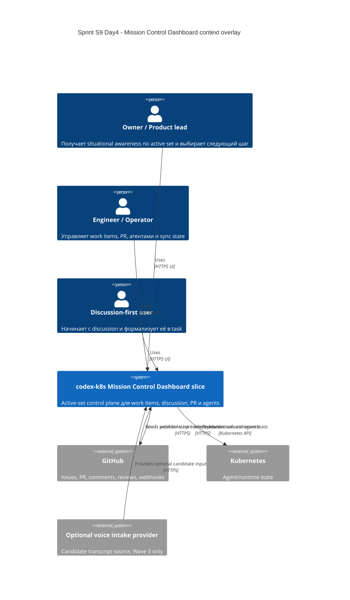

# C4 Context: Sprint S9 Day 4 Mission Control Dashboard

## TL;DR
- Mission Control Dashboard остаётся product slice внутри `codex-k8s`, а не отдельной внешней системой.
- GitHub остаётся provider source-of-truth для review/collaboration, Kubernetes остаётся источником runtime состояния, voice intake — только optional candidate stream.

## Диаграмма (Mermaid C4Context)

## Пояснения
- Mission Control Dashboard не заменяет GitHub как место финального human review и merge decision.
- Runtime/agent состояние приходит из текущих внутренних контуров платформы и агрегируется в active-set projection.
- Optional voice provider не становится обязательной зависимостью для core MVP.
