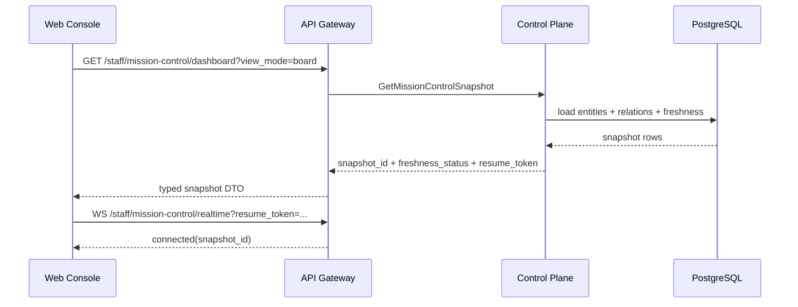
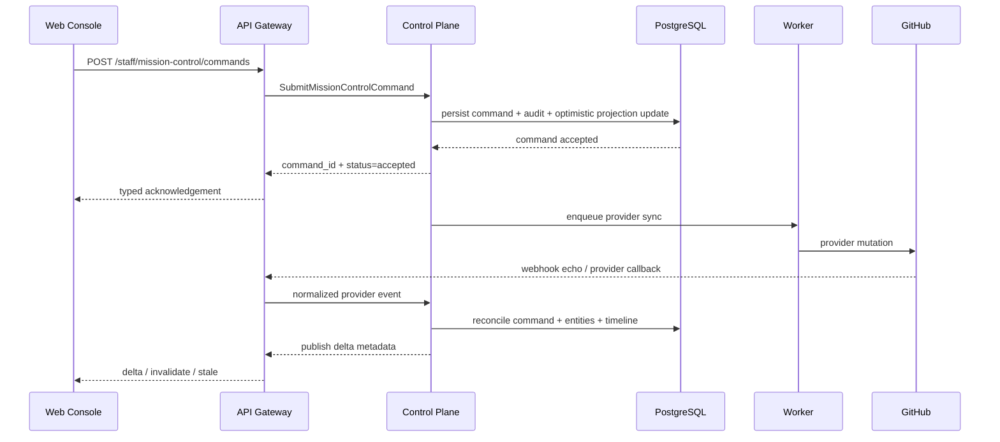
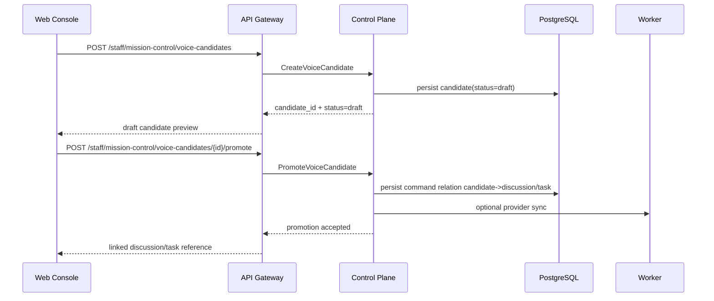

# Detailed Design: Mission Control Dashboard

## TL;DR
- Что меняем: фиксируем implementation-ready design package для Mission Control Dashboard поверх Day4 architecture baseline.
- Почему: `#340` закрепил service boundaries и ownership, но без typed API/data/runtime contracts нельзя безопасно перейти в `run:plan` и `run:dev`.
- Основные компоненты: `web-console` как presentation/state слой, `api-gateway` как thin-edge transport, `control-plane` как owner persisted projection и command admission, `worker` как provider sync/reconciliation executor.
- Риски: drift между snapshot и delta path, неправильный dedupe business intents, UX-деградация при stale realtime и scope leak от voice path.
- План выката: `migrations -> control-plane -> worker -> api-gateway -> web-console`, voice path включается только отдельным feature flag и не блокирует core MVP.

## Цели / Не-цели
### Goals
- Зафиксировать typed design для snapshot, entity details, timeline/comments projection, command lifecycle и realtime degraded path.
- Выбрать persisted projection model, которая сохраняет thin-edge и не уводит каноническую active-set модель во frontend.
- Определить MVP write-path и явно отделить provider deep-link-only действия.
- Подготовить observability, rollout и rollback constraints для будущего `run:dev`.
- Сохранить isolated voice candidate stream как optional continuation без блокировки core dashboard wave.

### Non-goals
- Реализация backend/frontend кода, миграций, OpenAPI/proto и deploy manifests в этом stage.
- Выбор graph/STT/voice libraries и другой premature dependency lock-in.
- Перенос human review, merge decision или provider-specific collaboration из GitHub в staff console.
- Отдельный read-model microservice для Mission Control Dashboard в первой волне.

## Контекст и текущая архитектура
- Source architecture:
  - `docs/architecture/initiatives/s9_mission_control_dashboard/architecture.md`
  - `docs/architecture/adr/ADR-0011-mission-control-dashboard-active-set-projection-and-command-reconciliation.md`
  - `docs/architecture/alternatives/ALT-0003-mission-control-dashboard-projection-and-realtime-trade-offs.md`
- Product baseline:
  - `docs/delivery/epics/s9/prd-s9-day3-mission-control-dashboard.md`
  - `docs/delivery/sprints/s9/sprint_s9_mission_control_dashboard_control_plane.md`
- Service boundaries, которые не меняются:
  - `services/staff/web-console` не владеет projection policy, dedupe или reconciliation state.
  - `services/external/api-gateway` остаётся thin-edge: auth, validation, transport mapping, realtime transport termination.
  - `services/internal/control-plane` владеет persisted active-set projection, relation graph, timeline mirror, command admission и command state transitions.
  - `services/jobs/worker` владеет outbound provider mutations, retries, replay-safe reconciliation и background rebuild jobs.

## Предлагаемый дизайн (high-level)
### Design choice: hybrid persisted projection
- Выбран гибридный persisted model:
  - typed primary tables для `entities`, `relations`, `timeline`, `commands`, `voice_candidates`;
  - JSONB payload-поля для card/detail/timeline fragments, чтобы не раздувать transport-схему колонками для каждого widget.
- Почему не full JSON document:
  - сложно обеспечить relation queries, dedupe и targeted refresh без повторной полной пересборки документа.
- Почему не fully normalized without payload cache:
  - возрастает стоимость UI-specific assembly для card/detail/timeline и усложняется evolution transport DTO.
- Компромисс:
  - канонические ключи, статусы и индексы остаются typed;
  - presentation-friendly fragments хранятся как versioned JSONB under `control-plane` ownership.

### Interaction model
- Initial load:
  - UI всегда начинает с HTTP snapshot и получает `snapshot_id`, `freshness_status`, `realtime_resume_token`.
  - `board` и `list` используют один snapshot contract; различие только в `view_mode`.
- Side panel:
  - детали сущности читаются отдельным typed details endpoint;
  - timeline/comments, relations и allowed actions отдаются вместе с entity details.
- Realtime:
  - после snapshot UI открывает realtime stream и принимает `delta`, `invalidate`, `stale`, `degraded`, `resync_required`.
  - delta никогда не заменяет полный snapshot contract.
- Explicit refresh:
  - при stale/degraded UI повторно вызывает snapshot/details endpoints и не требует отдельной write-команды.

### MVP inline write-path
- Inline write path в первой реализации допускает только typed команды:
  - `discussion.create`
  - `work_item.create`
  - `discussion.formalize`
  - `stage.next_step.execute`
  - `command.retry_sync` (operator-only, после failure/degraded diagnosis)
- Все inline команды проходят одинаковый admission path:
  - validate -> persist command -> acknowledge -> enqueue worker sync -> reconcile by webhook/provider outcome.
- Для approval-gated действий:
  - `stage.next_step.execute` может завершать admission со статусом `pending_approval`;
  - в этом состоянии `control-plane` уже создал audit/approval record, но `worker` и provider mutations ещё не запускаются;
  - только после approval decision `approved` команда переводится в `queued`.

### Provider deep-link-only actions в MVP
- В staff console не попадают в inline write path и остаются provider deep-link-only:
  - PR review, merge, rebase, force-push;
  - inline reply/edit/delete provider comments;
  - reviewer/assignee management в provider UI;
  - issue/PR close-reopen и label editing, если действие не выражено как platform-safe `stage.next_step.execute`;
  - любые destructive provider actions без existing policy-safe command contract.
- Причина:
  - эти действия уже имеют provider-specific policy, audit semantics и higher blast radius, а безопасный typed command contract для них не подтверждён в scope Sprint S9.

## Core flows
### Flow 1: Dashboard snapshot + realtime attach

### Flow 2: Inline command -> provider sync -> reconciliation

### Flow 3: Voice candidate draft -> promotion

## UX and state rules
### Snapshot and stale behavior
- `freshness_status` значения:
  - `fresh`
  - `stale`
  - `degraded`
- UI behavior:
  - `fresh`: board/list и side panel работают без ограничений.
  - `stale`: показать banner, разрешить navigation и commands, но пометить timeline/actions как potentially outdated.
  - `degraded`: переключить default CTA на explicit refresh и list fallback, а risky inline commands показывать только если action policy помечена как `allowed_when_degraded=true`.

### Command status behavior
- UX-статусы равны доменным статусам и не конвертируются на edge:
  - `accepted`
  - `pending_approval`
  - `queued`
  - `pending_sync`
  - `reconciled`
  - `failed`
  - `blocked`
  - `cancelled`
- Правила:
  - `accepted` и `queued` допускаются только как краткоживущие acknowledgement states.
  - `pending_approval` означает, что команда принята в ledger, но ждёт owner decision и ещё не выполняет side effects.
  - `pending_sync` означает, что provider outcome ещё не подтверждён.
  - `reconciled` фиксирует успешную консистентную запись provider outcome в projection.
  - `failed` всегда несёт typed `failure_reason`.
  - `blocked` используется для policy denial, stale precondition failure или approval decision `denied|expired`, но не для состояния ожидания.

### Timeline/comments projection
- Timeline panel объединяет:
  - provider comments/reviews/discussion events;
  - platform flow events;
  - command lifecycle events;
  - voice candidate events (если feature enabled).
- Ordering rules:
  - primary key ordering = `occurred_at desc`, secondary tie-breaker = `entry_id desc`;
  - provider and platform entries используют единый RFC3339 timestamp contract;
  - UI не re-sorts локально по source kind.
- Comment body:
  - в MVP provider-originated entries read-only;
  - platform-originated entries могут содержать structured summaries, а не raw provider markdown.

## API/Контракты
- Детализация transport contracts вынесена в:
  - `docs/architecture/initiatives/s9_mission_control_dashboard/api_contract.md`
- Source of truth для будущего `run:dev`:
  - OpenAPI: `services/external/api-gateway/api/server/api.yaml`
  - gRPC: `proto/codexk8s/controlplane/v1/controlplane.proto`
- Contract discipline:
  - HTTP/staff DTO only typed models;
  - gRPC request/response only typed models;
  - realtime envelopes typed and versioned, no `map[string]any`;
  - every polymorphic payload is described as a closed variant set by `entity_kind`, `command_kind`, `source_kind` or `event_kind`.

## Модель данных и миграции
- Детализация сущностей и индексов:
  - `docs/architecture/initiatives/s9_mission_control_dashboard/data_model.md`
- Rollout и rollback constraints:
  - `docs/architecture/initiatives/s9_mission_control_dashboard/migrations_policy.md`
- Ключевой выбор:
  - новый контур projection/timeline/command tables добавляется additive-моделью под owner `control-plane`;
  - destructive schema rewrite существующих platform tables не требуется;
  - write-path включается только после projection backfill/warmup.

## Нефункциональные аспекты
- Надёжность:
  - command persistence и audit происходят в одной транзакции;
  - dedupe опирается на `business_intent_key`, `provider_delivery_id`, `provider_event_key`, `correlation_id`;
  - stale/degraded path остаётся usable даже без realtime.
- Производительность:
  - snapshot target: p95 `<= 5s`;
  - entity details target: p95 `<= 1.5s`;
  - realtime delta propagation target: p95 `<= 3s` после reconcile commit.
- Безопасность:
  - staff JWT + project RBAC;
  - inline commands проверяют role/policy before admission;
  - provider deep-link-only actions не маскируются под local no-op buttons.
- Наблюдаемость:
  - freshness, dedupe, degraded mode и voice isolation публикуются в отдельный metrics/log event set.

## Наблюдаемость (Observability)
- Логи:
  - `mission_control.snapshot.loaded`
  - `mission_control.snapshot.stale_returned`
  - `mission_control.command.accepted`
  - `mission_control.command.reconciled`
  - `mission_control.command.failed`
  - `mission_control.command.deduped`
  - `mission_control.realtime.degraded`
  - `mission_control.voice_candidate.promoted`
- Метрики:
  - `mission_control_snapshot_latency_ms`
  - `mission_control_entity_details_latency_ms`
  - `mission_control_command_total{kind,status}`
  - `mission_control_command_dedupe_total{reason}`
  - `mission_control_realtime_degraded_total`
  - `mission_control_snapshot_stale_total`
  - `mission_control_voice_candidate_total{status}`
- Трейсы:
  - `staff-http -> control-plane-grpc -> postgres`
  - `worker reconcile -> provider client -> webhook ingest -> reconcile`
- Дашборды/алерты:
  - alert, если `command_dedupe_total{reason="duplicate_delivery"}` растёт выше baseline;
  - alert, если `realtime_degraded_total` растёт 3 окна подряд;
  - alert, если snapshot latency нарушает target 2 окна подряд.

## Тестирование
- Юнит:
  - command state machine;
  - dedupe/business-intent guard;
  - degraded-mode policy.
- Интеграция:
  - repository tests на projection queries, relation joins и timeline ordering;
  - worker reconciliation tests на duplicate webhook/provider echo.
- Contract:
  - OpenAPI schema validation;
  - gRPC caster/mapping tests;
  - realtime envelope schema tests.
- E2E / scenario:
  - `active-set landing`
  - `discussion -> formalize`
  - `command -> webhook echo dedupe`
  - `realtime degraded -> explicit refresh -> list fallback`
  - `voice disabled path`.
- Security checks:
  - forbidden inline command;
  - stale/degraded restricted action;
  - project boundary leak.

## План выката (Rollout)
- На этапе `run:design` runtime не меняется.
- Целевой rollout для `run:dev`:
  1. DB migrations и индексы под owner `control-plane`.
  2. Control-plane repositories/use-cases for projection, timeline, commands, voice candidates.
  3. Worker jobs for backfill, provider sync and reconcile retry.
  4. API gateway OpenAPI handlers + realtime endpoint.
  5. Web-console page/state integration.
- Feature flags:
  - `CODEXK8S_MISSION_CONTROL_WARMUP_VERIFIED`
  - `CODEXK8S_MISSION_CONTROL_WRITE_PATH_ENABLED`
  - `CODEXK8S_MISSION_CONTROL_VOICE_ENABLED`
- Rollout discipline:
  - read-side остаётся always-on при готовой схеме и доменном сервисе;
  - write-path разрешается только после projection warmup verification.

## План отката (Rollback)
- Триггеры:
  - sustained snapshot latency violation;
  - reconciliation correctness ниже `NFR-337-03`;
  - repeated degraded state without recovery;
  - provider mutation incidents on inline write path.
- Шаги:
  1. выключить `CODEXK8S_MISSION_CONTROL_WRITE_PATH_ENABLED` или вернуть read-only mode;
  2. отключить realtime stream route при необходимости и оставить explicit refresh snapshot path;
  3. отключить `CODEXK8S_MISSION_CONTROL_VOICE_ENABLED`, не трогая core dashboard read path;
  4. сохранить projection/timeline/command tables для postmortem и replay-safe retry.
- Проверка успеха:
  - snapshot и entity details доступны в read-only режиме;
  - новые provider mutations остановлены;
  - audit trail и command ledger сохранены для разборов.

## Альтернативы и почему отвергли
- Client-side composition без persisted projection отвергнута:
  - ломает boundary integrity и ухудшает доказуемость dedupe.
- Отдельный dashboard service/read-model service на этом этапе отвергнут:
  - добавляет premature service split и новый consistency contour.
- Full inline provider collaboration (comment/review/merge) отвергнута:
  - нет безопасного typed command contract и policy evidence для MVP.

## Runtime impact / Migration impact
- Runtime impact (`run:design`): отсутствует, change-set ограничен markdown.
- Migration impact (`run:dev`):
  - новые projection/timeline/command/voice tables;
  - backfill/warmup job перед enable write-path;
  - rollout order `migrations -> control-plane -> worker -> api-gateway -> web-console`.

## Acceptance criteria для handover в `run:plan`
- [x] Подготовлены `design_doc`, `api_contract`, `data_model`, `migrations_policy`.
- [x] Зафиксированы typed contracts для snapshot, entity details, commands, realtime и optional voice candidate path.
- [x] Явно отделены inline write-path и provider deep-link-only actions.
- [x] Описаны rollout order, rollback constraints и observability events для freshness/dedupe/degraded mode.
- [x] Подготовлена continuity issue `#363` для `run:plan`.
