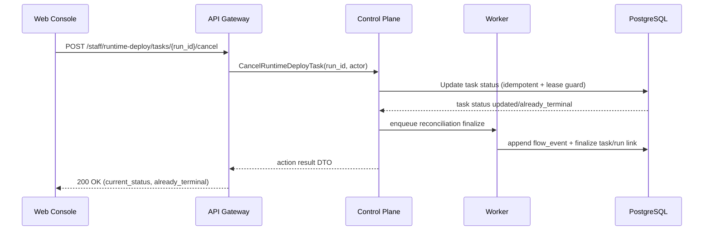
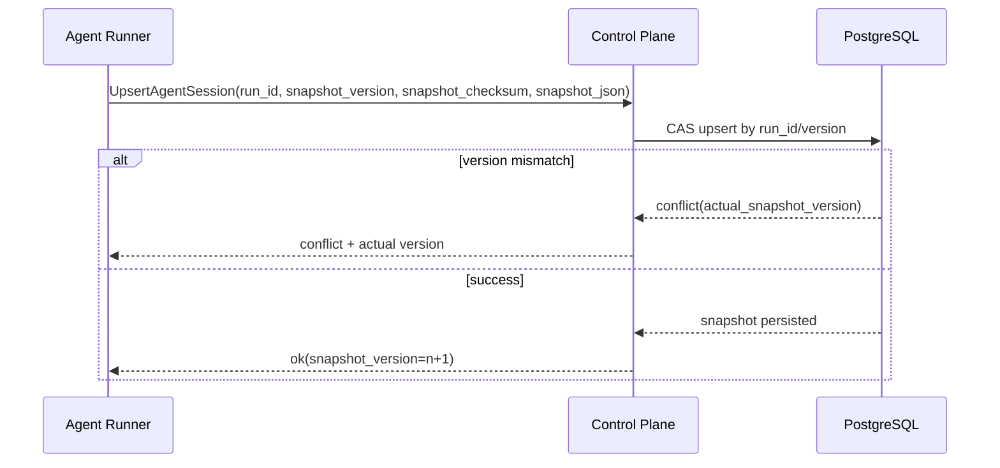

# Detailed Design: Sprint S7 MVP readiness gap closure

## TL;DR
- Что меняем: формализуем implementation-ready design package для потоков `S7-E01..S7-E18` с impact на контракты и persisted-state.
- Почему: архитектурный этап (`#222`) зафиксировал границы и ownership, но без typed design-решений переход в `run:plan` и `run:dev` остаётся рискованным.
- Основные компоненты: `web-console` (presentation), `api-gateway` (thin-edge contract adapters), `control-plane` (domain/state ownership), `worker` (idempotent reconciliation), `agent-runner` (snapshot lifecycle).
- Риски: drift между policy и runtime, race-condition при финализации run и cancel/stop deploy tasks, потеря консистентности snapshot при retries.
- План выката (`run:dev`): `migrations -> control-plane/worker -> api-gateway -> web-console`, без runtime mutation на `run:design`.

## Цели / Не-цели
### Goals
- Зафиксировать typed transport decisions по потокам `S7-E06`, `S7-E07`, `S7-E09`, `S7-E10`, `S7-E13`, `S7-E16`, `S7-E17`.
- Подготовить data-model и migrations-policy для потоков с persisted-state impact.
- Описать error-handling и idempotency-контракты для reliability-потоков.
- Зафиксировать quality-gates и handover-контракт в `run:plan`.

### Non-goals
- Реализация кода сервисов, миграций и UI.
- Изменение taxonomy `run:*`, `state:*`, `need:*` вне утверждённых S7 потоков.
- Пересмотр service boundaries, утверждённых в `ADR-0010`.

## Контекст и текущая архитектура
- Source architecture:
  - `docs/architecture/s7_mvp_readiness_gap_closure_architecture.md`
  - `docs/architecture/adr/ADR-0010-s7-mvp-readiness-stream-boundaries-and-parity-gate.md`
- Stream decomposition baseline:
  - `docs/delivery/epics/s7/prd-s7-day3-mvp-readiness-gap-closure.md`
- Design constraints:
  - markdown-only scope на `run:design`;
  - strict thin-edge rule для `services/external/*` и `services/staff/*`;
  - error mapping только на transport boundary.

## Предлагаемый дизайн (high-level)
### Component boundaries
- `web-console`:
  - удаляет non-MVP controls;
  - использует только typed DTO из OpenAPI codegen;
  - не содержит доменных решений по stage/policy.
- `api-gateway`:
  - принимает/возвращает typed DTO;
  - выполняет validation/auth/routing;
  - не хранит domain state.
- `control-plane`:
  - владеет stage resolver, runtime deploy state-machine, run finalization правилами, session snapshot consistency.
- `worker`:
  - реализует idempotent execution для runtime operations и completion events.
- `agent-runner`:
  - формирует callback payload для snapshot upsert/rewrite по новым reliability-инвариантам.

### Contract decisions by impact stream
| Stream | Typed design-решение | Error/idempotency контракт | Риск-mitigation |
|---|---|---|---|
| `S7-E06` Agents settings de-scope | Из staff DTO удаляются `runtime_mode`/`prompt_locale`; для системных ролей применяются platform defaults | Передача удалённых полей -> `invalid_argument` c `deprecated_field` | Единый defaults-resolver в `control-plane`, UI/API cleanup синхронно |
| `S7-E07` Prompt source repo-only | Selector `repo|db` исключается из staff API и runtime payload; effective source детерминируется как `repo` | Отсутствует шаблон в repo -> `failed_precondition` + typed details (`template_key`, `repository_path`) | Единый policy source в `control-plane` + audit event на fallback/error |
| `S7-E09` Runs UX namespace delete | Переиспользуется typed endpoint `DELETE /api/v1/staff/runs/{run_id}/namespace`; UI удаляет только колонку run type без ломки контракта | Повторное удаление -> `200` c `already_deleted=true` | Confirm UX + RBAC pre-check + audit trail |
| `S7-E10` Runtime deploy cancel/stop | Добавляются typed staff actions `cancel/stop` для `runtime_deploy_tasks`; внутренние RPC/DTO симметричны | Повтор action в terminal state -> `200` c `already_terminal=true`; конфликт lease -> `failed_precondition` | Idempotent state transitions + lease-aware guard |
| `S7-E13` multi-stage revise policy coverage | Stage resolver расширяется детерминированными ветками `run:doc-audit|qa|release|postdeploy|ops|self-improve:revise` без нового public endpoint | Ambiguous stage set -> `failed_precondition` + mandatory `need:input` | Единый precedence chain PR->Issue->run_context->flow_events |
| `S7-E16` `run:intake:revise` false-failed fix | Финализация run нормализуется через typed terminal metadata и precedence rule (`success > failed` при duplicate callbacks) | Duplicate terminal callback -> idempotent no-op c `already_finalized=true` | Terminal state rank + monotonic finalization event sequence |
| `S7-E17` Self-improve snapshot reliability | Callback contract `UpsertAgentSession` расширяется полями version/checksum для rewrite-safe upsert | Version mismatch -> `conflict` c `actual_snapshot_version` | CAS-like upsert semantics + retry-safe read-after-write |

## API/Контракты
- Детализация transport/gRPC: `docs/architecture/s7_mvp_readiness_gap_closure_api_contract.md`.
- Source of truth для реализации в `run:dev`:
  - OpenAPI: `services/external/api-gateway/api/server/api.yaml`;
  - gRPC: `proto/codexk8s/controlplane/v1/controlplane.proto`.
- Mapping policy:
  - HTTP DTO <-> gRPC DTO через явные casters;
  - domain errors конвертируются только в HTTP error handler / gRPC interceptor.

## Модель данных и миграции
- Детализация сущностей: `docs/architecture/s7_mvp_readiness_gap_closure_data_model.md`.
- Миграционный подход: `docs/architecture/s7_mvp_readiness_gap_closure_migrations_policy.md`.
- Потоки с data/runtime impact:
  - `S7-E10` (runtime deploy task state transitions),
  - `S7-E16` (run terminalization consistency),
  - `S7-E17` (session snapshot rewrite reliability),
  - `S7-E07` (prompt source normalization policy).

## Сценарии (Sequence diagrams)

## Нефункциональные аспекты
- Надёжность:
  - idempotent transitions для cancel/stop и run finalization;
  - retry-safe snapshot upsert/rewrite.
- Производительность:
  - p95 для runtime action endpoints <= 400ms при non-contended lease;
  - snapshot upsert/read path <= 250ms p95.
- Безопасность:
  - actions доступны только staff principal с RBAC;
  - audit обязателен для destructive/terminal операций.
- Наблюдаемость:
  - event-first telemetry по `flow_events` и runtime task logs.

## Наблюдаемость (Observability)
- Логи:
  - `runtime_deploy.task.cancel_requested`
  - `runtime_deploy.task.stop_requested`
  - `run.finalization.normalized`
  - `agent_session.snapshot.upserted`
  - `agent_session.snapshot.conflict`
- Метрики:
  - `runtime_deploy_action_total{action,status}`
  - `run_terminalization_conflict_total`
  - `agent_session_snapshot_conflict_total`
  - `stage_resolver_revise_total{stage,result}`
- Трейсы:
  - `staff-http -> cp-grpc -> repository -> postgres`.
- Алерты:
  - spike `run_terminalization_conflict_total` > baseline;
  - `agent_session_snapshot_conflict_total` > threshold в 15m.

## Тестирование
- На этапе `run:design`: checks ограничены markdown consistency и traceability sync.
- План тестирования для `run:dev`:
  - unit: stage resolver, runtime deploy action guards, terminal precedence rules;
  - integration: repository migrations/backfill/CAS snapshot upsert;
  - contract: OpenAPI/proto mapping + error contract checks;
  - e2e: `run:<stage>:revise` transition для `doc-audit|qa|release|postdeploy|ops|self-improve`, cancel/stop flows, self-improve snapshot rewrite.

## План выката (Rollout)
- `run:design`: runtime changes отсутствуют.
- Целевой rollout в `run:dev`:
  1. DB migrations + prechecks.
  2. `control-plane`/`worker` domain updates.
  3. `api-gateway` transport/codegen sync.
  4. `web-console` cleanup + typed client adoption.
- Sequencing guard:
  - release кода только после `coverage_ratio == 1.0` по parity-gate.

## План отката (Rollback)
- Триггеры:
  - рост ошибок `failed_precondition/conflict` выше порога;
  - regression в terminal status consistency.
- Шаги:
  1. Отключить новые action paths feature-flag конфигурацией.
  2. Вернуть UI к read-only поведению для cancel/stop controls.
  3. Оставить additive columns, rollback только write-path.
- Проверка успеха:
  - восстановлена стабильность run statuses;
  - отсутствуют новые snapshot conflicts сверх baseline.

## Альтернативы и почему отвергли
- Альтернатива A: выполнять все изменения только на UI/доках без корректировки internal contracts.
  - Отвергнуто: не устраняет race-condition и false-failed class.
- Альтернатива B: полный redesign runtime/state моделей до `run:plan`.
  - Отвергнуто: избыточный scope для S7 и риск срыва sequencing.

## Context7 и dependency baseline
- Через Context7 подтверждены:
  - `kin-openapi` (`/getkin/kin-openapi`) как релевантный runtime validation path для OpenAPI request/response.
  - `monaco-editor` (`/microsoft/monaco-editor`) как baseline API для `createDiffEditor`/`setModel`.
- По результату S7 Day5 новые внешние зависимости не требуются.
- Актуальные pinned версии остаются из каталога зависимостей:
  - `github.com/getkin/kin-openapi` `v0.133.0`;
  - `monaco-editor` `^0.55.1`.

## Acceptance criteria для handover в `run:plan`
- [x] Подготовлены `design_doc`, `api_contract`, `data_model`, `migrations_policy` для Sprint S7.
- [x] Для `S7-E06/S7-E07/S7-E09/S7-E10/S7-E13/S7-E16/S7-E17` зафиксированы typed contract decisions и risk-mitigation.
- [x] Для потоков с persisted-state impact зафиксированы migration/rollback правила.
- [x] Синхронизированы `issue_map`, `requirements_traceability`, sprint/epic docs.
- [x] Подготовлен handover в `run:plan` c follow-up issue `#241`.

## Апрув
- request_id: owner-2026-03-02-issue-238-design
- Решение: pending
- Комментарий: Ожидается review design-package и подтверждение перехода в `run:plan`.
