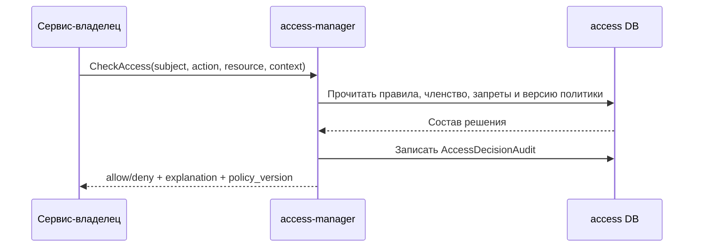
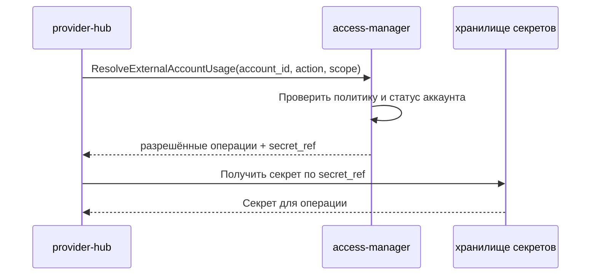

# Детальный дизайн: домен доступа и аккаунтов

## TL;DR

- Что меняем: вводим `access-manager` как единственный сервис-владелец организаций, пользователей, групп, членства, allowlist, внешних аккаунтов как субъектов политики и решений доступа.
- Почему: остальные сервисы должны запрашивать доступ и разрешение на использование аккаунта через контракт, а не хранить локальные правила и токены.
- Основные компоненты: доменная БД `access-manager`, gRPC API, outbox событий, путь чтения для операторской консоли, интеграция с SSO/OIDC и хранилищем секретов.
- Риски: смешать внешний аккаунт как субъект политики с провайдерским зеркалом, зацементировать одноорганизационный режим, хранить секреты в БД.
- План выката: сначала основа организаций и членства, затем вход и allowlist, затем внешние аккаунты, затем вычисление доступа и аудит.

## Цели

- Зафиксировать сервисную границу `access-manager`.
- Подготовить реализацию домена без старого фрагмента входа и доступа.
- Дать другим сервисам один авторитетный способ проверки доступа.
- Разделить политику доступа, операции провайдера и Human gate.

## Что не входит

- Не реализовывать зеркало провайдера, webhook и лимиты провайдера внутри `access-manager`.
- Не проектировать релизные Human gate как часть домена доступа.
- Не хранить секреты в PostgreSQL.
- Не проектировать полный коммерческий биллинг для организаций.

## Граница сервиса

| Владеет `access-manager` | Не владеет |
|---|---|
| Организации, пользователи, группы, членство, allowlist, внешние аккаунты как субъекты политики, правила доступа, аудит решений. | Проекты, репозитории, зеркало провайдера, webhook, лимиты провайдера, агентные запуски, слоты, задания, уведомления, биллинг. |

Внешний аккаунт в этом домене — это управляемый субъект политики и ссылка на секрет. `provider-hub` использует такой аккаунт для провайдерских операций, но не становится владельцем его области применения, разрешённых действий и секрета.

## Компоненты

| Компонент | Назначение |
|---|---|
| `access-manager` | Сервис-владелец домена доступа. |
| БД `access-manager` | Каноническое состояние организаций, пользователей, групп, членства, правил и внешних аккаунтов. |
| Адаптер SSO/OIDC | Проверяет внешний вход и передаёт идентичность пользователя в доменную команду создания или связывания профиля. |
| Адаптер ссылок на секреты | Создаёт и проверяет ссылки на секреты без раскрытия значения. |
| Каталог поставщиков и действий | Хранит поставщиков внешних аккаунтов и каталог действий для правил доступа. |
| Outbox-доставщик | Забирает `access.*` события после фиксации транзакции, ставит короткую аренду записи, повторяет временные ошибки с задержкой, останавливает повтор для постоянных ошибок и передаёт событие в подключённый канал публикации. |
| Операторский путь чтения | Даёт пользовательскому интерфейсу граф членства, состояния `pending`/`blocked` и объяснение доступа. |

## Основные потоки

### Первый вход пользователя

### Проверка доступа сервисом-владельцем

### Использование внешнего аккаунта

## Конкурентные изменения

Организация, пользователь, группа, членство, правило доступа и внешний аккаунт имеют версию. Команды изменения передают ожидаемую версию или идемпотентный ключ. `access-manager` выполняет проверку инвариантов и изменение в одной короткой транзакции.

Долгие операции, например ожидание повторной авторизации внешнего аккаунта, не держат SQL-блокировку. Они оформляются статусом доменной сущности и, если нужно, отдельным запросом решения через `interaction-hub`.

## Доменные события

События проектируются по агрегатам и доменным переходам, а не как слепой CRUD по таблицам. Для каждой сущности должны быть события создания и изменения, а для жизненного цикла — отдельные события `disabled`, `suspended`, `archived` или `status_changed`, если это несёт бизнес-смысл.

`access-manager` записывает событие в outbox в той же транзакции, где меняет агрегат и фиксирует идемпотентный след команды. Доставщик забирает непубликованные события через `FOR UPDATE SKIP LOCKED`, увеличивает номер попытки, ставит `locked_until` и публикует событие минимум один раз. Отметка успешной или неуспешной попытки привязана к номеру попытки, поэтому поздний обработчик не может снять аренду с уже повторно забранной записи. Подписчики обязаны дедуплицировать событие по `event_id`, потому что повторная публикация допустима при истечении аренды или сбое канала.

Канал публикации обязан классифицировать сбой как временный или постоянный. Временный сбой возвращает событие в повтор с задержкой. Постоянный сбой, например несовместимая схема или неисправимая конфигурация канала, помечает событие как окончательно не доставленное и требует операторского разбора, а не бесконечного повтора.

В текущем сервисном срезе реализован PostgreSQL outbox внутри `access-manager` и интерфейс канала публикации. Общий PostgreSQL event log, fan-out на несколько потребителей и inbox/checkpoint потребителей остаются обязательным следующим срезом до появления реальных межсервисных подписчиков на `access.*` события.

Диагностический канал публикации в лог имеет явный тип `diagnostic-log-lossy`, включается только с отдельным подтверждающим флагом и после записи в лог помечает событие опубликованным. Этот режим допустим только для одноразовой диагностики механики доставщика и не является MVP-доставкой. Он запрещён в контурах, где событие должно уйти реальным межсервисным потребителям.

| Событие | Когда публикуется |
|---|---|
| `access.organization.created` | Создана организация. |
| `access.organization.updated` | Изменены безопасные поля организации. |
| `access.organization.suspended` | Организация приостановлена. |
| `access.organization.archived` | Организация архивирована. |
| `access.user.created` | Пользователь создан. |
| `access.user.updated` | Изменены безопасные поля пользователя. |
| `access.user.identity_linked` | Пользователь связан с внешней идентичностью. |
| `access.user.status_changed` | Изменён статус пользователя. |
| `access.allowlist_entry.created` | Создана запись allowlist. |
| `access.allowlist_entry.updated` | Изменена запись allowlist. |
| `access.allowlist_entry.disabled` | Отключена запись allowlist. |
| `access.group.created` | Создана группа. |
| `access.group.updated` | Изменена группа или её иерархия. |
| `access.group.disabled` | Группа отключена. |
| `access.membership.created` | Создано членство. |
| `access.membership.updated` | Изменено членство. |
| `access.membership.disabled` | Членство отключено. |
| `access.external_provider.created` | Создан поставщик внешних аккаунтов. |
| `access.external_provider.updated` | Изменён поставщик внешних аккаунтов. |
| `access.external_provider.disabled` | Поставщик внешних аккаунтов отключён. |
| `access.external_account.created` | Создан внешний аккаунт. |
| `access.external_account.updated` | Изменены безопасные поля внешнего аккаунта. |
| `access.external_account.status_changed` | Изменён статус внешнего аккаунта. |
| `access.external_account.secret_ref_changed` | Изменилась ссылка на секрет внешнего аккаунта. |
| `access.external_account_binding.created` | Создана привязка внешнего аккаунта к области использования. |
| `access.external_account_binding.updated` | Изменена привязка внешнего аккаунта. |
| `access.external_account_binding.disabled` | Привязка внешнего аккаунта отключена. |
| `access.secret_binding_ref.created` | Создана ссылка на секрет без раскрытия значения. |
| `access.secret_binding_ref.rotated` | Ссылка на секрет ротирована. |
| `access.secret_binding_ref.disabled` | Ссылка на секрет отключена. |
| `access.access_action.created` | Создано действие из каталога прав. |
| `access.access_action.updated` | Изменено действие из каталога прав. |
| `access.access_action.disabled` | Действие из каталога прав отключено. |
| `access.access_rule.created` | Создано правило доступа. |
| `access.access_rule.updated` | Изменено правило доступа. |
| `access.access_rule.disabled` | Правило доступа отключено. |
| `access.access_decision.recorded` | Зафиксировано критичное решение доступа, если политика требует публикации такого события. |

## Наблюдаемость

- Метрики: всего пользователей, активных пользователей, пользователей в состояниях `pending` и `blocked`, количество входов, конфликтов версий, запрещённых решений, ошибок ссылок на секреты, ошибок SSO/OIDC.
- Аудит: все команды изменения и все критичные `CheckAccess` решения.
- Логи: только идентификаторы запроса, команды, агрегата и субъекта; без секретов, токенов, email, имён, ссылок на секреты и лишнего тела запроса.
- Операторские события: доступ ожидает решения, пользователь заблокирован, внешний аккаунт требует повторной авторизации, сработал явный запрет.

## Тестирование

- Модульные: вычисление итогового доступа, явный запрет, наследование, версии агрегатов.
- Интеграционные: создание или связывание пользователя через тестовый OIDC, allowlist, привязка внешнего аккаунта, outbox.
- Контрактные: gRPC методы, модель ошибок, идемпотентность команд.
- Безопасность: секреты не попадают в БД, логи, тело аудита и пользовательский интерфейс.

## Апрув

- request_id: `owner-2026-04-26-wave6-4-access-domain`
- Решение: approved
- Комментарий: дизайн домена доступа согласован как целевое состояние.
