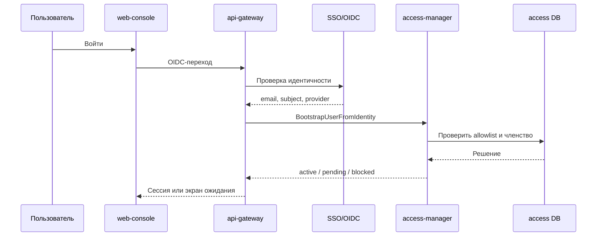
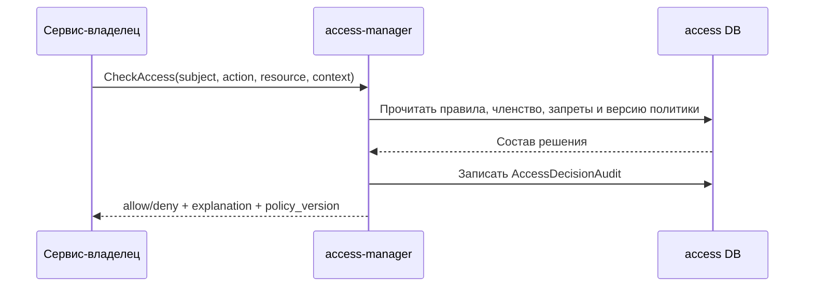
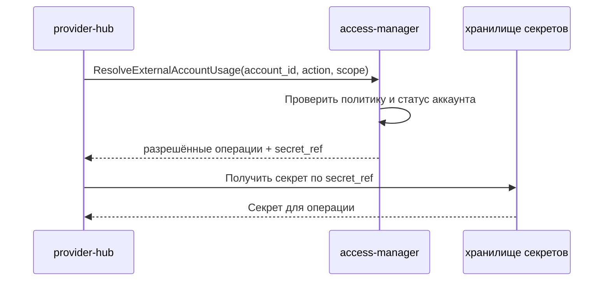

# Детальный дизайн: домен доступа и аккаунтов

## TL;DR

- Что меняем: вводим `access-manager` как единственный сервис-владелец организаций, пользователей, групп, членства, allowlist, внешних аккаунтов как субъектов политики и решений доступа.
- Почему: остальные сервисы должны запрашивать доступ и разрешение на использование аккаунта через контракт, а не хранить локальные правила и токены.
- Основные компоненты: доменная БД `access-manager`, gRPC API, outbox событий, путь чтения для операторской консоли, интеграция с SSO/OIDC и хранилищем секретов.
- Риски: смешать внешний аккаунт как субъект политики с провайдерским зеркалом, зацементировать одноорганизационный режим, хранить секреты в БД.
- План выката: сначала основа организаций и членства, затем вход и allowlist, затем внешние аккаунты, затем вычисление доступа и аудит.

## Цели

- Зафиксировать сервисную границу `access-manager`.
- Подготовить реализацию домена без старого фрагмента входа и доступа.
- Дать другим сервисам один авторитетный способ проверки доступа.
- Разделить политику доступа, операции провайдера и Human gate.

## Что не входит

- Не реализовывать зеркало провайдера, webhook и лимиты провайдера внутри `access-manager`.
- Не проектировать релизные Human gate как часть домена доступа.
- Не хранить секреты в PostgreSQL.
- Не проектировать полный коммерческий биллинг для организаций.

## Граница сервиса

| Владеет `access-manager` | Не владеет |
|---|---|
| Организации, пользователи, группы, членство, allowlist, внешние аккаунты как субъекты политики, правила доступа, аудит решений. | Проекты, репозитории, зеркало провайдера, webhook, лимиты провайдера, агентные запуски, слоты, задания, уведомления, биллинг. |

Внешний аккаунт в этом домене — это управляемый субъект политики и ссылка на секрет. `provider-hub` использует такой аккаунт для провайдерских операций, но не становится владельцем его области применения, разрешённых действий и секрета.

## Компоненты

| Компонент | Назначение |
|---|---|
| `access-manager` | Сервис-владелец домена доступа. |
| БД `access-manager` | Каноническое состояние организаций, пользователей, групп, членства, правил и внешних аккаунтов. |
| Адаптер SSO/OIDC | Проверяет внешний вход и передаёт идентичность пользователя в доменную команду создания или связывания профиля. |
| Адаптер ссылок на секреты | Создаёт и проверяет ссылки на секреты без раскрытия значения. |
| Outbox-доставщик | Публикует `access.*` события после фиксации транзакции. |
| Операторский путь чтения | Даёт пользовательскому интерфейсу граф членства, состояния `pending`/`blocked` и объяснение доступа. |

## Основные потоки

### Первый вход пользователя

### Проверка доступа сервисом-владельцем

### Использование внешнего аккаунта

## Конкурентные изменения

Организация, пользователь, группа, членство, правило доступа и внешний аккаунт имеют версию. Команды изменения передают ожидаемую версию или идемпотентный ключ. `access-manager` выполняет проверку инвариантов и изменение в одной короткой транзакции.

Долгие операции, например ожидание повторной авторизации внешнего аккаунта, не держат SQL-блокировку. Они оформляются статусом доменной сущности и, если нужно, отдельным запросом решения через `interaction-hub`.

## Доменные события

| Событие | Когда публикуется |
|---|---|
| `access.organization.created` | Создана организация. |
| `access.organization.archived` | Организация архивирована или отключена. |
| `access.user.bootstrapped` | Пользователь создан или связан с внешней идентичностью. |
| `access.user.status_changed` | Изменён статус пользователя. |
| `access.group.changed` | Создана, изменена или отключена группа. |
| `access.membership.changed` | Изменилось членство пользователя или группы. |
| `access.external_account.changed` | Изменился внешний аккаунт, его статус или область применения. |
| `access.policy.changed` | Изменилось правило доступа. |

## Наблюдаемость

- Метрики: количество входов, пользователей в состояниях `pending` и `blocked`, конфликтов версий, запрещённых решений, ошибок ссылок на секреты, ошибок SSO/OIDC.
- Аудит: все команды изменения и все критичные `CheckAccess` решения.
- Логи: без секретов, токенов, email в сыром виде там, где достаточно маскированного значения.
- Операторские события: доступ ожидает решения, пользователь заблокирован, внешний аккаунт требует повторной авторизации, сработал явный запрет.

## Тестирование

- Модульные: вычисление итогового доступа, явный запрет, наследование, версии агрегатов.
- Интеграционные: создание или связывание пользователя через тестовый OIDC, allowlist, привязка внешнего аккаунта, outbox.
- Контрактные: gRPC методы, модель ошибок, идемпотентность команд.
- Безопасность: секреты не попадают в БД, логи, тело аудита и пользовательский интерфейс.

## Апрув

- request_id: `owner-2026-04-26-wave6-4-access-domain`
- Решение: approved
- Комментарий: дизайн домена доступа согласован как целевое состояние.
