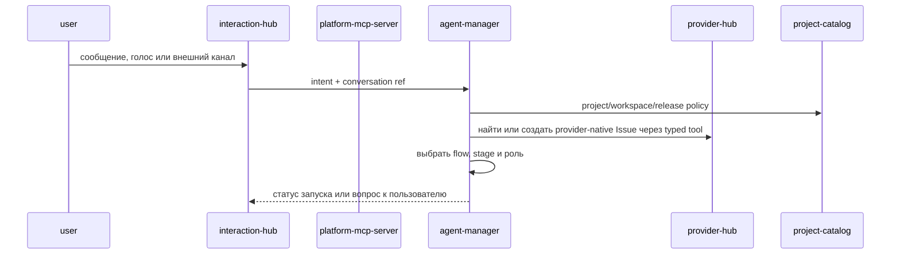
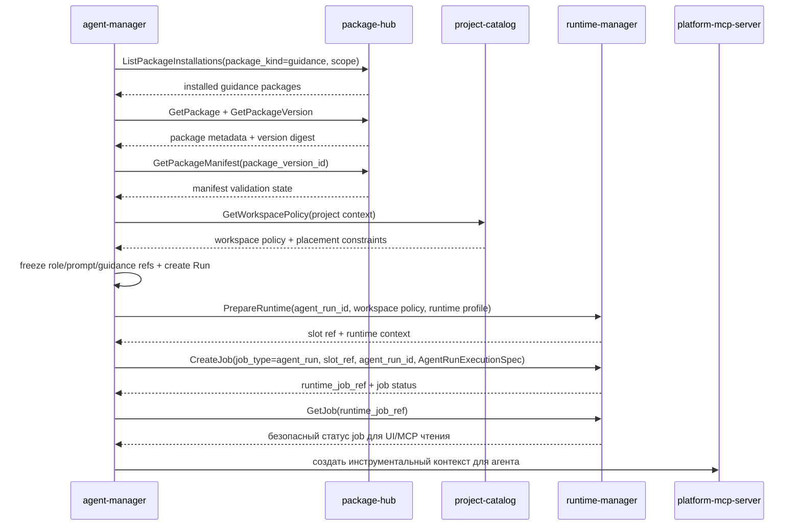
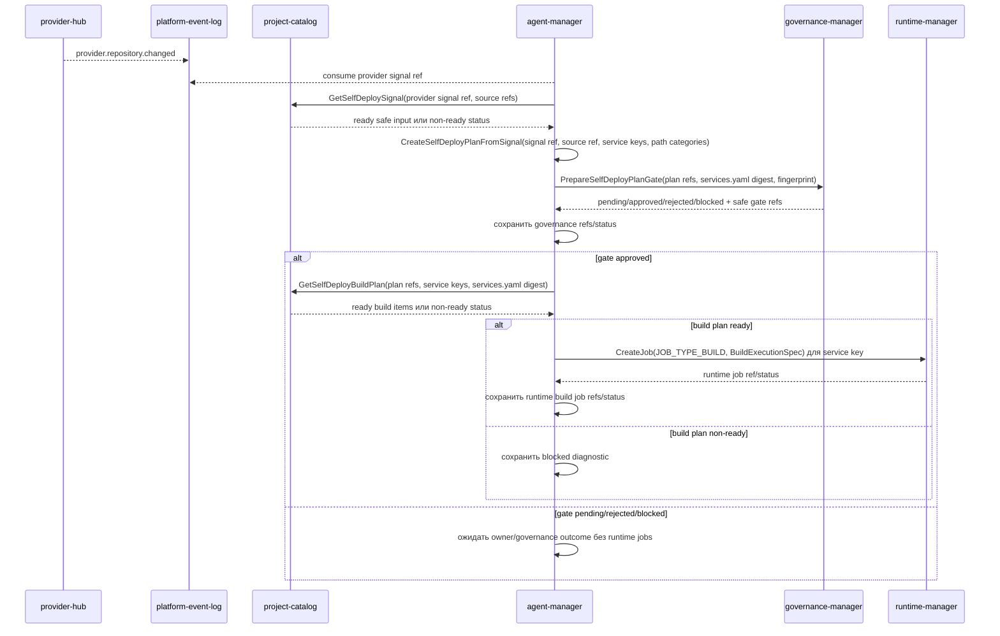
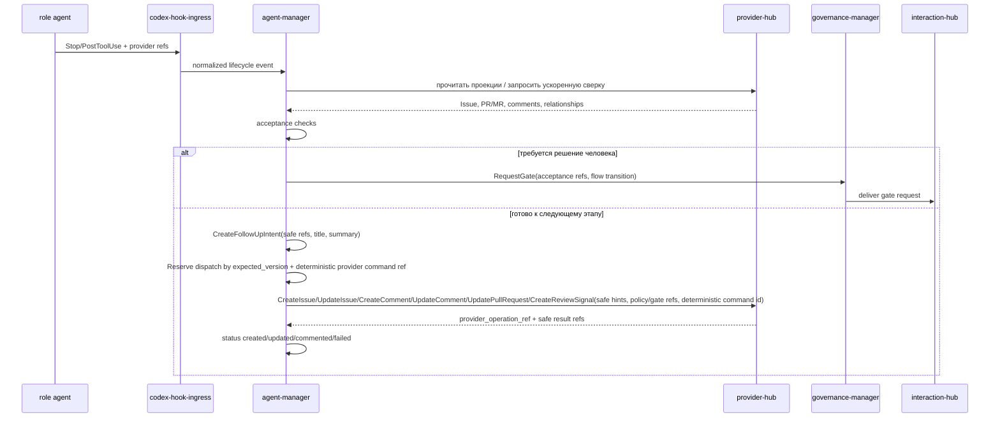

# Детальный дизайн: оркестрация агентов

## TL;DR

- Что меняем: выделяем `agent-manager` как сервис-владелец flow, stage, role, prompt template, session, agent `Run`, безопасной activity timeline, acceptance machine и follow-up задач.
- Почему: агентная работа должна иметь явную state machine и границы, а runtime, provider, package и interaction контуры не должны владеть процессом.
- Основные компоненты: БД `agent-manager`, gRPC API, outbox событий, движок flow, запускатель ролей, рендер prompt, движок приёмки и планировщик follow-up.
- Риски: смешать `Run` со slot/job, начать ходить в GitHub напрямую из управляющего сервиса или скопировать пакетную/проектную истину в agent-домен.

## Цели

- Зафиксировать границу `agent-manager` до контрактов и кода.
- Развести агентную оркестрацию, runtime, provider-native состояние, пакеты и взаимодействия.
- Развести MCP-инструменты и Codex hook events: MCP идёт через `platform-mcp-server`, а lifecycle/permission/tool-result hooks идут через `codex-hook-ingress`.
- Подготовить модель для встроенных и пользовательских ролей.
- Описать, как руководящие пакеты попадают в агентный контекст через package-контур.
- Описать машину приёмки и создание follow-up задач без введения внутренних заменителей `Issue` и `PR/MR`.

## Не-цели

- Не реализовывать код, proto, миграции или UI в стартовом документационном срезе.
- Не проектировать полный интерфейс flow-редактора.
- Не переносить slot, workspace filesystem, platform jobs и Kubernetes-операции в `agent-manager`.
- Не переносить provider-native операции и зеркало `Issue/PR/MR` из `provider-hub`.
- Не переносить диалоги, уведомления и внешние каналы из `interaction-hub`.

## Граница сервиса

| Владеет `agent-manager` | Не владеет |
|---|---|
| Flow, stage, role, stage-role binding, prompt template, prompt version, agent session, agent `Run`, safe activity timeline, acceptance check, acceptance result, follow-up intent, automation trigger binding, agent events и состояние ожидания flow. | Runtime slot, workspace filesystem, platform job, Kubernetes, provider-native проекции и операции, package catalog, package installation, secret value, risk/gate/release decisions, диалоговые ветки, уведомления, внешние каналы, проектная policy как истина, MCP transport, Codex hook transport, сырые tool payload и долгую ops feed hook ingress. |

Главное правило: `agent-manager` отвечает за вопрос «какая агентная работа должна быть выполнена, кем, по какому процессу и что считать готовым». Технический вопрос «где и как выполнить» решает runtime-контур. Вопрос «как записать provider-native артефакт» решает provider-контур. Вопрос «как получить пакет» решает package-контур. Вопрос «нужен ли gate и какое решение принято» решает governance-контур. Вопрос «как доставить запрос человеку» решает interaction-контур.

## Компоненты

| Компонент | Назначение |
|---|---|
| `agent-manager` | Сервис-владелец домена оркестрации агентов. |
| БД `agent-manager` | Версии flow, ролей, prompt template, сессии, `Run`, acceptance, follow-up и outbox. |
| Движок flow | Выбирает этап, переход, обязательные артефакты, роли и gates. |
| Запускатель ролей | Создаёт `Run`, фиксирует версии flow, этапа, роли, prompt и руководящих пакетов, затем запрашивает runtime-запуск. |
| Рендер prompt | Собирает prompt из версии роли, задачи, stage, policy, руководящих пакетов и рабочего контекста. |
| Запись снимков сессии | Фиксирует метаданные Codex session state после turn/checkpoint и обновляет указатель на актуальный снимок. |
| История действий агента | Хранит canonical persistent safe timeline по session/run: tool intent/result, lifecycle, permission, runtime/provider signals, bounded summary, digest, refs и timestamps без raw payload. |
| Движок приёмки | Проверяет артефакты, watermark, статусы provider-native сущностей и условия перехода. |
| Планировщик follow-up | Формирует авторитетное намерение следующей задачи с safe refs/status/summary и dispatch-командой вызывает typed `provider-hub` операции `CreateIssue`, `UpdateIssue`, `CreateComment`, `UpdateComment`, `UpdatePullRequest` или `CreateReviewSignal`; provider-native истина остаётся у `provider-hub`. |
| План self-deploy | Фиксирует pending orchestration state для собственного build/deploy после safe provider/project signal: refs, affected service keys, path categories, expected runtime job types, governance refs и fingerprint без автоматического deploy. |
| Outbox-доставщик | Публикует `agent.*` события через `platform-event-log`. |

## Основные потоки

### Запуск управляемой работы

`interaction-hub` хранит диалог и доставку, а `agent-manager` хранит интерпретацию намерения, выбранный процесс и агентную сессию.

### Запуск ролевого агента

`agent-manager` не выполняет checkout и не монтирует файлы сам. Он выбирает руководящие пакеты и контекст, а подготовку workspace выполняет runtime-контур по проверенной политике.

При включённом `KODEX_AGENT_MANAGER_RUNTIME_JOB_DISPATCH_ENABLED` постановка runtime job требует `KODEX_AGENT_MANAGER_RUNTIME_JOB_RUNNER_IMAGE_REF`. `agent-manager` собирает `AgentRunExecutionSpec` только из безопасных refs: `agent_run_id`, `slot_id`, workspace materialization id/fingerprint, runtime-owned workspace/context refs, digest `.kodex/context/agent-run.json`, `runner_profile_ref`, `runner_image_ref`, фиксированный `runner_mode=codex_agent`, разрешённые secret refs без значений и reporting targets обратно в `agent-manager`. Вложенный `CodexSessionExecutionSpec` формируется на стороне `agent-manager` из уже материализованных безопасных refs/digest: `PromptTemplateVersion.TemplateObject` как checked instruction object, настроенная result schema ref/digest, session snapshot или workspace snapshot ref, hook/callback refs, ограниченный timeout, тот же фиксированный runner profile/mode, output/result refs и allowed secret refs без значений. `CreateJob` вызывается только когда runtime уже подтвердил `slot_status=ready` и `workspace_materialization_status=completed`, а все обязательные refs и digest для `CodexSessionExecutionSpec` доступны и проходят безопасную валидацию; если `PrepareRuntime` вернул `materializing/pending`, `Run` переходит в `waiting` с safe reason `runtime_materialization_pending`, а replay той же команды повторно читает idempotent `PrepareRuntime` и ставит job после готовности. `agent-runner` исполняет только workspace refs `workspace://.kodex/execution/...`, сверяет digest instruction/result schema и не строит fallback prompt из `agent-run.json`, env или provider payload. Если instruction object, result schema, snapshot, context digest или workspace refs ещё не материализованы, dispatch фиксирует retryable diagnostic `execution_input_unavailable` и не создаёт неполный `JOB_TYPE_AGENT_RUN`. Если runtime вернул terminal materialization state `failed`/`cancelled`, failed slot или невалидный execution ref/digest, `agent-manager` фиксирует безопасный `failed` state без создания job.

Для UI, MCP и owner-оператора `agent-manager` предоставляет отдельную безопасную поверхность чтения `GetAgentRunRuntimeStatus`. Она берёт сохранённые refs и state из `Run`, а актуальное состояние задания читает только через `runtime-manager.GetJob`. Прямой доступ к Kubernetes, БД `runtime-manager`, shell и логам запрещён; ответ содержит только `runtime_job_ref`, статус job, safe error code/summary, timestamps, версии и признаки ожидания orchestration вроде Human gate.

Для командного центра и списка исполнений `agent-manager` отдаёт отдельные read-модели `ListAgentSessions` и `ListAgentRunSummaries`. Эти операции строятся только из локального orchestration state: `AgentSession`, `AgentRun`, Human gate waits, follow-up intents и latest safe activity. Они сортируют активные и ожидающие элементы выше, поддерживают bounded `page_token`, требуют сужающий фильтр по scope/session/provider/actor и не ходят в runtime/provider/Kubernetes за live деталями. Если UI нужен актуальный runtime job status, gateway вызывает `GetAgentRunRuntimeStatus` точечно по выбранному `run_id`.

`agent-runner` сообщает ход выполнения обратно в `agent-manager` через typed команду `ReportAgentRunState`, а не через произвольный result payload. Report принимает только `queued`, `running`, `started`, `completed`, `failed`, `cancelled` или `timed_out`, обязательно сверяет `run_id`, `session_id`, `runtime_slot_ref`, `runtime_job_ref` и expected version с сохранённым `Run`, поддерживает idempotent replay и конфликтует при изменённом payload по тому же `command_id`. `started` и `running` переводят `Run` в `running`; `timed_out` переводит `Run` в `failed` с safe `failure_code`, по умолчанию `runner_timeout`; `cancelled` переводит `Run` в `cancelled` и публикует `agent.run.cancelled`. В `Run` попадают только безопасный статус, bounded summary, diagnostic digest и failure code; prompt, transcript, raw tool input/output, stdout/stderr, provider payload, kubeconfig, workspace paths и значения секретов не принимаются.

Codex session state сохраняется как JSON/JSONL-объект в S3-compatible хранилище после каждого значимого turn/checkpoint. `agent-manager` хранит метаданные снимка, digest, размер и указатель на последний актуальный объект; сам большой файл сессии не пишется в PostgreSQL.

Безопасная история действий хранится отдельно от session snapshot. `RecordAgentActivity` фиксирует только kind, safe tool metadata, status, timestamps/duration, bounded summary/error, digest, safe refs/details и correlation trace. Полные `tool_input`, `tool_response`, stdout/stderr, prompt, transcript, session dump, provider payload, kubeconfig, локальные workspace paths и файлы workspace не сохраняются в `agent-manager`.

### План self-deploy без автоматического deploy

`agent-manager` владеет только orchestration state плана: какой safe signal получен, какие service keys/path categories затронуты, какой digest `services.yaml` принят как вход и какие runtime job types ожидаются после approval. `project-catalog` остаётся владельцем проектной декларации и проверенной проекции `services.yaml`, `provider-hub` — владельцем provider signal и provider-native фактов, `governance-manager` — владельцем approval/release decision, `runtime-manager` — владельцем build/deploy jobs и их исполнения.

Встроенный consumer `agent-manager` читает `provider.repository.changed` только как безопасный trigger с `provider_signal_ref` и source refs. Для live provider-owned signal без project fields consumer использует обязательный `KODEX_AGENT_MANAGER_SELF_DEPLOY_SIGNAL_PROJECT_ID`, а затем вызывает `project-catalog.GetSelfDeploySignal`: только статус `ready` превращается в `CreateSelfDeployPlanFromSignal`; статусы `needs_services_policy_reconcile`, `needs_repository_change_summary` и другие non-ready статусы фиксируются как безопасная диагностика ожидания и не создают ложный plan. Если project-side signal передаёт governance policy key вроде `self_deploy.owner_gate`, consumer канонизирует его в typed ref `governance:gate_policy/<key>` перед сохранением orchestration state. Project-side `risk_profile` key хранится как safe ref плана, но не отправляется в `governance-manager` как local `risk_profile_ref`, если это не UUID-совместимый профиль, потому что self-deploy gate использует встроенный governance path. `agent-manager` не подставляет `path_digest` вместо `services_yaml_digest` и не вычисляет affected service keys.

`CreateSelfDeployPlanFromSignal` фиксирует статус `pending_approval`, плановый fingerprint и событие `agent.self_deploy.plan_requested` из безопасного provider/project signal. `provider_signal_ref` обязателен: повтор с тем же signal ref и fingerprint возвращает существующий план, а другой fingerprint по тому же signal ref считается конфликтом. `CreateSelfDeployPlan` остаётся typed/manual входом для уже подготовленного plan input. После ready-плана `agent-manager` вызывает `governance-manager.PrepareSelfDeployPlanGate`, сохраняет только safe `risk_assessment_ref`, `gate_request_ref`, `gate_decision_ref` и status/version; повтор после уже подготовленного gate не создаёт второй gate request.

Если plan уже сохранён в `pending_approval`, но ещё не содержит `governance_risk_assessment_ref` или `governance_gate_request_ref`, `agent-manager` штатно доводит его через тот же идемпотентный жизненный цикл подготовки gate. При старте сервиса включённый self-deploy signal consumer выполняет ограниченную сверку по настроенному self-project и вызывает `EnsureSelfDeployPlanGovernanceGate` только для таких неполных pending plans. Этот путь не двигает checkpoint event-log, не читает raw provider payload и не требует ручного SQL. Если `governance-manager` уже содержит active risk assessment и requested/awaiting gate request для target `self_deploy_plan` с тем же fingerprint, `agent-manager` сначала находит risk assessment по target/project/fingerprint, а если project-scoped фильтр не вернул запись, выполняет target-only read и всё равно локально требует совпадения target и evidence fingerprint. Затем он читает gate requests по найденному `risk_assessment_id` и локально сверяет target/status. Так recovery не создаёт дублей и записывает недостающие refs в plan, даже если старая governance-запись была сохранена с неполным project context. Ошибки сверки классифицируются безопасными stage codes вроде `gate_prepare_failed`, `existing_risk_lookup_failed`, `existing_risk_fingerprint_mismatch`, `existing_gate_lookup_failed`, `existing_gate_mismatch` или `plan_governance_refs_update_failed`, без raw payload и секретов.

Если gate уже `approved` и включён `KODEX_AGENT_MANAGER_SELF_DEPLOY_BUILD_DISPATCH_ENABLED`, `agent-manager` вызывает `project-catalog.GetSelfDeployBuildPlan` с refs плана, affected service keys и ожидаемым `services_yaml_digest`. Только статус `ready` даёт per-service build items с `BuildExecutionSpec`-совместимыми refs; non-ready статус фиксируется как безопасный `runtime_build_status=blocked` без постановки runtime job. Для ready build plan `agent-manager` создаёт `runtime-manager.CreateJob(JOB_TYPE_BUILD)` с typed `BuildExecutionSpec` и пустым `job_input_json`, сохраняет `runtime_job_ref`/status/fingerprint по каждому service key и не читает Kubernetes. Повтор после уже созданных build jobs переиспользует сохранённые refs и не создаёт вторую job. Автоматический deploy после merge в `main` остаётся запрещённым; deploy и health-check jobs требуют отдельного approval-driven перехода.

### Приёмка результата агента

Приёмка не считает локальный ответ агента источником истины. Она сверяется с provider-native артефактами и platform watermark, а затем фиксирует follow-up intent. Dispatch follow-up выполняется только typed командами `provider-hub`: создание и обновление `Issue`, создание и обновление комментария, обновление `PR/MR` или создание provider-native review signal. Перед вызовом `agent-manager` атомарно резервирует dispatch локальной версией, а provider command id детерминирован от intent и вида dispatch. Поэтому параллельный dispatch с тем же `expected_version` получает conflict до повторного provider write, а retry после частичного сбоя идёт в provider-hub с тем же command id. `agent-manager` хранит `provider_operation_ref`, safe result refs и статус, но не provider payload, raw response, raw body, prompt, transcript или логи. Review signal здесь является provider-native действием через `provider-hub`, а не governance approval/release decision.

## Интеграции

### `package-hub`

`agent-manager` использует `package-hub` только для чтения пакетной истины:
- `ListPackageInstallations(package_kind=guidance, scope=...)` — найти установленные руководящие пакеты для платформы, организации, проекта или репозитория;
- `GetPackageInstallation(installation_id)` — проверить конкретную установку из selection hint;
- `GetPackage` и `GetPackageVersion` — зафиксировать безопасные refs, version label, строковый source ref как подсказку и digest;
- `GetPackageManifest(package_version_id)` — проверить состояние manifest руководящего пакета без сохранения `payload_json`;
- `ListPackages(package_kind=guidance)` — показать доступные руководящие пакеты в будущих настройках.

`agent-manager` не хранит копию пакетного каталога, не меняет установки, не сохраняет тексты `SKILL.md`, scripts, assets, package source или manifest payload и не выполняет checkout пакетов.

### Руководящие пакеты в workspace

Детальный контракт использования руководящих пакетов в runtime workspace закреплён в `docs/domains/agent-orchestration/architecture/guidance_workspace_context.md`.

MVP-путь:

1. `StartAgentRun` разрешает guidance selection hints через `package-hub` и сохраняет в `AgentRun.guidance_refs` только `package_installation_ref`, `package_version_ref`, `manifest_digest`, строковый source ref как подсказку, capability refs, slug/version label и bounded policy summary.
2. `StartAgentRun` получает проверенную workspace policy у `project-catalog` и добавляет в runtime request `WorkspaceSource` с видом `guidance_package` для каждого `GuidanceRef` и `generated_context` для `.kodex/context/agent-run.json`.
3. `agent-manager` вызывает `runtime-manager.PrepareRuntime` с `agent_run_id`, runtime profile роли, workspace policy и placement constraints; прямой checkout из `agent-manager` запрещён.
4. `runtime-manager` по `package_version_ref` читает в `package-hub` тип source ref, commit SHA и идентичность источника пакета, вычисляет безопасный `safe_local_name`, материализует эти источники только для чтения в `.kodex/guidance/<safe_local_name>` и создаёт сгенерированный контекст в `.kodex/context/agent-run.json`.
5. При включённом `KODEX_AGENT_MANAGER_RUNTIME_JOB_DISPATCH_ENABLED` `agent-manager` ставит typed `JOB_TYPE_AGENT_RUN` через `runtime-manager.CreateJob` с `agent_run_id`, `slot_ref`, `AgentRunExecutionSpec` и детерминированным command id только после готовности slot/materialization; повтор команды не создаёт второе runtime-задание, потому что replay возвращает сохранённый `runtime_job_ref`, а если job ещё нет, повторный runtime-вызов использует тот же command id.
6. `agent-manager` фиксирует только `runtime_context`, `runtime_job_ref`, fingerprint/diagnostic summary и переход статуса `Run`; локальные файлы, manifest payload, prompt text, flow files и scripts остаются в workspace/PVC.

Если выбранный набор руководящих пакетов содержит конфликтующие `safe_local_name` после нормализации, подготовка runtime должна завершиться безопасной ошибкой до checkout. `package_slug` используется для диагностики и отображения, но не конкатенируется в путь напрямую. `agent-manager` передаёт только request-local `WorkspaceSource.local_path`, требуемый текущим proto, не сохраняет workspace paths в `Run` и не копирует файлы пакетов в свою БД.

### `runtime-manager`

`agent-manager` передаёт в runtime:
- `agent_run_id`;
- runtime profile роли;
- workspace policy и placement constraints;
- generated context source `.kodex/context/agent-run.json` с digest;
- `AgentRunExecutionSpec` с safe refs на подготовленную materialization, workspace mount/PVC/workspace, `.kodex/context/agent-run.json` ref/digest, runner profile/image, фиксированный runner mode, secret refs без значений и reporting target refs;
- вложенный `CodexSessionExecutionSpec` с safe refs/digest для запуска Codex-сессии без raw prompt text;
- ссылки на provider-native задачу, stage, role и prompt version.
- метаданные последнего Codex session snapshot, если runtime продолжает существующую сессию.

Guidance refs не дублируются отдельным сырым payload в `AgentRunExecutionSpec`: они уже заморожены в `AgentRun.guidance_refs`, переданы в workspace policy как `guidance_package` sources и связаны с исполнением через workspace fingerprint и digest generated context. `job_input_json` не содержит prompt body, rendered prompt, transcript, raw tool input/output, provider payload, workspace paths, kubeconfig, значения секретов или большие логи. Проверенный execution input для Codex CLI материализуется отдельно в workspace или объектном хранилище и передаётся runner-у только как `instruction_object_ref`/digest внутри `CodexSessionExecutionSpec`; если такой ref/digest отсутствует, `agent-manager` оставляет `Run` в безопасном ожидании до replay после готовности refs.

`runtime-manager` возвращает slot ref, runtime context, runtime job ref и технический статус. `Run` остаётся у `agent-manager`, slot/job и исполнение задания остаются у runtime. Для чтения runtime-наблюдаемости `agent-manager` использует только `runtime-manager.GetJob` и не копирует `job_input_json`, steps, log refs, workspace paths или Kubernetes-детали.

Self-deploy plan не является runtime job request. Он хранит только expected job types `build`, `deploy` и `health_check` как намерение после owner/governance approval; `JOB_TYPE_AGENT_RUN` и runner execution к этому плану не относятся.

### `provider-hub`

`agent-manager` использует provider-контур для:
- создания следующего follow-up `Issue` через `provider-hub.CreateIssue`;
- обновления существующего `Issue` через `provider-hub.UpdateIssue`;
- создания и обновления комментариев через `provider-hub.CreateComment`/`UpdateComment`;
- обновления `PR/MR` через `provider-hub.UpdatePullRequest`;
- создания provider-native review signal через `provider-hub.CreateReviewSignal`;
- чтения проекций provider-native артефактов для приёмки;
- постановки ускоряющей сверки после работы агента.

Если ролевой агент в слоте работает через `gh` или нативный API провайдера, он передаёт платформе сигнал, а `provider-hub` догоняет проекцию webhook/reconciliation.

Для self-deploy `provider-hub` остаётся источником safe merge/push signal ref и provider-native фактов, а `project-catalog` — источником project/repository refs, связи путей с service keys и проверенной `services.yaml` проекции. `agent-manager` не читает raw webhook body, provider response или diff; он вызывает `project-catalog.GetSelfDeploySignal` по provider signal ref и принимает только `ready` safe input, достаточный для pending plan.

### `platform-mcp-server`

`platform-mcp-server` является инструментальной поверхностью:
- для быстрого agent-manager;
- для ролевых агентов в слотах;
- для безопасных provider, runtime, package, access и interaction операций.

MCP не владеет доменным состоянием и не подменяет `agent-manager`: он проверяет политику, пишет аудит и маршрутизирует вызовы к сервисам-владельцам.

### `codex-hook-ingress`

`codex-hook-ingress` является входным контуром Codex hook events для `agent-manager`:
- `SessionStart` создаёт или связывает Codex-сессию с `AgentSession`;
- `UserPromptSubmit` фиксирует безопасный факт нового пользовательского ввода и передаёт его в агентный контур;
- `PreToolUse` и `PostToolUse` дают realtime-сигналы и безопасные provider/runtime hints; следующий CHI-срез должен отправлять sanitized tool metadata в `agent-manager.RecordAgentActivity`;
- `PermissionRequest` преобразуется в risk/gate evaluation через `governance-manager`, а доставка запроса человеку остаётся у `interaction-hub`;
- `Stop` фиксирует контрольную точку хода, pending actions и итоговую сводку.

`agent-manager` не должен принимать эти события через MCP-инструменты. MCP остаётся для явных tool calls, а hook ingress — для событий, которые Codex command hook передал через локальный emitter или sidecar. `codex-hook-ingress` очищает и маршрутизирует события, держит короткую realtime/ops ленту, но не хранит долгую историю tool calls; canonical persistent timeline принадлежит `agent-manager`.

### `governance-manager`

`agent-manager` обращается к `governance-manager` за оценкой риска, записью review signals, созданием gate request и чтением итогового gate/release decision. `agent-manager` хранит только ожидание flow, normalized owner outcome и typed refs на `risk_assessment`, `gate_request`, `gate_decision`, `release_decision_package`, `release_decision`, `risk_profile`, `gate_policy` и `release_policy`; сами risk/gate/release decisions и evidence body остаются в governance-контуре.

Self-deploy plan использует те же typed governance refs как approval context. После ready-плана `agent-manager` готовит локальный risk assessment/gate request через `PrepareSelfDeployPlanGate`; до `approved` governance status план остаётся `pending_approval` или безопасно переходит в `rejected`/`failed`, не создавая runtime jobs. После `approved` `agent-manager` получает build plan из `project-catalog` и создаёт только build jobs через `runtime-manager`; deploy/release decision body остаются за governance/runtime следующими переходами.

### `interaction-hub`

`agent-manager` фиксирует, что flow ждёт обратную связь или owner decision, но не хранит диалоговую ветку, callback body и попытки доставки. Human gate transport request/response принадлежит `interaction-hub`; в `agent-manager` остаются только `interaction_request_ref`, `interaction_response_ref`, safe summary и normalized outcome для orchestration state.

Request-side путь работает через typed gRPC client `interaction-hub.RequestHumanGate`. `agent-manager` сначала выполняет локальный replay-check, затем строит стабильный owner request ref `agent:human_gate/<human_gate_request_id>`, передаёт source/decision owner refs, session/run/stage/provider context refs, target actor ref из `AgentSession.created_by_actor_ref`, bounded `safe_summary` и допустимые действия `approve`/`reject`/`request_changes`/`answer`. При успешном ответе сохраняется только `interaction_request_ref`; статус ожидания остаётся orchestration state в `agent-manager`. Если interaction request не создан из-за временной ошибки, локальный wait не записывается, а повтор команды использует тот же deterministic owner ref и не создаёт второй request.

Для автоматического resume `agent-manager` читает из `platform-event-log` только событие `interaction.request.response_recorded`. Событие должно ссылаться на owner-side Human gate через `owner_service=agent_manager`, `request_kind=human_gate` и `owner_request_ref`; `request_id` и `response_id` превращаются в safe refs, `response_action` мапится в normalized outcome, а `version` и digest нормализованного safe snapshot участвуют в идемпотентности. Producer, channel callback, owner inbox и delivery lifecycle остаются в `interaction-hub`.

Смысл исходов разделён: `approve` разрешает продолжение, `reject` фиксирует отказ владельца и даёт flow основание остановить или закрыть шаг, `request_changes` означает запрос доработки с продолжением по ветке исправления, а `answer` закрывает уточняющий вопрос без автоматического approve/reject. Полный текст ответа или доработки остаётся в `interaction-hub`; `agent-manager` хранит только refs, безопасную сводку и normalized outcome.

## Flow, stage, role и prompt

| Понятие | Назначение |
|---|---|
| `Flow` | Версионируемый шаблон процесса: этапы, переходы, обязательные артефакты, gates и правила автоматизации. |
| `Stage` | Этап flow с типом работы, ожидаемыми артефактами, критериями приёмки и допустимыми ролями. |
| `Role` | Профиль агента: назначение, режим запуска, MCP-права, runtime profile, prompt template и ограничения. |
| `StageRoleBinding` | Привязка роли к этапу как исполнитель, reviewer, gatekeeper, QA или вспомогательная роль. |
| `PromptTemplateVersion` | Версия шаблона prompt для работы или исправления замечаний. |

Каноническое runtime-состояние flow, ролей и prompt version хранится в БД `agent-manager`. Репозитории и руководящие пакеты могут поставлять установочные фикстуры и изменения через reviewable PR, но исполняемый `Run` всегда фиксирует конкретные версии, принятые платформой.

## Машина приёмки

Машина приёмки проверяет:
- наличие ожидаемых `PR/MR`;
- наличие follow-up `Issue`, если stage должен передать работу дальше;
- тип `Issue`, labels, milestones, project fields и watermark;
- обязательные разделы body/comment;
- связи между `Issue`, `PR/MR`, stage и run;
- результаты ролевых проверок;
- риск и необходимость Human gate.

Результат приёмки не меняет чужую истину напрямую. Базовый lifecycle создаёт и обновляет `AcceptanceResult` в `agent-manager`, хранит только статусы, safe refs, bounded summary/digest и публикует события. Если проверка требует provider/governance/interaction/runtime действия, `agent-manager` фиксирует ожидание или ссылку, а операцию выполняет сервис-владелец.

Для `human_gate` граница разделена явно:
- `agent-manager` владеет orchestration state: wait/result, session/run/stage/acceptance refs, normalized outcome, idempotency, expected version и события для продолжения или остановки flow;
- `interaction-hub` владеет transport request/response lifecycle и callback delivery;
- `governance-manager` владеет governance/risk/release decision там, где Human gate связан с policy gate.

`agent-manager` хранит только `interaction_request_ref`, `interaction_response_ref`, typed `governance_context`, provider target refs, safe summary и outcome `approve`/`reject`/`request_changes`/`answer`. Полные сообщения, transport payload, decision body, release evidence, prompt/transcript/logs/PII и provider payload не копируются в БД `agent-manager`.

## События

Минимальные события:
- `agent.session.created`;
- `agent.session.updated`;
- `agent.run.requested`;
- `agent.run.started`;
- `agent.run.waiting`;
- `agent.run.completed`;
- `agent.run.failed`;
- `agent.acceptance.requested`;
- `agent.acceptance.completed`;
- `agent.acceptance.failed`;
- `agent.follow_up.requested`;
- `agent.follow_up.created`;
- `agent.follow_up.updated`;
- `agent.follow_up.commented`;
- `agent.follow_up.review_signaled`;
- `agent.follow_up.failed`;
- `agent.human_gate.requested` как ожидание owner decision в flow;
- `agent.human_gate.resolved` как normalized owner outcome с refs на interaction/governance result;
- `agent.flow.version_activated`;
- `agent.role.version_activated`;
- `agent.prompt.version_activated`.

Для `AgentActivity` отдельное `agent.*` событие не вводится: запись timeline является owner-side read/write моделью `agent-manager`, а высокочастотный realtime-поток остаётся в `codex-hook-ingress`.

## Конкурентные изменения

- Flow, role, prompt template и automation rule имеют версии.
- `Run` фиксирует версии и digest, использованные при запуске, и не меняется при последующем редактировании flow, роли или prompt.
- Команды изменения состояния `Run` и acceptance передают ожидаемую версию.
- Долгие операции не держат SQL-блокировки: runtime-запуск, provider-операция и Human gate через governance/interaction выполняются через внешние контуры и события.
- Повтор команды с тем же `command_id` возвращает сохранённый результат или безопасный конфликт.

## Наблюдаемость

- Логи: session id, run id, flow, stage, role, provider target, runtime ref, activity id, correlation id, результат.
- Метрики: запрошенные, выполняемые, ожидающие, упавшие и завершённые `Run`; длительность этапов; ошибки приёмки; повторные запуски; Human gate wait/result.
- Трейсы: входящий gRPC/MCP, чтение package/project/provider, runtime prepare, activity record/list, acceptance, outbox.
- Алерты: рост упавших `Run`, застрявшие ожидающие `Run`, рост ошибок приёмки, массовые ошибки package/runtime/provider зависимостей.

## Риски

| Риск | Митигирующее решение |
|---|---|
| `agent-manager` начнёт владеть runtime-слотом. | В API хранить только `runtime_ref`; slot/job остаются в `runtime-manager`. |
| `agent-manager` начнёт ходить напрямую в GitHub/GitLab. | Provider-операции выполнять через `provider-hub` или разрешённую slot-модель с последующим сигналом. |
| Prompt template станет неотслеживаемым текстом. | Хранить версии и источник фикстуры, фиксировать prompt version в каждом `Run`. |
| Flow-изменение сломает активную работу. | Активный `Run` хранит immutable snapshot ссылок на flow/stage/role/prompt versions. |
| Руководящие пакеты скопируются в agent-домен. | Читать только установки и manifest из `package-hub`; checkout/mount выполняет runtime-контур. |

## Апрув

- request_id: `owner-2026-05-12-agent-manager-kickoff`
- Решение: approved
- Комментарий: дизайн домена оркестрации агентов согласован как стартовое целевое состояние.
