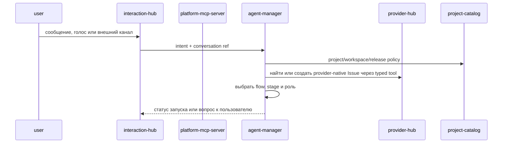
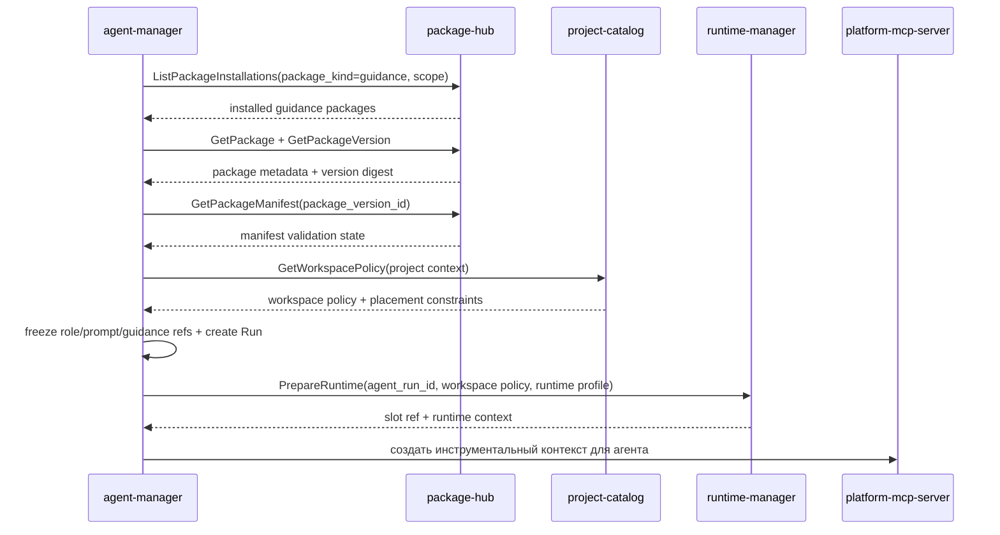
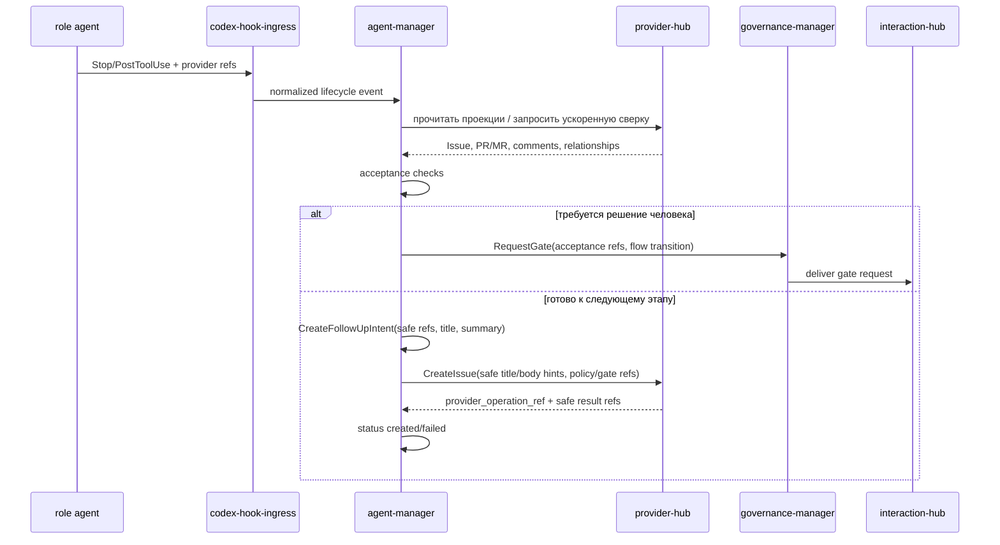

# Детальный дизайн: оркестрация агентов

## TL;DR

- Что меняем: выделяем `agent-manager` как сервис-владелец flow, stage, role, prompt template, session, agent `Run`, безопасной activity timeline, acceptance machine и follow-up задач.
- Почему: агентная работа должна иметь явную state machine и границы, а runtime, provider, package и interaction контуры не должны владеть процессом.
- Основные компоненты: БД `agent-manager`, gRPC API, outbox событий, движок flow, запускатель ролей, рендер prompt, движок приёмки и планировщик follow-up.
- Риски: смешать `Run` со slot/job, начать ходить в GitHub напрямую из управляющего сервиса или скопировать пакетную/проектную истину в agent-домен.

## Цели

- Зафиксировать границу `agent-manager` до контрактов и кода.
- Развести агентную оркестрацию, runtime, provider-native состояние, пакеты и взаимодействия.
- Развести MCP-инструменты и Codex hook events: MCP идёт через `platform-mcp-server`, а lifecycle/permission/tool-result hooks идут через `codex-hook-ingress`.
- Подготовить модель для встроенных и пользовательских ролей.
- Описать, как руководящие пакеты попадают в агентный контекст через package-контур.
- Описать машину приёмки и создание follow-up задач без введения внутренних заменителей `Issue` и `PR/MR`.

## Не-цели

- Не реализовывать код, proto, миграции или UI в стартовом документационном срезе.
- Не проектировать полный интерфейс flow-редактора.
- Не переносить slot, workspace filesystem, platform jobs и Kubernetes-операции в `agent-manager`.
- Не переносить provider-native операции и зеркало `Issue/PR/MR` из `provider-hub`.
- Не переносить диалоги, уведомления и внешние каналы из `interaction-hub`.

## Граница сервиса

| Владеет `agent-manager` | Не владеет |
|---|---|
| Flow, stage, role, stage-role binding, prompt template, prompt version, agent session, agent `Run`, safe activity timeline, acceptance check, acceptance result, follow-up intent, automation trigger binding, agent events и состояние ожидания flow. | Runtime slot, workspace filesystem, platform job, Kubernetes, provider-native проекции и операции, package catalog, package installation, secret value, risk/gate/release decisions, диалоговые ветки, уведомления, внешние каналы, проектная policy как истина, MCP transport, Codex hook transport, сырые tool payload и долгую ops feed hook ingress. |

Главное правило: `agent-manager` отвечает за вопрос «какая агентная работа должна быть выполнена, кем, по какому процессу и что считать готовым». Технический вопрос «где и как выполнить» решает runtime-контур. Вопрос «как записать provider-native артефакт» решает provider-контур. Вопрос «как получить пакет» решает package-контур. Вопрос «нужен ли gate и какое решение принято» решает governance-контур. Вопрос «как доставить запрос человеку» решает interaction-контур.

## Компоненты

| Компонент | Назначение |
|---|---|
| `agent-manager` | Сервис-владелец домена оркестрации агентов. |
| БД `agent-manager` | Версии flow, ролей, prompt template, сессии, `Run`, acceptance, follow-up и outbox. |
| Движок flow | Выбирает этап, переход, обязательные артефакты, роли и gates. |
| Запускатель ролей | Создаёт `Run`, фиксирует версии flow, этапа, роли, prompt и руководящих пакетов, затем запрашивает runtime-запуск. |
| Рендер prompt | Собирает prompt из версии роли, задачи, stage, policy, руководящих пакетов и рабочего контекста. |
| Запись снимков сессии | Фиксирует метаданные Codex session state после turn/checkpoint и обновляет указатель на актуальный снимок. |
| История действий агента | Хранит canonical persistent safe timeline по session/run: tool intent/result, lifecycle, permission, runtime/provider signals, bounded summary, digest, refs и timestamps без raw payload. |
| Движок приёмки | Проверяет артефакты, watermark, статусы provider-native сущностей и условия перехода. |
| Планировщик follow-up | Формирует авторитетное намерение следующей задачи с safe refs/status/summary и dispatch-командой вызывает typed `provider-hub.CreateIssue`; update существующей provider-native задачи остаётся следующим срезом. |
| Outbox-доставщик | Публикует `agent.*` события через `platform-event-log`. |

## Основные потоки

### Запуск управляемой работы

`interaction-hub` хранит диалог и доставку, а `agent-manager` хранит интерпретацию намерения, выбранный процесс и агентную сессию.

### Запуск ролевого агента

`agent-manager` не выполняет checkout и не монтирует файлы сам. Он выбирает руководящие пакеты и контекст, а подготовку workspace выполняет runtime-контур по проверенной политике.

Codex session state сохраняется как JSON/JSONL-объект в S3-compatible хранилище после каждого значимого turn/checkpoint. `agent-manager` хранит метаданные снимка, digest, размер и указатель на последний актуальный объект; сам большой файл сессии не пишется в PostgreSQL.

Безопасная история действий хранится отдельно от session snapshot. `RecordAgentActivity` фиксирует только kind, safe tool metadata, status, timestamps/duration, bounded summary/error, digest, safe refs/details и correlation trace. Полные `tool_input`, `tool_response`, stdout/stderr, prompt, transcript, session dump, provider payload, kubeconfig, локальные workspace paths и файлы workspace не сохраняются в `agent-manager`.

### Приёмка результата агента

Приёмка не считает локальный ответ агента источником истины. Она сверяется с provider-native артефактами и platform watermark, а затем фиксирует follow-up intent. Создание следующего `Issue` выполняется только через `provider-hub.CreateIssue`; `agent-manager` хранит `provider_operation_ref`, safe result refs и статус, но не provider payload, raw response или body будущего `Issue`.

## Интеграции

### `package-hub`

`agent-manager` использует `package-hub` только для чтения пакетной истины:
- `ListPackageInstallations(package_kind=guidance, scope=...)` — найти установленные руководящие пакеты для платформы, организации, проекта или репозитория;
- `GetPackageInstallation(installation_id)` — проверить конкретную установку из selection hint;
- `GetPackage` и `GetPackageVersion` — зафиксировать безопасные refs, version label, строковый source ref как подсказку и digest;
- `GetPackageManifest(package_version_id)` — проверить состояние manifest руководящего пакета без сохранения `payload_json`;
- `ListPackages(package_kind=guidance)` — показать доступные руководящие пакеты в будущих настройках.

`agent-manager` не хранит копию пакетного каталога, не меняет установки, не сохраняет тексты `SKILL.md`, scripts, assets, package source или manifest payload и не выполняет checkout пакетов.

### Руководящие пакеты в workspace

Детальный контракт использования руководящих пакетов в runtime workspace закреплён в `docs/domains/agent-orchestration/architecture/guidance_workspace_context.md`.

MVP-путь:

1. `StartAgentRun` разрешает guidance selection hints через `package-hub` и сохраняет в `AgentRun.guidance_refs` только `package_installation_ref`, `package_version_ref`, `manifest_digest`, строковый source ref как подсказку, capability refs, slug/version label и bounded policy summary.
2. `StartAgentRun` получает проверенную workspace policy у `project-catalog` и добавляет в runtime request `WorkspaceSource` с видом `guidance_package` для каждого `GuidanceRef` и `generated_context` для `.kodex/context/agent-run.json`.
3. `agent-manager` вызывает `runtime-manager.PrepareRuntime` с `agent_run_id`, runtime profile роли, workspace policy и placement constraints; прямой checkout из `agent-manager` запрещён.
4. `runtime-manager` по `package_version_ref` читает в `package-hub` тип source ref, commit SHA и идентичность источника пакета, вычисляет безопасный `safe_local_name`, материализует эти источники только для чтения в `.kodex/guidance/<safe_local_name>` и создаёт сгенерированный контекст в `.kodex/context/agent-run.json`.
5. `agent-manager` фиксирует только `runtime_context`, fingerprint/diagnostic summary и переход статуса `Run`; локальные файлы, manifest payload, prompt text, flow files и scripts остаются в workspace/PVC.

Если выбранный набор руководящих пакетов содержит конфликтующие `safe_local_name` после нормализации, подготовка runtime должна завершиться безопасной ошибкой до checkout. `package_slug` используется для диагностики и отображения, но не конкатенируется в путь напрямую. `agent-manager` передаёт только request-local `WorkspaceSource.local_path`, требуемый текущим proto, не сохраняет workspace paths в `Run` и не копирует файлы пакетов в свою БД.

### `runtime-manager`

`agent-manager` передаёт в runtime:
- `agent_run_id`;
- runtime profile роли;
- workspace policy и placement constraints;
- rendered execution context;
- ссылки на provider-native задачу, stage, role и prompt version.
- метаданные последнего Codex session snapshot, если runtime продолжает существующую сессию.

`runtime-manager` возвращает slot ref, runtime context и технический статус. `Run` остаётся у `agent-manager`, slot/job остаются у runtime.

### `provider-hub`

`agent-manager` использует provider-контур для:
- создания следующего follow-up `Issue` через `provider-hub.CreateIssue`;
- будущего обновления `Issue`, когда intent будет безопасно различать create/update target;
- создания `PR/MR`, комментариев и review-сигналов через типизированные инструменты;
- чтения проекций provider-native артефактов для приёмки;
- постановки ускоряющей сверки после работы агента.

Если ролевой агент в слоте работает через `gh` или нативный API провайдера, он передаёт платформе сигнал, а `provider-hub` догоняет проекцию webhook/reconciliation.

### `platform-mcp-server`

`platform-mcp-server` является инструментальной поверхностью:
- для быстрого agent-manager;
- для ролевых агентов в слотах;
- для безопасных provider, runtime, package, access и interaction операций.

MCP не владеет доменным состоянием и не подменяет `agent-manager`: он проверяет политику, пишет аудит и маршрутизирует вызовы к сервисам-владельцам.

### `codex-hook-ingress`

`codex-hook-ingress` является входным контуром Codex hook events для `agent-manager`:
- `SessionStart` создаёт или связывает Codex-сессию с `AgentSession`;
- `UserPromptSubmit` фиксирует безопасный факт нового пользовательского ввода и передаёт его в агентный контур;
- `PreToolUse` и `PostToolUse` дают realtime-сигналы и безопасные provider/runtime hints; следующий CHI-срез должен отправлять sanitized tool metadata в `agent-manager.RecordAgentActivity`;
- `PermissionRequest` преобразуется в risk/gate evaluation через `governance-manager`, а доставка запроса человеку остаётся у `interaction-hub`;
- `Stop` фиксирует контрольную точку хода, pending actions и итоговую сводку.

`agent-manager` не должен принимать эти события через MCP-инструменты. MCP остаётся для явных tool calls, а hook ingress — для событий, которые Codex command hook передал через локальный emitter или sidecar. `codex-hook-ingress` очищает и маршрутизирует события, держит короткую realtime/ops ленту, но не хранит долгую историю tool calls; canonical persistent timeline принадлежит `agent-manager`.

### `governance-manager`

`agent-manager` обращается к `governance-manager` за оценкой риска, записью review signals, созданием gate request и чтением итогового gate/release decision. `agent-manager` хранит только ожидание flow и ссылки на governance-решения; сами risk/gate/release decisions остаются в governance-контуре.

### `interaction-hub`

`agent-manager` создаёт запрос обратной связи или уведомления, но не хранит диалоговую ветку и попытки доставки. Human gate доставляется через `interaction-hub` по запросу `governance-manager`, а результат решения возвращается в `agent-manager` как governance decision ref или событие продолжения flow.

## Flow, stage, role и prompt

| Понятие | Назначение |
|---|---|
| `Flow` | Версионируемый шаблон процесса: этапы, переходы, обязательные артефакты, gates и правила автоматизации. |
| `Stage` | Этап flow с типом работы, ожидаемыми артефактами, критериями приёмки и допустимыми ролями. |
| `Role` | Профиль агента: назначение, режим запуска, MCP-права, runtime profile, prompt template и ограничения. |
| `StageRoleBinding` | Привязка роли к этапу как исполнитель, reviewer, gatekeeper, QA или вспомогательная роль. |
| `PromptTemplateVersion` | Версия шаблона prompt для работы или исправления замечаний. |

Каноническое runtime-состояние flow, ролей и prompt version хранится в БД `agent-manager`. Репозитории и руководящие пакеты могут поставлять установочные фикстуры и изменения через reviewable PR, но исполняемый `Run` всегда фиксирует конкретные версии, принятые платформой.

## Машина приёмки

Машина приёмки проверяет:
- наличие ожидаемых `PR/MR`;
- наличие follow-up `Issue`, если stage должен передать работу дальше;
- тип `Issue`, labels, milestones, project fields и watermark;
- обязательные разделы body/comment;
- связи между `Issue`, `PR/MR`, stage и run;
- результаты ролевых проверок;
- риск и необходимость Human gate.

Результат приёмки не меняет чужую истину напрямую. Базовый lifecycle создаёт и обновляет `AcceptanceResult` в `agent-manager`, хранит только статусы, safe refs, bounded summary/digest и публикует события. Если проверка требует provider/governance/interaction/runtime действия, `agent-manager` фиксирует ожидание или ссылку, а операцию выполняет сервис-владелец в отдельном срезе. Для `human_gate` `agent-manager` фиксирует только `waiting` с безопасным gate/risk/governance ref и не записывает финальное решение.

## События

Минимальные события:
- `agent.session.created`;
- `agent.session.updated`;
- `agent.run.requested`;
- `agent.run.started`;
- `agent.run.waiting`;
- `agent.run.completed`;
- `agent.run.failed`;
- `agent.acceptance.requested`;
- `agent.acceptance.completed`;
- `agent.acceptance.failed`;
- `agent.follow_up.requested`;
- `agent.follow_up.created`;
- `agent.follow_up.failed`;
- `agent.human_gate.requested` как ожидание governance gate в flow;
- `agent.human_gate.resolved` как получение ссылки на resolved governance decision;
- `agent.flow.version_activated`;
- `agent.role.version_activated`;
- `agent.prompt.version_activated`.

Для `AgentActivity` отдельное `agent.*` событие не вводится: запись timeline является owner-side read/write моделью `agent-manager`, а высокочастотный realtime-поток остаётся в `codex-hook-ingress`.

## Конкурентные изменения

- Flow, role, prompt template и automation rule имеют версии.
- `Run` фиксирует версии и digest, использованные при запуске, и не меняется при последующем редактировании flow, роли или prompt.
- Команды изменения состояния `Run` и acceptance передают ожидаемую версию.
- Долгие операции не держат SQL-блокировки: runtime-запуск, provider-операция и Human gate через governance/interaction выполняются через внешние контуры и события.
- Повтор команды с тем же `command_id` возвращает сохранённый результат или безопасный конфликт.

## Наблюдаемость

- Логи: session id, run id, flow, stage, role, provider target, runtime ref, activity id, correlation id, результат.
- Метрики: запрошенные, выполняемые, ожидающие, упавшие и завершённые `Run`; длительность этапов; ошибки приёмки; повторные запуски; ожидания governance gate.
- Трейсы: входящий gRPC/MCP, чтение package/project/provider, runtime prepare, activity record/list, acceptance, outbox.
- Алерты: рост упавших `Run`, застрявшие ожидающие `Run`, рост ошибок приёмки, массовые ошибки package/runtime/provider зависимостей.

## Риски

| Риск | Митигирующее решение |
|---|---|
| `agent-manager` начнёт владеть runtime-слотом. | В API хранить только `runtime_ref`; slot/job остаются в `runtime-manager`. |
| `agent-manager` начнёт ходить напрямую в GitHub/GitLab. | Provider-операции выполнять через `provider-hub` или разрешённую slot-модель с последующим сигналом. |
| Prompt template станет неотслеживаемым текстом. | Хранить версии и источник фикстуры, фиксировать prompt version в каждом `Run`. |
| Flow-изменение сломает активную работу. | Активный `Run` хранит immutable snapshot ссылок на flow/stage/role/prompt versions. |
| Руководящие пакеты скопируются в agent-домен. | Читать только установки и manifest из `package-hub`; checkout/mount выполняет runtime-контур. |

## Апрув

- request_id: `owner-2026-05-12-agent-manager-kickoff`
- Решение: approved
- Комментарий: дизайн домена оркестрации агентов согласован как стартовое целевое состояние.
