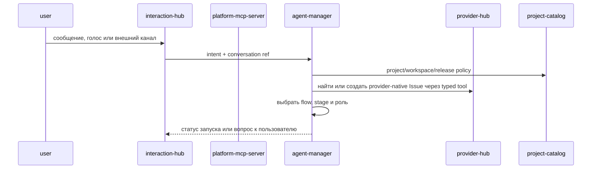
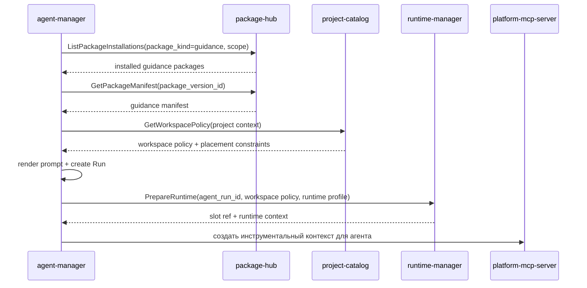
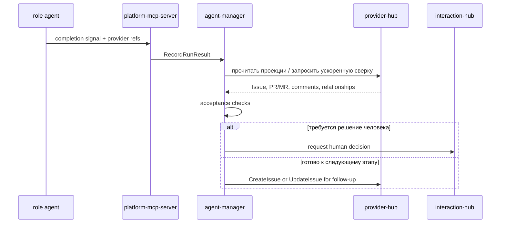

# Детальный дизайн: оркестрация агентов

## TL;DR

- Что меняем: выделяем `agent-manager` как сервис-владелец flow, stage, role, prompt template, session, agent `Run`, acceptance machine и follow-up задач.
- Почему: агентная работа должна иметь явную state machine и границы, а runtime, provider, package и interaction контуры не должны владеть процессом.
- Основные компоненты: БД `agent-manager`, gRPC API, outbox событий, движок flow, запускатель ролей, рендер prompt, движок приёмки и планировщик follow-up.
- Риски: смешать `Run` со slot/job, начать ходить в GitHub напрямую из управляющего сервиса или скопировать пакетную/проектную истину в agent-домен.

## Цели

- Зафиксировать границу `agent-manager` до контрактов и кода.
- Развести агентную оркестрацию, runtime, provider-native состояние, пакеты и взаимодействия.
- Подготовить модель для встроенных и пользовательских ролей.
- Описать, как руководящие пакеты попадают в агентный контекст через package-контур.
- Описать машину приёмки и создание follow-up задач без введения внутренних заменителей `Issue` и `PR/MR`.

## Не-цели

- Не реализовывать код, proto, миграции или UI в стартовом документационном срезе.
- Не проектировать полный интерфейс flow-редактора.
- Не переносить slot, workspace filesystem, platform jobs и Kubernetes-операции в `agent-manager`.
- Не переносить provider-native операции и зеркало `Issue/PR/MR` из `provider-hub`.
- Не переносить диалоги, уведомления и внешние каналы из `interaction-hub`.

## Граница сервиса

| Владеет `agent-manager` | Не владеет |
|---|---|
| Flow, stage, role, stage-role binding, prompt template, prompt version, agent session, agent `Run`, acceptance check, acceptance result, follow-up intent, automation trigger binding, agent events. | Runtime slot, workspace filesystem, platform job, Kubernetes, provider-native проекции и операции, package catalog, package installation, secret value, диалоговые ветки, уведомления, внешние каналы, проектная policy как истина. |

Главное правило: `agent-manager` отвечает за вопрос «какая агентная работа должна быть выполнена, кем, по какому процессу и что считать готовым». Технический вопрос «где и как выполнить» решает runtime-контур. Вопрос «как записать provider-native артефакт» решает provider-контур. Вопрос «как получить пакет» решает package-контур. Вопрос «как спросить человека» решает interaction-контур.

## Компоненты

| Компонент | Назначение |
|---|---|
| `agent-manager` | Сервис-владелец домена оркестрации агентов. |
| БД `agent-manager` | Версии flow, ролей, prompt template, сессии, `Run`, acceptance, follow-up и outbox. |
| Движок flow | Выбирает этап, переход, обязательные артефакты, роли и gates. |
| Запускатель ролей | Создаёт `Run`, фиксирует версию роли и запрашивает runtime-запуск. |
| Рендер prompt | Собирает prompt из версии роли, задачи, stage, policy, руководящих пакетов и рабочего контекста. |
| Движок приёмки | Проверяет артефакты, watermark, статусы provider-native сущностей и условия перехода. |
| Планировщик follow-up | Формирует намерение следующей задачи и вызывает provider-контур для создания или обновления `Issue`. |
| Outbox-доставщик | Публикует `agent.*` события через `platform-event-log`. |

## Основные потоки

### Запуск управляемой работы

`interaction-hub` хранит диалог и доставку, а `agent-manager` хранит интерпретацию намерения, выбранный процесс и агентную сессию.

### Запуск ролевого агента

`agent-manager` не выполняет checkout и не монтирует файлы сам. Он выбирает руководящие пакеты и контекст, а подготовку workspace выполняет runtime-контур по проверенной политике.

### Приёмка результата агента

Приёмка не считает локальный ответ агента источником истины. Она сверяется с provider-native артефактами и platform watermark, а затем создаёт follow-up через provider-контур.

## Интеграции

### `package-hub`

`agent-manager` использует `package-hub` только для чтения пакетной истины:
- `ListPackageInstallations(package_kind=guidance, scope=...)` — найти установленные руководящие пакеты для платформы, организации, проекта или репозитория;
- `GetPackageManifest(package_version_id)` — получить проверенный manifest руководящего пакета;
- `ListPackages(package_kind=guidance)` — показать доступные руководящие пакеты в будущих настройках.

`agent-manager` не хранит копию пакетного каталога, не меняет установки и не выполняет checkout пакетов.

### `runtime-manager`

`agent-manager` передаёт в runtime:
- `agent_run_id`;
- runtime profile роли;
- workspace policy и placement constraints;
- rendered execution context;
- ссылки на provider-native задачу, stage, role и prompt version.

`runtime-manager` возвращает slot ref, runtime context и технический статус. `Run` остаётся у `agent-manager`, slot/job остаются у runtime.

### `provider-hub`

`agent-manager` использует provider-контур для:
- создания и обновления `Issue`;
- создания `PR/MR`, комментариев и review-сигналов через типизированные инструменты;
- чтения проекций provider-native артефактов для приёмки;
- постановки ускоряющей сверки после работы агента.

Если ролевой агент в слоте работает через `gh` или нативный API провайдера, он передаёт платформе сигнал, а `provider-hub` догоняет проекцию webhook/reconciliation.

### `platform-mcp-server`

`platform-mcp-server` является инструментальной поверхностью:
- для быстрого agent-manager;
- для ролевых агентов в слотах;
- для безопасных provider, runtime, package, access и interaction операций.

MCP не владеет доменным состоянием и не подменяет `agent-manager`: он проверяет политику, пишет аудит и маршрутизирует вызовы к сервисам-владельцам.

### `interaction-hub`

`agent-manager` создаёт запрос решения, обратной связи или уведомления, но не хранит диалоговую ветку и попытки доставки. Результат решения возвращается как событие или команда продолжения сессии.

## Flow, stage, role и prompt

| Понятие | Назначение |
|---|---|
| `Flow` | Версионируемый шаблон процесса: этапы, переходы, обязательные артефакты, gates и правила автоматизации. |
| `Stage` | Этап flow с типом работы, ожидаемыми артефактами, критериями приёмки и допустимыми ролями. |
| `Role` | Профиль агента: назначение, режим запуска, MCP-права, runtime profile, prompt template и ограничения. |
| `StageRoleBinding` | Привязка роли к этапу как исполнитель, reviewer, gatekeeper, QA или вспомогательная роль. |
| `PromptTemplateVersion` | Версия шаблона prompt для работы или исправления замечаний. |

Каноническое runtime-состояние flow, ролей и prompt version хранится в БД `agent-manager`. Репозитории и руководящие пакеты могут поставлять установочные фикстуры и изменения через reviewable PR, но исполняемый `Run` всегда фиксирует конкретные версии, принятые платформой.

## Машина приёмки

Машина приёмки проверяет:
- наличие ожидаемых `PR/MR`;
- наличие follow-up `Issue`, если stage должен передать работу дальше;
- тип `Issue`, labels, milestones, project fields и watermark;
- обязательные разделы body/comment;
- связи между `Issue`, `PR/MR`, stage и run;
- результаты ролевых проверок;
- риск и необходимость Human gate.

Результат приёмки не меняет чужую истину напрямую. Он создаёт `AcceptanceResult` в `agent-manager`, публикует событие и инициирует provider/interaction/runtime операции через владельцев.

## События

Минимальные события:
- `agent.session.created`;
- `agent.session.updated`;
- `agent.run.requested`;
- `agent.run.started`;
- `agent.run.waiting`;
- `agent.run.completed`;
- `agent.run.failed`;
- `agent.acceptance.requested`;
- `agent.acceptance.completed`;
- `agent.acceptance.failed`;
- `agent.follow_up.requested`;
- `agent.follow_up.created`;
- `agent.human_gate.requested`;
- `agent.human_gate.resolved`;
- `agent.flow.version_activated`;
- `agent.role.version_activated`;
- `agent.prompt.version_activated`.

## Конкурентные изменения

- Flow, role, prompt template и automation rule имеют версии.
- `Run` фиксирует версии, использованные при запуске, и не меняется при последующем редактировании flow.
- Команды изменения состояния `Run` и acceptance передают ожидаемую версию.
- Долгие операции не держат SQL-блокировки: runtime-запуск, provider-операция и Human gate выполняются через внешние контуры и события.
- Повтор команды с тем же `command_id` возвращает сохранённый результат или безопасный конфликт.

## Наблюдаемость

- Логи: session id, run id, flow, stage, role, provider target, runtime ref, correlation id, результат.
- Метрики: запрошенные, выполняемые, ожидающие, упавшие и завершённые `Run`; длительность этапов; ошибки приёмки; повторные запуски; ожидания Human gate.
- Трейсы: входящий gRPC/MCP, чтение package/project/provider, runtime prepare, acceptance, outbox.
- Алерты: рост упавших `Run`, застрявшие ожидающие `Run`, рост ошибок приёмки, массовые ошибки package/runtime/provider зависимостей.

## Риски

| Риск | Митигирующее решение |
|---|---|
| `agent-manager` начнёт владеть runtime-слотом. | В API хранить только `runtime_ref`; slot/job остаются в `runtime-manager`. |
| `agent-manager` начнёт ходить напрямую в GitHub/GitLab. | Provider-операции выполнять через `provider-hub` или разрешённую slot-модель с последующим сигналом. |
| Prompt template станет неотслеживаемым текстом. | Хранить версии и источник фикстуры, фиксировать prompt version в каждом `Run`. |
| Flow-изменение сломает активную работу. | Активный `Run` хранит immutable snapshot ссылок на flow/stage/role/prompt versions. |
| Руководящие пакеты скопируются в agent-домен. | Читать только установки и manifest из `package-hub`; checkout/mount выполняет runtime-контур. |

## Апрув

- request_id: `owner-2026-05-12-agent-manager-kickoff`
- Решение: approved
- Комментарий: дизайн домена оркестрации агентов согласован как стартовое целевое состояние.
