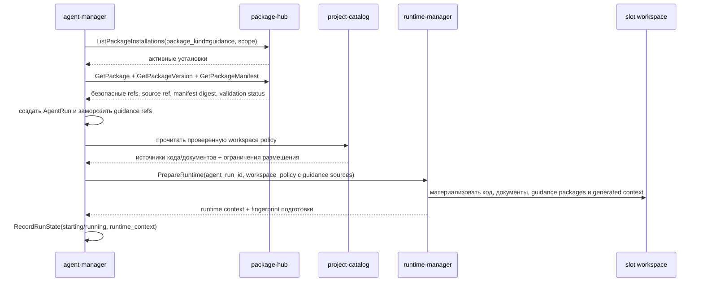

# Контекст руководящих пакетов в workspace агента

## TL;DR

- `agent-manager` выбирает руководящие пакеты через `package-hub` и фиксирует в `AgentRun` только безопасные ссылки, версии, digest и краткую policy summary.
- `agent-manager` не делает checkout, mount или чтение файлов руководящего пакета.
- `runtime-manager` получает `WorkspaceSource` с видом `guidance_package` и материализует пакет в workspace/PVC.
- Локальный путь руководящего пакета строится не из сырого `package_slug`, а из проверенного `safe_local_name`.
- Тексты руководств, `SKILL.md`, шаблоны prompt, flow-файлы, scripts, assets и полный manifest не пишутся в БД `agent-manager`.
- Slot-агент видит руководящие документы по стабильным локальным путям внутри workspace.

## Ответственность доменов

| Домен | Ответственность |
|---|---|
| `agent-manager` | Выбирает guidance installations для session/run, проверяет stage/role/prompt, замораживает безопасные refs в `AgentRun`, передаёт runtime-контекст и после подготовки фиксирует `runtime_context`. |
| `package-hub` | Владеет каталогом пакетов, установками, версиями, manifest snapshot, статусами проверки и package kind `guidance`. |
| `project-catalog` | Владеет проектной workspace policy: кодовые репозитории, проектная документация, проверенный `services.yaml`, release/risk policy и ограничения размещения. |
| `runtime-manager` | Владеет slot, workspace materialization, локальными checkout/mount путями, fingerprint и техническим статусом подготовки. |
| `platform-mcp-server` | Даёт агенту безопасные инструменты платформы, но не материализует файлы и не хранит состояние `Run`. |

## Поток MVP



`StartAgentRun` остаётся авторитетной командой создания `Run`. Подготовка runtime может быть выполнена тем же оркестрационным контуром сразу после создания `Run`, но прямой checkout из `agent-manager` запрещён. Если `PrepareRuntime` временно запускается внешним оператором или быстрым manager-агентом через MCP, входной набор данных должен быть тем же: замороженный `AgentRun.guidance_refs` и проверенная workspace policy.

## Что хранится в БД и что живёт в workspace

| Данные | БД `agent-manager` | Workspace/PVC |
|---|---|---|
| `package_installation_ref` | да | может дублироваться в manifest контекста |
| `package_version_ref` | да | может дублироваться в manifest контекста |
| `manifest_digest` | да | используется runtime для проверки входного источника |
| `source_ref.kind`, `source_ref.ref`, `source_ref.commit_sha` | да | используется runtime для проверки фиксированной версии перед checkout |
| `package_slug`, `package_version_label` | да | используется только для диагностики и человекочитаемого контекста |
| `safe_local_name` | нет | runtime-контур вычисляет при построении `WorkspaceSource`; может дублироваться в manifest контекста |
| `policy_summary_json` | да, только ограниченная summary без payload | может дублироваться в сгенерированном контексте |
| `payload_json` manifest | нет | runtime может получить от package/source контура при materialization, но не возвращает в `agent-manager` |
| `SKILL.md`, руководства, шаблоны, scripts, assets | нет | да, как файлы источника только для чтения |
| rendered execution context | нет как большой текст | да, как файл сгенерированного контекста |
| slot/job/workspace refs | только ссылки в `runtime_context` | авторитетное состояние у `runtime-manager` |

## WorkspaceSource для руководящего пакета

Для каждого замороженного `GuidanceRef` оркестрационный контур строит `runtime.WorkspaceSource`:

| Поле `WorkspaceSource` | Значение |
|---|---|
| `source_id` | `guidance:<package_installation_ref>` |
| `kind` | `guidance_package` |
| `source_ref` | `PackageVersion.source_ref.ref` из `package-hub` |
| `commit_sha` | `PackageVersion.source_ref.commit_sha`, если известен |
| `digest` | `GuidanceRef.manifest_digest` |
| `local_path` | `.kodex/guidance/<safe_local_name>`; если имена конфликтуют в выбранном наборе, подготовка runtime должна завершиться `failed_precondition` до checkout |
| `access_mode` | `read` |
| `metadata_json` | безопасные поля: `package_installation_ref`, `package_version_ref`, `package_ref`, `package_slug`, `package_version_label`, `safe_local_name`, `source_ref_kind`, `source_commit_sha`, `package_source_id`, `package_source_kind`, `package_source_repository_ref`, `package_source_catalog_endpoint_ref`, `capability_ref`, `capability_kind`, `manifest_digest` |

`local_path` является runtime-контрактом, а не полем `AgentRun`. Он вычисляется из замороженных refs при подготовке workspace. Так старый `Run` не меняется при будущей смене правил layout, а runtime materialization всегда имеет собственный fingerprint.

`package_slug` нельзя напрямую конкатенировать в путь. `safe_local_name` является единственным разрешённым сегментом локального пути для руководящего пакета. Правила:

- сегмент должен быть ASCII lowercase и соответствовать `^[a-z0-9][a-z0-9_-]{0,62}$`;
- сегмент не может содержать `/`, `\`, управляющие символы, Unicode-варианты, `.` или `..`;
- если `package_slug` уже соответствует формату, он может использоваться как `safe_local_name`;
- если `package_slug` не соответствует формату, `safe_local_name` строится детерминированно из `package_ref`, `package_version_ref` и `sha256(package_slug)` в виде безопасного ASCII-имени;
- конфликт двух `safe_local_name` внутри одного workspace считается ошибкой входной политики и отклоняется до checkout.

Перед materialization runtime-контур не должен доверять только строковому `source_ref`. Он выполняет авторитетное чтение `package_version_ref`, `package_ref` и `package_source_id` из `package-hub` либо получает от оркестрационного контура уже проверенный снимок этих данных и сверяет его с `WorkspaceSource.metadata_json`. Для checkout используются тип источника `source_ref_kind`, значение `source_ref`, `source_commit_sha`, идентичность `PackageSource` и `manifest_digest`; если хотя бы одно значение расходится с замороженными refs `Run`, подготовка завершается `failed_precondition` до обращения к внешнему источнику.

## Сгенерированный контекст

Кроме руководящих пакетов runtime получает один `WorkspaceSource` с видом `generated_context`. В первой версии он должен указывать на файл:

```text
.kodex/context/agent-run.json
```

Файл содержит только безопасные ссылки и инструкционные указатели:

- `agent_run_id`, `agent_session_id`, `flow_version_id`, `stage_id`;
- `role_profile_id`, `role_profile_version`, `role_profile_digest`;
- `prompt_template_version_id`, `prompt_template_digest`;
- provider target refs;
- список локальных путей руководящих пакетов;
- ссылки на session snapshot, если run продолжает существующую Codex-сессию;
- список разрешённых MCP tools и runtime profile.

В сгенерированный контекст нельзя включать значения секретов, полный manifest payload, тексты prompt templates, большие логи, сырые provider payload и полные session JSON/JSONL.

## Инварианты

- Повтор `StartAgentRun` с тем же `command_id` возвращает тот же `Run` и тот же набор `guidance_refs`.
- Повтор `PrepareRuntime` должен использовать `agent_run_id` и runtime `command_id`, чтобы не создавать несколько независимых слотов для одного запуска.
- Если `package-hub` больше не отдаёт установку или manifest после создания `Run`, уже замороженный `Run` остаётся исторически валидным, но новый runtime start должен завершиться безопасной ошибкой зависимости.
- `package-hub` не создаёт локальные пути и не подготавливает workspace.
- `runtime-manager` не выбирает flow, stage, role, prompt или guidance packages самостоятельно.
- `runtime-manager` не выводит способ получения пакета из произвольной строки `source_ref`: тип источника, commit и идентичность источника приходят из `package-hub` и проверяются до checkout.
- `platform-mcp-server` может инициировать подготовку runtime как инструментальная поверхность, но не становится владельцем `Run` или workspace policy.

## Бэклог реализации

- Подключить прямой вызов `runtime-manager.PrepareRuntime` из оркестрационного контура после того, как `project-catalog` отдаст проверенную workspace policy для конкретного run context.
- Добавить механизм materialization, который умеет получать guidance package source по `WorkspaceSource.kind=guidance_package`.
- Добавить writer сгенерированного контекста в runtime/workspace слой.
- Добавить проверку формата и конфликтов `safe_local_name` в selected guidance set до подготовки runtime.

## Апрув

- request_id: `owner-2026-05-25-ago-6-guidance-workspace`
- Решение: approved
- Комментарий: выбран MVP-путь без checkout из `agent-manager`; руководящие пакеты проходят через `package-hub` refs и материализуются `runtime-manager`.
