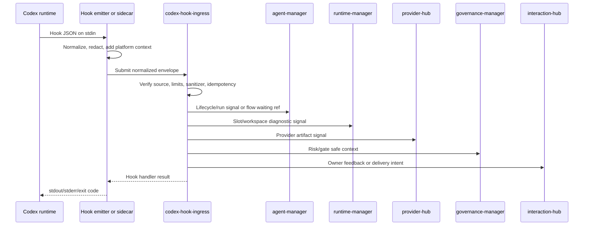
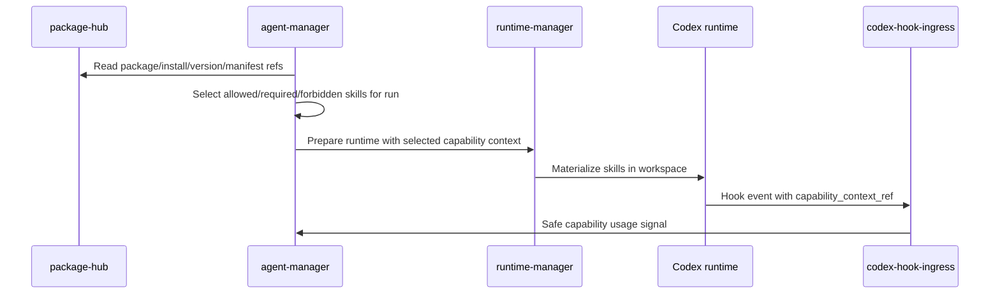

# Дизайн codex-hook-ingress

## TL;DR

- Что меняем: выделяем `codex-hook-ingress` как отдельную входную границу Codex hook events.
- Почему: Codex hooks запускаются как command hooks в рабочем пространстве, а MCP tools обслуживаются `platform-mcp-server`; это разные протоколы и разные риски данных.
- Основные компоненты: hook emitter или sidecar, ingress transport, source verifier, sanitizer, event classifier, route planner, decision bridge, short operational feed, audit/metrics emitter.
- Риски: хранение raw payload, смешивание с MCP, перенос бизнес-состояния в ingress и преждевременное превращение skills в локальный каталог.

## Цели

- Описать границу сервиса до выбора транспорта, proto, OpenAPI или AsyncAPI.
- Зафиксировать MVP hook events и их маршрутизацию к сервисам-владельцам.
- Описать очистку входа, лимиты размера, запрет секретов и безопасные preview/hash/ref поля.
- Увязать hooks с Codex skills как capability layer без создания skill-хранилища в `codex-hook-ingress`.
- Подготовить delivery-план, который позволит отдельно согласовать транспортные контракты и только потом писать код.

## Не-цели

- Не реализовывать sidecar, emitter, proto, OpenAPI, AsyncAPI или physical transport contract до отдельного решения.
- Сервисный каркас допускается как отдельный срез: process, health/readiness/metrics, in-process logical `SubmitHookEvent`, source verifier placeholder, sanitizer boundary and idempotency.
- Не проектировать `platform-mcp-server` заново.
- Не менять контракты `agent-manager`, `runtime-manager`, `provider-hub`, `governance-manager`, `interaction-hub` или `package-hub`.
- Не добавлять Codex hook events вне MVP-набора.
- Не использовать `codex-hook-ingress` как каталог skills или package store.

## Контекст

Официальные Codex hooks получают JSON на `stdin`, запускаются в session `cwd`, имеют event-specific поля и возвращают результат через `stdout`, `stderr` и exit code. Текущий MVP использует только события `SessionStart`, `UserPromptSubmit`, `PreToolUse`, `PermissionRequest`, `PostToolUse` и `Stop`. `PreToolUse`, `PermissionRequest` и `PostToolUse` могут относиться к `Bash`, `apply_patch` и MCP tool names, но это не делает hook событие MCP-вызовом.

Официальные Codex skills являются авторским форматом повторяемых workflow: `SKILL.md` плюс опциональные `scripts/`, `references/`, `assets/` и metadata. Плагины могут поставлять skills, MCP config, lifecycle hooks и assets. В платформе это значит, что package/source/version/manifest принадлежат `package-hub`, выбор capability - `agent-manager`, materialization - `runtime-manager`, а hook ingress видит только безопасные refs в событиях.

## Исходные источники

- OpenAI Codex hooks: <https://developers.openai.com/codex/hooks>
- OpenAI Codex skills: <https://developers.openai.com/codex/skills>
- OpenAI Codex plugin structure: <https://developers.openai.com/codex/plugins/build#plugin-structure>
- Сквозная рамка платформы: `docs/platform/architecture/codex_hooks_and_skills.md`
- Стратегия MCP и hooks: `docs/domains/platform-mcp-server/architecture/contract_strategy.md`

## Граница сервиса

| Владеет `codex-hook-ingress` | Не владеет |
|---|---|
| Приём нормализованных hook events, проверка source binding, redaction, размерные лимиты, классификация события, маршрутизация владельцам, короткая операционная лента, метрики ingress, idempotency на границе. | MCP transport, MCP discovery, `Run`, session, flow, persistent tool/activity history, risk/gate decisions, slot, workspace, provider state, package catalog, skill catalog, dialogue, notification delivery, billing, UI state. |

Главное правило: `codex-hook-ingress` отвечает на вопрос "можно ли принять этот hook event от этого источника и каким владельцам передать безопасную сводку". Он не отвечает на вопрос "как меняется доменное состояние". Долгая persistent история действий агента и tool calls принадлежит `agent-manager`, потому что он владеет session/run.

## Компоненты

| Компонент | Ответственность |
|---|---|
| Hook emitter | Локальный command hook для Codex. Получает исходный JSON на `stdin`, отбрасывает запрещённые поля, добавляет platform context и отправляет envelope в ingress. |
| Local sidecar | Опциональный агентный процесс рядом с Codex runtime. Держит короткий retry buffer, применяет те же redaction rules и не хранит секреты. |
| Ingress transport | Будущий внутренний endpoint для `SubmitHookEvent`. Транспорт выбирается отдельным контрактным срезом. |
| Source verifier | Проверяет actor/source/run/session/slot/scope binding и совместимость `emitter_version`/`schema_version`. |
| Sanitizer | Проверяет размер, типы полей, forbidden keys, secret-like patterns, binary payload, stdout/stderr и session/transcript references. |
| Event classifier | Приводит событие к одному из MVP event types и вычисляет safe category: lifecycle, prompt, pre-tool, permission, post-tool, stop. |
| Route planner/registry | Формирует набор downstream-владельцев, проверяет включение route config и проецирует только разрешённые `safe_parts` для каждого owner port. |
| Decision bridge | Для `PermissionRequest` и policy-controlled `PreToolUse` строит safe request context, вызывает owner decision ports/stubs и возвращает explicit result; `agent-manager` получает только ожидание flow, refs и safe timeline context. |
| Operational feed | Пишет bounded короткую ленту для realtime UI и диагностики с retention: safe summary, event kind, route result, owner target, digest, size bucket, status, reject reason и timestamps. Это не canonical history; persistent timeline пишет `agent-manager`. |
| Audit/metrics emitter | Фиксирует решения, отказы, sanitizer events, route latency, duplicates, rate limits и owner timeouts. |

## Runtime contract emitter/sidecar

Детальный контракт CHI-2 живёт в `docs/domains/codex-hook-ingress/architecture/emitter_sidecar_contract.md`, а machine-readable runtime policy — в `specs/jsonschema/codex-hook-ingress.v1/hook-emitter-config.v1.schema.json`.

Инварианты runtime-границы:

- hook emitter запускается как Codex command hook и читает только JSON object из `stdin`;
- local sidecar опционален и может держать retry buffer только после sanitizer;
- sidecar не является доменным сервисом, не принимает бизнес-решения и не владеет состоянием run/session/slot;
- receiver всегда `codex-hook-ingress`; `integration-gateway` остаётся для внешних webhook/callback;
- `SubmitHookEvent` в CHI-2 является логической операцией без выбранного physical transport;
- endpoint ref, source binding и auth material подготавливает `runtime-manager` в рамках slot/runtime boundary;
- `PreCompact` и `PostCompact` не попадают в `supported_hook_events`; compact checkpoints остаются внутренними событиями `agent-manager`/`runtime-manager`.

## Поток данных

## Нормализованный envelope

Envelope должен быть стабильнее исходного Codex input и не должен повторять его полностью.

Machine-readable форма CHI-1 живёт в `specs/jsonschema/codex-hook-ingress.v1/normalized-hook-envelope.v1.schema.json`. Схема фиксирует только безопасный payload contract до выбора транспорта ingress.

| Поле | Назначение |
|---|---|
| `event_id` | Идемпотентный идентификатор события, созданный emitter/sidecar. |
| `schema_version` | Версия нормализованного envelope, не версия OpenAI hook input. |
| `hook_event_name` | Одно из `SessionStart`, `UserPromptSubmit`, `PreToolUse`, `PermissionRequest`, `PostToolUse`, `Stop`. |
| `event_time` | Время события в runtime. |
| `received_time` | Время приёма ingress. |
| `organization_id`, `project_id`, `repository_id` | Scope события. |
| `actor_ref`, `source_ref` | Кто инициировал runtime и какой emitter/sidecar отправил событие. |
| `run_id`, `session_id`, `slot_id`, `turn_id` | Связь с агентной сессией и runtime. |
| `role_ref`, `stage_ref` | Контекст роли и этапа, если выбран `agent-manager`. |
| `capability_context_ref` | Опциональная ссылка на выбранный skill/capability set для run. |
| `tool_category`, `tool_name`, `tool_use_id` | Safe tool metadata для tool-scoped events. |
| `safe_summary` | Короткая сводка без секретов и raw payload. |
| `payload_digest` | Digest исходного очищенного payload или значимых частей. |
| `correlation_id`, `command_id` | Связь с downstream-командами и аудитом. |

## Очистка входа и лимиты

Machine-readable sanitizer contract живёт в `specs/jsonschema/codex-hook-ingress.v1/sanitizer-contract.v1.schema.json`; стартовые defaults и safe examples находятся рядом. Этот контракт задаёт правила до сервисной реализации sanitizer.

| Область | Правило |
|---|---|
| Размер envelope | По умолчанию до 64 KiB после нормализации. Событие больше лимита отклоняется или требует sidecar truncation до отправки. |
| Text preview | До 4 KiB на поле. Preview должен быть sanitized и не должен содержать секреты. |
| Error preview | До 8 KiB на bounded error. Полные stdout/stderr и logs не передаются. |
| Raw tool input/output | Запрещены. Разрешены tool category, command hash, path category, exit status, artifact ref и bounded sanitized preview. |
| Prompt | Полный prompt не хранится в ingress. Для пользовательской переписки используется отдельная retention-политика `interaction-hub`; ingress передаёт факт, hash и safe summary. |
| Transcript/session | `transcript_path`, session JSON/JSONL и session dump не читаются и не пересылаются ingress. Допустимы только object refs, если их сформировал владелец. |
| Secrets | Токены, authorization headers, env values, kubeconfig, provider credentials, private keys и secret-like strings запрещены в payload, логах, метриках и ошибках. |
| Binary data | Запрещены. Emitter должен заменить binary payload на digest и media/object ref, если такой ref допустим. |

## Маршрутизация событий

| Hook event | Route | Safe payload |
|---|---|---|
| `SessionStart` | `agent-manager`, `runtime-manager` | Session/run/slot binding, start source, model slug, workspace ref, emitter version. |
| `UserPromptSubmit` | `agent-manager`, `interaction-hub` | Prompt hash, prompt class, policy pre-check result, safe summary. |
| `PreToolUse` | `agent-manager`, `governance-manager`, `runtime-manager`, realtime UI | Tool category, tool name, command hash, path category, risk hints, skill/capability ref. Для persistent UI history следующий CHI-срез вызывает `agent-manager.RecordAgentActivity` с sanitized refs/details. |
| `PermissionRequest` | `governance-manager`, `agent-manager`, `interaction-hub` | Request id, tool category, sanitized reason, risk class, timeout, capability ref. |
| `PostToolUse` | `agent-manager`, `runtime-manager`, `provider-hub`, realtime UI | Exit status, bounded error, artifact signal, rate-limit hint, command digest. Для persistent UI history следующий CHI-срез вызывает `agent-manager.RecordAgentActivity` без raw stdout/stderr/tool response. |
| `Stop` | `agent-manager`, `runtime-manager`, `provider-hub`, `governance-manager`, `interaction-hub` | Turn status, pending actions, stop summary, provider signals, checkpoint refs. |

## PermissionRequest bridge

`PermissionRequest` не должен превращаться в локальный неаудируемый yes/no.

1. Ingress принимает normalized event.
2. Source verifier подтверждает actor/run/session/slot/scope.
3. Ingress создаёт safe request context и вызывает owner ports/stubs для `governance-manager`, `agent-manager` и `interaction-hub`.
4. `governance-manager` создаёт или находит gate/decision; `agent-manager` фиксирует ожидание flow и persistent tool/activity timeline в своём контуре.
5. `interaction-hub` доставляет owner feedback или Human gate request и возвращает callback/result в governance-контур.
6. Ingress ждёт решение в пределах timeout, возвращает `allow`, `deny`, `no_decision`, `timeout`, `fail_closed` или `retryable_error` hook emitter.
7. Все решения, timeouts и отказы идут в audit/metrics без raw payload.

Если owner decision не пришёл вовремя, поведение должно быть fail-closed для `PermissionRequest` и policy-controlled для `PreToolUse`. Для нерискованных `PreToolUse` ingress не блокирует без отдельной policy. Неподдержанный owner port, disabled route или downstream unavailable не считаются успешной доставкой и отображаются только safe diagnostics.

## Skills как capability layer

`codex-hook-ingress` не хранит skills, но hook event может ссылаться на уже выбранный capability context.

| Вопрос | Владелец | Решение |
|---|---|---|
| Где живёт source/version/manifest package-backed skill | `package-hub` | Package entry, installation, version, digest и manifest snapshot. |
| Кто выбирает skill для run | `agent-manager` | Role/stage/flow/project policy, required/allowed/forbidden lists, invocation policy. |
| Кто кладёт skill в workspace | `runtime-manager` | Materialization path, file permissions, sandbox, script execution profile, local config. |
| Кто проверяет MCP/tool dependencies | `agent-manager`, `platform-mcp-server`, `access-manager` | Skill metadata может требовать tools, но права выдаются отдельно. |
| Что видит hook ingress | `codex-hook-ingress` | Только `capability_context_ref`, `skill_ref`, digest и safe usage signal. |

Если hook был вызван skill-provided script, emitter может передать `skill_ref` и `script_ref`, но не содержимое script, не output целиком и не локальные секреты.

## Ошибки и безопасное поведение

| Ошибка | Поведение |
|---|---|
| `hook.unsupported_event` | Отклонить событие, записать metric, не маршрутизировать владельцам. |
| `hook.invalid_binding` | Отклонить событие и audit-safe причину. |
| `hook.payload_too_large` | Отклонить или запросить truncation; не сохранять payload. |
| `hook.payload_rejected` | Отклонить из-за forbidden fields, binary data или secret-like content. |
| `hook.duplicate_event` | Вернуть прежний результат, если fingerprint совпадает; иначе idempotency conflict. |
| `hook.route_disabled` | Не вызывать owner port, вернуть safe diagnostic и не считать route успешной доставкой. |
| `hook.route_unsupported` | Не считать route успешной доставкой, вернуть safe diagnostic о незарегистрированном owner port. |
| `hook.owner_unavailable` | Retry/backoff для asynchronous routes; fail-closed для permission bridge по policy. |
| `hook.decision_timeout` | Безопасный отказ или controlled wait по policy `governance-manager`. |
| `hook.rate_limited` | Отклонить или деградировать realtime-only events; не терять audit-critical events. |
| `hook.backpressure` | Не маршрутизировать событие дальше и вернуть безопасную ошибку, если bounded ops/feed admission не может принять событие. |

## Наблюдаемость

Минимальные метрики:

- `hook_ingress_events_total{event,source,route,result}`
- `hook_ingress_rejected_total{reason}`
- `hook_ingress_sanitized_total{reason}`
- `hook_ingress_payload_bytes{event}`
- `hook_ingress_payload_size_bucket_total{event,bucket}`
- `hook_ingress_route_latency_seconds{route}`
- `hook_ingress_route_diagnostics_total{route,result}` со значениями `accepted`, `rejected`, `redacted`, `dropped`, `downstream_failed`, `disabled`, `unsupported`
- `hook_ingress_decision_latency_seconds{event}`
- `hook_ingress_duplicates_total`
- `hook_ingress_retry_queue_depth`

Логи должны содержать только ids, route, result, error class, size class и correlation id. Секреты, raw payload и большие previews запрещены.

Сервисный MVP использует in-memory bounded ops feed как service-local diagnostic boundary. Это не аудит, не источник бизнес-истины и не persistent store: entries живут только в памяти процесса, ограничены capacity/TTL и содержат только safe поля. Каноническая persistent история действий агента находится в `agent-manager.AgentActivity`; постоянное хранилище для собственной ops feed ingress вводится только отдельным решением, если SRE-требования потребуют восстановления именно ingress-ленты после рестарта.

## Совместимость

- Нормализованный envelope версионируется независимо от OpenAI hook input.
- Добавление нового hook event требует отдельного решения и обновления доменной документации.
- Изменение лимитов должно идти через typed platform settings или согласованную config policy, а не через скрытый hardcode.
- Будущий транспорт может быть gRPC или HTTP, но внешняя семантика `SubmitHookEvent` должна остаться стабильной.

## Апрув

- request_id: `owner-2026-05-22-codex-hook-ingress-docs`
- Решение: pending
- Комментарий: дизайн фиксирует границу hook ingress и не запускает контрактную или кодовую реализацию.
