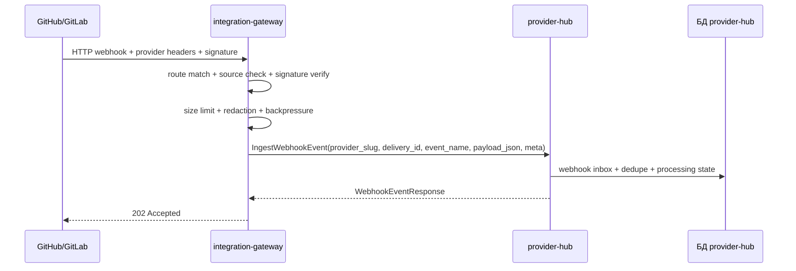
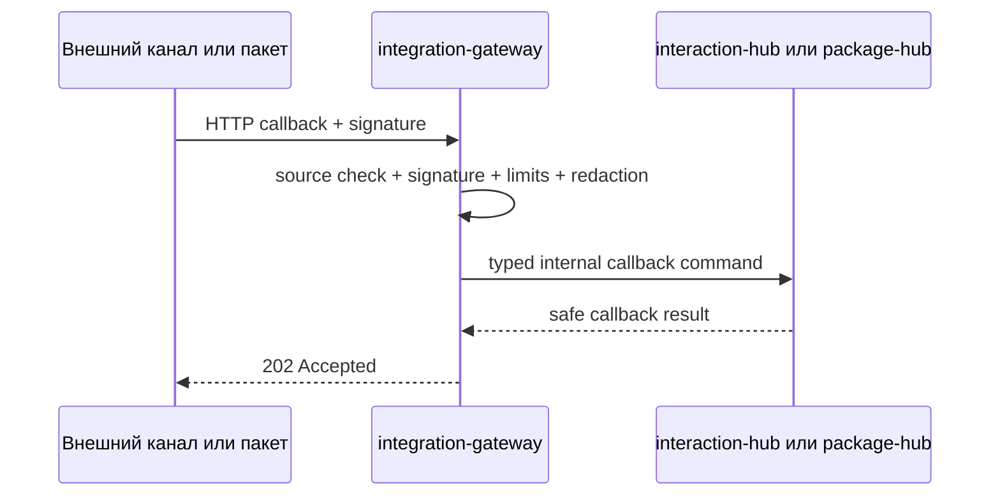

# Дизайн integration-gateway

## TL;DR

- Что меняем: выделяем `integration-gateway` как тонкий HTTP-вход для внешних webhook и callback событий.
- Почему: внешние системы должны попадать в платформу через отдельную пограничную поверхность с проверкой источника, подписи, лимитов, размера payload и backpressure.
- Основные компоненты: HTTP router, OpenAPI validation, source registry, signature verifier interface, payload guard, redactor, backpressure guard, idempotency mapper, gRPC router к сервисам-владельцам и bounded diagnostics.
- Риски: превратить gateway в второй `provider-hub`, начать хранить business state или смешать внешние callback события с UI/staff/user API.

## Цели

- Зафиксировать границу `integration-gateway` до сервисного кода.
- Описать первый MVP-маршрут: provider webhook -> проверенный internal gRPC вызов `provider-hub.IngestWebhookEvent`.
- Отделить edge-проверки от provider business normalization.
- Подготовить единый HTTP-контур для будущих callback событий внешних каналов и пакетов без смешивания с `staff-gateway` или `user-gateway`.
- Зафиксировать требования к безопасности, retry, идемпотентности, backpressure и очистке данных.

## Не-цели

- Не реализовывать storage, Kubernetes manifests или полный provider webhook route с проверкой подписи в сервисном каркасе IGW-1.
- Не переносить webhook inbox, provider projections, cursors, операции провайдера или reconciliation из `provider-hub`.
- Не парсить бизнес-смысл GitHub/GitLab событий глубже edge envelope.
- Не создавать UI endpoints.
- Не принимать Codex hook events и MCP tools.
- Не хранить значения секретов, сырые токены, большие payload, полные provider responses или бизнес-проекции.

## Граница сервиса

| Владеет `integration-gateway` | Не владеет |
|---|---|
| Публичный HTTP endpoint внешней интеграции, проверка источника и подписи, лимиты, payload size guard, redaction, backpressure, edge envelope, correlation/idempotency mapping, маршрутизация во внутренний сервис-владелец, ограниченная диагностика входа. | Provider webhook inbox, provider projection, provider event normalization, sync cursors, provider operations, project policy, interaction delivery state, risk decisions, Codex hooks, MCP tools, UI сценарии. |

Главное правило: `integration-gateway` отвечает на вопрос «можно ли принять этот внешний HTTP-сигнал и как безопасно передать его владельцу». Он не отвечает на вопрос «что означает это событие для домена».

## Ответственность соседних сервисов

| Сервис | Ответственность | Роль gateway |
|---|---|---|
| `provider-hub` | Webhook inbox, дедупликация, нормализация provider events, provider projections, reconciliation, лимиты и provider operations. | Получает от gateway проверенный `IngestWebhookEvent` и сам решает бизнес-обработку. |
| `interaction-hub` | Диалоги, доставка запросов, внешние каналы, delivery attempts и callback lifecycle. | Получает будущие проверенные callback события внешних каналов. |
| `package-hub` | Пакеты, manifest, установки и package-owned runtime metadata. | Получает будущие проверенные callback события пакетов, если пакетный контракт это требует. |
| `codex-hook-ingress` | Нормализованные Codex hook events от hook emitter или sidecar. | Не использует `integration-gateway`; это отдельный внутренний входной контур. |
| `platform-mcp-server` | MCP tools для агентов и manager-контуров. | Не принимает внешние webhooks и callbacks. |
| `staff-gateway` / `user-gateway` | HTTP API для UI сотрудников и внешних пользователей. | Не принимает внешние интеграционные события. |

## Компоненты

| Компонент | Назначение |
|---|---|
| HTTP router | Принимает публичные webhook/callback запросы по OpenAPI gateway-поверхности. |
| OpenAPI validation | Загружает `specs/openapi/integration-gateway.v1.yaml` на старте и валидирует входящие HTTP requests по контракту. |
| Source registry | Сопоставляет входящий route, provider/channel slug и ожидаемый способ проверки. В MVP допускается статическая конфигурация deployment; динамический registry добавляется отдельным срезом. |
| Signature verifier | Проверяет подписи GitHub/GitLab или callback secret по ссылке на секрет. Значение секрета держится только в памяти процесса. |
| Payload guard | Отклоняет слишком большие payload и неподдерживаемые content type до gRPC-вызова владельца. |
| Redactor | Удаляет секретоподобные заголовки и небезопасные диагностические поля из логов, ошибок, метрик и audit summary. |
| Backpressure guard | Ограничивает входящий поток по source, provider, route и downstream-сервису. |
| Idempotency mapper | Извлекает delivery id или строит безопасный idempotency key для передачи владельцу. |
| gRPC router | Вызывает сервис-владелец по внутреннему контракту и не выполняет доменную обработку. |
| Bounded diagnostics | Возвращает и пишет только короткие статусы и безопасные причины отказа. |

## Первый MVP-поток provider webhook

`integration-gateway` передаёт в `provider-hub` минимальный transport envelope: `provider_slug`, `delivery_id`, `event_name`, `payload_json`, `received_at` и безопасный `CommandMeta`. Он не извлекает provider work item, не строит проекцию и не решает, какие доменные события публиковать.

В сервисном каркасе IGW-1 этот route смонтирован как отключённый по умолчанию stub: он валидирует HTTP-контракт, отдаёт безопасные ошибки и фиксирует provider-hub client interface, но не принимает webhook как проверенный, пока не подключён verifier подписи и source binding.

Если provider не даёт устойчивый delivery id, gateway отклоняет запрос или строит idempotency key только по заранее согласованному правилу source registry. Само доменное дублирование webhook остаётся в `provider-hub`.

## Будущие callback потоки

Для внешних каналов и пакетов gateway выполняет тот же edge-контур:

Конкретный owner-service и gRPC-контракт callback фиксируются в доменном пакете владельца. Gateway не хранит состояние доставки или решения.

## Безопасность

### Проверка источника

Каждый route должен иметь:

- `source_type`: provider webhook, channel callback, package callback или другой утверждённый тип;
- публичный route и ожидаемый provider/channel/package slug;
- allowed methods и content types;
- способ проверки подписи или токена;
- ссылку на секрет, если проверка требует secret;
- лимиты размера, частоты и downstream timeout;
- target owner service и внутреннюю операцию.

Запрос отклоняется до gRPC-вызова владельца, если route неизвестен, подпись невалидна, source отключён, payload слишком большой или backpressure guard закрыт.

### Секреты и redaction

Запрещено писать в логи, события, ошибки, метрики и audit summary:

- webhook secret, tokens, authorization headers и private keys;
- полные подписи, если их можно использовать как чувствительный материал;
- полный provider payload в логах gateway;
- большие callback payload и вложения;
- внутренние адреса, если они раскрывают приватную инфраструктуру.

Разрешённый минимум: provider/channel slug, route id, delivery id, event name, payload size, digest, безопасная причина отказа, latency, downstream status и correlation id.

### Rate limits и backpressure

- Лимиты задаются по route, source, provider/channel slug, IP/ASN при необходимости и downstream owner service.
- При перегрузке gateway возвращает `429` или `503` без постановки скрытой фоновой работы.
- Timeout downstream gRPC меньше общего HTTP timeout, чтобы внешний отправитель получил контролируемый ответ.
- Retry внешнего отправителя должен быть безопасен: provider webhook route передаёт delivery id в `provider-hub`, который дедуплицирует событие.

## Наблюдаемость

| Область | Что измерять |
|---|---|
| HTTP вход | Количество запросов, статус, route, source type, payload size bucket, latency. |
| Проверки | Отказы подписи, неизвестные source, превышение размера, redaction hits. |
| Backpressure | Rate limited, downstream unavailable, queue saturation или rejected before owner call. |
| gRPC маршруты | Owner service, method, latency, status, retryable/non-retryable classification. |

## Риски

| Риск | Митигирующее решение |
|---|---|
| Gateway начнёт хранить provider state. | Provider webhook сохраняется только в `provider-hub`; gateway хранит не больше bounded diagnostics. |
| Edge начнёт парсить GitHub/GitLab payload как бизнес-объекты. | Gateway извлекает только route, event name, delivery id, payload size/digest и source metadata. |
| Внешний callback смешается с UI API. | Callback endpoints живут в `integration-gateway`, UI endpoints — в `staff-gateway`/`user-gateway`. |
| Потеря webhook из-за сетевой ошибки. | Внешний sender повторяет запрос; `provider-hub` дедуплицирует по delivery id; сверка остаётся обязательной защитой от потерь. |
| Утечка секретов в диагностике. | Redactor применяется до логов, метрик, ошибок и audit summary. |

## Апрув

- request_id: `owner-2026-05-25-integration-gateway-igw-0`
- Решение: approved
- Комментарий: граница `integration-gateway` согласована как целевое состояние IGW-0.
