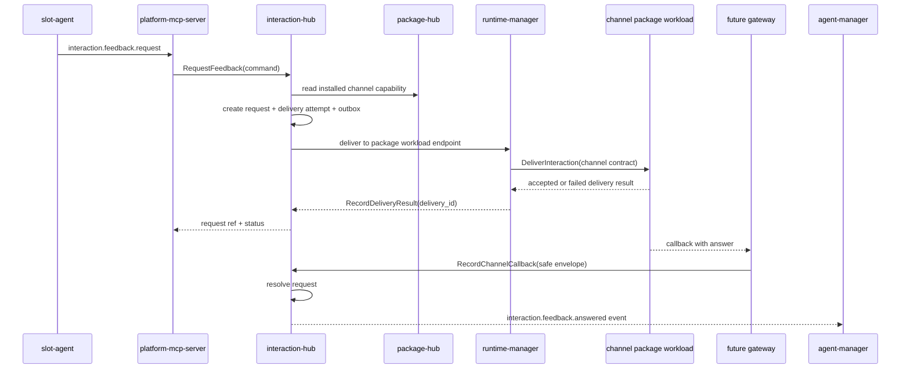
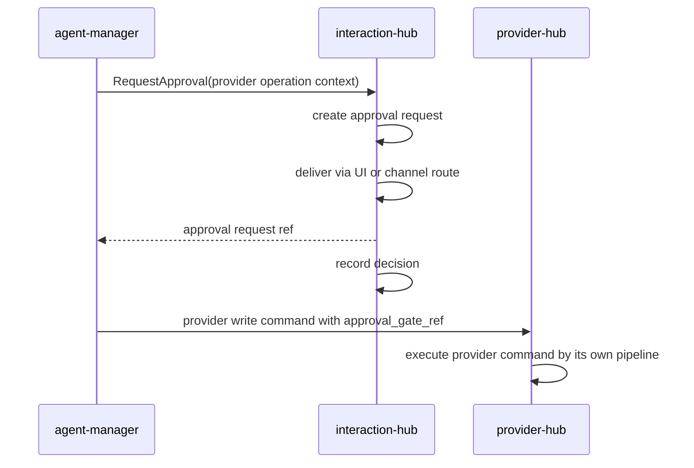
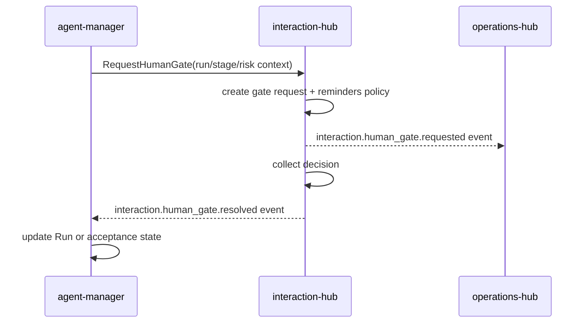
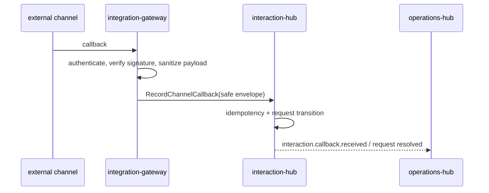

# Детальный дизайн: центр взаимодействий

## TL;DR

- Что меняем: выделяем `interaction-hub` как владельца диалогов, запросов к человеку, approval request, Human gate, уведомлений, подписок, delivery attempts и callback внешних каналов.
- Почему: owner feedback loop и dual-surface inbox должны иметь один lifecycle независимо от UI, голоса, MCP или внешнего канала.
- Основные компоненты: БД `interaction-hub`, lifecycle engine запросов, delivery planner, channel contract boundary, callback resolver, subscription engine и outbox `interaction.*`.
- Риски: превратить `interaction-hub` в UI, gateway, runtime плагинов, package-hub или agent-manager. Эти контуры остаются у соседних владельцев.

## Цели

- Зафиксировать границы `interaction-hub` до контрактов и кода.
- Подготовить первый кодовый PR с proto/AsyncAPI контрактами и следующий PR с сервисным каркасом.
- Описать единый lifecycle feedback, approval, Human gate и notification delivery.
- Закрепить гибридную модель внешних каналов: package-owned runtime плюс stable channel delivery/callback contract.
- Развести `interaction-hub`, `agent-manager`, `platform-mcp-server`, `codex-hook-ingress`, `provider-hub`, `operations-hub`, future gateways и plugin packages.

## Не-цели

- Не реализовывать код, proto, AsyncAPI, OpenAPI или gateway в стартовом документационном срезе.
- Не проектировать конкретный внешний канал.
- Не выбирать vendor-specific список каналов.
- Не владеть flow, `Run`, session, acceptance, runtime job, provider write operation, package installation или UI state.
- Не заменять пакетную модель новым магазином, каталогом или отдельным plugin registry.

## Граница сервиса

| Владеет `interaction-hub` | Не владеет |
|---|---|
| Диалоговые ветки, сообщения, feedback request, approval request, Human gate request, уведомления, подписки, delivery route choice, delivery attempts, reminders, callback records, решения человека, события `interaction.*`. | Flow, stage, role, prompt, agent session, agent `Run`, acceptance result, provider write pipeline, provider projections, package catalog, package installation, runtime job, Kubernetes workload, UI, внешний HTTP gateway, операции биллинга. |

Правило: `interaction-hub` отвечает за вопрос "какой запрос к человеку существует, как он доставляется и какое решение получено". Соседний сервис-владелец отвечает за то, как это решение меняет его собственное состояние.

## Выбранная модель внешних каналов

Выбрана гибридная модель:

1. Канал поставляется как `plugin` package через `package-hub`.
2. `package-hub` владеет package entry, version, manifest, installation, secret schema и verification.
3. `runtime-manager` и `fleet-manager` исполняют runtime-нагрузку установленного пакета.
4. `interaction-hub` хранит только channel binding refs, delivery attempts, callback records и lifecycle запроса.
5. Стабильный `ChannelDeliveryContract` описывает delivery command, delivery result, callback envelope и error model.
6. Future `integration-gateway` или другой профильный gateway принимает внешний HTTP callback, проверяет публичную подпись и маршрутизирует безопасный внутренний вызов в `interaction-hub`.

Эта модель не фиксирует OpenAPI как текущий источник правды. OpenAPI для внешнего gateway создаётся отдельным срезом, когда будет утверждён сам gateway. На доменной границе сейчас фиксируется payload и lifecycle channel contract, а не транспорт конкретного gateway.

## Компоненты

| Компонент | Назначение |
|---|---|
| `interaction-hub` | Сервис-владелец домена взаимодействий. |
| БД `interaction-hub` | Диалоги, запросы, уведомления, подписки, попытки доставки, callback, command result и outbox. |
| Lifecycle engine | Переходы feedback, approval, Human gate и one-way notification/reminder. |
| Delivery planner | Выбор допустимого delivery route по scope, policy, подпискам и channel capability. |
| Channel contract boundary | Стабильный контракт доставки в установленный channel package и обратного callback. |
| Callback resolver | Идемпотентная привязка callback к delivery attempt и request. |
| Subscription engine | Правила подписки на события и области, создание notification intent и reminders. |
| Outbox-доставщик | Публикация `interaction.*` событий через `platform-event-log`. |

## Основные потоки

### Slot-агент просит обратную связь

Slot-агент не выбирает внешний канал и не получает секреты канала. MCP проверяет actor/source/run/session/slot binding и маршрутизирует команду к владельцу. `interaction-hub` не создаёт runtime job сам: delivery command передаётся в уже согласованный runtime boundary для package workload, а публичный callback проходит через профильный gateway.

### Approval request для provider write

`interaction-hub` не выполняет provider write. Он возвращает проверяемую ссылку на принятое решение, а `provider-hub` применяет свой typed write pipeline.

### Human gate в agent flow

`agent-manager` остаётся владельцем `Run`, stage и acceptance. `interaction-hub` хранит запрос и решение.

### Callback внешнего канала

Публичная проверка подписи и rate limit живут в future gateway. `interaction-hub` принимает только безопасный внутренний envelope.

## Channel delivery contract

Контракт канала описывает смысл данных, которые передаются установленному channel package. Транспорт и конкретный gateway не фиксируются этим документом.

### Delivery command

| Поле | Назначение |
|---|---|
| `delivery_id` | Идемпотентный идентификатор попытки доставки. |
| `request_ref` | Ссылка на feedback, approval или Human gate request. |
| `notification_ref` | Ссылка на one-way notification или reminder, если delivery не связан с request. |
| `delivery_kind` | `feedback`, `approval`, `human_gate`, `notification`. |
| `scope` | Организация, проект, репозиторий или platform scope. |
| `recipient_refs` | Пользователи, группы или роли получателей без раскрытия лишних PII. |
| `message_template_ref` | Ссылка на локализуемый шаблон или безопасный текст сообщения. |
| `actions` | Допустимые действия решения: answer, approve, reject, defer, acknowledge или custom action key. |
| `callback_ref` | Внутренняя ссылка, по которой gateway сможет сопоставить callback. |
| `correlation_id` | Связь с run, provider operation, runtime job, issue или инцидентом. |
| `expires_at` | Срок действия запроса или попытки доставки. |
| `retention_class` | Политика хранения callback и вложений. |

### Delivery result

| Поле | Назначение |
|---|---|
| `delivery_id` | Та же попытка доставки. |
| `accepted` | Пакет принял попытку к доставке. |
| `channel_message_ref` | Безопасная ссылка на сообщение канала, если она есть. |
| `retry_after` | Когда можно повторить, если ошибка временная. |
| `error_code` | Короткий безопасный код ошибки. |
| `error_class` | `temporary`, `permanent`, `auth`, `rate_limited`, `policy`. |

### Callback envelope

| Поле | Назначение |
|---|---|
| `callback_id` | Идемпотентный идентификатор callback от gateway или channel package. |
| `delivery_id` | Связь с попыткой доставки. |
| `request_ref` | Исходный запрос. |
| `actor_ref` | Проверенный пользователь, внешний субъект или service principal. |
| `action` | Выбранное действие. |
| `answer_summary` | Короткая безопасная сводка ответа. |
| `answer_object_ref` | Ссылка на полный ответ или вложения, если они хранятся вне PostgreSQL. |
| `received_at` | Время получения callback. |
| `signature_status` | Результат проверки gateway, без сырой подписи. |

## Междоменные связи

| Домен или сервис | Связь |
|---|---|
| `agent-manager` | Создаёт feedback, Human gate и approval requests; получает события решения и сам меняет `Run`, session и acceptance. |
| `platform-mcp-server` | Публикует MCP tools `interaction.*`, проверяет source/run/session/slot binding и маршрутизирует вызовы к `interaction-hub`. |
| `codex-hook-ingress` | Передаёт нормализованные hook events, которые требуют разрешения, вопроса или уведомления человеку. |
| `provider-hub` | Использует `approval_gate_ref` и provider refs; provider write pipeline остаётся у `provider-hub`. |
| `package-hub` | Даёт сведения об установленном channel package, manifest capability и required platform APIs; установка и секреты пакета остаются там. |
| `runtime-manager` и `fleet-manager` | Исполняют runtime-нагрузку channel package; `interaction-hub` не создаёт jobs сам. |
| `access-manager` | Проверяет права создания запроса, принятия решения, чтения статуса и использования channel package. |
| `operations-hub` | Получает события и читает авторитетные статусы для операторской очереди и dual-surface inbox. |
| Future gateways | Выполняют внешнюю аутентификацию, public rate limit, signature verification и маршрутизацию callback. |

## События

Минимальные события:

- `interaction.thread.created`;
- `interaction.message.recorded`;
- `interaction.feedback.requested`;
- `interaction.approval.requested`;
- `interaction.human_gate.requested`;
- `interaction.notification.requested`;
- `interaction.subscription.updated`;
- `interaction.delivery.requested`;
- `interaction.delivery.accepted`;
- `interaction.delivery.failed`;
- `interaction.delivery.reminder_scheduled`;
- `interaction.callback.received`;
- `interaction.request.answered`;
- `interaction.request.approved`;
- `interaction.request.rejected`;
- `interaction.request.expired`;
- `interaction.request.cancelled`.

События публикуются через service-local outbox и общий `platform-event-log`. Payload не содержит сырой внешний payload, токены, secret refs, полные медиа, полный prompt или большие вложения.

## Конкурентные изменения

- Каждый изменяемый request имеет `version`.
- Команда решения передаёт expected version или идемпотентный `decision_id`.
- Повтор callback с тем же `callback_id` возвращает уже сохранённый безопасный результат.
- Две разные попытки решить один request конфликтуют, если request уже находится в terminal state.
- Долгие ожидания человека не держат SQL-блокировку; срок ожидания хранится в request и reminder policy.
- Повтор delivery command не создаёт новую попытку, если `delivery_id` уже принят с тем же безопасным отпечатком.

## Наблюдаемость

- Логи: request id, request kind, scope, source service, delivery id, channel package ref, correlation id, outcome и safe error code.
- Метрики: количество активных запросов, время до первого delivery attempt, время до решения, retry count, callback duplicates, expired requests и delivery failures.
- Трейсы: входящий gRPC/MCP, проверка доступа, выбор delivery route, вызов channel package, запись callback, outbox publish.
- Алерты: рост застрявших Human gate, массовые ошибки delivery, истёкшие approval requests, недоступность channel package и всплеск callback conflicts.

## Риски

| Риск | Митигирующее решение |
|---|---|
| `interaction-hub` начнёт владеть flow/run/session. | В request хранить только refs; переходы `Run` выполняет `agent-manager`. |
| Внешний канал станет источником правды. | Channel package только доставляет и возвращает callback; lifecycle request хранится в `interaction-hub`. |
| Домен превратится в gateway. | Публичная аутентификация, подпись и HTTP находятся в future gateway; домен принимает безопасный internal envelope. |
| Домен начнёт управлять пакетами. | Использовать `package-hub` readings и refs, не менять installation и manifest. |
| Provider write смешается с approval. | `interaction-hub` хранит решение; `provider-hub` выполняет write по своей политике и pipeline. |

## Апрув

- request_id: `owner-2026-05-22-interaction-hub-kickoff`
- Решение: approved
- Комментарий: дизайн `interaction-hub` согласован как стартовое целевое состояние; внешний канал подключается через package-owned runtime и стабильный channel contract.
