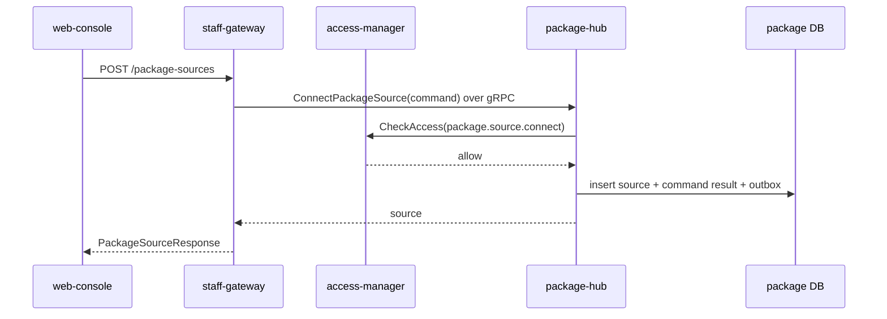
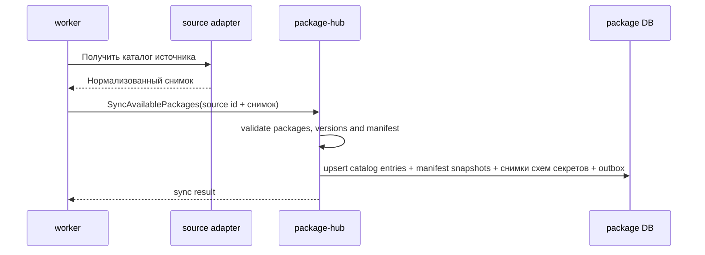
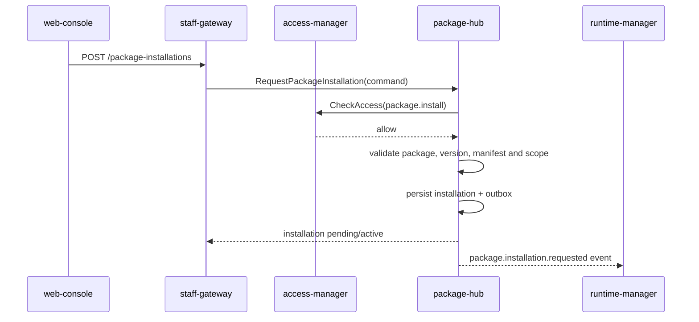
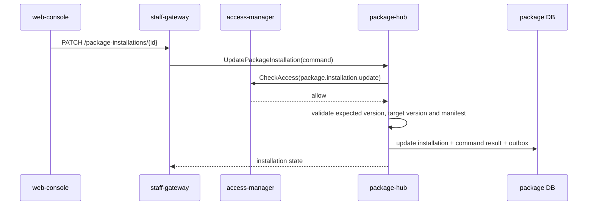
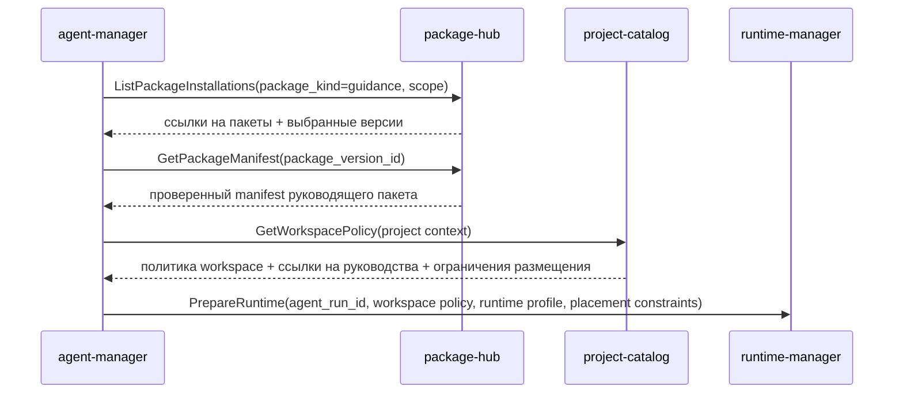
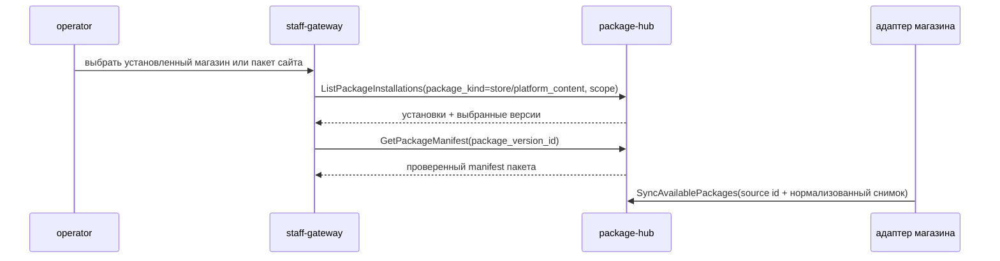

# Детальный дизайн: пакетная платформа

## TL;DR

- Что меняем: вводим `package-hub` как сервис-владелец пакетов, источников магазинов, доступного каталога, установок, версий, manifest и верификации.
- Почему: пакеты должны быть управляемым расширением платформы, а не набором неявных submodule, ручных инструкций и встроенных интеграций.
- Основные компоненты: БД `package-hub`, gRPC API, outbox событий, валидатор manifest, синхронизатор доступного каталога и чтения установленных пакетов.
- Риски: превратить `package-hub` в магазин пакетов, runtime-оркестратор, биллинг или Git-провайдер. Эти контуры должны оставаться в своих доменах.

## Цели

- Зафиксировать границу `package-hub`.
- Подготовить кодовые срезы без старой реализации из `deprecated/**`.
- Дать другим сервисам авторитетные чтения о доступных и установленных пакетах.
- Разделить пакетную истину, runtime-исполнение, provider-native операции и коммерческий контур.

## Не-цели

- Не реализовывать магазин пакетов как часть ядра `package-hub`.
- Не запускать runtime-нагрузки плагинов.
- Не делать checkout источников пакета внутри `package-hub`.
- Не выставлять счета и не принимать платежи.
- Не делать UI в этом домене.

## Граница сервиса

| Владеет `package-hub` | Не владеет |
|---|---|
| Источники магазинов, локальный доступный каталог, локальный установленный каталог, версии пакетов, снимки manifest, статусы проверки, схемы секретов, статус заполненности секретов установки, требования API платформы, ценовые метаданные, события `package.*`. | Бизнес-логика магазина, исходники пакетов как Git-истина, webhook провайдера, runtime-нагрузки, Kubernetes, счета биллинга, сырые секреты, канонические ссылки на заполненные секреты, проектная документация, пользовательский интерфейс. |

Магазин пакетов является устанавливаемым пакетом. `package-hub` знает подключение к магазину, синхронизирует каталог и управляет локальными установками, но не становится владельцем бизнес-логики магазина или его публичного сайта.

Source submodule пакетов остаются одним из способов получить пакет в рабочий контур. `package-hub` хранит проверенную пакетную метаинформацию, версию, источник и статус, а не заменяет Git, объектное хранилище или runtime.

## Компоненты

| Компонент | Назначение |
|---|---|
| `package-hub` | Сервис-владелец пакетного домена. |
| БД `package-hub` | Каноническое состояние источников магазинов, пакетов, версий, установок и проверок. |
| Валидатор manifest | Проверяет структуру пакета, права, схему секретов, runtime-требования и локализованные метаданные. |
| Синхронизатор каталога | Получает доступные пакеты из подключённых магазинов и пользовательских источников. |
| Outbox-доставщик | Публикует `package.*` события после фиксации транзакции. |
| Чтения пакетов | Возвращают доступные и установленные пакеты для сервисов, gateway и MCP-инструментов. |

## Основные потоки

### Подключение источника магазина

Внешняя HTTP-поверхность появляется через `staff-gateway`. Сам `package-hub` остаётся внутренним gRPC-сервисом и не содержит UI-логики.

### Синхронизация доступного каталога

Синхронизация не делает пользовательский запрос зависимым от внешнего магазина. UI и внутренние сервисы читают локальный доступный каталог. `package-hub` не получает данные из Git/store/provider сам: адаптер источника готовит нормализованный снимок, а сервис атомарно сохраняет его вместе с событиями.

Блок `secrets` из manifest нормализуется в `PackageSecretSchema` и сохраняется вместе с новой или изменённой версией пакета. Если digest схемы уже есть для этой версии, дубль не создаётся. Чтение схемы идёт через `GetPackageSecretSchema`; обновление статуса заполненности конкретной установки требует отдельного контракта с `access-manager`, потому что канонические привязки секретов не принадлежат `package-hub`. После появления ссылок от `access-manager` пакетный домен использует только `secretresolver.Checker`, чтобы проверить наличие секрета без возврата значения вызывающему коду.

### Установка пакета

`package-hub` фиксирует установку и публикует событие. Если пакет требует runtime-нагрузку, `runtime-manager` выполняет техническую работу по своему контракту.

### Изменение и снятие установки

Отключение и снятие установки идут отдельными командами `DisablePackageInstallation` и `UninstallPackage`, чтобы события `package.installation.disabled` и `package.installation.uninstalled` не смешивались с обычным изменением версии или desired state. `package-hub` не удаляет runtime-нагрузку сам: он меняет локальное состояние и публикует событие для runtime-контура.

### Использование руководящего пакета агентом

Руководящий пакет не смешивается с проектной документацией. `project-catalog` отвечает за проектные источники и политику рабочего контура, `package-hub` отвечает за пакет, выбранную версию, установку в scope и проверенный снимок manifest. Отдельный RPC для руководящих пакетов не нужен: будущий `agent-manager` получает их через `ListPackages`, `ListPackageInstallations` с фильтром `package_kind=guidance` и `GetPackageManifest`, а checkout и mount документов выполняет не `package-hub`.

### Использование пакета магазина и пользовательского контента платформы

`store` и `platform_content` остаются пакетами в общей модели `PackageEntry`/`PackageInstallation`. `package-hub` хранит источник, пакет, версию, установку, manifest, ценовые признаки и статусы проверки. Бизнес-логика магазина, выдача внешнего каталога, provider-native состояние репозитория, runtime-размещение и файлы сайта или документации остаются за внешним магазином, `provider-hub`, `runtime-manager` и `fleet-manager`.

## Manifest пакета

Manifest является обязательным файлом репозитория-источника пакета. Точный формат будет закреплён в контрактном срезе, но домен уже исходит из следующих блоков:

| Блок | Назначение |
|---|---|
| `identity` | Slug, вид пакета, издатель, лицензия, локализованные название и описание. |
| `source` | Репозиторий, допустимые ref, версия, digest и способ получения. |
| `capabilities` | Возможности пакета: внешний канал, MCP-инструмент, руководство, сайт, магазин. |
| `required_platform_apis` | Какие API платформы нужны пакету. |
| `required_access_actions` | Какие системные действия доступа нужно выдать пакету или его runtime-нагрузке. Ключи должны существовать в общем каталоге `libs/go/accesscatalog`; произвольные динамические действия в этом поле не допускаются без отдельного контрактного расширения. |
| `secrets` | Локализованные поля секретов, типы, обязательность и подсказки. |
| `runtime` | Требования runtime-нагрузки, Kubernetes-манифесты, ресурсы, health и ограничения. |
| `pricing` | Бесплатный, платный или коммерчески ограниченный пакет. |
| `verification` | Проверенная версия, статус доверия и ограничения установки. |

## Виды пакетов

`package_kind` является доменным классификатором поведения пакета. Он хранится в `PackageEntry`, дублируется в `identity.kind` manifest и используется в чтениях каталога и установок. Вид пакета не заменяет `capabilities`: вид определяет границу ответственности, а `capabilities` уточняет конкретные возможности внутри этой границы.

| Вид | Назначение | Правила manifest |
|---|---|---|
| `plugin` | Расширяет поведение платформы: внешний канал, MCP-инструмент, webhook, уведомления, approval или другой исполняемый адаптер. | Может объявлять API платформы, действия доступа, секреты и runtime-требования. Не должен использовать зарезервированные capability `guidance`, `store`, `platform_content`, чтобы не смешивать вид плагина с другими видами пакетов. |
| `guidance` | Поставляет руководящую документацию, правила, шаблоны и инструкции для рабочих контуров агентов. | Должен объявить capability `guidance`. Не может требовать runtime-нагрузку, секреты, действия доступа или API платформы: сами документы остаются в репозитории-источнике и подключаются в workspace через соседние домены. |
| `store` | Поставляет магазин пакетов как устанавливаемый пакет и источник доступного каталога. | Должен объявить capability `store`. Может иметь runtime, секреты, действия доступа и API платформы, если это нужно самому магазину, но бизнес-логика магазина остаётся внутри пакета магазина, а `package-hub` хранит только локальную пакетную истину. |
| `platform_content` | Поставляет пользовательский контент платформы: сайт, справку, API-документацию, правила разработки пакетов и добавления в каталог. | Должен объявить capability `platform_content`. Не может требовать секреты, действия доступа или API платформы; runtime допустим только как способ доставки статического или пользовательского контента, без хранения файлов в БД `package-hub`. |

Capability `guidance`, `store` и `platform_content` являются зарезервированными и взаимоисключающими для специализированных видов. Если manifest смешивает эти capability в одном пакете, `package-hub` отклоняет снимок как невалидный, чтобы вид пакета оставался границей ответственности.

Модели чтения по видам не создают отдельные таблицы. Авторитетные чтения используют фильтр `package_kind` в `ListPackages` и `ListPackageInstallations`; repository-слой индексирует `(source_id, package_kind, status)` для каталога и соединяет установки с пакетами при фильтрации установок.

## Междоменные связи

| Домен | Связь |
|---|---|
| `access-manager` | Проверяет права на источники, установки, верификацию и управление scope пакета; владеет каноническими ссылками на заполненные секреты. |
| `provider-hub` | Отражает Git-истину репозиториев пакетов, webhook, PR и доступность источника. |
| `project-catalog` | Хранит проектную политику, где пакетные источники и руководящие пакеты могут участвовать в рабочем контуре. |
| `runtime-manager` | Исполняет runtime-нагрузку, checkout, подготовку локального источника и технические задания. |
| `fleet-manager` | Предоставляет допустимые кластеры и контуры размещения для runtime-нагрузки пакета. |
| `agent-manager` | Использует установленные руководящие пакеты, роли и возможности пакетов при подготовке агентной работы. |
| `interaction-hub` | Использует пакеты внешних каналов как подключаемый способ доставки сообщений и согласований. |
| `billing-hub` | Использует ценовые метаданные, установки и факты использования для будущего расчёта. |

## События

Минимальные события:
- `package.source.connected`;
- `package.source.updated`;
- `package.source.disabled`;
- `package.catalog.synced`;
- `package.package.discovered`;
- `package.package.updated`;
- `package.version.discovered`;
- `package.version.updated`;
- `package.version.revoked`;
- `package.verification.updated`;
- `package.installation.requested`;
- `package.installation.activated`;
- `package.installation.updated`;
- `package.installation.disabled`;
- `package.installation.uninstalled`;
- `package.secret_schema.updated`.

События публикуются через сервисный outbox и общий `platform-event-log`. Потребители строят свои проекции или запускают собственную бизнес-логику, но не меняют каноническое состояние `package-hub` напрямую.

Физическое удаление не является штатным бизнес-сценарием первой версии. Завершение жизненного цикла выражается через `disabled`, `revoked` или `uninstalled`.

## Конкурентные изменения

- Изменяемые агрегаты имеют версию.
- Команда, основанная на ранее прочитанном состоянии, передаёт ожидаемую версию.
- Сервис выполняет проверку manifest, scope, секретов и прав в одной короткой транзакции там, где меняет своё состояние.
- Проверка заполненности секретов установки не читает значения секретов: `package-hub` проверяет только статус доступности по ссылкам, полученным из `access-manager`.
- При конфликте вызывающая сторона перечитывает актуальное состояние.
- Долгие операции, например запуск runtime-нагрузки или checkout, не держат SQL-блокировку и выполняются в runtime-контуре как отдельное задание.

## Наблюдаемость

- Логи: команда, пакет, версия, источник, scope, actor, correlation id, результат.
- Метрики: количество источников, синхронизаций, установок, ошибок manifest, ошибок доступа к источнику и конфликтов версий.
- Трейсы: входящий gRPC, проверка доступа, валидация manifest, слой репозитория, публикация outbox.
- Алерты: сбой синхронизации магазина, отзыв установленной версии, систематическая ошибка manifest, потеря доступа к приватному источнику.

## Апрув

- request_id: `owner-2026-05-06-package-platform-kickoff`
- Решение: approved
- Комментарий: дизайн домена пакетной платформы согласован как целевое состояние стартового среза.
