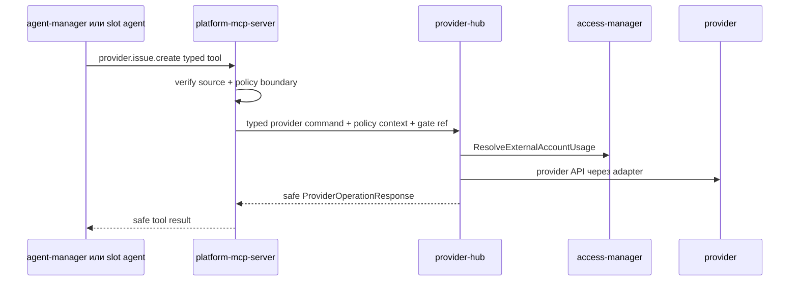
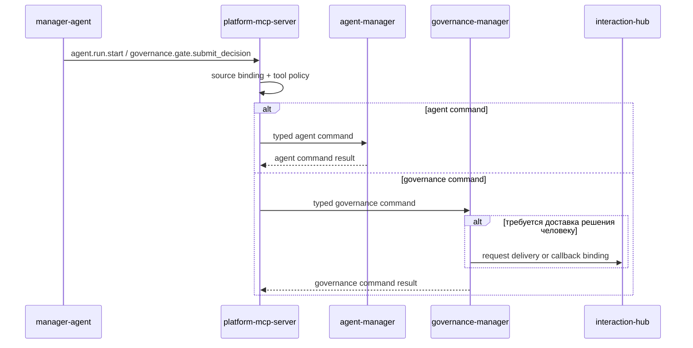
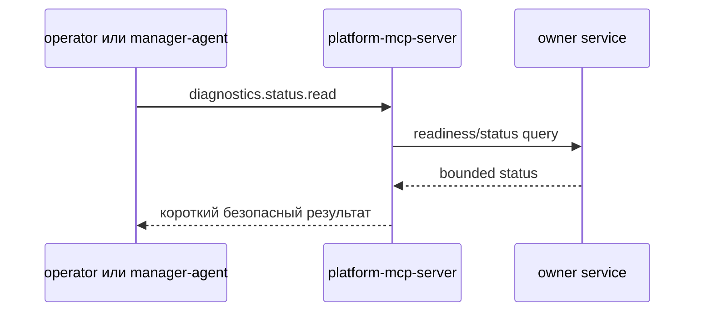

# Дизайн platform-mcp-server

## TL;DR

- Что меняем: выделяем `platform-mcp-server` как тонкую MCP-поверхность платформы.
- Почему: `agent-manager` и slot-агенты должны обращаться к платформе через управляемую MCP-поверхность и policy/auth boundary, а не напрямую к каждому сервису.
- Основные компоненты: MCP-транспорт, source verifier, MCP tool registry, policy boundary, router к сервисам-владельцам, sanitizer, bounded diagnostics и audit emitter.
- Риски: превратить MCP в доменный монолит, хранить сырые данные вызовов или начать обходить `provider-hub` при операциях провайдера.

## Цели

- Зафиксировать границу сервиса до контрактов и кода.
- Разделить MCP-поверхность и доменное владение.
- Зафиксировать, что входной контур Codex hooks вынесен в отдельный `codex-hook-ingress`.
- Подготовить будущие инструменты `agent-manager` без переноса состояния run/session и ожидания flow в MCP.
- Подготовить маршруты `governance-manager` без переноса risk/gate/release decisions в MCP или `agent-manager`.
- Подготовить инструменты provider без обхода `provider-hub` и его provider-native pipeline.

## Не-цели

- Не проектировать полную proto/AsyncAPI спецификацию.
- Не переносить в сервис бизнес-реализацию доменов-владельцев.
- Не создавать БД-модель.
- Не проектировать `staff-gateway` или `interaction-hub`.
- Не переносить бизнес-состояние из сервисов-владельцев.

## Граница сервиса

| Владеет `platform-mcp-server` | Не владеет |
|---|---|
| MCP-поверхность инструментов, нормализация MCP-вызова, проверка источника, минимальная tool-policy, маршрутизация, очистка данных, ограниченная диагностика, idempotency/correlation на границе. | Codex hook events, `Run`, session, flow, stage, role, prompt, risk/gate/release decisions, slot, job, workspace, provider projections, provider write truth, project policy, package installation, dialogue, notification, billing, UI. |

Главное правило: `platform-mcp-server` отвечает на вопрос «можно ли этому источнику вызвать этот инструмент в этом контексте и как безопасно передать вызов владельцу». Он не отвечает на вопрос «как меняется бизнес-состояние домена».

## Ответственность соседних сервисов

| Сервис | Ответственность | Роль MCP |
|---|---|---|
| `agent-manager` | `Run`, session, flow, role, prompt, acceptance, agent lifecycle и состояние ожидания flow. | MCP вызывает только типизированные инструменты agent-manager и не хранит состояние `Run` или ожидания. |
| `governance-manager` | Risk assessment, review signals, gate request/decision, release decision package, release decision и release safety-loop. | MCP вызывает governance-инструменты и не хранит risk/gate/release decision state. |
| `runtime-manager` | Slot, workspace, job, cleanup, prewarm и runtime refs. | MCP маршрутизирует чтения и разрешённые команды runtime, не выбирает slot и не меняет job state сам. |
| `fleet-manager` | Серверы, Kubernetes-кластеры, health и placement decision. | MCP маршрутизирует административные чтения и будущие fleet-инструменты без собственной placement-логики. |
| `provider-hub` | Provider projections, webhook, reconciliation, лимиты, provider write pipeline. | MCP вызывает инструменты provider только через `provider-hub`, не через GitHub/GitLab напрямую. |
| `project-catalog` | Проекты, репозитории, `services.yaml`, workspace policy, release/placement policy. | MCP читает проектную политику только через `project-catalog`. |
| `package-hub` | Пакеты, manifest, установки, catalog, store connections. | MCP читает package/install/manifest через `package-hub`. |
| `interaction-hub` | Диалоги, owner feedback, approval delivery, notifications, callbacks и внешние каналы. | MCP создаёт запросы обратной связи и доставки через `interaction-hub`, когда контракт готов; решения остаются у `governance-manager`. |

## Компоненты

| Компонент | Назначение |
|---|---|
| MCP-транспорт | Принимает вызовы инструментов и возвращает нормализованные ответы. |
| Source verifier | Проверяет actor, source type, run id, session id, slot id, project/repository scope и подпись или токен вызова. |
| Реестр MCP-инструментов | Регистрирует MCP-инструменты через официальный SDK; `tools/list` и snapshot-тесты фиксируют машинно-читаемую поверхность. |
| Policy boundary | Делает минимальную проверку права на инструмент и риск-профиля вызова. Доменную проверку выполняет сервис-владелец. |
| Router | Вызывает сервис-владелец по внутреннему gRPC-контракту. |
| Sanitizer | Удаляет секреты, сырые данные вызова, большие логи и небезопасные поля до маршрутизации, аудита и ответа. |
| Diagnostics guard | Ограничивает размер и тип диагностических ответов. |
| Audit emitter | Фиксирует решения, risky operations, отказы и permission/gate сценарии без сырых данных. |

## Основные потоки

### Provider-инструмент

MCP не выбирает токен провайдера, не хранит секрет и не сохраняет исходные данные провайдера.

### Agent-manager и governance инструменты

`agent-manager` остаётся владельцем `Run`, session и состояния ожидания flow. `governance-manager` владеет gate request/decision и release decision. MCP только проверяет инструментальную границу и маршрутизирует вызов владельцу.

### Ограниченная диагностика

Диагностика не возвращает большие логи, секреты, kubeconfig, исходные данные провайдера, полный stdout/stderr или сырые session files.

## Безопасность

### Контекст вызова

Каждый вызов должен иметь:

- `actor_id` и `actor_type`;
- `source_type`: `agent_manager`, `slot_agent`, `plugin_workload`, `operator`;
- `source_instance_id`;
- `organization_id`, `project_id`, `repository_id`, если применимо;
- `agent_run_id`, `session_id`, `slot_id`, если вызов связан с агентной работой;
- `correlation_id`;
- `command_id` или idempotency key для изменяющих операций;
- `tool_name` и `tool_version`.

Вызов отклоняется, если source не может быть связан с ожидаемым run/slot/session или если область проекта не совпадает с политикой запуска.

### Очистка данных

Запрещено хранить и передавать дальше без отдельного доменного решения:

- значения секретов;
- `Authorization` headers, tokens, private keys;
- полный `tool_input` и `tool_response`;
- полный prompt, если он не является частью диалогового контура `interaction-hub`;
- большие stdout/stderr;
- исходные данные провайдера;
- kubeconfig и Kubernetes objects;
- бинарные данные и вложения.

Разрешённый минимум: тип события, безопасная категория инструмента, hash/digest, object ref, короткая безопасная сводка, exit status, bounded error code, timestamps и correlation id.

### Rate limits и backpressure

- Лимиты задаются по actor, source type, tool group, project scope и dependency route.
- При переполнении очереди MCP возвращает явный retryable error, а не создаёт скрытую фоновую работу без владельца.
- Большие данные вызова отклоняются до маршрутизации.
- Timeout вызова владельца меньше, чем общий timeout MCP-call, чтобы вернуть контролируемую ошибку.

### Аудит

Аудит пишется только для:

- решений policy/gate;
- risky operations;
- отказов доступа;
- provider write operations;
- permission requests;
- изменения статуса run/session через MCP;
- диагностических запросов с повышенным доступом.

Массовые успешные read-only MCP-вызовы не пишутся как полный аудит, но отражаются в метриках и короткой операционной истории с retention.

## Наблюдаемость

| Область | Что измерять |
|---|---|
| Tool calls | Количество, задержка, статус, tool group, owner service. |
| Policy boundary | Allow/deny/ask, причина отказа, риск-класс без данных вызова. |
| Dependencies | Ошибки gRPC, timeout, unavailable, latency per owner service. |
| Safety | Количество удалённых секретоподобных значений, отказы из-за размера данных вызова, срабатывания rate limit. |

## Апрув

- request_id: `owner-2026-05-14-platform-mcp-kickoff`
- Решение: approved
- Комментарий: дизайн `platform-mcp-server` согласован как целевое состояние.
