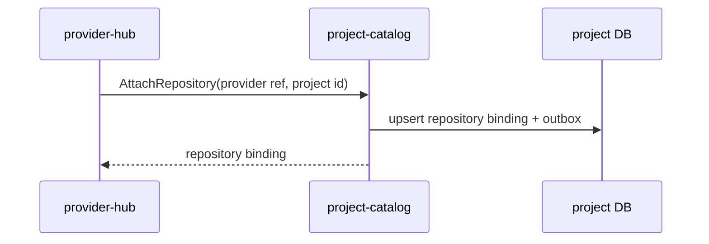
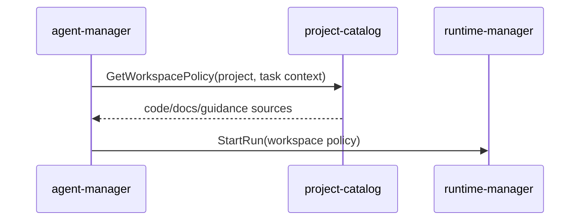

# Детальный дизайн: домен проектов и репозиториев

## TL;DR

- Что меняем: вводим `project-catalog` как сервис-владелец проектов, репозиториев, проектной политики, `services.yaml`, источников проектной документации, правил веток, релизных политик и политики размещения.
- Почему: `provider-hub`, `agent-manager`, `runtime-manager` и пользовательский интерфейс через `api-gateway` должны получать одну авторитетную проектную картину, а не собирать её из провайдера, файлов и локальных настроек.
- Основные компоненты: БД `project-catalog`, gRPC API, outbox событий, валидатор политики, путь чтения политики рабочего контура.
- Риски: смешать проектный каталог с provider-native зеркалом, начать выполнять checkout в этом сервисе, заставить сервисы читать сырой `services.yaml` напрямую или разрешить обход Git/PR для декларативной проектной политики.

## Цели

- Зафиксировать границу `project-catalog`.
- Подготовить кодовые срезы без старой реализации из `deprecated/**`.
- Дать потребителям авторитетные чтения проектной структуры и политики.
- Разделить проектную политику, provider-native артефакты и runtime-исполнение.

## Не-цели

- Не реализовывать GitHub/GitLab API и webhook в `project-catalog`.
- Не хранить рабочие сущности провайдера.
- Не управлять slot, `run`, `job`, build или deploy.
- Не делать UI в этом домене.

## Граница сервиса

| Владеет `project-catalog` | Не владеет |
|---|---|
| Проекты, репозитории, ссылки на иконки проектов и репозиториев, проектная конфигурация, проверенная проекция политики `services.yaml`, управляемой через Git, источники проектной документации, правила веток, релизные политики, релизная линия, политика размещения. | Бинарные файлы иконок, `Issue`, `PR/MR`, комментарии, webhook, лимиты провайдера, checkout рабочего контура, agent runs, slots, jobs, уведомления, вычисление доступа. |

`services.yaml` остаётся переносимым источником намерения для проектной политики, управляемой через Git. Агенты и люди меняют его через PR вместе с кодом. После слияния PR или первичной загрузки `project-catalog` хранит проверенную, типизированную и индексируемую проекцию этой политики с привязкой к исходному commit, хэшу файла, `content_hash` и версии политики. Сервисы платформы читают проекцию из `project-catalog`, а не парсят файл напрямую.

Иконки проектов и репозиториев хранятся как объекты в бакете. `project-catalog` хранит только ссылку `icon_object_uri`; загрузка, проверка формата, преобразование и выдача изображения не входят в границу сервиса.

## Правила изменения `services.yaml`

- Основной путь изменения: агент или человек правит `services.yaml` в PR вместе с кодом и документацией.
- PR должен проходить валидацию `services.yaml`, включая сервисы, зависимости, источники документации, правила выкладки, правила управления рисками и правила обязательного ревью человеком.
- После слияния PR webhook или периодическая сверка передаёт новую версию файла в `project-catalog`.
- `project-catalog` валидирует файл, сохраняет новую проекцию в БД, обновляет типизированные модели чтения и публикует `project.services_policy.updated`.
- Если webhook потерян, сверка сравнивает сохранённые `source_commit_sha`, `source_blob_sha` и `content_hash` с фактическим состоянием репозитория и догоняет проекцию.
- Редактирование декларативной политики из пользовательского интерфейса по умолчанию создаёт PR с изменением `services.yaml`, а не пишет новую политику напрямую в БД.
- Прямое операторское переопределение допустимо только для аварийного случая: с причиной, сроком действия, аудитом, отдельным статусом и явной индикацией, что состояние временно расходится с политикой, управляемой через Git.

## Компоненты

| Компонент | Назначение |
|---|---|
| `project-catalog` | Сервис-владелец проектного домена. |
| БД `project-catalog` | Каноническое состояние проектов и репозиториев, проверенные проекции политик и версии. |
| Валидатор политики | Проверяет `services.yaml`, источники документации, правила веток, релизную политику и политику размещения. |
| Outbox-доставщик | Публикует `project.*` события после фиксации транзакции. |
| Операторские чтения | Возвращают списки проектов, репозиториев, политик и источников документации для внутренних сервисов и `api-gateway`. |

## Основные потоки

### Создание проекта

`web-console` не вызывает внутренние сервисы напрямую. Внешняя поверхность для пользовательского интерфейса живёт в тонком `api-gateway` с OpenAPI-контрактом; `api-gateway` маршрутизирует запросы во внутренние сервисы по gRPC и не содержит доменной логики.

### Подключение репозитория к проекту

`provider-hub` отвечает за факт существования репозитория у провайдера и webhook. `project-catalog` отвечает за то, что репозиторий входит в проект, какую политику использует и какие источники документации с ним связаны.

### Подготовка политики рабочего контура

`project-catalog` не делает checkout. Он отдаёт разрешённый состав источников и режимы доступа.

## Междоменные связи

| Домен | Связь |
|---|---|
| `access-manager` | Проверяет право на проектные команды и чтения. |
| `provider-hub` | Синхронизирует provider-native состояние и вызывает проектные команды привязки. |
| `agent-manager` | Использует проектную политику для выбора flow, контекста и follow-up задач. |
| `runtime-manager` | Получает политику рабочего контура и исполняет checkout/подготовку слота. |
| `fleet-manager` | Даёт допустимые серверные и кластерные контуры для политики размещения. |
| `risk-and-release-governance` | Использует правила веток и релизную политику для релизных решений. |

## События

Минимальные события:
- `project.project.created`;
- `project.project.updated`;
- `project.repository.attached`;
- `project.repository.updated`;
- `project.services_policy.updated`;
- `project.documentation_source.updated`;
- `project.branch_rules.updated`;
- `project.release_policy.updated`;
- `project.placement_policy.updated`.

События публикуются через сервисный outbox и общий `platform-event-log`. Потребители строят свои проекции или запускают свою бизнес-логику, но не меняют каноническое состояние `project-catalog` напрямую.

## Конкурентные изменения

- Все изменяемые агрегаты имеют версию.
- Команда, основанная на ранее прочитанном состоянии, передаёт ожидаемую версию.
- Сервис выполняет проверку инвариантов и запись в одной короткой транзакции.
- При конфликте вызывающая сторона перечитывает актуальное состояние.
- Долгие операции не держат SQL-блокировки; они оформляются через `runtime-manager` как `run`, `job` или slot state.

## Наблюдаемость

- Логи: команда, агрегат, версия, actor, correlation id, результат.
- Метрики: количество команд, конфликтов версий, ошибок валидации политики, задержка чтения списков.
- Трейсы: входящий gRPC, проверка доступа, слой репозитория, публикация outbox.
- Алерты: рост конфликтов, сбой публикации событий, систематическая невалидность `services.yaml`.

## Апрув

- request_id: `owner-2026-05-05-wave8-project-catalog-kickoff`
- Решение: approved
- Комментарий: дизайн домена проектов и репозиториев согласован как целевое состояние стартового среза.
