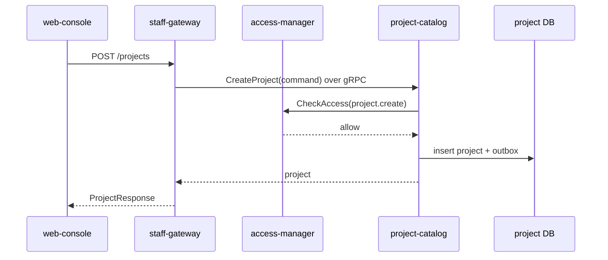
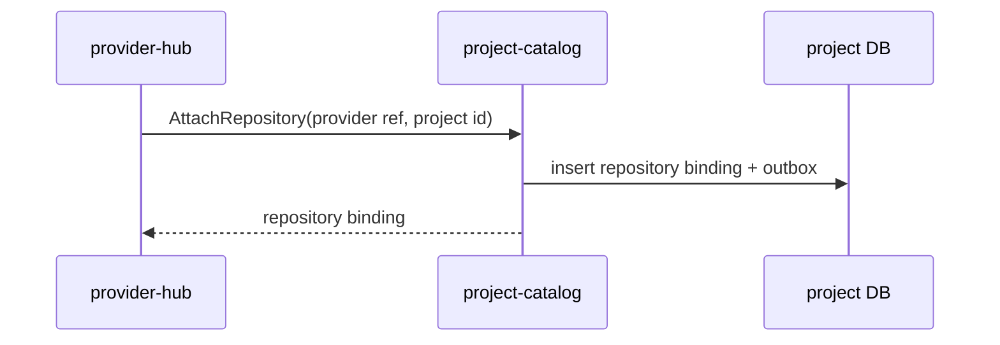
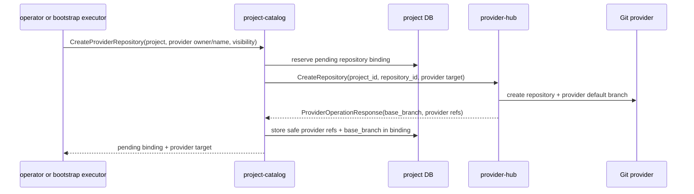
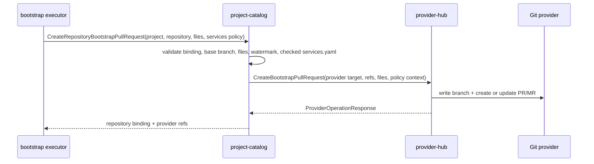
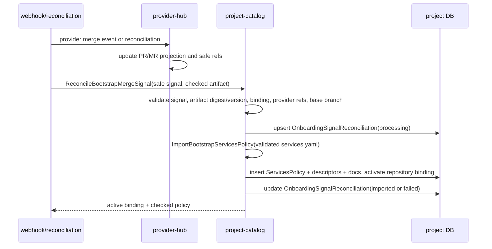
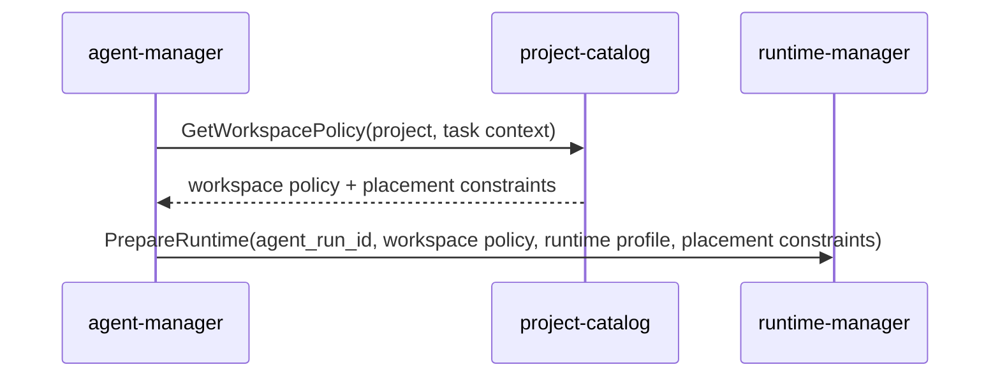

# Детальный дизайн: домен проектов и репозиториев

## TL;DR

- Что меняем: вводим `project-catalog` как сервис-владелец проектов, репозиториев, проектной политики, `services.yaml`, источников проектной документации, правил веток, релизных политик и политики размещения.
- Почему: `provider-hub`, `agent-manager`, `runtime-manager` и пользовательский интерфейс через `staff-gateway` должны получать одну авторитетную проектную картину, а не собирать её из провайдера, файлов и локальных настроек.
- Основные компоненты: БД `project-catalog`, gRPC API, outbox событий, валидатор политики, путь чтения политики рабочего контура, project-side команды создания provider repository, bootstrap PR и импорта проверенной политики после merge.
- Риски: смешать проектный каталог с provider-native зеркалом, начать выполнять checkout в этом сервисе, заставить сервисы читать сырой `services.yaml` напрямую или разрешить обход Git/PR для декларативной проектной политики.

## Цели

- Зафиксировать границу `project-catalog`.
- Подготовить кодовые срезы без старой реализации из `deprecated/**`.
- Дать потребителям авторитетные чтения проектной структуры и политики.
- Разделить проектную политику, provider-native артефакты и runtime-исполнение.

## Не-цели

- Не реализовывать GitHub/GitLab API и webhook в `project-catalog`.
- Не хранить рабочие сущности провайдера.
- Не управлять agent `Run`, slot, `job`, build или deploy.
- Не делать UI в этом домене.

## Граница сервиса

| Владеет `project-catalog` | Не владеет |
|---|---|
| Проекты, репозитории, ссылки на иконки проектов и репозиториев, проектная конфигурация, проверенная проекция политики `services.yaml`, управляемой через Git, источники проектной документации, правила веток, релизные политики, релизная линия, политика размещения. | Бинарные файлы иконок, `Issue`, `PR/MR`, комментарии, webhook, лимиты провайдера, checkout рабочего контура, agent runs, slots, jobs, уведомления, вычисление доступа. |

`services.yaml` остаётся переносимым источником намерения для проектной политики, управляемой через Git. Агенты и люди меняют его через PR вместе с кодом. После слияния PR или первичной загрузки `project-catalog` хранит проверенную, типизированную и индексируемую проекцию этой политики с привязкой к исходному commit, хэшу файла, `content_hash` и версии политики. Сервисы платформы читают проекцию из `project-catalog`, а не парсят файл напрямую.

Иконки проектов и репозиториев хранятся как объекты в бакете. `project-catalog` хранит только ссылку `icon_object_uri`; загрузка, проверка формата, преобразование и выдача изображения не входят в границу сервиса.

## Правила изменения `services.yaml`

- Основной путь изменения: агент или человек правит `services.yaml` в PR вместе с кодом и документацией.
- PR должен проходить валидацию `services.yaml`, включая сервисы, зависимости, источники документации, правила выкладки, правила управления рисками и правила обязательного ревью человеком.
- После слияния PR webhook или периодическая сверка передаёт новую версию файла в `project-catalog` как уже проверенный внутренний сигнал с provider projection refs, source ref, commit, хэшем и watermark; `project-catalog` не читает файл из GitHub/GitLab напрямую.
- `project-catalog` валидирует нормализованное представление файла, сохраняет новую проекцию в БД, сам строит типизированные модели чтения и публикует `project.services_policy.imported`.
- Валидатор проверяет не только список сервисов, но и источники документации: scope, безопасный локальный путь, режим доступа, статус, связь с сервисом или зависимым сервисом.
- Сырой YAML остаётся в Git; в БД сохраняется нормализованный JSON-снимок для аудита, повторной проверки и воспроизводимости проекции.
- Если webhook потерян, сверка сравнивает сохранённые `source_commit_sha`, `source_blob_sha` и `content_hash` с фактическим состоянием репозитория и догоняет проекцию.
- Редактирование декларативной политики из пользовательского интерфейса по умолчанию создаёт PR с изменением `services.yaml`, а не пишет новую политику напрямую в БД.
- Прямое операторское переопределение допустимо только для аварийного случая: с причиной, сроком действия, аудитом, отдельным статусом и явной индикацией, что состояние временно расходится с политикой, управляемой через Git.
- Активные и не истёкшие операторские переопределения всегда доступны через авторитетный read-path: отдельным списком и в составе политики рабочего контура. Потребители не должны считать базовые таблицы полной эффективной политикой, если рядом есть активное переопределение для того же проекта или целевого агрегата.

## Компоненты

| Компонент | Назначение |
|---|---|
| `project-catalog` | Сервис-владелец проектного домена. |
| БД `project-catalog` | Каноническое состояние проектов и репозиториев, проверенные проекции политик и версии. |
| Валидатор политики | Проверяет `services.yaml`, источники документации, правила веток, релизную политику и политику размещения. |
| Outbox-доставщик | Публикует `project.*` события после фиксации транзакции. |
| Операторские чтения | Возвращают списки проектов, репозиториев, политик и источников документации для внутренних сервисов и `staff-gateway`. |

## Основные потоки

### Создание проекта

`web-console` не вызывает внутренние сервисы напрямую. Внешняя поверхность для операторской и администраторской консоли живёт в тонком `staff-gateway` с OpenAPI-контрактом; `staff-gateway` маршрутизирует запросы во внутренние сервисы по gRPC и не содержит доменной логики. Если похожие проектные сценарии появятся для внешних пользователей, они должны идти через отдельную поверхность `user-gateway`, а не через общий gateway.

### Подключение репозитория к проекту

`provider-hub` отвечает за факт существования репозитория у провайдера и webhook. `project-catalog` отвечает за то, что репозиторий входит в проект, какую политику использует и какие источники документации с ним связаны.

### Создание provider repository для пустого bootstrap

`project-catalog` не вызывает GitHub/GitLab API напрямую и не хранит сырой provider response. Он владеет локальным `Repository` binding, выбирает project-side `repository_id`, передаёт этот id в `provider-hub CreateRepository`, а после успешной provider-операции сохраняет только `provider_repository_id`, `web_url`, `repository_full_name` и `base_branch`. Binding остаётся `pending` до импорта проверенного `services.yaml` после merge bootstrap PR; это позволяет следующей команде bootstrap PR использовать уже проверенный provider target и base branch.

### Bootstrap пустого репозитория по существующему binding

В этом потоке `project-catalog` не становится Git-клиентом и не создаёт шаблон репозитория. Он выводит provider target из `Repository` binding, проверяет, что `base_branch` соответствует проектной привязке, связывает подготовленный `services.yaml` с проверенной нормализованной проекцией и передаёт provider-native запись в `provider-hub`. Полная генерация файлов остаётся у `package-hub` и bootstrap executor; импорт активной политики выполняется отдельным шагом после merge bootstrap PR.

### Импорт политики после merge bootstrap PR

Команда `ReconcileBootstrapMergeSignal` является явным project-side caller path для provider-side события `provider.repository.bootstrap_merged`. Она нужна на границе между provider projection и импортом проектной политики: `provider-hub` фиксирует safe merge signal, а вызывающий внутренний контур подготавливает checked artifact metadata и нормализованный payload `services.yaml`. `project-catalog` принимает только safe refs, digest, artifact ref/version и checked projection; сырой YAML, raw webhook body, diff, provider response и файлы не проходят через эту команду.

`ReconcileBootstrapMergeSignal` проверяет, что сигнал относится к bootstrap, `signal_key` задан, `provider_target` соответствует repository binding, `base_branch` равен project default branch, `source_ref` указывает на эту ветку, merge commit валиден, artifact digest совпадает с `content_hash`, artifact version привязан к merge commit, watermark digest совпадает с переданным watermark payload, а ожидаемая версия совпадает с pending binding. После штатной проверки доступа команда записывает `OnboardingSignalReconciliation` со статусом `processing`, safe fingerprint, refs и artifact metadata, затем вызывает `ImportBootstrapServicesPolicy`. Успешный импорт переводит запись в `imported` и связывает её с `ServicesPolicy`; предсказуемая ошибка сохраняется как safe `error_code` и короткий `error_summary`.

Команда `ImportBootstrapServicesPolicy` остаётся атомарным use-case импорта. Она принимает нормализованный `validated_payload_json`, а не сырой YAML и не raw provider payload; сырое содержимое остаётся в Git и во временном контуре проверки вызывающей стороны. `project-catalog` проверяет, что `provider_target` соответствует сохранённому binding, `base_branch` равен проектной default branch, `source_ref` указывает на эту ветку, commit и `content_hash` заданы, watermark относится к `repository_bootstrap`, а ожидаемая версия совпадает с pending binding.

Импорт и активация binding выполняются в одной транзакции: создаётся новая `ServicesPolicy`, пересобираются `ServiceDescriptor` и источники документации из checked projection, binding переводится из `pending` в `active`, а outbox получает `project.repository.updated` и `project.services_policy.imported`. Событие политики содержит только безопасные refs и короткий summary. Повтор того же commit/source ref возвращает уже сохранённую проекцию, другой commit/ref после активации считается конфликтом и не меняет состояние. Повтор того же provider `signal_key` с тем же fingerprint идемпотентно обновляет статус обработки, а тот же `signal_key` с другим fingerprint конфликтует до повторного импорта.

### Подготовка политики рабочего контура

`project-catalog` не делает checkout. Он отдаёт разрешённый состав источников и режимы доступа.

Политика рабочего контура включает:
- кодовые репозитории активных сервисов из последней политики `valid + synced/overridden`;
- проектные документы, которые нужны любому рабочему контексту проекта;
- документы выбранного сервиса;
- документы сервисов, от которых выбранный сервис зависит;
- ссылки на руководящие пакеты, если вызывающая сторона запросила их явно.

Источники документации, объявленные в `services.yaml`, становятся проекцией чтения, управляемой политикой: при успешном импорте активной политики старые управляемые политикой источники проекта отключаются, а текущий проверенный набор создаётся или обновляется атомарно с `ServicesPolicy` и `ServiceDescriptor`. Ручные источники, созданные отдельной командой, не отключаются импортом политики.

Фильтры `repository_ids` и `service_keys` сужают рабочий контур, но не заставляют потребителя читать `services.yaml` напрямую. Если источник недоступен для checkout, это фиксирует `runtime-manager`; `project-catalog` остаётся владельцем состава и режима доступа.

## Междоменные связи

| Домен | Связь |
|---|---|
| `access-manager` | Проверяет право на проектные команды и чтения. |
| `provider-hub` | Синхронизирует provider-native состояние, вызывает проектные команды привязки и выполняет provider-native запись для bootstrap/adoption PR по уже подготовленному project-side payload. |
| `agent-manager` | Использует проектную политику для выбора flow, контекста и follow-up задач. |
| `runtime-manager` | Получает политику рабочего контура и исполняет checkout/подготовку слота. |
| `fleet-manager` | Даёт допустимые серверные и кластерные контуры для политики размещения. |
| `risk-and-release-governance` | Использует правила веток и релизную политику для релизных решений. |

## События

Минимальные события:
- `project.project.created`;
- `project.project.updated`;
- `project.project.archived`;
- `project.project.disabled`;
- `project.repository.attached`;
- `project.repository.updated`;
- `project.repository.detached`;
- `project.services_policy.imported`;
- `project.policy_override.created`;
- `project.policy_override.expired`;
- `project.policy_override.cancelled`;
- `project.documentation_source.created`;
- `project.documentation_source.updated`;
- `project.documentation_source.disabled`;
- `project.branch_rules.created`;
- `project.branch_rules.updated`;
- `project.branch_rules.disabled`;
- `project.release_policy.created`;
- `project.release_policy.updated`;
- `project.release_policy.archived`;
- `project.release_policy.disabled`;
- `project.release_line.created`;
- `project.release_line.updated`;
- `project.release_line.archived`;
- `project.release_line.disabled`;
- `project.placement_policy.created`;
- `project.placement_policy.updated`;
- `project.placement_policy.disabled`.

События публикуются через сервисный outbox и общий `platform-event-log`. Потребители строят свои проекции или запускают свою бизнес-логику, но не меняют каноническое состояние `project-catalog` напрямую.

Физическое удаление не является штатным бизнес-сценарием `v1`, поэтому событие `deleted` не публикуется. Завершение жизненного цикла выражается через `archived`, `disabled`, `detached`, `expired` или `cancelled`.

## Конкурентные изменения

- Все изменяемые агрегаты имеют версию.
- Команда, основанная на ранее прочитанном состоянии, передаёт ожидаемую версию.
- Сервис выполняет проверку инвариантов и запись в одной короткой транзакции.
- При конфликте вызывающая сторона перечитывает актуальное состояние.
- Долгие операции не держат SQL-блокировки; agent `Run` оформляется в `agent-manager`, а `job` и slot state оформляются в `runtime-manager`.

## Наблюдаемость

- Логи: команда, агрегат, версия, actor, correlation id, результат.
- Метрики: количество команд, конфликтов версий, ошибок валидации политики, задержка чтения списков, статусы onboarding signal reconciliation.
- Трейсы: входящий gRPC, проверка доступа, слой репозитория, публикация outbox.
- Алерты: рост конфликтов, сбой публикации событий, систематическая невалидность `services.yaml`, накопление failed onboarding signal.

## Апрув

- request_id: `owner-2026-05-05-wave8-project-catalog-kickoff`
- Решение: approved
- Комментарий: дизайн домена проектов и репозиториев согласован как целевое состояние стартового среза.
